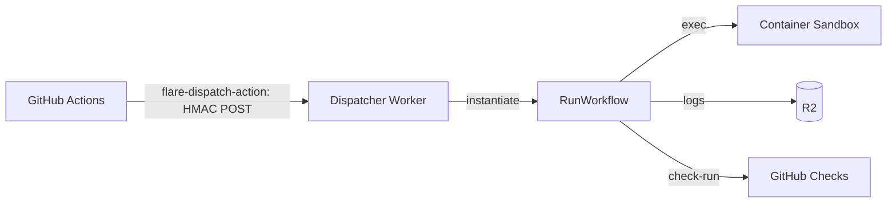

<h1 align="center">FlareDispatch</h1>

<p align="center">Offload the expensive half of GitHub Actions onto Cloudflare.</p>

<p align="center"><a href="https://flare-dispatch.openhackers.club"><b>Documentation</b></a></p>

---

BYOC CI/CD that moves the heavy compute off GitHub Actions and onto a Cloudflare stack you own — Workflows for orchestration, Containers for execution, Browser Rendering for e2e, R2 for cache and artifacts. Trigger runs from GitHub Actions, the GitHub App webhook, or a cron schedule; runs take the expensive jobs — agentic code review, Playwright e2e, acceptance suites, matrix fan-outs, security scans.

Runs are typed Effect-TS programs — composable steps, tagged errors, exhaustive matching — not YAML, written against a layered DSL: capabilities → primitives → recipes. `wrangler deploy` into your own Cloudflare account; no multi-tenant SaaS.

## How it works



A GHA workflow calls the **flare-dispatch-action**, which HMAC-signs a dispatch body and POSTs it to your **Dispatcher Worker**. The Dispatcher instantiates a Cloudflare **Workflow** that runs the job in a **Container**, streams logs to **R2**, and reports the result back to the PR as a GitHub **check-run**. The GHA step finishes in seconds; zero GitHub minutes are spent on the execution itself.

## V0 — the walking skeleton

V0 ships the `offload-test` run: a `pnpm test` executing in a CF Sandbox that reports green/red to a PR check. See [`specs/pm/plan.md`](specs/pm/plan.md) for the full roadmap.

## Quickstart

### 1. Deploy the Dispatcher

Prerequisites: a Cloudflare **Workers Paid** account, `wrangler ≥ 4`, `pnpm ≥ 9`, Node ≥ 20.

```sh
git clone https://github.com/openhackersclub/flare-dispatch && cd flare-dispatch
pnpm install
pnpm typecheck && pnpm test

# Provision CF resources — wrangler writes the IDs back into wrangler.jsonc
wrangler r2 bucket create flare-dispatch-v0
wrangler d1 create flare-dispatch-v0
wrangler d1 execute flare-dispatch-v0 --remote --file infra/d1-schema.sql

# Set secrets
wrangler secret put HMAC_SECRET                          # openssl rand -base64 32
wrangler secret put GITHUB_APP_ID                        # numeric App id
wrangler secret put GITHUB_APP_PRIVATE_KEY < ./app.pem   # piped from the PEM
wrangler secret put GITHUB_WEBHOOK_SECRET                # not used in V0, but expected

wrangler deploy
# Note the deployed URL, e.g. https://flare-dispatch-v0.<account>.workers.dev

curl -fsS https://flare-dispatch-v0.<account>.workers.dev/health
# {"status":"ok","runs":["offload-test"]}
```

Install the `FlareDispatch` GitHub App on the repos you want to use it with (manifest in [`infra/github-app-manifest.json`](infra/github-app-manifest.json)). Full walkthrough: [`specs/05-byoc.md`](specs/05-byoc.md).

### 2. Wire the GHA Action into a repo

Set on the repo (or org):

- **Variable** `FLAREDISPATCH_ENDPOINT` — the deployed Dispatcher URL.
- **Secret** `FLAREDISPATCH_HMAC` — the same value as the Worker's `HMAC_SECRET`.

Then add the Action to a workflow:

```yaml
# .github/workflows/ci.yml
- uses: openhackersclub/flare-dispatch-action@v0
  with:
    run: offload-test
    endpoint: ${{ vars.FLAREDISPATCH_ENDPOINT }}
    hmac-secret: ${{ secrets.FLAREDISPATCH_HMAC }}
    inputs: |
      { "repo": "${{ github.repository }}", "sha": "${{ github.sha }}", "command": "pnpm test" }
    mode: fire-and-forget
```

The Action HMAC-signs the dispatch and POSTs it; the run's result lands on the PR as the `flare-dispatch/offload-test` check-run. Require **that check-run** in branch protection — not the GHA job. Action reference: [`actions/flare-dispatch-action/`](actions/flare-dispatch-action/README.md).

> V0 ships **fire-and-forget** mode only. `await` mode is deferred to V1.

## Repository layout

```
flare-dispatch/
├── apps/dispatcher/         Dispatcher Worker — HMAC verify, routes, RunWorkflow
├── packages/                @flare-dispatch/{core,runtime-cf,github-app}
├── runs/                    offload-test (the V0 run)
├── actions/                 flare-dispatch-action — composite GHA Action
├── infra/                   D1 schema, container Dockerfile, App manifest
└── specs/                   the contract — architecture, DSL, GHA, BYOC, PM plan
```

**Status** — V0 walking skeleton.
