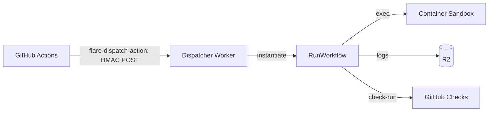

<h1 align="center">FlareDispatch</h1>

<p align="center">Offload the expensive half of GitHub Actions onto Cloudflare.</p>

<p align="center"><a href="https://flare-dispatch.openhackers.club"><b>Documentation</b></a></p>

---

BYOC CI/CD that moves the heavy compute off GitHub Actions and onto a Cloudflare stack you own — Workflows for orchestration, Containers for execution, Browser Rendering for e2e, R2 for cache and artifacts. Trigger runs from GitHub Actions, the GitHub App webhook, or a cron schedule; runs take the expensive jobs — agentic code review, Playwright e2e, acceptance suites, matrix fan-outs, security scans.

Runs are typed Effect-TS programs — composable steps, tagged errors, exhaustive matching — not YAML, written against a layered DSL: capabilities → primitives → recipes. `wrangler deploy` into your own Cloudflare account; no multi-tenant SaaS.

## How it works



A GHA workflow calls the **flare-dispatch-action**, which HMAC-signs a dispatch body and POSTs it to your **Dispatcher Worker**. The Dispatcher instantiates a Cloudflare **Workflow** that runs the job in a **Container**, streams logs to **R2**, and reports the result back to the PR as a GitHub **check-run**. The GHA step finishes in seconds; zero GitHub minutes are spent on the execution itself.

## Status

Live at HEAD:

- **Runs** — all 11 are registered (`/health` lists them, sorted): `cdp-acceptance`, `ci-triage-pr`, `deploy-smoke`, `matrix-fanout`, `offload-test`, `playwright-demo`, `playwright-e2e`, `pr-review`, `product-demo`, `refresh-fixtures`, `spec-drift-pr`. Headline shapes: `offload-test` (`pnpm test` → green/red check), `cdp-acceptance` (boot app + CDP assertions), `playwright-demo` / `playwright-e2e` (Playwright specs → signed R2 tarball), `product-demo` (AI-driven walkthrough over CDP with Browser Run Session Recording + [rrweb replay](#how-it-works) link, per-chapter summary).
- **Agentic PR review** — the marquee capability. `pr-review` reviews a PR diff in-Worker via an `@effect/ai` `modelGateway` capability, configurable as **multi-agent** (up to seven per-domain personas) or **single-agent** (`pr-review.agents`), with **selectable backends chosen from `CONFIG_KV` without redeploy**: Workers AI catalog (`@cf/…`, binding-as-auth, no API key), Anthropic-via-AI-Gateway (BYOK), `reasonix`/DeepSeek, and Bedrock-via-AI-Gateway (OIDC → STS → SigV4, **no long-lived AWS key**). A dispatch can override the model/region/role per call for model bake-offs. Diff is capped to the chosen model's context window; the review comment is a scannable summary table + per-finding headings + GitHub blob links; re-reviews auto-resolve fixed findings.
- **Trigger modes** — all three are wired in `apps/dispatcher/src/router.ts`: **Action** (HMAC POST from the [bundled JS Action](actions/flare-dispatch-action/README.md)), **Schedule** (Cloudflare Cron Triggers → Dispatcher `scheduled()` handler), and **Webhook** (`POST /v1/webhooks/github`, [`routes/webhook.ts`](apps/dispatcher/src/routes/webhook.ts) + tests). Webhook mode is **shipped but opt-in / off by default** — a deploy without `GITHUB_WEBHOOK_SECRET` returns `503` on that route; set the secret to enable it (it does not fire on every push by default).
- **GitHub App** — manifest-creation install flow (`GET /v1/github/install/new` renders a form that POSTs the manifest to GitHub; the `GET /v1/github/installed` callback exchanges the temporary code for the App's credentials) ships the operator's one-click App setup; the webhook receiver is live (opt-in, see above).
- **DSL** — six run-author capabilities (`sandbox`, `browser`, `cache`, `artifact`, `io`, `config`) and six primitives (`workspace`, `installCached`, `loadSecrets`, `sharded`, `bootApp`, `probeHttp`) all wired against Cloudflare Containers / Browser Rendering / R2 / D1 / KV. `step.waitForEvent` is shipped (delegates to the CF Workflows platform event; the `POST /v1/admin/events/:wf_id` signal route is wired) and `io.priorExecution` is a real D1 query. The `github` capability's `actionRuns` (read) + `openDraftPullRequest` (write) are shipped — used by `ci-triage-pr` / `spec-drift-pr`. `step.sleep` / `step.sleepUntil` and parts of the `github` read surface remain stubbed → Planned.
- **modelGateway** — the `@effect/ai`-backed capability above; backend + model selectable from `CONFIG_KV` at runtime, no redeploy.
- **Admission + leasing** — a global per-pool FIFO admission queue caps in-flight runs at `ADMISSION_CAP` (default 16); overflow queues ("waiting for a sandbox slot behind N runs") and drains FIFO, crashed-holder slots reclaimed by heartbeat TTL. A per-container D1 lease serializes runs sharing a sandbox container id (`ContainerBusy` after ~10 min). Zero new operator config.
- **Dual sandbox images** — a `sandboxImage` selector picks a lean default or a chromium-baked browser variant (second DO class `RunSandboxBrowser`, `chromium-headless-shell` + demo-agent baked in).
- **Email notify** — run-authored failure summaries can notify over Cloudflare Email Routing. **Opt-in**: a logged no-op until `send_email` is configured, gated by an `EMAIL_ALLOWED_RECIPIENTS` allowlist.
- **Writeback** — a run can declare a `writeback` output to *propose a diff as a PR* (fixture refreshes, dependency bumps, generated-doc updates). The credential-free container writes a changed-files manifest; the Worker (sole creds holder) validates it (path-traversal / allowlist / byte+count caps, `.github/workflows` opt-in gate) and commits via the GitHub App's Git Data API as a branch + PR. Best-effort — a failure annotates the green check, never flips the run red. `refresh-fixtures` is the worked example. See [`specs/02-runs.md` § Writeback](specs/02-runs.md).

Implementation has skipped around the V0–V4 roadmap deliberately — each run / capability lands when the underlying platform plumbing composes without new infra. See [`specs/pm/plan.md`](specs/pm/plan.md) for the full roadmap and [`specs/02-runs.md`](specs/02-runs.md) for the per-run status.

## Quickstart

### 1. Deploy the Dispatcher

Prerequisites: a Cloudflare **Workers Paid** account, `wrangler ≥ 4`, `pnpm ≥ 9`, Node ≥ 20.

```sh
git clone https://github.com/openhackersclub/flare-dispatch && cd flare-dispatch
pnpm install
pnpm typecheck && pnpm test

# Provision CF resources — wrangler writes the IDs back into wrangler.jsonc
wrangler r2 bucket create flare-dispatch-v0
wrangler d1 create flare-dispatch-v0
wrangler d1 migrations apply RUNS_METADATA --remote

# Set secrets
wrangler secret put HMAC_SECRET                          # openssl rand -base64 32
wrangler secret put GITHUB_APP_ID                        # numeric App id
wrangler secret put GITHUB_APP_PRIVATE_KEY < ./app.pem   # piped from the PEM
wrangler secret put GITHUB_WEBHOOK_SECRET                # enables Webhook mode (opt-in); omit to leave it off

wrangler deploy
# Note the deployed URL, e.g. https://flare-dispatch-v0.<account>.workers.dev

curl -fsS https://flare-dispatch-v0.<account>.workers.dev/health
# {"status":"ok","runs":["cdp-acceptance","ci-triage-pr","deploy-smoke","matrix-fanout","offload-test","playwright-demo","playwright-e2e","pr-review","product-demo","refresh-fixtures","spec-drift-pr"]}
# — all 11 registered runs, sorted.
```

Install the `FlareDispatch` GitHub App on the repos you want to use it with (manifest in [`infra/github-app-manifest.json`](infra/github-app-manifest.json)). Full walkthrough: [`specs/05-byoc.md`](specs/05-byoc.md).

### 2. Pure webhook mode — zero GitHub Actions (recommended)

The leanest path runs **without any GitHub Actions**: the App's webhook deliveries are the trigger. You already set `GITHUB_WEBHOOK_SECRET` in step 1, so there is nothing more to wire — **no `.github/workflows/` file, no GitHub Actions minutes, no `FLAREDISPATCH_HMAC` to rotate.** Onboarding another repo is just *install the App on it*.

The shipped `pr-review` run declares a `pull_request` trigger, so it reviews every PR on the installed repos out of the box. Require the `flare-dispatch/<run>` check-run in branch protection (there is no GHA job to require). Authoring your own `triggers` block: [`specs/04-gha-integration.md` § Webhook mode](specs/04-gha-integration.md#webhook-mode).

### 3. (Optional) Trigger from a GitHub Actions step instead

Use Action mode when a run must interleave with other GHA jobs or use GHA's native `paths:` / `branches:` filters. Set on the repo (or org):

- **Variable** `FLAREDISPATCH_ENDPOINT` — the deployed Dispatcher URL.
- **Secret** `FLAREDISPATCH_HMAC` — the same value as the Worker's `HMAC_SECRET`.

Then add the Action to a workflow:

```yaml
# .github/workflows/ci.yml
- uses: openhackersclub/flare-dispatch-action@v0
  with:
    run: offload-test
    endpoint: ${{ vars.FLAREDISPATCH_ENDPOINT }}
    hmac-secret: ${{ secrets.FLAREDISPATCH_HMAC }}
    inputs: |
      { "repo": "${{ github.repository }}", "sha": "${{ github.sha }}", "command": "pnpm test" }
    mode: fire-and-forget
```

The Action HMAC-signs the dispatch and POSTs it; the run's result lands on the PR as the `flare-dispatch/offload-test` check-run. Require **that check-run** in branch protection — not the GHA job. Action reference: [`actions/flare-dispatch-action/`](actions/flare-dispatch-action/README.md).

> The Action ships **fire-and-forget** mode only at HEAD. `await` mode (poll until terminal + propagate the run's exit) is Planned (V1).

## Repository layout

```
flare-dispatch/
├── apps/dispatcher/         Dispatcher Worker — HMAC verify, router (dispatch, webhook, artifacts, scheduled, admin-events, browser-cdp, oidc, github), RunWorkflow, admission queue
├── packages/                @flare-dispatch/{core,runtime-cf,github-app,cli,demo-agent,review-agent}
├── runs/                    all 11 runs — pr-review, ci-triage-pr, spec-drift-pr, refresh-fixtures, offload-test, cdp-acceptance, deploy-smoke, matrix-fanout, playwright-demo, playwright-e2e, product-demo
├── actions/                 flare-dispatch-action — bundled JS Action (wraps @flare-dispatch/cli)
├── recipes/                 starter `.github/workflows/*.yml` per run
├── infra/                   D1 migrations (0001 schema, 0002 leases, 0003 admissions), container Dockerfiles, App manifest
├── scripts/                 build + deploy helpers
└── specs/                   the contract — architecture, runs, DSL, GHA, BYOC, cost, trust model, PM plan
```
