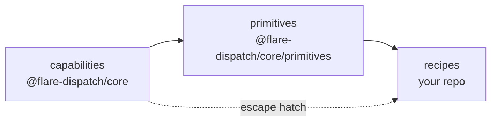

# Primitives

**Primitives** are the middle tier of the DSL: reusable Effect-TS compositions that sit between the raw [capabilities](../specs/03-dsl.md#capability-namespaces) (`sandbox`, `browser`, `cache`, `artifact`, `io`, `config`) and the [recipes](../recipes/) that ride on them.

A capability does one atomic thing — launch a container, exec a command, upload a blob. A recipe is a whole CI use case. Without a layer between them, every recipe re-derives the same shapes by hand: the `acquire → clone → install` checkout dance, the indexed `Effect.forEach` fan-out, the boot-and-wait preamble, the curl-and-classify probe. A primitive is that shape — named once, typed once, tested once — so a recipe carries only the logic unique to it.



A primitive is just an Effect: it composes capabilities (and other primitives), threads the same `RunContext`, fails with the same [tagged errors](../specs/03-dsl.md#errors), and swaps Layers for tests exactly like a capability call. It adds **no new runtime** — only a smaller surface to write recipes against.

## Catalogue

| Primitive | Does | Built from | Used by |
|---|---|---|---|
| [`workspace`](workspace.ts) | Acquire a container + clone a repo (+ optional cached install) | `sandbox`, `installCached` | every recipe |
| [`installCached`](install-cached.ts) | R2-backed dependency install, keyed on the lockfile hash | `cache`, `sandbox` | `workspace`, browser-tests |
| [`sharded`](sharded.ts) | Count-and-index parallel fan-out | `Effect.forEach` | test-matrix, browser-tests |
| [`bootApp`](boot-app.ts) | Start a detached process and wait for its port | `sandbox` | cdp-acceptance |
| [`probeHttp`](probe-http.ts) | Hit a set of URLs and classify each healthy / failed | `sandbox` | deploy-smoke |

## Where these live

The canonical home is the `@flare-dispatch/core/primitives` sub-path of the core package (`packages/core/src/primitives/` — see [pm/plan.md](../specs/pm/plan.md)). The files in this directory are a **reference catalogue**: each one shows how the primitive is composed from capabilities. Unlike [recipes](../recipes/), primitives are not copied into your repo — you `import` them:

```ts
import { defineRun, step, sandbox, artifact } from "@flare-dispatch/core";
import { workspace, sharded } from "@flare-dispatch/core/primitives";
```

The two import paths keep the layer boundary visible at the top of every recipe file.

## Adding a primitive

A new primitive earns its place when a shape recurs across **two or more** recipes and is awkward enough that copy-paste drifts. It must compose only capabilities and existing primitives (no new Layer, no new `Context.Tag`), fail with existing tagged errors, and stay a pure Effect so it inherits Layer-swapping and the unit-test story unchanged. A one-off shape used by a single recipe stays inline in that recipe — premature primitives are just indirection. Full rule in [03-dsl § Adding a primitive](../specs/03-dsl.md#adding-a-primitive).
