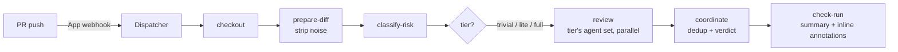

# Recipe: AI code review on every PR

A FlareDispatch port of Cloudflare's multi-agent code reviewer — [blog.cloudflare.com/ai-code-review](https://blog.cloudflare.com/ai-code-review/). The blog's system reviews merge requests with up to seven domain-specific agents, deduplicates their findings, and posts one consolidated review. This recipe implements the same shape as a FlareDispatch **run**.

## Why Webhook mode

AI review should fire on **every PR push**, on every repo, without anyone editing `.github/workflows/` and without burning GHA minutes. That is exactly [Webhook mode](../../specs/04-gha-integration.md#webhook-mode): the `FlareDispatch` GitHub App webhook fires the run directly. The recipe is therefore a single DSL file — [`pr-review.run.ts`](pr-review.run.ts) — dropped into your repo's `runs/`. No workflow file.

## How the blog's design maps onto the run

| Blog concept | In `pr-review.run.ts` |
|---|---|
| Triggered on merge-request open / update | `triggers` on `pull_request` actions `opened`, `synchronize`, `ready_for_review` |
| Noise filtering — lockfiles, minified, generated | `prepare-diff` step → `review-agent diff --exclude lockfiles,minified,generated`, written as a directory of per-file patches |
| Risk tiers — trivial / lite / full | `classify-risk` step → `Match` on the tier selects the agent set (1 / 4 / 7) **and** the coordinator model |
| Cheaper model on trivial diffs | the `Match` arm returns `sonnet` for trivial/lite, `opus` for full |
| Workers + KV control plane — model routing without redeploy | `resolve-model` step → `config.get("pr-review.model.<tier-model>")` overrides the default ([03-dsl § `config`](../../specs/03-dsl.md#config)) |
| Up to seven domain-specific agents, each tightly scoped | `FULL_AGENTS`; the tier's subset is fanned out in the `review` step with `concurrency` |
| Shared context to cut token duplication | the per-file patch directory written once by `prepare-diff`, read by every agent |
| Per-task timeouts (5 min, 10 min for code quality) | `timeoutSec` per `sandbox.exec` inside the `review` fan-out |
| Re-reviews track previous findings | `load-prior` step → `io.priorExecution` loads the last execution's findings for this PR; `coordinate --previous` resolves fixed threads ([03-dsl § `io`](../../specs/03-dsl.md#io)) |
| Coordinator dedups + filters into one verdict | `coordinate` step, `--json` output |
| Single consolidated review | the FlareDispatch **check-run summary** — one per execution, replaced on each push |
| Inline comments on specific lines | each `Finding` in the run output → a check-run **annotation** ([04-gha-integration § Inline findings](../../specs/04-gha-integration.md#inline-findings--annotations)) |
| Bias toward approval unless critical findings | encoded in the `review-agent coordinate` rubric; surfaced as the `verdict` output |
| Prompt caching, circuit breakers, model failover | inside the bundled `review-agent` CLI / model client — not the DSL |

## Flow

## Framework surface this recipe relies on

The run is deliberately thin — it orchestrates, it does not contain model logic. Three pieces of the framework carry the weight:

- **`config`** ([03-dsl](../../specs/03-dsl.md#config)) — a KV-backed control plane. The coordinator model is resolved at run time, so an operator can repoint it at a fallback in seconds when a provider degrades — no redeploy. This is the seam for the blog's "Workers + KV control plane."
- **`io.priorExecution`** ([03-dsl](../../specs/03-dsl.md#io)) — reads the last execution's recorded output for the same `(repo, PR)` family. That is how re-reviews stay incremental: the coordinator sees what it concluded on the previous push.
- **Check-run annotations** ([04-gha-integration](../../specs/04-gha-integration.md#inline-findings--annotations)) — the run returns a `findings` array; the Dispatcher posts each as an inline annotation on the PR's Files-changed tab. The GitHub-native equivalent of GitLab's per-line DiffNotes, with no separate review thread to manage.

## The review agent

Each step shells out to a `review-agent` CLI baked into the container image (`flaredispatch-review`). That mirrors the blog's approach of spawning a coding-agent child process — the agent, its model client, **prompt caching, the per-model circuit breaker, and provider failover** all live inside that CLI, not in the DSL. The run only orchestrates: check out, slice the diff, tier it, fan out, coordinate, return findings.

Swapping the model or the agent framework is a change to the image (or a `config` key), not to this run.

## Install

1. Deploy FlareDispatch and install the GitHub App — [specs/05-byoc.md](../../specs/05-byoc.md).
2. Copy `pr-review.run.ts` into your repo's `runs/` directory.
3. Push. The Dispatcher auto-discovers the run; the next PR gets a `flaredispatch/pr-review` check, with inline annotations on the Files-changed tab.

Opt a PR out with the `skip-ai-review` label; force review on a draft with `request-ai-review`.
