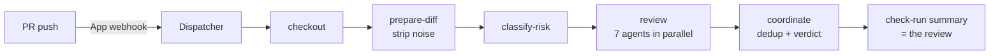

# Recipe: AI code review on every PR

A FlareDispatch port of Cloudflare's multi-agent code reviewer — [blog.cloudflare.com/ai-code-review](https://blog.cloudflare.com/ai-code-review/). The blog's system reviews merge requests with up to seven domain-specific agents, deduplicates their findings, and posts one consolidated review. This recipe implements the same shape as a FlareDispatch **run**.

## Why Webhook mode

AI review should fire on **every PR push**, on every repo, without anyone editing `.github/workflows/` and without burning GHA minutes. That is exactly [Webhook mode](../../specs/04-gha-integration.md#webhook-mode): the `FlareDispatch` GitHub App webhook fires the run directly. The recipe is therefore a single DSL file — [`pr-review.run.ts`](pr-review.run.ts) — dropped into your repo's `runs/`. No workflow file.

## How the blog's design maps onto the run

| Blog concept | In `pr-review.run.ts` |
|---|---|
| Triggered on merge-request open / update | `triggers` on `pull_request` actions `opened`, `synchronize`, `ready_for_review` |
| Noise filtering — lockfiles, minified, generated | `prepare-diff` step: `review-agent diff --exclude lockfiles,minified,generated` |
| Risk tiers — skip expensive calls on trivial diffs | `classify-risk` step produces a tier consumed by every agent |
| Up to seven domain-specific agents, each tightly scoped | `AGENTS` array fanned out in the `review` step with `concurrency: AGENTS.length` |
| Shared context to cut token duplication | the diff + context file written once by `prepare-diff`, read by every agent |
| Coordinator dedups + filters into one verdict | `coordinate` step, `--json` output |
| Single consolidated review comment | the FlareDispatch **check-run summary** — one per execution, replaced on each push |
| Bias toward approval unless critical findings | encoded in the `review-agent coordinate` rubric; surfaced as the `verdict` output |
| Prompt caching for cost | handled inside the bundled `review-agent` CLI / model client |

## Flow

## The review agent

Each step shells out to a `review-agent` CLI baked into the container image (`flaredispatch-review`). That mirrors the blog's approach of spawning a coding-agent child process — the agent, its model client, prompt caching, and circuit-breaker / provider failover all live inside that CLI, not in the DSL. The run only orchestrates: check out, slice the diff, tier it, fan out, coordinate.

Swapping the model or the agent framework is a change to the image, not to this run.

## Install

1. Deploy FlareDispatch and install the GitHub App — [specs/05-byoc.md](../../specs/05-byoc.md).
2. Copy `pr-review.run.ts` into your repo's `runs/` directory.
3. Push. The Dispatcher auto-discovers the run; the next PR gets a `flaredispatch/pr-review` check.

Opt a PR out with the `skip-ai-review` label; force review on a draft with `request-ai-review`.
