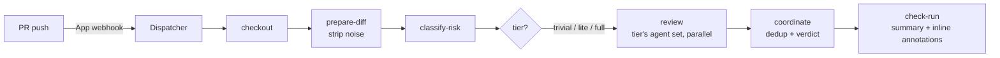
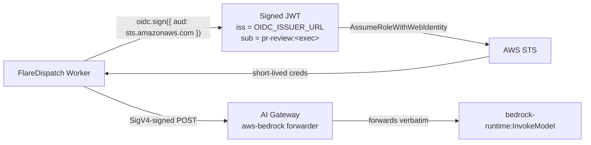
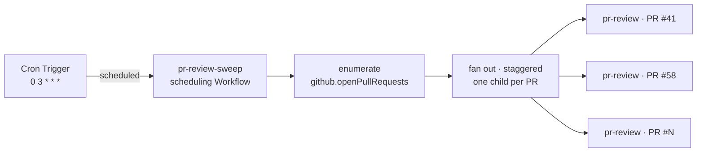

# Recipe: AI code review on every PR

A FlareDispatch port of Cloudflare's multi-agent code reviewer — [blog.cloudflare.com/ai-code-review](https://blog.cloudflare.com/ai-code-review/). The blog's system reviews merge requests with up to seven domain-specific agents, deduplicates their findings, and posts one consolidated review. This recipe implements the same shape as a FlareDispatch **run**.

## Why Webhook mode

AI review should fire on **every PR push**, on every repo, without anyone editing `.github/workflows/` and without burning GHA minutes. That is exactly [Webhook mode](../../specs/04-gha-integration.md#webhook-mode): the `FlareDispatch` GitHub App webhook fires the run directly. The recipe is therefore a single DSL file — [`pr-review.run.ts`](pr-review.run.ts) — dropped into your repo's `runs/`. No workflow file.

## How the blog's design maps onto the run

| Blog concept | In `pr-review.run.ts` |
|---|---|
| Triggered on merge-request open / update | `triggers` on `pull_request` actions `opened`, `synchronize`, `ready_for_review` |
| Noise filtering — lockfiles, minified, generated | `prepare-diff` step → plain `git diff`, then `stripDiffNoise` drops lockfile / minified / generated / vendored file sections **in the Worker** |
| Risk tiers — trivial / lite / full | `classify-risk` step → the engine's pure `riskTier` heuristic (diff size + sensitive paths); `Match` on the tier selects the agent set (1 / 4 / 7) |
| Cheaper model on trivial diffs | the tier gates how many domain reviewers fan out; the model is the operator-pinned backend (see below) |
| Workers + KV control plane — model routing without redeploy | `resolve-backend` step → `config.get("pr-review.backend")` + the backend's `model` / `mode` keys ([03-dsl § `config`](../../specs/03-dsl.md#config)) — repoint a backend in seconds, no redeploy |
| Up to seven domain-specific agents, each tightly scoped | `FULL_AGENTS`; the tier's subset is fanned out in the `review` step (`Effect.forEach` with `concurrency`), each calling `reviewDomain` **in the Worker** |
| Shared context to cut token duplication | the single noise-stripped, size-capped diff passed to every domain reviewer |
| Coordinator dedups + filters into one verdict | `coordinate` step → the engine's `coordinate`, **pure deterministic code** (dedup + counts-by-severity + verdict-by-rule) — no model call. The current run is authoritative (no carry-over), so a fixed finding clears on its own |
| Single consolidated review | a **PR review comment** (`github.pullReview`, `event: COMMENT`) posted on every run — success AND failure — plus the check-run summary |
| Inline comments on specific lines | each `Finding` in the run output → a check-run **annotation** ([04-gha-integration § Inline findings](../../specs/04-gha-integration.md#inline-findings--annotations)) |
| Bias toward approval unless critical findings | the verdict rule in `coordinate`: any `failure` → request-changes; else any `warning` → comment; else approve |
| Provider-agnostic model client | `@flare-dispatch/review-agent` calls the model through the `modelGateway` capability — backed by the Cloudflare **Workers AI binding** (`env.AI`) via an AI Gateway. The binding is the auth (account-billed); **no model API key** |

## Flow



## Resilience — a flaky reviewer never sinks the whole review

The fan-out is the point of the multi-agent design, so a single domain reviewer's
bad luck must not abort the rest:

- **Per-domain fault isolation.** Each reviewer in the `review` step is run
  independently; one whose model call fails — unparseable output, or a transient
  capacity / rate-limit error under the concurrent fan-out — is dropped to zero
  findings and flagged `⚠️` in the comment's engagement line. The review still
  ships with every domain that succeeded. Only when **every** reviewer fails does
  the run go red, re-raising the precise cause (so a systemic fault — misconfigured
  backend, wrong model/mode, gateway down — is still named honestly, never masked
  as an empty review).
- **JSON repair retry.** A model asked for strict JSON sometimes answers in prose
  or truncates inside a reasoning block, leaving no parseable JSON. Before that
  reviewer counts as failed, the engine re-asks **once** with a blunt "JSON only"
  correction — and floors the retry's token budget so the structured answer can
  fit (the model no longer spends the budget on a `<think>` block). This composes
  with the existing tools→json auto-fallback.

## Framework surface this recipe relies on

The run is deliberately thin — it orchestrates, it does not contain model logic. Three pieces of the framework carry the weight:

- **`config`** ([03-dsl](../../specs/03-dsl.md#config)) — a KV-backed control plane. The reviewer backend (model id + mode) is resolved at run time, so an operator can repoint it at a fallback in seconds when a model degrades — no redeploy. This is the seam for the blog's "Workers + KV control plane."
- **`modelGateway`** ([03-dsl](../../specs/03-dsl.md#config)) — the model-calling capability, backed by the Cloudflare **Workers AI binding** (`env.AI`) via an AI Gateway. The binding is the auth (account-billed), so the run carries **no model API key**. The engine yields the Tag; the runtime provides it ambiently, like `config` / `sandbox`.
- **Check-run annotations** ([04-gha-integration](../../specs/04-gha-integration.md#inline-findings--annotations)) — the run returns a `findings` array; the Dispatcher posts each as an inline annotation on the PR's Files-changed tab. The GitHub-native equivalent of GitLab's per-line DiffNotes, with no separate review thread to manage.

## The review engine runs in the Worker

The review is performed **in the Worker run body**, not in a container CLI. The single container image (`infra/Dockerfile.sandbox`: Node + git + curl) is used only for `git` (checkout + `git diff`). The engine is `@flare-dispatch/review-agent`: `riskTier` (a pure heuristic, no model call), `reviewDomain` (the one model-calling surface — calls the model through the `modelGateway` capability, backed by the Cloudflare **Workers AI binding** via an AI Gateway, **no API key**), and `coordinate` (**pure deterministic assembly** — dedup + counts + verdict-by-rule, no model call). `reviewDomain`'s findings come from a Schema-validated tool call (`tools` mode) or a parsed strict-JSON text response (`json` mode).

> Earlier versions shelled out to a `review-agent` CLI that did **not** exist in the deployed image, so every review silently failed. Moving the engine into the Worker removes that dependency entirely.

### Configurable backend

The engine selects a model backend from config — repoint it in seconds, no redeploy. **No API key** — the model is called through the `modelGateway` capability (the Workers AI binding is the auth):

| Key (CONFIG_KV) | Meaning |
|---|---|
| `pr-review.backend` | `opencode` (default), `reasonix`, `anthropic`, or `bedrock` |
| `pr-review.prompt` | *(optional)* REPLACE the generic per-domain reviewer system prompt |
| `pr-review.guidelines` | *(optional)* ADDITIVE house rules appended on top of the reviewer prompt — a suppression rubric ("what NOT to flag"), project conventions, or severity calibration. Layers onto the maintained default instead of replacing it. |
| `pr-review.opencode.model` | bare Workers AI model id for the **opencode** backend, e.g. `@cf/meta/llama-3.3-70b-instruct-fp8-fast` |
| `pr-review.opencode.mode` | `tools` (default) or `json` — how structured output is coaxed (see below) |
| `pr-review.reasonix.model` | reasoning-model id for the **reasonix** backend. Either a bare Workers AI distill (`@cf/deepseek-ai/deepseek-r1-distill-qwen-32b`, account-billed, no key) **or** a `deepseek/`-prefixed hosted reasoner (`deepseek/deepseek-reasoner`, the real model — routes via the AI Gateway universal endpoint with a BYOK DeepSeek key stored in the gateway; requires `AI_GATEWAY_ID`) |
| `pr-review.reasonix.mode` | `tools` or `json` (**default `json`** — DeepSeek-class reasoning models ignore tool-calls) |
| `pr-review.anthropic.model` | `anthropic/`-prefixed model id, e.g. `anthropic/claude-sonnet-4-6`. Routes via the AI Gateway universal endpoint (BYOK Anthropic key stored in the gateway). Requires `AI_GATEWAY_ID`. |
| `pr-review.anthropic.mode` | `tools` (default) or `json` |
| `pr-review.bedrock.model` | `bedrock/`-prefixed model id, e.g. `bedrock/us.anthropic.claude-opus-4-6-v1`. Routes via the AI Gateway Bedrock forwarder; SigV4-signed with short-lived STS creds (BYOC trust path). Requires `AI_GATEWAY_ID` + `CLOUDFLARE_ACCOUNT_ID` + `OIDC_SIGNING_JWK` + `OIDC_ISSUER_URL`. |
| `pr-review.bedrock.region` | AWS region (default `us-east-1`) |
| `pr-review.bedrock.roleArn` | IAM role ARN to AssumeRoleWithWebIdentity into. Trust policy MUST pin `sub: pr-review:*`. |

Model ids are bare `@cf/...` for the Workers AI catalog, `anthropic/...` or `deepseek/...` for the AI-Gateway universal endpoint (BYOK), or `bedrock/...` for the AI-Gateway Bedrock forwarder. An AI Gateway can front Workers AI calls by setting the `AI_GATEWAY_ID` var on the Worker; the same `AI_GATEWAY_ID` is used for the `anthropic/`, `deepseek/` and `bedrock/` routes (required, not optional).

A misconfigured backend (no `model` key, or for `bedrock` no `roleArn`) fails fast — the run posts a PR comment naming the exact missing key.

#### Bedrock backend — the BYOC trust path

The `bedrock` backend mints short-lived AWS credentials per execution via OIDC federation — no long-lived AWS key in GHA or the Worker. The dispatcher signs an OIDC JWT, AWS STS exchanges it for short-lived creds, then the run SigV4-signs `bedrock:InvokeModel` and POSTs through the [AI Gateway Bedrock forwarder](https://developers.cloudflare.com/ai-gateway/usage/providers/bedrock/) (the gateway forwards the SigV4 `Authorization` header verbatim, never holds the creds).



Two factors gate role assumption — the dispatch HMAC **and** the JWT signature — so a leaked HMAC alone cannot mint Bedrock creds. AWS-side setup:

1. **Register the dispatcher as an OIDC provider in AWS** (the `--url` MUST equal the `OIDC_ISSUER_URL` Worker secret; AWS doesn't allow updating it later):

   ```sh
   aws iam create-open-id-connect-provider \
     --url "https://<your-dispatcher>.workers.dev" \
     --client-id-list sts.amazonaws.com \
     --thumbprint-list <sha1-of-jwks-tls-leaf-cert>
   ```

2. **Create the IAM role**, trust policy pinned to a `Federated` principal + a `sub: pr-review:*` pattern, with a narrow `bedrock:InvokeModel` policy:

   ```json5
   {
     "Effect": "Allow",
     "Principal": { "Federated": "arn:aws:iam::<acct>:oidc-provider/<your-dispatcher>.workers.dev" },
     "Action": "sts:AssumeRoleWithWebIdentity",
     "Condition": {
       "StringEquals": { "<your-dispatcher>.workers.dev:aud": "sts.amazonaws.com" },
       "StringLike":   { "<your-dispatcher>.workers.dev:sub": "pr-review:*" }
     }
   }
   ```

3. **Set the Worker secrets + vars**: `OIDC_SIGNING_JWK` (secret — `pnpm cli oidc keygen`), `OIDC_ISSUER_URL` (secret — must equal the OIDC provider `--url`), `AI_GATEWAY_ID` (var), `CLOUDFLARE_ACCOUNT_ID` (var), and optionally `AI_GATEWAY_AUTH_TOKEN` (secret — only if [Authenticated Gateway](https://developers.cloudflare.com/ai-gateway/configuration/authentication/) is on). The matching public JWK is auto-served at `<issuer>/.well-known/jwks.json`.

4. **Point the backend at Bedrock**: `pr-review.backend=bedrock`, `pr-review.bedrock.model=bedrock/us.anthropic.claude-opus-4-6-v1`, `pr-review.bedrock.roleArn=<the role ARN>` (and optionally `pr-review.bedrock.region`).

See [05-byoc § AWS federation trust policy](../../specs/05-byoc.md#aws-federation-trust-policy) for the full trust model.

### One reviewer or many — `pr-review.agents`

The fan-out is configurable:

- **`pr-review.agents=multi`** *(default)* — the tier-scaled per-domain personas above (1 / 4 / 7 reviewers by risk tier). The "multi-agent" reviewer.
- **`pr-review.agents=single`** — one generalist reviewer covering every concern, through the same structured engine (same findings → annotations → verdict → consolidated comment). A leaner, cheaper pass; the historical `multi-agent-review` run collapsed into this mode.

The risk tier is still classified either way (it sizes the diff cap and renders in the comment); in `single` mode it just doesn't scale the reviewer count.

### Per-dispatch overrides — model bake-offs

When dispatched in **Action mode** (a GHA workflow `POST`s the run), a single dispatch can override the CONFIG_KV defaults via the run inputs — `agents`, `backend`, `modelId`, `region`, `roleArn`, `focusArea`. Absent, the CONFIG_KV defaults apply (the Webhook path is unchanged). This is the **model-bake-off / per-PR-escalation** path: dispatch `backend: "bedrock"`, a `modelId` under test, and a `roleArn` to compare a model on a real PR without touching CONFIG_KV. These inputs ride the HMAC-authenticated dispatch (operator-trusted), never the diff.

#### Output mode: `tools` vs `json`

Not every model honours tool-calling. Validated against Workers AI: a tool-calling-capable model (e.g. `@cf/meta/llama-3.3-70b-…`) returns tool calls fine, but a reasoning model (`@cf/deepseek-ai/deepseek-r1-distill-qwen-32b`) returns **no** tool calls (it emits `<think>…</think>` reasoning instead).

- **`tools`** — sends the `report` tool and reads the Schema-validated tool args. Workers AI returns the args as a parsed object (the engine also tolerates an OpenAI-style JSON string). Best when the model supports it.
- **`json`** — no tools; the model is asked for a strict JSON object. The engine strips `<think>…</think>` blocks and markdown code fences, isolates the JSON value, `JSON.parse`s it, and Schema-decodes against the same `Finding[]` schema. A parse/decode failure surfaces a `StructuredOutputInvalid` error (the run posts a PR comment naming it).
- **Auto-fallback** — a `tools`-mode call that comes back with zero tool calls retries **once** in `json` mode, so a model that silently drops tool-calling still produces a review.

### Always a PR comment

Every run posts a top-level PR review comment (`event: COMMENT`) via the `github` capability — on success (the consolidated verdict + findings) **and** on failure (`⚠️ pr-review could not complete: <reason>`). The comment carries the `<!-- flare-dispatch: pr-review -->` footer marker.

## Scheduled sweep — [`pr-review-sweep.run.ts`](pr-review-sweep.run.ts)

`pr-review` fires on every PR push (Webhook mode). That misses three cases: a PR opened *before* the App was installed, a webhook delivery GitHub dropped, and a PR whose review you want re-run on a cadence regardless of pushes. [`pr-review-sweep.run.ts`](pr-review-sweep.run.ts) closes them — a **Schedule-mode** run ([04-gha-integration § Schedule mode](../../specs/04-gha-integration.md#schedule-mode)) that fires on a Cloudflare Cron Trigger instead of a GitHub event.



The sweep contains **no review logic** — it reuses the `pr-review` run above, unchanged. It only decides *what* to review and *when*:

| Concern | How the sweep handles it |
|---|---|
| A cron tick names no target | The `enumerate` step calls `github.openPullRequests` ([03-dsl § `github`](../../specs/03-dsl.md#github)) — the App-token-backed read surface — to discover every open PR across the App's installations. |
| Don't re-review unchanged PRs | Each child is created with the semantic instanceId `pr-review:{repo}:{pr}:{headSha}`. CF Workflows treats a duplicate `create({ id })` as a no-op, so a PR already reviewed at its current head SHA — by Webhook mode or an earlier sweep — is skipped for free. The sweep is a **backstop, not a duplicate channel**. |
| Don't burst the API / model provider | The fan-out is staggered with `step.sleepUntil` ([03-dsl § Deferred scheduling](../../specs/03-dsl.md#deferred-scheduling-with-stepsleepuntil)) — children are spread evenly across a 45-minute window. The scheduling Workflow hibernates between slots, consuming no CPU. |
| Skip weekends / freeze windows | The `schedules[].gate` receiver-side check skips the tick before any Workflow is created. |

The cadence (`0 3 * * *`) lives in the run's `schedules` **and** in `wrangler.jsonc` `triggers.crons` — the latter is what Cloudflare subscribes to ([05-byoc § Wrangler config](../../specs/05-byoc.md#wrangler-config)). The sweep posts no check-run of its own; each child `pr-review` posts its own per-PR check exactly as in Webhook mode.

## Install

1. Deploy FlareDispatch and install the GitHub App — [specs/05-byoc.md](../../specs/05-byoc.md).
2. Copy `pr-review.run.ts` into your repo's `runs/` directory.
3. Push. The Dispatcher auto-discovers the run; the next PR gets a `flare-dispatch/pr-review` check, with inline annotations on the Files-changed tab.

Opt a PR out with the `skip-ai-review` label; force review on a draft with `request-ai-review`.

### Add the scheduled sweep (optional)

4. Copy [`pr-review-sweep.run.ts`](pr-review-sweep.run.ts) into `runs/` as well.
5. Add its cron to `wrangler.jsonc` — `"triggers": { "crons": ["0 3 * * *"] }` — and `wrangler deploy`. The expression must match the run's `schedules[].cron`.
6. At 03:00 UTC the Dispatcher's `scheduled()` handler instantiates the sweep; every open PR not already reviewed at its head SHA gets a `flare-dispatch/pr-review` check.
