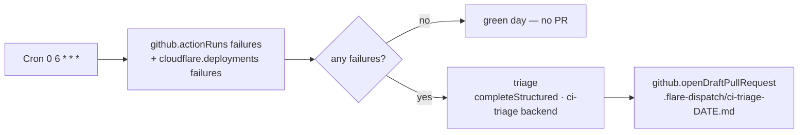

# Recipe: scheduled CI-failure triage → draft PR

Every day, read recent CI failures across **GitHub Actions** and **Cloudflare**
(Pages) deployments, ask a model to triage them, and open **one** draft pull
request carrying a triage write-up (`.flare-dispatch/ci-triage-<date>.md`) — a
diagnosis + suggested next steps a human reviews. It does **not** attempt an
auto-fix (a larger, lower-confidence problem); the value is a single daily,
deduped, model-written triage of what's red, filed where the team will see it.

## Why Schedule mode

CI goes red across many repos and projects asynchronously. A
[Schedule-mode](../../specs/04-gha-integration.md#schedule-mode) run sweeps on a
cadence (a Cloudflare Cron Trigger), aggregating the day's failures into one
report — instead of N scattered notifications. Single DSL file
[`ci-triage-pr.run.ts`](ci-triage-pr.run.ts), dropped into `runs/`. Zero GHA
minutes.

## Reuse: the same review infra as `ai-code-review`

The triage model call goes through `@flare-dispatch/review-agent`'s reusable
**`completeStructured`** engine — the `workers-ai` backend machinery
[`pr-review`](../ai-code-review/) uses, resolved from `CONFIG_KV` under this run's
`ci-triage.*` namespace. **No model API key** — the Workers AI binding is the
auth.

Reading the failures uses two **read capabilities**:

- **`github.actionRuns`** — recent workflow runs across the configured repos,
  filtered to `conclusion: failure`.
- **`cloudflare.deployments`** — recent Pages deployments across the configured
  projects, filtered to `status: failure` (backed by a scoped
  `CLOUDFLARE_API_TOKEN`).

Opening the PR uses **`github.openDraftPullRequest`** (Git Data API from the
Worker — no container).

## Config (CONFIG_KV)

| Key | Meaning |
|---|---|
| `ci-triage.repos` | **required** — comma/space-separated `owner/name` list to scan Actions on |
| `ci-triage.projects` | *(optional)* Cloudflare Pages project names to scan deploys on |
| `ci-triage.report-repo` | repo to open the triage PR on (default: first of `ci-triage.repos`) |
| `ci-triage.base` | base branch for the triage PR (default `main`) |
| `ci-triage.window-hours` | only failures newer than this (default `24`) |
| `ci-triage.backend` | `workers-ai` (default), `anthropic`, or `bedrock` |
| `ci-triage.prompt` | *(optional)* override the triage system prompt |
| `ci-triage.workers-ai.model` | bare Workers AI catalog id (e.g. `@cf/meta/llama-3.3-70b-instruct-fp8-fast`, account-billed, no key) **or** a `deepseek/`-prefixed hosted reasoner (e.g. `deepseek/deepseek-reasoner`, BYOK via AI Gateway) |
| `ci-triage.workers-ai.mode` | `tools` (default) or `json` — pin `json` for reasoning models (DeepSeek-class models ignore tool-calls) |

A green day (no failures in the window) opens no PR and never calls the model.
Repoint the model or rewrite the prompt entirely from `CONFIG_KV`, no redeploy.

## Prerequisites for the data sources

- **GitHub Actions** — the FlareDispatch App must be installed on the scanned
  repos (the capability resolves each repo's installation from the App JWT).
- **Cloudflare** — set a scoped `CLOUDFLARE_API_TOKEN` (Pages:Read) Worker secret
  + the existing `CLOUDFLARE_ACCOUNT_ID` var. Absent, the CF side degrades to
  empty (Actions-only triage). The capability is **read-only** — mutating CF
  state stays a `wrangler`/CI concern.

## Install

1. Deploy FlareDispatch + install the GitHub App — [specs/05-byoc.md](../../specs/05-byoc.md).
2. Copy [`ci-triage-pr.run.ts`](ci-triage-pr.run.ts) into your repo's `runs/`.
3. Add the cron to `wrangler.jsonc` — `"triggers": { "crons": ["0 6 * * *"] }` —
   and `wrangler deploy`.
4. Set `ci-triage.repos` (+ optional `ci-triage.projects`, `CLOUDFLARE_API_TOKEN`)
   and a backend model. At 06:00 UTC the Dispatcher instantiates the run; a red
   day gets one triage draft PR.
