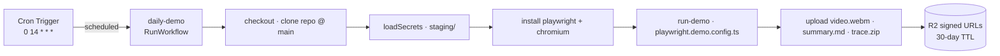

# Recipe: daily stakeholder demo

A [Schedule-mode](../../specs/04-gha-integration.md#schedule-mode) run that records a narrated end-to-end demo of the target webapp's onboarding → creative workflow once a day, against the deployed staging tier — for investor updates and post-deploy stakeholder smoke checks.

> **Source of truth**: the shipped run lives at [`runs/daily-demo.ts`](../../runs/daily-demo.ts). This recipe page is the operator-facing documentation; there is no separate "illustration" run file (unlike `recipes/cdp-acceptance/`) because the shipped run IS the recipe — there's nothing to simplify away for teaching.

The recipe takes a Playwright spec that already lives in the target webapp repo (typically maintained as a local `/demo-e2e` skill), drives it inside a Cloudflare Sandbox container on a daily cron, and uploads the resulting `video.webm` + `summary.md` + `trace.zip` to R2 as signed URLs. **Zero GitHub Actions involvement** — the trigger is the clock.

## Why Schedule mode for this

A daily demo has no PR, no SHA, no webhook to attach to. It's a wall-clock obligation: "at 14:00 UTC every day, run the demo against staging and produce a shareable artifact." Schedule mode is exactly that.

Two consequences that shape the recipe:

1. **The input is fully synthesized** from the cron tick. There is no GHA workflow file, no `--repo` flag, no `--sha` flag. The run's `schedules[].inputs(ctx)` produces the whole body — `repo`, `ref`, `stagingBaseUrl` — from operator-supplied defaults.
2. **The shape is static-targets**, not enumerated. One repo, one staging URL, one demo spec — the run body is straight-line Playwright, not a fan-out matrix. (Contrast with `pr-review-sweep`, which has to *discover* its targets at run time.)

## Flow



## What the demo covers

(Same scripted journey as `qa/acceptance/tests/demo-onboarding-creative.spec.ts` in the target webapp repo.)

1. Signed-in alpha user lands on `/onboard`.
2. Pastes a Play Store URL → backend seeds product + persona, vertical = gaming.
3. SPA redirects to `/creative` with the seeded brief banner visible.
4. User picks 1:1 + 9:16 aspects, sets variants=4, clicks Generate.
5. Run reaches `data-status="succeeded"`; 4 concept cards render.
6. Each card shows an 8-dimension critic grid + numeric overall score.
7. User switches the aspect tab on the first card → variant image swaps.
8. Download link resolves to a DAM signed URL.

Each step is a Playwright `test.step()` so the video has natural narration anchors and the trace viewer shows the same chapter markers. `slowMo: 200ms` for stakeholder-friendly pacing.

## Operator setup

One-time, on the FlareDispatch Dispatcher side. The run shares the existing Dispatcher infra (R2, D1, KV) — no new Worker is deployed.

### 0. Point the run at your webapp

Edit `runs/daily-demo.ts` `schedules[].inputs` and replace the placeholder defaults:

- `repo: "OWNER/REPO"` → your webapp repo (`"owner/name"`).
- `stagingBaseUrl: "https://staging.example.com"` → your deployed Pages/Worker URL.
- `DEMO_PNPM_FILTER` (top of the file) → your QA package filter (e.g. `@your-org/qa`).

### 1. Populate the staging credentials in `CONFIG_KV`

The run pulls four keys from the config store under the `staging/` prefix. Read each value from a file via `--path` — keep secrets out of shell history.

```sh
cd /Users/<you>/workspaces/ohc/flare-dispatch
wrangler kv key put --binding CONFIG_KV staging/STAGING_WEB_BASE              --path .secrets/staging-web-base
wrangler kv key put --binding CONFIG_KV staging/CF_ACCESS_CLIENT_ID           --path .secrets/staging-cf-access-id
wrangler kv key put --binding CONFIG_KV staging/CF_ACCESS_CLIENT_SECRET       --path .secrets/staging-cf-access-secret
wrangler kv key put --binding CONFIG_KV staging/VITE_CLERK_PUBLISHABLE_KEY    --path .secrets/staging-clerk-vite-pk
```

Where the values come from:

| Key | Source |
|---|---|
| `STAGING_WEB_BASE` | The deployed Pages/Worker URL. |
| `CF_ACCESS_CLIENT_ID` / `CF_ACCESS_CLIENT_SECRET` | Service-token pair from CF Zero Trust → Access → Service Auth. Bypasses the staging Access gate from outside the tailnet. |
| `VITE_CLERK_PUBLISHABLE_KEY` | The **staging** Clerk instance's publishable key. The demo spec signs in as the alpha test user via `+clerk_test@…` (frontend-only, no `CLERK_SECRET_KEY` needed). |

Any missing key fails the run loudly with `SecretsMissing` rather than booting a credential-less container. The keys live ONLY under `staging/` — the prod tier should never be the demo target.

### 2. Deploy with the cron wired

The cron expression `0 14 * * *` is already declared both in:

- `wrangler.jsonc` `triggers.crons` — what Cloudflare actually subscribes to.
- `runs/daily-demo.ts` `schedules[].cron` — what the `scheduled()` handler routes the firing tick to.

The two MUST match exactly. After deploying the Dispatcher, confirm via the Cloudflare dashboard (Workers & Pages → flare-dispatch-v0 → Triggers) that the cron is registered.

```sh
wrangler deploy
```

### 3. Watch the first run

At 14:00 UTC the next day:

- The Dispatcher's `scheduled()` handler fires.
- `schedulesByCron("0 14 * * *")` resolves to `daily-demo`.
- A `RunWorkflow` instance is created with id `daily-demo:<YYYY-MM-DD>` (UTC date).
- The execution lands in the D1 `executions` table; tail with `wrangler tail` for live logs.

If the run fails, the most common causes are the same as the local `/demo-e2e` skill:
- CF Access gate misconfig → 403 before Playwright sees the page.
- Staging Clerk key drift → sign-in step times out.
- Pages deploy lag → onboarding redirect fails.

The uploaded `trace.zip` opens locally with `playwright show-trace <path>`.

## Stakeholder distribution

Today the demo's artifact URIs sit on the FlareDispatch check-run summary. Forthcoming follow-ups (out of scope for this PR):

- **Slack incoming-webhook** — post the video URL + summary line to a `#daily-demo` channel on success.
- **Public domain front** — proxy the R2 bucket behind `demo.openhackers.club` so the URLs are permanent rather than 30-day signed.

Until those land, an operator can drop the video URL into the relevant Slack/email manually each morning.

## Anti-patterns the recipe deliberately avoids

- **Booting a fresh container app.** The demo's purpose is to show what stakeholders actually see; targeting the deployed staging tier is the only honest choice. The DAM / edge Worker boot path that `cdp-acceptance` runs is irrelevant here.
- **Using Cloudflare Browser Rendering CDP.** Playwright's `recordVideo` captures the browser it launches; pointing it at a remote CDP endpoint would need a separate video-capture path we don't want to build for a daily demo.
- **Committing the artifacts.** R2 is the sink. The check-run carries signed URLs. Nothing lands in git.
- **Treating the demo as a CI gate.** The acceptance smoke gate stays on `cdp-acceptance` via [`acceptance/`](../cdp-acceptance/). A failing demo flags a stakeholder-visible UX regression, but it does not block merges.
