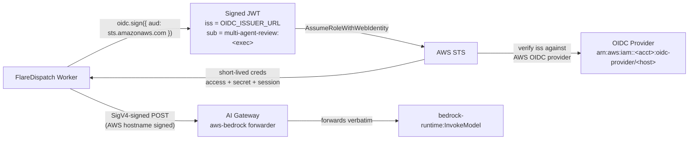
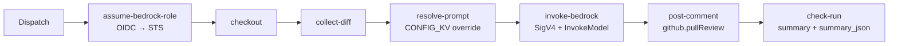

# Recipe: AI code review on AWS Bedrock via Cloudflare AI Gateway (BYOC trust path)

Sibling to [`ai-code-review`](../ai-code-review/) — same surface (PR review comment + check-run), different model backend. Both run through the unified `modelGateway` capability; the difference is which prefix the model id carries:

- `pr-review`: configurable per CONFIG_KV — `@cf/...` (Workers AI catalog), `anthropic/...` (Anthropic-via-AI-Gateway BYOK), or `bedrock/...` (Bedrock via AI Gateway, BYOC trust path).
- `multi-agent-review`: hard-pins the `bedrock/...` route, takes model + region per-dispatch (so a `workflow_dispatch` can pin a specific model for QA / model-comparison work without changing CONFIG_KV).

The `bedrock/` route is the BYOC trust path: the dispatcher signs an OIDC JWT, AWS STS exchanges it for short-lived credentials, then the run SigV4-signs `bedrock:InvokeModel` and POSTs through Cloudflare's [AI Gateway Bedrock forwarder](https://developers.cloudflare.com/ai-gateway/usage/providers/bedrock/) — the gateway adds caching + observability + per-org cost dashboards without touching the AWS credentials (they ride in the Authorization header it forwards verbatim). **No model API key. No long-lived AWS access key.**

## Why this exists alongside `pr-review`

| | `pr-review` | `multi-agent-review` |
|---|---|---|
| Backend selection | per CONFIG_KV (`pr-review.backend`) | hard-pinned to `bedrock` |
| Model id | from `pr-review.<backend>.model` | from the dispatch input `modelId` (workflow_dispatch override-friendly) |
| AWS region / role | from `pr-review.bedrock.region` / `roleArn` | from the dispatch input `region` / `roleArn` |
| Best for | the operator's everyday reviewer (one config, all PRs) | per-dispatch model overrides (model bake-offs, tier escalation on specific PRs) |

Run both side-by-side if you want a redundant reviewer panel — the `flare-dispatch/pr-review` and `flare-dispatch/multi-agent-review` check-runs each post their own review comment, gated by their own marker, with their own idempotency.

## How the BYOC trust path works



The dispatcher publishes its OIDC discovery + JWKS at `/.well-known/openid-configuration` and `/.well-known/jwks.json`. AWS validates the JWT's `iss` against the OIDC provider URL the operator registered, and validates the `sub` against the IAM role's trust policy. Two factors gate the role assumption — the HMAC + the JWT signature — so a leaked HMAC alone cannot mint Bedrock-invoke credentials.

The AI Gateway sits between the Worker and AWS purely as a forwarder + observability layer: the SigV4 signature targets the AWS hostname (`bedrock-runtime.<region>.amazonaws.com`), the gateway forwards the signed request to AWS verbatim, and the gateway never sees plaintext AWS credentials. Caching, rate-limiting, and per-org cost dashboards come for free.

## Setup

### 1. Register the dispatcher as an OIDC provider in AWS

```sh
aws iam create-open-id-connect-provider \
  --url "https://<your-dispatcher>.workers.dev" \
  --client-id-list sts.amazonaws.com \
  --thumbprint-list <sha1-of-jwks-tls-leaf-cert>
```

The `url` MUST equal the `OIDC_ISSUER_URL` Worker secret (issuer URL is checked exactly). If the URL ever changes, the OIDC provider has to be re-created (AWS doesn't allow updating it).

### 2. Create the IAM role + Bedrock-invoke policy

```json5
// Trust policy — pinned to ONE run + a Federated principal.
{
  "Version": "2012-10-17",
  "Statement": [{
    "Effect": "Allow",
    "Principal": {
      "Federated": "arn:aws:iam::<acct>:oidc-provider/<your-dispatcher>.workers.dev"
    },
    "Action": "sts:AssumeRoleWithWebIdentity",
    "Condition": {
      "StringEquals": {
        "<your-dispatcher>.workers.dev:aud": "sts.amazonaws.com"
      },
      "StringLike": {
        "<your-dispatcher>.workers.dev:sub": "multi-agent-review:*"
      }
    }
  }]
}
```

```json5
// Policy — narrow to the model(s) you actually invoke. Anthropic Claude Opus
// 4.6's inference profile is the default the run uses.
{
  "Version": "2012-10-17",
  "Statement": [{
    "Effect": "Allow",
    "Action": "bedrock:InvokeModel",
    "Resource": [
      "arn:aws:bedrock:us-*:<acct>:inference-profile/us.anthropic.claude-opus-4-6-v1",
      "arn:aws:bedrock:us-*::foundation-model/anthropic.claude-opus-4-6-v1:0"
    ]
  }]
}
```

### 3. Worker secrets and vars

Required on the Dispatcher Worker:

| Setting | Kind | What it is |
|---|---|---|
| `OIDC_SIGNING_JWK` | secret | ES256 private JWK the Dispatcher signs JWTs with. Generate with `pnpm cli oidc keygen`. |
| `OIDC_ISSUER_URL` | secret | The Dispatcher's origin (`https://<your-dispatcher>.workers.dev`). Must equal the `url` of the AWS OIDC provider (step 1). |
| `AI_GATEWAY_ID` | var | Cloudflare AI Gateway slug — the Bedrock route's URL pattern is `gateway.ai.cloudflare.com/v1/<account>/<gateway>/aws-bedrock/...`. Required (no direct-AWS fallback). |
| `CLOUDFLARE_ACCOUNT_ID` | var | First segment of the AI Gateway URL. Required for the Bedrock route. |
| `AI_GATEWAY_AUTH_TOKEN` | secret (optional) | Set ONLY if the gateway has [Authenticated Gateway](https://developers.cloudflare.com/ai-gateway/configuration/authentication/) turned on; the run forwards it as `cf-aig-authorization: Bearer`. |

`OIDC_SIGNING_JWK` / `OIDC_ISSUER_URL` go via `wrangler secret put`; the two `vars` go in `[vars]` in `wrangler.jsonc` (the matching `[env.<name>.vars]` block when deploying multiple environments).

The matching public JWK is auto-served at `<issuer>/.well-known/jwks.json`; AWS pulls it on the first STS exchange and caches by `kid`.

### 4. (Optional) Override the system prompt

The default prompt is generic ("expert software engineer reviewing a code change"). For project-specific guardrails (architecture conventions, severity calibration, "what NOT to flag" lists), override via CONFIG_KV:

```sh
wrangler kv:key put \
  --binding=CONFIG_KV \
  multi-agent-review.prompt \
  --path .your-repo/path/to/review-rubric.md
```

Re-run the command after editing the rubric — the file is the source of truth, KV is its mirror.

### 5. Dispatch from GHA (Action mode)

Drop this into `.github/workflows/multi-agent-review.yml`:

```yaml
name: multi-agent-review
on:
  pull_request:
    types: [opened, synchronize, reopened, ready_for_review]
    paths-ignore:
      - "*.md"

permissions:
  contents: read
  checks: write
  pull-requests: read

jobs:
  dispatch:
    runs-on: ubuntu-latest
    timeout-minutes: 5
    steps:
      - uses: OpenHackersClub/flare-dispatch/actions/flare-dispatch-action@<sha>
        with:
          run: multi-agent-review
          endpoint: ${{ vars.FLAREDISPATCH_ENDPOINT }}
          hmac-secret: ${{ secrets.FLAREDISPATCH_HMAC }}
          installation-id: ${{ vars.FLAREDISPATCH_INSTALLATION_ID }}
          inputs: |
            {
              "repo": "${{ github.repository }}",
              "sha": "${{ github.event.pull_request.head.sha }}",
              "baseSha": "${{ github.event.pull_request.base.sha }}",
              "roleArn": "${{ secrets.FLAREDISPATCH_BEDROCK_ROLE_ARN }}",
              "pr": ${{ github.event.pull_request.number }},
              "installationId": ${{ vars.FLAREDISPATCH_INSTALLATION_ID && fromJSON(vars.FLAREDISPATCH_INSTALLATION_ID) || 'null' }}
            }
```

The `installationId` expression handles the unset-var case (renders as `null`, which the schema treats as omitted optional). Pin the action SHA from upstream `main`.

## Inputs

| Field | Required | Default | Notes |
|---|---|---|---|
| `repo` | yes | — | `owner/name` |
| `sha` | yes | — | head SHA to review |
| `baseSha` | no | — | merge-base or omit for `git log --stat -n 50` |
| `roleArn` | yes | — | IAM role to AssumeRoleWithWebIdentity into |
| `modelId` | no | `us.anthropic.claude-opus-4-6-v1` | any Bedrock-enabled model id in your account |
| `region` | no | `us-east-1` | STS + Bedrock region |
| `focusArea` | no | — | extra context line appended to the user prompt |
| `pr` | no | — | PR number; required for the comment-post path |
| `installationId` | no | — | App installation id; required for the comment-post path |

## Outputs

A `{ review, modelId, inputTokens?, outputTokens? }` object — `review` is the first 5000 chars of the model's text (the full body lives in R2 logs at the run's artifact path). The same review text lands as a `flare-dispatch` PR review comment when `pr` + `installationId` are present.

## Flow



## Why a separate run from `pr-review`

The two reviewers share the recipe shape (defineRun + post-comment + idempotent marker) so the choice is binary at the workflow level: dispatch `pr-review` or `multi-agent-review` (or both, in parallel — they hold separate concurrency groups, separate markers, separate check-runs). One run per PR per backend keeps the comment surface deduplicated and lets operators turn either off independently.

The "multi-agent" name reflects the eventual fan-out to N domain reviewers (security / performance / code-quality / etc.) each calling the model with a per-agent system prompt — same trust path, loop over agents. V0 is single-agent; the load-bearing risk is the OIDC issuer → JWKS → STS handshake, not the review quality.
