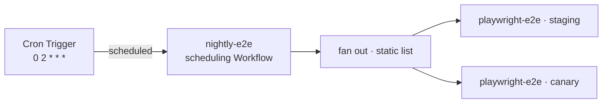

# Recipe: nightly end-to-end suite

A [Schedule-mode](../../specs/04-gha-integration.md#schedule-mode) run that exercises your deployed environments every night — the **simplest** shape Schedule mode takes.

## Why Schedule mode

A nightly suite has no GitHub trigger. It is not a PR push (Webhook mode) and not a GHA job (Action mode) — it is the *clock*. Schedule mode is the trigger: a Cloudflare Cron Trigger fires the run on a wall-clock cadence, zero GHA minutes, no `.github/workflows/` file.

## The simplest Schedule-mode shape — static targets

[`pr-review-sweep`](../ai-code-review/) has to *discover* its targets — a cron tick names no repo or PR, so its first step enumerates open PRs via the `github` capability. `nightly-e2e` doesn't: the environments it tests are a fixed list (`ENVIRONMENTS` at the top of [`nightly-e2e.run.ts`](nightly-e2e.run.ts)) known at deploy time.

So there is **no `enumerate` step**. `schedules[].inputs` produces the whole input from the cron tick, and the run body just fans out the shipped `playwright-e2e` run — one child per environment — with `sharded` over the static list.

| Schedule-mode run | Target resolution |
|---|---|
| `nightly-e2e` | **Static** — a fixed `ENVIRONMENTS` list in the recipe |
| `pr-review-sweep` | **Enumerated** — `github.openPullRequests()` at run time |
| `scheduled-deps` | **Enumerated** — `github.repositories()` at run time |

When the target set is static, Schedule mode is just `schedules` + a fixed input. Reach for `github` enumeration only when the targets genuinely vary tick to tick.

## Flow

## Install

1. Deploy FlareDispatch and install the GitHub App — [specs/05-byoc.md](../../specs/05-byoc.md).
2. Copy [`nightly-e2e.run.ts`](nightly-e2e.run.ts) into your repo's `runs/` directory and edit the `ENVIRONMENTS` list.
3. Add the cron to `wrangler.jsonc` — `"triggers": { "crons": ["0 2 * * *"] }` — matching the run's `schedules[].cron`, and `wrangler deploy`.
4. At 02:00 UTC the Dispatcher's `scheduled()` handler instantiates `nightly-e2e`; each environment gets a `flare-dispatch/playwright-e2e` check.

`ref` in each `ENVIRONMENTS` entry is a branch — a nightly suite tracks the branch tip, so `sandbox.git.clone` resolving the ref is intended. Pin a SHA instead if you need a frozen suite.
