# Recipe: AI-driven product demo

Hand a list of user stories in prose and a deployed URL; get back one continuous rrweb-based replay with chapter markers per story, a key screenshot per story, and a holistic markdown summary. When the dispatch carries the PR number (the Action-mode default), every completed demo also posts a PR comment with the summary and an **animated GIF of the walkthrough embedded inline** — the reviewer sees the demo in the review thread without leaving GitHub.

## Files

- [`product-demo.run.ts`](product-demo.run.ts) — the typed Run: attach CDP (with `?recording=true`) → record start (set viewport, capture sessionId) → for each story drive the agent → record stop (close session, pull rrweb events from Browser Run's REST API, upload JSON to R2) → write the holistic summary. The canonical, registered copy lives at [`runs/product-demo.ts`](../../runs/product-demo.ts) (this file is the teaching illustration the doc site renders).
- [`ci.yml`](ci.yml) — the GitHub Actions workflow that dispatches the run (Action mode, fire-and-forget). Triggers on `pull_request` against `apps/**` and on manual `workflow_dispatch` with an optional inline script override.
- [`demo-stories.md`](demo-stories.md) — the worked story script `ci.yml` reads by default (each `## ` heading = one chapter). Edit it like docs; see § "Authoring stories".
- [`Dockerfile.example`](Dockerfile.example) — drop-in layers that add the `demo-agent` binary to your own `Dockerfile.sandbox`. FlareDispatch ships no hosted image for the agent; the operator's sandbox image IS the integration point.

## Authoring stories

The run accepts the story script in either of two shapes — pass **exactly one** (`stories` wins if both are present):

- **`storiesMarkdown`** — a markdown document where **each level-2 heading (`## `) is one story**: the heading text is the story `name`, everything down to the next `## ` is the `prose`. Content before the first heading (a `# Title`, a preamble) is ignored. Lets you keep the demo script as a readable `.md` and edit it like documentation instead of hand-maintaining JSON. This is what [`ci.yml`](ci.yml) ships by default — it reads the tracked [`demo-stories.md`](demo-stories.md) into the dispatch input.
- **`stories`** — the structured array, `[{ "name": "...", "prose": "..." }]`. Drop in for a programmatically-generated script, or what a `schedules[].inputs` block returns.

```markdown
# Checkout demo

## sign-in
Open the site, click Sign in, log in with the demo account, and land on the dashboard.

## create-project
From the dashboard, create a new project called Demo and confirm the empty-state CTA appears.

## invite-member
Open the new project, invite a teammate by email, and confirm the pending-invite chip shows.
```

Both formats resolve to the same `{ name, prose }` list before the agent runs, so nothing downstream is markdown-aware. Story names must be unique — they become chapter markers on the rrweb replay timeline; the run dies loudly on duplicates or an empty list.

## Modes

The recipe runs in either of two trigger modes — pick the one that fits your use case, or wire up both:

- **Action mode (per-PR).** `ci.yml` POSTs to the Dispatcher when a PR opens/updates against `apps/**`, handing it the deployed preview URL + story list + the PR number (`pr: ${{ github.event.pull_request.number }}`). On completion the reviewer gets a PR comment with the GIF + summary, plus the replay link on the check-run. This is the default the recipe is tuned for.
- **Schedule mode (daily stakeholder demo).** [`runs/product-demo.ts`](../../runs/product-demo.ts) carries a `schedules: [{ cron: "0 14 * * *", inputs: () => ({ … }) }]` block. The Dispatcher's `scheduled()` handler fires the same run once a day against a pre-baked deployed URL + story list (no PR trigger required). Edit the `inputs` placeholders (`OWNER/REPO`, `https://staging.example.com`, the default story array) to point at your staging tier.

Use both at once if you want per-PR demos AND a daily stakeholder-facing run against staging — they share the same run code and Browser Rendering pool. The Schedule-mode firing is independent of `ci.yml`; the Action-mode dispatches inherit their inputs from the `workflow_dispatch` payload and ignore the `schedules[].inputs` defaults.

## How it works

The agent is a `demo-agent` CLI baked into the **operator's own** sandbox image (paste the [`Dockerfile.example`](Dockerfile.example) layers into your `Dockerfile.sandbox`). No registry pull, no separate FlareDispatch-hosted image — FlareDispatch ships exactly one container per Worker and `demo-agent` is just another binary on PATH inside it. The run owns *orchestration* (CDP attach, sequencing, uploads, summary stitching); the agent owns *the model loop and applying CDP commands from prose*. Recording itself is a **platform** capability — Browser Run captures rrweb DOM events when the CDP connect URL carries `?recording=true`, and the dispatcher's `newCDPSession` primitive does that automatically for runs with `requiresBrowser: true`.

```mermaid
flowchart LR
  PR[PR push / dispatch] --> A[ci.yml]
  A -->|HMAC POST| DSP[Dispatcher]
  DSP --> CDP["attach CDP<br/>(?recording=true)"]
  CDP --> REC["record start<br/>(viewport + sessionId)"]
  REC --> S1[demo-agent play<br/>story 1]
  S1 --> S2[demo-agent play<br/>story 2]
  S2 --> SN[demo-agent play<br/>story N]
  SN --> STOP["record stop<br/>(close, pull rrweb)"]
  STOP --> GIF["render gif<br/>(captured frames, ≤10 MB)"]
  GIF --> R2[upload replay.json<br/>+ demo.gif + screenshots → R2]
  R2 --> SUM[demo-agent summarize<br/>holistic markdown]
  SUM --> CHK[check-run<br/>replay link + summary]
  SUM -->|pr number present| CMT["PR comment<br/>summary + inline GIF"]
```



Each story's play captures a pixel frame after every action into a shared frames dir — the GIF's source, since the rrweb stream is DOM events, not pixels. The `render gif` step is the bundled `demo-agent gif` subcommand (pure-JS `pngjs` + `gifenc`, no ffmpeg in the image); it downscales to ≤ 800 px and drops frames evenly to stay under GitHub's ~10 MB image-proxy limit. The comment is best-effort: a GIF or comment failure logs but never fails the run, and a firing with no PR (Schedule mode, or a `workflow_dispatch` with no PR) skips it entirely. See [specs/02-runs.md § PR comment on completion](../../specs/02-runs.md#pr-comment-on-completion-gif--summary) for the full contract, and [`.github/workflows/product-demo-logviewer.yml`](../../.github/workflows/product-demo-logviewer.yml) for the worked dogfood that demos this repo's own log viewer.

## Failure signals (self-heal input)

A product-demo failure is a richer diagnostic than an OTel alert — it carries the journey that broke, the replay, and the screenshot. The run turns the **assertion-failed** chapters into `signals/v1` (the same vendor-blind contract a Datadog/SigNoz collector prints, [`packages/core/src/signals.ts`](../../packages/core/src/signals.ts)), so they can be folded into [`ci-triage-pr`](../ci-triage-pr/) today and a self-heal later — the same path an e2e or OTel finding takes.

Two rules make the output heal-worthy by construction (enforced by the pure, unit-tested [`storyResultsToSignals`](../../packages/core/src/demo-signals.ts)):

- **Only assertion failures emit a signal.** Each chapter result now carries a `failureKind` (`assertion` \| `timeout` \| `infra` \| `unparseable`). A demo verdict is an LLM-driven, non-deterministic browser loop, so a single red chapter is *not* ground truth — only `assertion` (the agent played the journey and the app misbehaved) becomes a signal. `infra`/`timeout`/`unparseable` are flake/environment and are dropped before emission, so the triage PR never drowns in flake.
- **The narrative is untrusted.** The demo drives a deployed app that may render attacker-influenced content, and the chapter `narrative` is an LLM *summary* of what it saw on-page — a carrier, not a sanitizer. It rides `signals/v1`'s already-fenced `detail` field; the signal's fingerprint (source + title) keys off the operator-authored chapter **name**, never the narrative, so a reworded flake can't mint a fresh incident identity and defeat downstream dedup.

The run exposes these two ways, so both the green and the **red** path keep them:

- `Output.signals` — the derived `signals/v1` array, returned on the success path.
- `artifacts/<execId>/signals.json` and `artifacts/<execId>/stories.json` — persisted to R2 on **both** paths. The dispatcher discards the Output (`summary_json`) on a failed Exit — exactly the run that most warrants triage — so a consumer reads the structured per-chapter results (status, `failureKind`, replay URIs) and the signals from R2 even on a fully-red demo.

## Why this lives on FlareDispatch

The structural advantages over the plain-GHA baseline ([`baseline.yml`](baseline.yml)):

- **One continuous replay across all stories.** Playwright's `recordVideo` on GHA is per-`BrowserContext` — one story = one .webm, with no clean way to stitch them. FlareDispatch shares ONE Browser Run session across every story, and Browser Run's native recording emits ONE rrweb event stream that covers the whole walkthrough; the run records per-story `chapterStartMs` / `chapterEndMs` offsets so a reviewer can scrub straight to a chapter.
- **rrweb DOM fidelity, not pixels.** Browser Run records DOM mutations + events via rrweb, not a video file. The replay is searchable, copy-pasteable, and orders of magnitude smaller than a webm — and the same recording supports console-error inspection, network-call observation, and per-element timing on the replay page. GHA + Playwright can only produce a flat video.
- **Warm browser pool — no `playwright install`.** A cold GHA runner pays ~30–45 s of `checkout` + `setup-node` + `pnpm install` + ~60–90 s of `playwright install --with-deps chromium` before the first frame. FlareDispatch attaches to Browser Run over CDP — there's no chromium install on the path at all.
- **Agent CLI inside the image, model provider chosen at deploy — zero credentials on the runner.** `demo-agent` lives in the operator's sandbox image; it talks to any OpenAI-compatible endpoint (Cloudflare AI Gateway with BYOK, OpenAI direct, Workers AI, Bedrock-via-compat, Ollama, …) via `@effect/ai`'s provider-agnostic `LanguageModel`. The container only sees a gateway URL; the upstream API key lives in the gateway. On the GHA baseline, model API keys are exposed to every step in the job, every postinstall script, and every third-party action you use.
- **Scale-to-zero between deploys.** Stories run sequentially because the browser is shared; the model round-trip per story is a wall-clock wait. On GHA you pay runner minutes while the model thinks. FlareDispatch only bills CPU actually used.
- **Signed R2 URLs for PR embedding — and a GIF where video can't go.** GitHub PR comments cannot embed video — the GHA artifact UI hands you a download link that requires unzip-and-watch-locally. But comments *do* render animated GIFs: the run encodes one from the frames it captured during the session and posts it inline on the PR (via the stable artifact URL, so it keeps rendering after the R2 presign rotates). The full-fidelity path stays too: `artifact.upload` returns a 30-day signed R2 URL to the rrweb event JSON, and the run returns a `replayUri` that opens the rrweb player on the docs site so reviewers can scrub the recording.
- **Live model routing via `config`.** The summary model resolves through `config.get("product-demo.model.summary")` ([`03-dsl § config`](../../specs/03-dsl.md#config)) — flip to a fallback provider in seconds, no redeploy. Mirrors the `pr-review` pattern in [recipes/ai-code-review](../ai-code-review/).
- **Incremental on re-runs via `io.priorExecution`.** Keyed on `(repo, deployedUrl)`, so a re-demo after a fix can call out what's new / regressed since the previous replay — same pattern as `pr-review`'s re-review continuity, durable instead of leaning on `actions/cache`.

## Install

1. Deploy FlareDispatch and install the GitHub App — see [specs/05-byoc.md](../../specs/05-byoc.md).
2. Add `product-demo.run.ts` to your repo's `runs/` directory.
3. Copy `ci.yml` into `.github/workflows/` and `demo-stories.md` alongside your repo (the workflow reads `recipes/product-demo/demo-stories.md` — adjust the path to wherever you keep it). Edit the story script to match your app's journey. Set `vars.PREVIEW_URL` (or adjust the inline URL convention) so the `pull_request` trigger knows where to drive the demo. Keep the `pr: ${{ github.event.pull_request.number }}` input on the dispatch — that's what enables the completion comment; drop it and the run silently reverts to check-run-only reporting. For the GIF to render inline, the deploy's artifact route (`/v1/artifacts/...`) must be set public — GitHub's image proxy fetches it server-side; on a private deploy the comment carries a plain link instead.
4. **Bake the `demo-agent` binary into your sandbox image.** Open [`Dockerfile.example`](Dockerfile.example) — it's a two-stage layer pair (build `demo-agent` from a pinned `flare-dispatch` ref, copy the bundle into a stock `cloudflare/sandbox` runtime). Paste the two stages into your own `Dockerfile.sandbox` (the one referenced by `wrangler.jsonc` `containers[].image`); `wrangler deploy` does the rest. No registry credentials, no `flare-dispatch-demo` pull — your sandbox image IS the integration. Pin `FD_REF` to a tag for reproducible builds.
5. **Point at a Cloudflare AI Gateway.** The agent speaks the OpenAI wire protocol via `@effect/ai`'s provider-agnostic `LanguageModel` and always routes through a Cloudflare AI Gateway. You don't paste a full URL — the agent **derives** the `/v1/<account>/<gateway>/compat` endpoint from `CLOUDFLARE_ACCOUNT_ID` + the gateway slug `CF_AI_GATEWAY_ID`. The gateway fans out to the upstream provider (OpenAI, Workers AI, Anthropic-via-compat, Bedrock, …). Run the gateway in **BYOK** mode so the container never holds an upstream key — the gateway holds it. Two optional auth knobs layer on top, each on its own axis:
   - `MODEL_API_KEY` — the **upstream provider** key (`Authorization: Bearer`). Leave unset under BYOK; set it only to bypass BYOK with a direct provider credential.
   - `CF_AI_GATEWAY_TOKEN` — the **gateway's own** auth token (`cf-aig-authorization: Bearer`), for a gateway with [Authenticated Gateway](https://developers.cloudflare.com/ai-gateway/configuration/authentication/) turned on. Orthogonal to `MODEL_API_KEY` — it gates access *to* the gateway, not to the upstream.
6. **Configure the run's runtime credentials.** Two Worker Secrets + a small set of `CONFIG_KV` entries (the agent reads zero ambient env vars; every credential flows in through `loadSecrets`):

   ```sh
   # Worker Secrets — read by the live `browser` Layer for the CDP attach.
   wrangler secret put BROWSER_CDP_CONNECT_URL    # wss://api.cloudflare.com/.../connect?recording=true
   wrangler secret put BROWSER_CDP_API_TOKEN      # Cloudflare API token, Browser Rendering edit

   # CONFIG_KV transport secrets — read by `loadSecrets`, passed as env to every demo-agent exec.
   # The model endpoint is DERIVED from CLOUDFLARE_ACCOUNT_ID + CF_AI_GATEWAY_ID
   # (no MODEL_BASE_URL). The two model auth knobs are optional and independent:
   # MODEL_API_KEY = upstream provider key (Authorization), unset under BYOK;
   # CF_AI_GATEWAY_TOKEN = the gateway's own auth (cf-aig-authorization), set
   # only for an Authenticated Gateway.
   wrangler kv key put --binding=CONFIG_KV product-demo.secret/CF_AI_GATEWAY_ID      <ai-gateway-slug>
   wrangler kv key put --binding=CONFIG_KV product-demo.secret/MODEL_API_KEY         <optional: upstream provider key; unset under gateway BYOK>
   wrangler kv key put --binding=CONFIG_KV product-demo.secret/CF_AI_GATEWAY_TOKEN   <optional: gateway auth token; set only for an Authenticated Gateway>
   wrangler kv key put --binding=CONFIG_KV product-demo.secret/CLOUDFLARE_ACCOUNT_ID <account-id>
   wrangler kv key put --binding=CONFIG_KV product-demo.secret/CLOUDFLARE_API_TOKEN  <token-with-browser-rendering-read>

   # CONFIG_KV model ids — resolved per-execution by the run via `config.get`,
   # so you can repoint models in seconds (no redeploy). REQUIRED — there is no
   # provider-neutral default (a `gpt-4o` default would only work on an OpenAI
   # gateway; a `claude-opus-4-7` default only on Anthropic). Pick the model
   # id that matches the upstream behind your AI Gateway.
   wrangler kv key put --binding=CONFIG_KV product-demo.model.play     gpt-4o-mini          # or claude-haiku-4-5-20251001 / @cf/meta/llama-3.1-70b-instruct / ...
   wrangler kv key put --binding=CONFIG_KV product-demo.model.summary  gpt-4o               # or claude-opus-4-7 / @cf/meta/llama-3.1-405b-instruct / ...
   ```

   Verify with [`scripts/check-product-demo-secrets.sh`](../../scripts/check-product-demo-secrets.sh).
7. **(Optional) Wire Bedrock through the same gateway.** AWS Bedrock isn't reachable on the gateway's `/compat` endpoint ([CF docs](https://developers.cloudflare.com/ai-gateway/usage/providers/bedrock/) — Bedrock is `provider endpoint only`), so a `bedrock/<modelId>` model id takes a separate path: SigV4-signed POST to `/v1/<acct>/<gw>/aws-bedrock/...`. The trust path is the same OIDC-federated AssumeRole that `pr-review`'s `bedrock` backend uses; share the role and widen its trust policy `sub` to also accept `product-demo:*`. To enable:
   - In `ci.yml` (or your `workflow_dispatch` payload), pass `bedrockRoleArn` and optionally `bedrockRegion` (defaults to `us-east-1`) on the dispatch input. The run will mint short-lived STS creds via `awsAssumeRole` and thread them into the agent through `agentEnv`.
   - Set `product-demo.model.play` to a `bedrock/<modelId>` id — e.g. `bedrock/us.anthropic.claude-opus-4-7-v1`. The agent's model client routes that prefix through the Bedrock forwarder; everything without the prefix keeps using the OpenAI-compat path.
   - The `MODEL_API_KEY` / gateway BYOK setup above is unused on the Bedrock path (auth IS the SigV4 signature). `CF_AI_GATEWAY_TOKEN` still applies if the gateway has Authenticated Gateway turned on.
8. Require the `flare-dispatch/product-demo` check-run in branch protection (NOT the GHA job — the GHA step succeeds at dispatch time; the actual demo result lives on the check-run).
9. Open a PR; when the demo completes, a PR comment lands with the walkthrough GIF + holistic summary, and the check-run summary carries the rrweb replay URL (`replayUri`) and the per-story chapter markers (`chapterStartMs` / `chapterEndMs` on the rrweb timeline).
