# Recipe: AI-driven product demo

Hand a list of user stories in prose and a deployed URL; get back one continuous rrweb-based replay with chapter markers per story, a key screenshot per story, and a holistic markdown summary a reviewer can paste into the PR description.

## Files

- [`product-demo.run.ts`](product-demo.run.ts) — the typed Run: attach CDP (with `?recording=true`) → record start (set viewport, capture sessionId) → for each story drive the agent → record stop (close session, pull rrweb events from Browser Run's REST API, upload JSON to R2) → write the holistic summary. The canonical, registered copy lives at [`runs/product-demo.ts`](../../runs/product-demo.ts) (this file is the teaching illustration the doc site renders).
- [`ci.yml`](ci.yml) — the GitHub Actions workflow that dispatches the run (Action mode, fire-and-forget). Triggers on `pull_request` against `apps/**` and on manual `workflow_dispatch` with a custom story list.
- [`Dockerfile.example`](Dockerfile.example) — drop-in layers that add the `demo-agent` binary to your own `Dockerfile.sandbox`. FlareDispatch ships no hosted image for the agent; the operator's sandbox image IS the integration point.

## Modes

The recipe runs in either of two trigger modes — pick the one that fits your use case, or wire up both:

- **Action mode (per-PR).** `ci.yml` POSTs to the Dispatcher when a PR opens/updates against `apps/**`, handing it the deployed preview URL + story list. The reviewer gets a video on every PR. This is the default the recipe is tuned for.
- **Schedule mode (daily stakeholder demo).** [`runs/product-demo.ts`](../../runs/product-demo.ts) carries a `schedules: [{ cron: "0 14 * * *", inputs: () => ({ … }) }]` block. The Dispatcher's `scheduled()` handler fires the same run once a day against a pre-baked deployed URL + story list (no PR trigger required). Edit the `inputs` placeholders (`OWNER/REPO`, `https://staging.example.com`, the default story array) to point at your staging tier.

Use both at once if you want per-PR demos AND a daily stakeholder-facing run against staging — they share the same run code and Browser Rendering pool. The Schedule-mode firing is independent of `ci.yml`; the Action-mode dispatches inherit their inputs from the `workflow_dispatch` payload and ignore the `schedules[].inputs` defaults.

## How it works

The agent is a `demo-agent` CLI baked into the **operator's own** sandbox image (paste the [`Dockerfile.example`](Dockerfile.example) layers into your `Dockerfile.sandbox`). No registry pull, no separate FlareDispatch-hosted image — FlareDispatch ships exactly one container per Worker and `demo-agent` is just another binary on PATH inside it. The run owns *orchestration* (CDP attach, sequencing, uploads, summary stitching); the agent owns *the model loop and applying CDP commands from prose*. Recording itself is a **platform** capability — Browser Run captures rrweb DOM events when the CDP connect URL carries `?recording=true`, and the dispatcher's `newCDPSession` primitive does that automatically for runs with `requiresBrowser: true`.

```mermaid
flowchart LR
  PR[PR push / dispatch] --> A[ci.yml]
  A -->|HMAC POST| DSP[Dispatcher]
  DSP --> CDP["attach CDP<br/>(?recording=true)"]
  CDP --> REC["record start<br/>(viewport + sessionId)"]
  REC --> S1[demo-agent play<br/>story 1]
  S1 --> S2[demo-agent play<br/>story 2]
  S2 --> SN[demo-agent play<br/>story N]
  SN --> STOP["record stop<br/>(close, pull rrweb)"]
  STOP --> R2[upload replay.json<br/>+ screenshots → R2]
  R2 --> SUM[demo-agent summarize<br/>holistic markdown]
  SUM --> CHK[check-run<br/>replay link + summary]
```



## Why this lives on FlareDispatch

The structural advantages over the plain-GHA baseline ([`baseline.yml`](baseline.yml)):

- **One continuous replay across all stories.** Playwright's `recordVideo` on GHA is per-`BrowserContext` — one story = one .webm, with no clean way to stitch them. FlareDispatch shares ONE Browser Run session across every story, and Browser Run's native recording emits ONE rrweb event stream that covers the whole walkthrough; the run records per-story `chapterStartMs` / `chapterEndMs` offsets so a reviewer can scrub straight to a chapter.
- **rrweb DOM fidelity, not pixels.** Browser Run records DOM mutations + events via rrweb, not a video file. The replay is searchable, copy-pasteable, and orders of magnitude smaller than a webm — and the same recording supports console-error inspection, network-call observation, and per-element timing on the replay page. GHA + Playwright can only produce a flat video.
- **Warm browser pool — no `playwright install`.** A cold GHA runner pays ~30–45 s of `checkout` + `setup-node` + `pnpm install` + ~60–90 s of `playwright install --with-deps chromium` before the first frame. FlareDispatch attaches to Browser Run over CDP — there's no chromium install on the path at all.
- **Agent CLI inside the image, model key in AI Gateway — zero credentials on the runner.** `demo-agent` lives in the operator's sandbox image; the Anthropic key sits in the operator's Cloudflare AI Gateway (BYOK), so the container only sees a gateway URL. On the GHA baseline, `ANTHROPIC_API_KEY` is exposed to every step in the job, every postinstall script, and every third-party action you use.
- **Scale-to-zero between deploys.** Stories run sequentially because the browser is shared; the model round-trip per story is a wall-clock wait. On GHA you pay runner minutes while the model thinks. FlareDispatch only bills CPU actually used.
- **Signed R2 URLs for PR embedding.** GitHub PR comments cannot embed video — the GHA artifact UI hands you a download link that requires unzip-and-watch-locally. FlareDispatch's `artifact.upload` returns a 30-day signed R2 URL to the rrweb event JSON, and the run also returns a `replayUri` that opens the rrweb player on the docs site so reviewers can scrub the recording inline.
- **Live model routing via `config`.** The summary model resolves through `config.get("product-demo.model.summary")` ([`03-dsl § config`](../../specs/03-dsl.md#config)) — flip to a fallback provider in seconds, no redeploy. Mirrors the `pr-review` pattern in [recipes/ai-code-review](../ai-code-review/).
- **Incremental on re-runs via `io.priorExecution`.** Keyed on `(repo, deployedUrl)`, so a re-demo after a fix can call out what's new / regressed since the previous replay — same pattern as `pr-review`'s re-review continuity, durable instead of leaning on `actions/cache`.

## Install

1. Deploy FlareDispatch and install the GitHub App — see [specs/05-byoc.md](../../specs/05-byoc.md).
2. Add `product-demo.run.ts` to your repo's `runs/` directory.
3. Copy `ci.yml` into `.github/workflows/`. Set `vars.PREVIEW_URL` (or adjust the inline URL convention) so the `pull_request` trigger knows where to drive the demo.
4. **Bake the `demo-agent` binary into your sandbox image.** Open [`Dockerfile.example`](Dockerfile.example) — it's a two-stage layer pair (build `demo-agent` from a pinned `flare-dispatch` ref, copy the bundle into a stock `cloudflare/sandbox` runtime). Paste the two stages into your own `Dockerfile.sandbox` (the one referenced by `wrangler.jsonc` `containers[].image`); `wrangler deploy` does the rest. No registry credentials, no `flare-dispatch-demo` pull — your sandbox image IS the integration. Pin `FD_REF` to a tag for reproducible builds.
5. **Set up Cloudflare AI Gateway for the model transport.** Create an AI Gateway in the dashboard, attach Anthropic with your upstream key (BYOK so the container never holds it), copy the per-provider URL (`https://gateway.ai.cloudflare.com/v1/<account>/<gateway>/anthropic`).
6. **Configure the run's runtime credentials.** Two Worker Secrets + a small set of `CONFIG_KV` entries (the agent reads zero ambient env vars; every credential flows in through `loadSecrets`):

   ```sh
   # Worker Secrets — read by the live `browser` Layer for the CDP attach.
   wrangler secret put BROWSER_CDP_CONNECT_URL    # wss://api.cloudflare.com/.../connect?recording=true
   wrangler secret put BROWSER_CDP_API_TOKEN      # Cloudflare API token, Browser Rendering edit

   # CONFIG_KV — read by `loadSecrets` and passed as env to every demo-agent exec.
   # AI_GATEWAY_URL is required; AI_GATEWAY_TOKEN only if your gateway has
   # "Authenticated Gateway" turned on.
   wrangler kv key put --binding=CONFIG_KV product-demo.secret/AI_GATEWAY_URL        https://gateway.ai.cloudflare.com/v1/<account>/<gateway>/anthropic
   wrangler kv key put --binding=CONFIG_KV product-demo.secret/AI_GATEWAY_TOKEN      <optional: gateway auth token>
   wrangler kv key put --binding=CONFIG_KV product-demo.secret/CLOUDFLARE_ACCOUNT_ID <account-id>
   wrangler kv key put --binding=CONFIG_KV product-demo.secret/CLOUDFLARE_API_TOKEN  <token-with-browser-rendering-read>
   ```

   Verify with [`scripts/check-product-demo-secrets.sh`](../../scripts/check-product-demo-secrets.sh).
7. Require the `flare-dispatch/product-demo` check-run in branch protection (NOT the GHA job — the GHA step succeeds at dispatch time; the actual demo result lives on the check-run).
8. Open a PR; the check-run summary lands with the rrweb replay URL (`replayUri`) and the per-story chapter markers (`chapterStartMs` / `chapterEndMs` on the rrweb timeline).
