# Recipe: AI-driven product demo

Hand a list of user stories in prose and a deployed URL; get back one master walkthrough video with chapter markers, a key screenshot per story, and a holistic markdown summary a reviewer can paste into the PR description.

## Files

- [`product-demo.run.ts`](product-demo.run.ts) — the typed Run: attach CDP → start recording → for each story drive the agent → stop recording → upload to R2 → write the holistic summary. The canonical, registered copy lives at [`runs/product-demo.ts`](../../runs/product-demo.ts) (this file is the teaching illustration the doc site renders).
- [`ci.yml`](ci.yml) — the GitHub Actions workflow that dispatches the run (Action mode, fire-and-forget). Triggers on `pull_request` against `apps/**` and on manual `workflow_dispatch` with a custom story list.

## Modes

The recipe runs in either of two trigger modes — pick the one that fits your use case, or wire up both:

- **Action mode (per-PR).** `ci.yml` POSTs to the Dispatcher when a PR opens/updates against `apps/**`, handing it the deployed preview URL + story list. The reviewer gets a video on every PR. This is the default the recipe is tuned for.
- **Schedule mode (daily stakeholder demo).** [`runs/product-demo.ts`](../../runs/product-demo.ts) carries a `schedules: [{ cron: "0 14 * * *", inputs: () => ({ … }) }]` block. The Dispatcher's `scheduled()` handler fires the same run once a day against a pre-baked deployed URL + story list (no PR trigger required). Edit the `inputs` placeholders (`OWNER/REPO`, `https://staging.example.com`, the default story array) to point at your staging tier.

Use both at once if you want per-PR demos AND a daily stakeholder-facing run against staging — they share the same run code and Browser Rendering pool. The Schedule-mode firing is independent of `ci.yml`; the Action-mode dispatches inherit their inputs from the `workflow_dispatch` payload and ignore the `schedules[].inputs` defaults.

## How it works

The agent is a `demo-agent` CLI baked into the `flare-dispatch-demo` container image — the same shape as `review-agent` in [recipes/ai-code-review](../ai-code-review/). The run owns *orchestration* (CDP attach, sequencing, uploads, summary stitching); the agent owns *mechanics* (the recording pipeline, the model loop, applying CDP commands from prose).

```mermaid
flowchart LR
  PR[PR push / dispatch] --> A[ci.yml]
  A -->|HMAC POST| DSP[Dispatcher]
  DSP --> CDP[attach CDP<br/>to deployed URL]
  CDP --> REC[record start]
  REC --> S1[demo-agent play<br/>story 1]
  S1 --> S2[demo-agent play<br/>story 2]
  S2 --> SN[demo-agent play<br/>story N]
  SN --> STOP[record stop]
  STOP --> R2[upload video<br/>+ screenshots → R2]
  R2 --> SUM[demo-agent summarize<br/>holistic markdown]
  SUM --> CHK[check-run<br/>video link + summary]
```

## Why this lives on FlareDispatch

The structural advantages over the plain-GHA baseline ([`baseline.yml`](baseline.yml)):

- **Master video as a single artifact.** Playwright's `recordVideo` is per-`BrowserContext` — on GHA, one story = one .webm, and there is no clean way to stitch them. FlareDispatch's `demo-agent` records ONE continuous video across all stories with chapter markers stored as per-story `videoStartMs` / `videoEndMs` offsets.
- **Warm browser container pool.** A cold GHA runner pays ~30–45 s of `checkout` + `setup-node` + `pnpm install` + ~60–90 s of `playwright install --with-deps chromium` before the first frame. FlareDispatch ships `flare-dispatch-demo:latest` with chromium and the agent baked in, served from a warm pool that scales to zero between deploys.
- **Agent CLI inside the image — no API keys on the runner.** `demo-agent` lives in the container; the model API key is a Worker Secret on the Dispatcher. On the GHA baseline, `ANTHROPIC_API_KEY` is exposed to every step in the job, every postinstall script, and every third-party action you use.
- **Scale-to-zero between deploys.** Stories run sequentially because the browser is shared; the model round-trip per story is a wall-clock wait. On GHA you pay runner minutes while the model thinks. FlareDispatch only bills CPU actually used.
- **Signed R2 URLs for PR embedding.** GitHub PR comments cannot embed video — the GHA artifact UI hands you a download link that requires unzip-and-watch-locally. FlareDispatch's `artifact.upload` returns a 30-day signed R2 URL the reviewer drops straight into the PR description.
- **Live model routing via `config`.** The summary model resolves through `config.get("product-demo.model.summary")` ([`03-dsl § config`](../../specs/03-dsl.md#config)) — flip to a fallback provider in seconds, no redeploy. Mirrors the `pr-review` pattern in [recipes/ai-code-review](../ai-code-review/).
- **Incremental on re-runs via `io.priorExecution`.** Keyed on `(repo, deployedUrl)`, so a re-demo after a fix can call out what's new / regressed since the previous video — same pattern as `pr-review`'s re-review continuity, durable instead of leaning on `actions/cache`.

## Install

1. Deploy FlareDispatch and install the GitHub App — see [specs/05-byoc.md](../../specs/05-byoc.md).
2. Add `product-demo.run.ts` to your repo's `runs/` directory.
3. Copy `ci.yml` into `.github/workflows/`. Set `vars.PREVIEW_URL` (or adjust the inline URL convention) so the `pull_request` trigger knows where to drive the demo.
4. Require the `flare-dispatch/product-demo` check-run in branch protection (NOT the GHA job — the GHA step succeeds at dispatch time; the actual demo result lives on the check-run).
5. Open a PR; the check-run summary lands with the signed video URL and the per-story chapter markers.
