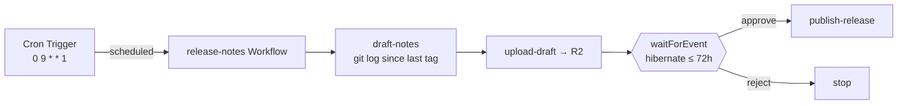

# Recipe: weekly release notes with a human gate

A [Schedule-mode](../../specs/04-gha-integration.md#schedule-mode) run that drafts release notes every Monday, posts the draft for review, and waits for a human to approve before publishing the GitHub Release.

## Why Schedule mode

Release notes are not triggered by a push — they are triggered by a *cadence*: "every Monday morning." That is Schedule mode. A Cloudflare Cron Trigger fires the Dispatcher's `scheduled()` handler weekly; no GHA workflow file, no GHA minutes.

## The two things this recipe pairs

This recipe is the canonical example of Schedule mode's two distinct durable mechanisms working together:

1. **A wall-clock trigger** — the `schedules` block (`0 9 * * 1`). The Cron Trigger is the heartbeat.
2. **A durable pause** — `step.waitForEvent` ([03-dsl § Human-in-the-loop](../../specs/03-dsl.md#human-in-the-loop-with-stepwaitforevent)). After drafting, the Workflow **hibernates** for up to 72 hours — consuming no CPU, surviving Worker eviction — until an approver POSTs the decision to `/v1/admin/events/:wf_id` (behind Cloudflare Access).

Both are Cloudflare Workflows durability primitives. The cron starts the run; `waitForEvent` lets it sit idle for days between "drafted" and "published" without holding any compute.

## Flow

## What lives where

The run is thin orchestration. The work is a `release-notes` CLI baked into the `flare-dispatch-release` image — it builds the draft from `git log <last-tag>..HEAD` and (on approval) publishes the release. This mirrors how [`ai-code-review`](../ai-code-review/) keeps all model logic inside `review-agent`.

| Step | DSL surface |
|---|---|
| `draft-notes` | `workspace` checkout + `sandbox.exec` the CLI |
| `upload-draft` | `artifact.upload` → signed R2 URL, linked from the check-run summary |
| `release approval` | `step.waitForEvent` — the durable 72h pause |
| `publish-release` | `sandbox.exec` `gh` inside the container — see the note below |

## The publish-write boundary

Drafting, uploading, and the check-run summary are all DSL-native (read + R2 + container exec). **Publishing** a GitHub Release is a *write*, and the `github` capability is deliberately read-only — writes are the Dispatcher's job ([03-dsl § `github`](../../specs/03-dsl.md#github)). So `publish-release` shells out to `gh` inside the container, authenticated with a fine-grained PAT the operator sets as the Worker Secret `RELEASE_PUBLISH_TOKEN`. The run reads it through `io.env` (which keeps the read deterministic under checkpoint replay) and never logs it.

If `RELEASE_PUBLISH_TOKEN` is unset, `publish-release` fails with a clear error rather than silently skipping.

## Install

1. Deploy FlareDispatch and install the GitHub App — [specs/05-byoc.md](../../specs/05-byoc.md).
2. Copy [`release-notes.run.ts`](release-notes.run.ts) into `runs/` and set `TARGET` to your release repo.
3. `wrangler secret put RELEASE_PUBLISH_TOKEN` — a fine-grained PAT with `contents: write` on that repo.
4. Add the cron to `wrangler.jsonc` — `"triggers": { "crons": ["0 9 * * 1"] }` — matching `schedules[].cron`, and `wrangler deploy`.
5. Configure a Cloudflare Access app on `/v1/admin/*` so approvers can authenticate ([specs/05-byoc.md § ship-ready checklist](../../specs/05-byoc.md#reference-ship-ready-checklist)).
6. Each Monday 09:00 UTC the run drafts notes and pauses; approve from the link in the check-run summary to publish.
