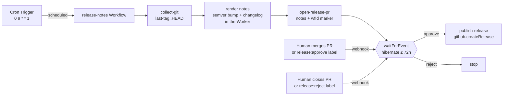

# Recipe: weekly release notes with a human gate

A [Schedule-mode](../../specs/04-gha-integration.md#schedule-mode) run that drafts release notes for the unreleased range every Monday, uploads the draft for review, and **waits for a human to approve** before publishing the GitHub Release.

> The recipe file [`release-notes.run.ts`](release-notes.run.ts) is generated from the deployed [`runs/release-notes.ts`](../../runs/release-notes.ts) — they never drift (`pnpm sync-recipes --check` gates it in CI).

## Why Schedule mode

Release notes are not triggered by a push — they are triggered by a *cadence*: "every Monday morning, is there anything unreleased worth cutting?" That is Schedule mode. A Cloudflare Cron Trigger fires the Dispatcher's `scheduled()` handler weekly; no GHA workflow file, no GHA minutes.

## The two durable mechanisms this recipe pairs

This is the canonical example of Schedule mode's two distinct durability primitives working together:

1. **A wall-clock trigger** — the `schedules` block (`0 9 * * 1`). The Cron Trigger is the heartbeat.
2. **A durable pause** — `step.waitForEvent` ([03-dsl § Human-in-the-loop](../../specs/03-dsl.md#human-in-the-loop-with-stepwaitforevent)). After drafting, the Workflow **hibernates** for up to 72 hours — consuming no CPU, surviving Worker eviction — until an approver POSTs the decision to `/v1/admin/events/:wf_id`.

The cron starts the run; `waitForEvent` lets it sit idle for days between "drafted" and "published" without holding any compute.

## Flow



## What's real — no fictional CLI

The work is *thin orchestration over real primitives*; there is **no bespoke `release-notes` CLI and no special image**:

| Step | DSL surface |
|---|---|
| `collect-git` | `workspace` checkout + `sandbox.exec` plain `git` (`git describe --tags`, `git log <last-tag>..HEAD`) on the **existing** `flare-dispatch-review` image — used only for `git`, exactly like `spec-drift-pr`. |
| *(render)* | Pure helpers in the Worker (`parseConventional`, `nextVersion`, `renderReleaseNotes`) — a semver bump derived from [Conventional Commits](https://www.conventionalcommits.org/) (`feat` → minor, `fix`/other → patch, `!`/`BREAKING CHANGE` → major) and a categorized changelog (Breaking / Features / Fixes / Performance / Documentation / Other) with PR links + contributors. Unit-tested and replay-safe. |
| `open-release-pr` | `github.openDraftPullRequest({ draft: false })` — commits the notes as `.flare-dispatch/releases/<tag>.md` and opens a **mergeable** PR whose body carries the notes + a hidden marker (see below). |
| `release approval` | `step.waitForEvent` — the durable 72h pause, resumed by the webhook. |
| `publish-release` | `github.createRelease` — see below. |

## The publish boundary — a capability write, not a PAT

Publishing a GitHub Release is a *write*. Rather than a container `gh` shell-out authenticated by an operator PAT, this run uses the **`github.createRelease` capability** — the same Dispatcher-side seam as `openDraftPullRequest`, authenticated by the FlareDispatch App's short-lived **installation token**. `POST /repos/{o}/{r}/releases` also creates the tag at the drafted `HEAD` sha, so the tag is reproducible and no container `git push --tags` is needed.

So there is **no `RELEASE_PUBLISH_TOKEN` secret to set**. On a deploy without App credentials, `createRelease` degrades to a logged no-op (the run returns `reason: "not-configured"`) rather than failing.

## The approval surface — a release PR (GitHub-native)

Approval happens **on GitHub**, not via a shared admin token. The PR body carries a hidden marker that pins the run's own Workflow instance id:

```html
<!-- flare-dispatch:release-approval wf=<instanceId> tag=<tag> -->
```

A human:

- **approves** by **merging the PR** (or adding the `release:approve` label), or
- **rejects** by **closing it unmerged** (or the `release:reject` label).

The Dispatcher's webhook (`apps/dispatcher/src/release-approval.ts`) reads the marker off the `pull_request` event, verifies the App webhook HMAC, and signals the paused run. **GitHub's own repo permissions are the authZ** (only someone who can merge/label a PR can approve), and the decider is a real GitHub identity — so no `ADMIN_TOKEN` is needed for this flow. The `pull_request` event is already in the App's subscription set (it powers `pr-review`), so nothing new to subscribe.

The generic [`POST /v1/admin/events/:wf_id`](../../specs/05-byoc.md) endpoint (`ADMIN_TOKEN` bearer / Cloudflare Access) remains a **manual override** for the same `{ "type": "release-approval", "payload": { "decision": "approve", "decider": "you" } }` signal.

## Install

1. Deploy FlareDispatch and install the GitHub App with **webhooks on** — [specs/05-byoc.md](../../specs/05-byoc.md). The installation must grant `pull_requests: write` (open the release PR) and `contents: write` (releases + tags), and subscribe to `pull_request` events.
2. Copy [`release-notes.run.ts`](release-notes.run.ts) into `runs/`, set `TARGET` to your release repo, register it in `runs/index.ts` + the Dispatcher registry.
3. Add the cron to `wrangler.jsonc` — `"triggers": { "crons": ["0 9 * * 1"] }` — matching `schedules[].cron`, and `wrangler deploy`.
4. *(Optional)* Set `ADMIN_TOKEN` only if you want the manual-override signalling path; the merge/label flow needs no secret.
5. Each Monday 09:00 UTC the run drafts notes and opens the release PR; **merge it to publish** the GitHub Release.
