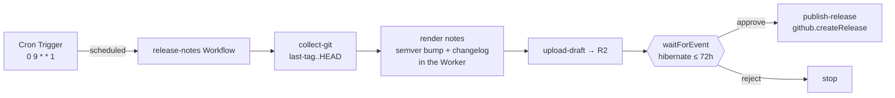

# Recipe: weekly release notes with a human gate

A [Schedule-mode](../../specs/04-gha-integration.md#schedule-mode) run that drafts release notes for the unreleased range every Monday, uploads the draft for review, and **waits for a human to approve** before publishing the GitHub Release.

> The recipe file [`release-notes.run.ts`](release-notes.run.ts) is generated from the deployed [`runs/release-notes.ts`](../../runs/release-notes.ts) — they never drift (`pnpm sync-recipes --check` gates it in CI).

## Why Schedule mode

Release notes are not triggered by a push — they are triggered by a *cadence*: "every Monday morning, is there anything unreleased worth cutting?" That is Schedule mode. A Cloudflare Cron Trigger fires the Dispatcher's `scheduled()` handler weekly; no GHA workflow file, no GHA minutes.

## The two durable mechanisms this recipe pairs

This is the canonical example of Schedule mode's two distinct durability primitives working together:

1. **A wall-clock trigger** — the `schedules` block (`0 9 * * 1`). The Cron Trigger is the heartbeat.
2. **A durable pause** — `step.waitForEvent` ([03-dsl § Human-in-the-loop](../../specs/03-dsl.md#human-in-the-loop-with-stepwaitforevent)). After drafting, the Workflow **hibernates** for up to 72 hours — consuming no CPU, surviving Worker eviction — until an approver POSTs the decision to `/v1/admin/events/:wf_id`.

The cron starts the run; `waitForEvent` lets it sit idle for days between "drafted" and "published" without holding any compute.

## Flow



## What's real — no fictional CLI

The work is *thin orchestration over real primitives*; there is **no bespoke `release-notes` CLI and no special image**:

| Step | DSL surface |
|---|---|
| `collect-git` | `workspace` checkout + `sandbox.exec` plain `git` (`git describe --tags`, `git log <last-tag>..HEAD`) on the **existing** `flare-dispatch-review` image — used only for `git`, exactly like `spec-drift-pr`. |
| *(render)* | Pure helpers in the Worker (`parseConventional`, `nextVersion`, `renderReleaseNotes`) — a semver bump derived from [Conventional Commits](https://www.conventionalcommits.org/) (`feat` → minor, `fix`/other → patch, `!`/`BREAKING CHANGE` → major) and a categorized changelog (Breaking / Features / Fixes / Performance / Documentation / Other) with PR links + contributors. Unit-tested and replay-safe. |
| `upload-draft` | `artifact.upload` → signed R2 URL, linked from the check-run summary. |
| `release approval` | `step.waitForEvent` — the durable 72h pause. |
| `publish-release` | `github.createRelease` — see below. |

## The publish boundary — a capability write, not a PAT

Publishing a GitHub Release is a *write*. Rather than a container `gh` shell-out authenticated by an operator PAT, this run uses the **`github.createRelease` capability** — the same Dispatcher-side seam as `openDraftPullRequest`, authenticated by the FlareDispatch App's short-lived **installation token**. `POST /repos/{o}/{r}/releases` also creates the tag at the drafted `HEAD` sha, so the tag is reproducible and no container `git push --tags` is needed.

So there is **no `RELEASE_PUBLISH_TOKEN` secret to set**. On a deploy without App credentials, `createRelease` degrades to a logged no-op (the run returns `reason: "not-configured"`) rather than failing.

## The approval payload

The approver authenticates against `/v1/admin/*` (the `ADMIN_TOKEN` bearer / Cloudflare Access) and POSTs:

```http
POST /v1/admin/events/{wf_id}
Authorization: Bearer ${ADMIN_TOKEN}
Content-Type: application/json

{ "type": "release-approval",
  "payload": { "decision": "approve", "deciderEmail": "you@example.com" } }
```

`decision: "reject"` stops the run (`reason: "rejected"`); the `wf_id` is the workflow instance id from the drafted run's check-run summary / log.

## Install

1. Deploy FlareDispatch and install the GitHub App — [specs/05-byoc.md](../../specs/05-byoc.md). The App's installation must grant `contents: write` on the release repo (releases + tags).
2. Copy [`release-notes.run.ts`](release-notes.run.ts) into `runs/`, set `TARGET` to your release repo, register it in `runs/index.ts` + the Dispatcher registry.
3. Add the cron to `wrangler.jsonc` — `"triggers": { "crons": ["0 9 * * 1"] }` — matching `schedules[].cron`, and `wrangler deploy`.
4. Set `ADMIN_TOKEN` (`wrangler secret put ADMIN_TOKEN`) so approvers can authenticate, or front `/v1/admin/*` with a Cloudflare Access app ([specs/05-byoc.md § ship-ready checklist](../../specs/05-byoc.md#reference-ship-ready-checklist)).
5. Each Monday 09:00 UTC the run drafts notes and pauses; approve from the link in the check-run summary to publish.
