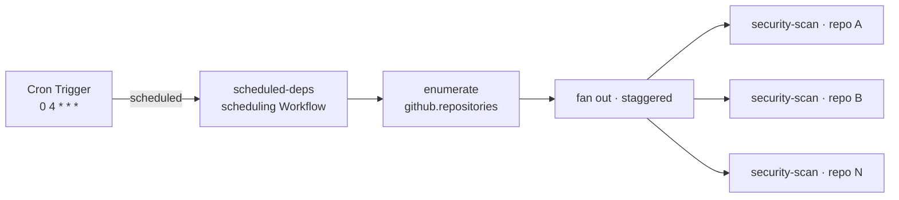

# Recipe: scheduled dependency audit

A [Schedule-mode](../../specs/04-gha-integration.md#schedule-mode) run that audits dependencies across **every repo** the FlareDispatch App is installed on, every night.

## Why Schedule mode

A vulnerability disclosure does not wait for your next PR. A dependency that was clean when it merged can be flagged days later — and a PR-triggered scan ([`security-scan`](../security-scan/) in Action mode) never re-runs on code that isn't being changed. Schedule mode closes that gap: a Cloudflare Cron Trigger re-audits the whole org on a cadence, so a fresh CVE surfaces within a day rather than at the next unrelated push.

## Shape — enumerate, then fan out

Same shape as [`pr-review-sweep`](../ai-code-review/), but the unit of work is a **repo**, not a PR:

| Concern | How the run handles it |
|---|---|
| A cron tick names no repo | The `enumerate` step calls `github.repositories()` ([03-dsl § `github`](../../specs/03-dsl.md#github)) — the App-token-backed read surface — filtering out archived repos and ones idle beyond `pushedWithinDays`. |
| Don't burst the API / container pool | The fan-out is staggered with `step.sleepUntil` ([03-dsl § Deferred scheduling](../../specs/03-dsl.md#deferred-scheduling-with-stepsleepuntil)) across a 30-minute window; the scheduling Workflow hibernates between slots. |
| Don't double-scan | Each child `security-scan` is created with a date-windowed semantic `instanceId` — a duplicate cron delivery or an overlapping manual scan collapses to a no-op `create`. |

`github.repositories()` is the repo-level counterpart to `github.openPullRequests()`: a sweep over PRs enumerates the latter, a sweep over repos enumerates the former.

## What it dispatches

The shipped `security-scan` run, unchanged — see [`recipes/security-scan/`](../security-scan/). This run only decides *which repos* and *when*; `security-scan` runs the scanners and posts a `flare-dispatch/security-scan` check-run per repo. `scheduled-deps` posts no check-run of its own.

## Install

1. Deploy FlareDispatch and install the GitHub App on the repos to audit — [specs/05-byoc.md](../../specs/05-byoc.md).
2. Copy [`scheduled-deps.run.ts`](scheduled-deps.run.ts) into `runs/` (and `security-scan.run.ts` from the security-scan recipe, if not already present).
3. Add the cron to `wrangler.jsonc` — `"triggers": { "crons": ["0 4 * * *"] }` — matching `schedules[].cron`, and `wrangler deploy`.
4. At 04:00 UTC the Dispatcher's `scheduled()` handler instantiates `scheduled-deps`; every active repo gets a `flare-dispatch/security-scan` check.

Edit the `SCANNERS` list in the run to match your ecosystems — `security-scan` skips a scanner whose lockfile a repo doesn't have, so a broad list is safe.
