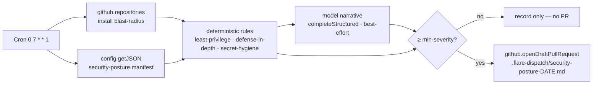

# Recipe: scheduled BYOC security-posture review → draft PR

Every week, audit the security posture of **your FlareDispatch deployment
itself** — least-privilege of its API tokens, defense-in-depth of its controls,
hygiene of its long-lived secrets — and open **one** draft pull request carrying
a posture scorecard + findings (`.flare-dispatch/security-posture-<date>.md`). It
scores the deployment against the canonical trust model
([specs/07-trust-model.md](../../specs/07-trust-model.md)) and proposes
**nothing automatically** — every finding is a recommendation a human reviews.

This is **not** [`security-scan`](../security-scan/). That recipe scans a
checked-out repo's *dependencies* for CVEs. This one audits the *Dispatcher's own
trust surface*: the GitHub App key's blast-radius, the `CLOUDFLARE_API_TOKEN`
scope, whether Cloudflare Access actually fronts the viewer, whether you're still
carrying an `HMAC_SECRET` you no longer need.

## Why Schedule mode

Security posture drifts silently — a token gains a scope during a debugging
session, the App gets installed on three more repos, a secret outlives its
purpose. A [Schedule-mode](../../specs/04-gha-integration.md#schedule-mode) run
(a Cloudflare Cron Trigger) re-scores the deployment on a cadence and files the
delta where the team will see it, instead of waiting for an incident. Single DSL
file [`security-posture.run.ts`](security-posture.run.ts), dropped into `runs/`.
Zero GHA minutes.

## What it can read, and what you declare

A run executes inside a Workflow and **cannot introspect which Worker Secrets or
bindings are set** — `io.env` is a deliberate no-op, because Worker Env is a
deploy-time fact and *"the operator's Cloudflare account is sound"* is an
explicit trust assumption ([07-trust-model § Scope and
non-goals](../../specs/07-trust-model.md#scope-and-non-goals)). So the audit has
two input planes:

| Plane | Source | Examples |
|---|---|---|
| **Live** (introspected) | `github.repositories()` | the App key's real install blast-radius — repo count, distinct installations, archived repos still attached |
| **Declared** (CONFIG_KV) | `security-posture.manifest` | CF API-token scopes, App permission set, `VIEWER_ACCESS_MODE`, which secrets are set, trigger modes in use |



**Deterministic rules** produce the high-confidence findings with no model in the
loop (an over-broad token, a missing Access layer, an unneeded long-lived
secret). The **model pass** adds the narrative scorecard and catches what the
rules miss — and it's **best-effort**: if the review backend is unconfigured or
errors, the audit still files the rules-only report. A security control should
fail toward *"tell me less,"* never *"go dark."*

## What it checks (rubric → trust model)

Each finding maps to a control or known-gap in
[07-trust-model](../../specs/07-trust-model.md):

| Principle | Checks |
|---|---|
| **Least-privilege** | `CLOUDFLARE_API_TOKEN` carries no account-wide/"god" scope; a read-purpose token holds no edit scopes; deploy token includes `Containers` (the silent-freeze gotcha); GitHub App permissions stay within the minimal baseline (`checks:write`, `contents`/`deployments`/`metadata:read`, `pull_requests:write`); a webhook-/schedule-only deploy isn't carrying an unused `HMAC_SECRET` |
| **Defense-in-depth** | viewer surfaces aren't `token-only` (no identity layer); `VIEWER_ACCESS_MODE=required` actually has a custom domain (Access can't front `*.workers.dev`); `/v1/admin/*` is fronted by Access on top of the `ADMIN_TOKEN` bearer |
| **Secret hygiene** | required secrets for the trigger modes in use are set (`HMAC_SECRET` for Action, `GITHUB_WEBHOOK_SECRET` for Webhook); `BROWSER_CDP_API_TOKEN` (long-lived static credential — a known gap) has a rotation plan; OIDC signing key + secrets have a declared ≤90-day rotation cadence |
| **Blast-radius** | the App is installed on *selected* repos, not org-wide "all"; the live reachable-repo count is sane and carries no archived repos |

The model can add **platform-residual** findings for the trust model's un-defended
[known gaps](../../specs/07-trust-model.md#known-gaps) (CSRF state-token, rate
limiting, per-installation tenancy) so each weekly report restates the residual
risk the operator carries.

## Config (CONFIG_KV)

| Key | Meaning |
|---|---|
| `security-posture.manifest` | **the declared plane** — a JSON posture manifest (shape below) |
| `security-posture.report-repo` | **required** — repo to open the audit PR on (usually your `flare-dispatch` fork) |
| `security-posture.base` | base branch for the audit PR (default `main`) |
| `security-posture.min-severity` | only open a PR when a finding is at/above this — `info` (default, always) \| `low` \| `medium` \| `high` \| `critical` |
| `security-posture.backend` | `opencode` (default) or `reasonix` — the narrative model |
| `security-posture.prompt` | *(optional)* override the auditor system prompt |
| `security-posture.opencode.model` / `.mode` | model id + `tools`/`json` for `opencode` |
| `security-posture.reasonix.model` / `.mode` | model id + `tools`/`json` for `reasonix` |

Reuses the same configurable model machinery as
[`ai-code-review`](../ai-code-review/) (`@flare-dispatch/review-agent`'s
`completeStructured`, resolved under this run's `security-posture.*` namespace).
**No model API key** — the Workers AI binding is the auth.

### The posture manifest

`security-posture.manifest` is a JSON value describing what the run can't
introspect. Every field is optional and defaults to its most-unknown value, so a
partially-filled manifest still audits cleanly (a missing field surfaces as an
`unknown` finding, never a false `ok`). Set it with:

```sh
wrangler kv key put --binding CONFIG_KV security-posture.manifest "$(cat manifest.json)"
```

```jsonc
{
  // The trigger paths actually in use — decides which secrets are *required*.
  "triggerModes": ["webhook", "schedule"],          // "action" | "webhook" | "schedule"

  // Defense-in-depth.
  "customDomain": true,                              // Access can't front *.workers.dev
  "viewerAccess": "required",                        // "required" | "token-only" | "unset"
  "adminToken": "n/a",                               // "set" | "unset" | "n/a" (no waitForEvent run)
  "adminAccessFronted": false,

  // Secret presence (the run can't read these — declare them).
  "hmacSecret": "unset",                             // webhook-only ⇒ you can drop it
  "webhookSecret": "set",
  "browserCdpToken": "n/a",                          // "set" if you run cdp-acceptance
  "oidcFederation": false,
  "secretRotationDays": 90,

  // Least-privilege of the credentials.
  "cloudflareApiTokenScopes": [
    "Workers Scripts:Edit", "Workers KV Storage:Edit", "D1:Edit",
    "Workers R2 Storage:Edit", "Workers Containers:Edit", "DNS:Edit"
  ],
  "cloudflareApiTokenPurpose": "deploy",
  "githubAppPermissions": {
    "checks": "write", "contents": "read", "deployments": "read",
    "metadata": "read", "pull_requests": "write"
  },
  "githubAppInstallScope": "selected"                // "selected" | "all" | "unknown"
}
```

A finding is only as good as the manifest is current — treat keeping it accurate
as part of the deploy. The audit nags (`medium`) when the manifest is absent
entirely.

## Prerequisites for the data sources

- **GitHub App** — must be installed on the repos you operate, so
  `github.repositories()` can measure the live blast-radius and
  `github.openDraftPullRequest` can file the report. With no installation
  reachable from the cron tick, the live plane degrades to empty and the audit
  leans on the declared scope (noted in the report).
- **A model backend** — set `security-posture.opencode.model` (or `.reasonix.*`)
  for the narrative. Absent, the audit files the deterministic rule findings only.

## Install

1. Deploy FlareDispatch + install the GitHub App — [specs/05-byoc.md](../../specs/05-byoc.md).
2. Copy [`security-posture.run.ts`](security-posture.run.ts) into your repo's `runs/`.
3. Add the cron to `wrangler.jsonc` — `"triggers": { "crons": ["0 7 * * 1"] }` —
   and `wrangler deploy`.
4. Set `security-posture.report-repo` (your fork), populate
   `security-posture.manifest`, and pick a backend model. At 07:00 UTC Monday the
   Dispatcher instantiates the run; a posture below your `min-severity` files no
   PR, anything at/above it gets one draft audit PR.
5. *(Optional)* point a `CODEOWNERS` rule at `.flare-dispatch/security-posture-*`
   so the audit lands on the security owner's review queue.
