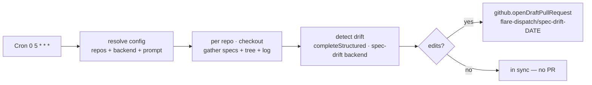

# Recipe: scheduled spec drift → draft PR

Every day, scan each configured repo for drift between its `specs/` and the
implementation, and open a **draft pull request** with the reconciling spec
edits. The unattended, cron-driven sibling of the [`spec-drift`
skill](../../../.claude/skills/spec-drift/SKILL.md)'s `--apply`: the skill runs
by hand; this run fires on a wall-clock cadence and files its proposal as a draft
PR a human reviews before merge.

## Why Schedule mode

Spec drift accrues continuously, not on a single PR. A
[Schedule-mode](../../specs/04-gha-integration.md#schedule-mode) run re-checks on
a cadence (a Cloudflare Cron Trigger, not a GitHub event), so the specs never sit
stale for long. The recipe is a single DSL file —
[`spec-drift-pr.run.ts`](spec-drift-pr.run.ts) — dropped into your repo's `runs/`.
No workflow file, zero GHA minutes.

## Reuse: the same review infra as `ai-code-review`

The detection model call goes through `@flare-dispatch/review-agent`'s reusable
**`completeStructured`** engine — the very `workers-ai` backend
machinery [`pr-review`](../ai-code-review/) uses (tools/json output coaxing +
auto-fallback + Schema-validated result), resolved from `CONFIG_KV`. **No model
API key** — the Workers AI binding is the auth. The detection runs **in the
Worker**; the one container image is used only for `git` (checkout + reading
`specs/` and the file tree).

## How the draft PR is written

There is no container `git push`. The run commits the proposed spec edits via the
**GitHub Git Data API from the Worker** (`github.openDraftPullRequest`: blob →
tree → commit → ref → draft PR), idempotent on the branch
`flare-dispatch/spec-drift-<date>` (a re-run updates the branch and reuses the
open PR). The implementation is the source of truth — TODO-/Planned-marked spec
sections are left alone (see the prompt).

## Config (CONFIG_KV)

| Key | Meaning |
|---|---|
| `spec-drift.repos` | **required** — comma/space-separated `owner/name` list to scan |
| `spec-drift.base` | base branch to scan + open PRs against (default `main`) |
| `spec-drift.backend` | `workers-ai` (default), `anthropic`, or `bedrock` |
| `spec-drift.prompt` | *(optional)* override the drift-detection system prompt |
| `spec-drift.workers-ai.model` | bare Workers AI catalog id (e.g. `@cf/meta/llama-3.3-70b-instruct-fp8-fast`, account-billed, no key) **or** a `deepseek/`-prefixed hosted reasoner (e.g. `deepseek/deepseek-reasoner`, BYOK via AI Gateway) |
| `spec-drift.workers-ai.mode` | `tools` (default) or `json` — pin `json` for reasoning models (DeepSeek-class models ignore tool-calls) |

An empty/unset `spec-drift.repos` is a no-op — the run is a backstop, not an
installation-wide crawler. A misconfigured backend (no model) fails the run
loudly. Repoint the model or **rewrite the prompt entirely** from `CONFIG_KV`, no
redeploy — exactly as `pr-review` does.

## Install

1. Deploy FlareDispatch + install the GitHub App — [specs/05-byoc.md](../../specs/05-byoc.md).
2. Copy [`spec-drift-pr.run.ts`](spec-drift-pr.run.ts) into your repo's `runs/`.
3. Add the cron to `wrangler.jsonc` — `"triggers": { "crons": ["0 5 * * *"] }` —
   and `wrangler deploy`. The expression must match the run's `schedules[].cron`.
4. Set `spec-drift.repos` + a backend model in `CONFIG_KV`. At 05:00 UTC the
   Dispatcher instantiates the run; drifted repos get a draft PR.

## Scope / limits

The detection feeds the model each spec's full content plus the repo's tracked
file tree and recent commit subjects as drift signal — strong for orphaned
references, stale prose, and verbose transcriptions, but it does not deep-read
every implementation file. Treat the draft PR as a **proposal**: a human reviews
and merges. It never edits code — only specs.
