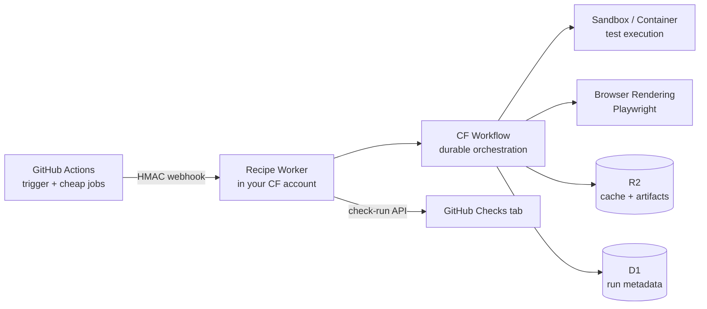

# 00 — Overview

## Mission

Offload the expensive parts of CI from GitHub Actions to a self-hosted Cloudflare stack, packaged as reusable **recipes** that any team can `wrangler deploy` into their own account in under an hour.

The shape we're aiming for: GHA still runs as the trigger, PR gate, and orchestrator of cheap jobs (lint, type-check, unit). For everything heavy — Playwright e2e, acceptance against a running app, sharded test matrices, long scans, browser-based smoke tests — GHA fires a webhook at a recipe and the work happens on Cloudflare. Status comes back as a GitHub Check Run, so reviewers see it inline with their other checks.

## Non-goals

- **Replacing GitHub Actions.** GHA remains the trigger, PR gate, and home for fast jobs. Recipes are an offload target, not a control plane.
- **Hosted SaaS in v1.** Every code path assumes "deployed into the user's Cloudflare account." A SaaS edition is possible later; it is not a v1 constraint we design around.
- **A new dashboard / UI.** GitHub Check Runs are the UI. Logs and artifacts are served via R2 signed URLs linked from the check summary.
- **Secrets management product.** Workers Secrets is sufficient; recipes don't reinvent it.
- **Generalized workflow engine.** Recipes are for CI-shaped work. If you need durable business workflows, use Trigger.dev or Temporal.

## Operating model — self-host first

A team installs recipes by:

1. Forking or cloning a template repo.
2. Setting Workers Secrets (GitHub App key, HMAC secret).
3. `wrangler deploy`.
4. Installing the companion GitHub App on their org/repos.
5. Adding `uses: openhackersclub/cf-recipes-action@v1` to their workflow.

After that, each PR fires recipes against the team's own Cloudflare bill. The project supplies the recipes, the GHA Action, and the Effect-TS DSL packages. The team supplies the account.

## What recipes are

A **recipe** is a typed, named Effect-TS program with:

- A `Schema`-defined input contract (what the caller sends).
- A `Schema`-defined output contract (what gets posted back).
- A sequence of `step`s, each mapped to a CF Workflow step, composed via `Effect.gen`.
- Access to a fixed set of platform primitives: `sandbox`, `browser`, `cache`, `artifact`, `io`.

Recipes are not opaque — they are TypeScript files in the user's repo. The user owns them, can fork them, can vendor-edit them. The shipped recipes are the starter library; the DSL is the contract.

## Where the value is

| | What recipes do | What GHA keeps doing |
|---|---|---|
| **Trigger** | — | `on: pull_request`, branch filters, secrets, approvals |
| **Cheap jobs** | — | lint, type-check, unit tests, build checks |
| **Heavy compute** | Sandbox containers, charged per vCPU-second | — |
| **Browser e2e** | Browser Rendering, Workers Paid includes 10 browser-hr/month + 10 concurrent browsers | — |
| **Fan-out matrix** | Workflows `createBatch` (up to 100 children per call, 50,000 concurrent instances per account), scale-to-zero | — |
| **Long suites** | Multi-step Workflows, no 6-hour ceiling | — |
| **Cache** | R2 (zero egress within CF), unlimited size | actions/cache (10GB cap, eviction) |
| **Artifacts** | R2 with signed URLs, custom retention | actions/upload-artifact (90-day default) |
| **Status reporting** | GitHub Check Runs via App token | Native check runs |

## Roadmap

| Phase | Scope | Recipes shipped | Exit criteria |
|---|---|---|---|
| **V0 — Walking skeleton** | Dispatcher Worker + one Workflow + one Sandbox + check-run callback | `offload-test` | A `pnpm test` running in CF Sandbox reports green/red to a PR check |
| **V1 — Fan-out + cache + artifacts** | Queues for matrix; R2 cache helper; R2 artifact upload with signed URLs | `+ matrix-fanout`, `+ cache-pnpm`, `+ r2-artifacts` (building blocks) | 8-shard test matrix on CF beats GHA wall time on a real repo |
| **V2 — Browser e2e + acceptance** | Browser Rendering integration; CDP observation helper | `+ playwright-e2e`, `+ cdp-acceptance` | Sharded Playwright suite reports per-shard status; gctrl-board acceptance suite runs |
| **V3 — Long-running + security** | Step chaining for >Workflow-step-limit suites; security scan recipes | `+ security-scan`, `+ custom-sandbox` | 30-min suite completes; npm audit / cargo audit / trivy run in Sandbox |
| **V4 — Polish** | OpenTelemetry export, Logpush integration, retention policies, `cf-recipes init` CLI | — | Time-to-first-green-check < 30 min on a fresh CF account |

V0 is the slice that proves the model. Everything after is incremental and independently shippable.

## Comparison with adjacent options

| | Role |
|---|---|
| **Depot** | GHA runner accelerator. Complementary — keep using it for fast jobs that stay on GHA. Not a backend for these recipes; reselling its runners has no margin. |
| **Trigger.dev** | Durable workflow platform. Could be the backend for a non-CF self-host edition later. Out of scope for v1 — adds Postgres + Redis ops that conflict with "easy self-host." |
| **Buildkite Agent** | Hybrid CI: their orchestrator, your compute. Same shape as this project, but you operate VMs. Recipes replace the "your compute" half with serverless CF. |
| **Earthly / Dagger** | Local-and-CI build engines. Could be invoked *inside* a recipe step; not a substitute for the orchestration plane. |
