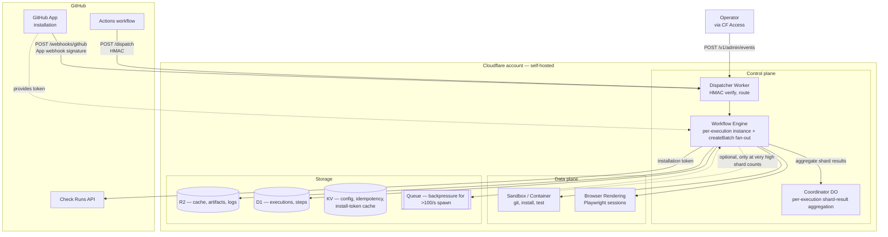
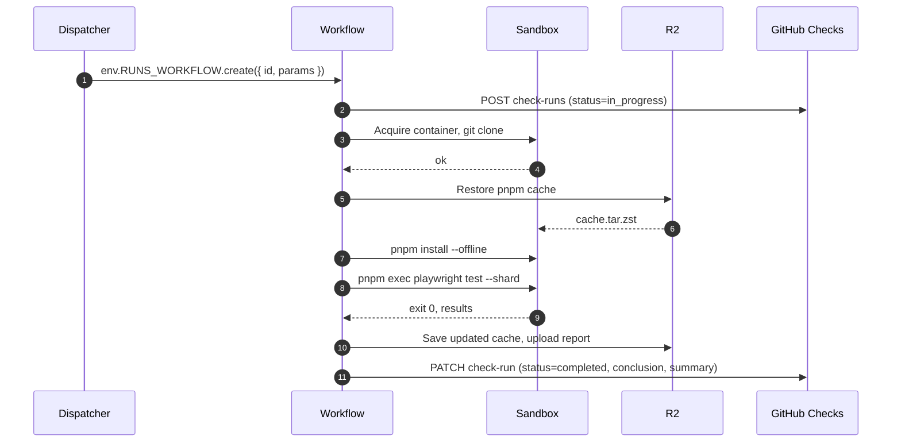

# 01 — Architecture

## Components



### Control plane

**Dispatcher Worker** — single entry point at `https://runs.<your-domain>` or `https://runs.<account>.workers.dev`. Routes:

- `POST /v1/dispatch/:run` — start an execution from a GHA Action or any authenticated HTTP caller. HMAC-signed body. See [04-gha-integration § GHA Action](04-gha-integration.md).
- `POST /v1/webhooks/github` — primary App-signed trigger for autonomous runs (`pull_request`, `deployment_status`, `push`, `check_run.rerequested`). Co-equal with `/v1/dispatch/:run`. The receiver verifies `X-Hub-Signature-256` with `crypto.subtle.verify("HMAC", ...)` (constant-time per Web Crypto spec), runs two-layer dedup (see below), enqueues the Workflow, and returns 202 within GitHub's 10-second ack window.
- `GET /v1/executions/:id` — fetch execution metadata (for ad-hoc inspection).
- `GET /v1/artifacts/:execution/:name` — signed-URL redirect to R2.
- `POST /v1/admin/events/:wf_id` — signal a running Workflow (e.g. release approval, manual gate). Gated by Cloudflare Access JWT; the receiver re-verifies the Access JWT in Worker code. Calls `env.RUNS_WORKFLOW.get(wfId).sendEvent({ type, payload })`.
- `GET /v1/admin/*` — operator surface (execution list, force-cancel, replay). Gated by Cloudflare Access.
- `GET /health` — liveness.

Dispatcher does **only** auth, routing, dedup, and Workflow instantiation. No business logic, no long calls. Keeps Worker CPU under 50ms per invocation.

#### Dedup

Both trigger endpoints share a two-layer dedup discipline — a receiver-level idempotency key in `IDEMPOTENCY_KV` plus a Workflow-level semantic `instanceId` collapse — so a redelivery storm or a double-click on a GHA re-run does not spawn parallel work. The receiver path is intentionally hot-path-only: LLM calls, Octokit fetches, and container starts happen inside the Workflow, never on the receiver. Full discipline in [04-gha-integration § Receiver dedup](04-gha-integration.md#receiver-dedup-shared-by-both-modes).

**Workflow Engine** — Cloudflare Workflows binding. One Workflow instance per execution. The Workflow's `run()` method is an Effect program (see [03-dsl](03-dsl.md)) that composes `step.do(...)` calls. Each `step.do` is a Workflow checkpoint — durable across Worker restarts, automatically retried by the platform.

**Coordinator DO** (Durable Object) — used by fan-out runs to aggregate child-shard results. When a matrix run spawns N child Workflows (via `RUNS_WORKFLOW.createBatch(...)`, native to Workflows; see fan-out model below), the parent stores aggregate state (counts of completed shards, pass/fail tallies) in a DO keyed by parent execution id. Single-writer guarantees, so shard completion handlers can race without conflicts. When all shards report, the DO triggers the check-run finalization callback.

The DO is *only* for result aggregation — spawning children does not require a DO or Queue because `createBatch` is a single bound call that returns N `WorkflowInstance` handles. The Queue producer in the storage layout below remains useful for backpressure / rate-shaping when shard counts exceed the per-account instance-creation rate.

*Source:* https://developers.cloudflare.com/workflows/build/workers-api/ (createBatch), https://developers.cloudflare.com/workflows/reference/limits/ (instance creation: 100 per workflow per second on Paid).

### Data plane

**Sandbox / Container** — Cloudflare Containers binding. Each step that needs to execute arbitrary code (git clone, pnpm install, pytest, cargo test, bash scripts) acquires a container instance from a pool. Container images are versioned per language stack and mirrored to `registry.cloudflare.com` (CF Containers pulls only from `registry.cloudflare.com`, `docker.io`, or Amazon ECR — GHCR is not a supported pull source, so a release job mirrors from `ghcr.io/openhackersclub/...` to CF's registry):

| Image (CF registry) | Source (GHCR mirror) | Contents |
|---|---|---|
| `registry.cloudflare.com/openhackersclub/flaredispatch-node:latest` | `ghcr.io/openhackersclub/flaredispatch-node` | Node LTS, pnpm, npm, yarn, git, jq, gh CLI |
| `registry.cloudflare.com/openhackersclub/flaredispatch-playwright:latest` | `ghcr.io/openhackersclub/flaredispatch-playwright` | Node image + Playwright + Chromium (for in-container browser mode) |
| `registry.cloudflare.com/openhackersclub/flaredispatch-rust:latest` | `ghcr.io/openhackersclub/flaredispatch-rust` | Rust stable + cargo + git |
| `registry.cloudflare.com/openhackersclub/flaredispatch-python:latest` | `ghcr.io/openhackersclub/flaredispatch-python` | Python 3.12 + uv + git |

Users may supply their own image via run input `image:`, subject to the same registry constraint. The base images are kept thin; run-level installs happen at runtime and are cached to R2.

*Source:* https://developers.cloudflare.com/containers/platform-details/image-management/ (registry support, 2026-05).

**Browser Rendering** — Cloudflare Browser Rendering binding. Used by browser-centric runs (`playwright-e2e`, `cdp-acceptance`) that need a managed Chromium with no container overhead. Two access modes:

1. **REST mode** — `@cloudflare/puppeteer` against the managed pool. Fast for short, stateless page interactions.
2. **CDP mode** — direct CDP WebSocket attach for fine-grained instrumentation (request interception, heap snapshots, `Network.*` events).

Runs choose mode based on the assertion they need.

### Storage

**R2 bucket** — `flaredispatch-{slug}` per deploy. Layout:

```
cache/<repo>/<key>.tar.zst          immutable; key derived from lockfile hash
artifacts/<execution-id>/<name>     per-execution; lifecycle policy controls retention
logs/<execution-id>/<step>.ndjson   per-step structured logs
```

R2 has zero egress within Cloudflare and zero egress to the public internet for signed URLs in normal pricing tiers. Cache and artifact downloads cost nothing operational.

**D1 database** — `flaredispatch`. Schema:

```sql
CREATE TABLE executions (
  id TEXT PRIMARY KEY,                    -- ULID
  run TEXT NOT NULL,
  repo TEXT NOT NULL,
  ref TEXT NOT NULL,
  sha TEXT NOT NULL,
  status TEXT NOT NULL,                   -- queued | running | success | failure | cancelled
  started_at INTEGER,                     -- ms epoch
  completed_at INTEGER,
  parent_execution_id TEXT,               -- for matrix children
  input_json TEXT NOT NULL,
  summary_json TEXT,
  check_run_id INTEGER                    -- GitHub check-run id
);

CREATE TABLE steps (
  id TEXT PRIMARY KEY,
  execution_id TEXT NOT NULL REFERENCES executions(id),
  name TEXT NOT NULL,
  status TEXT NOT NULL,
  started_at INTEGER,
  completed_at INTEGER,
  exit_code INTEGER,
  log_uri TEXT,                           -- R2 path
  attempt INTEGER NOT NULL DEFAULT 1
);

CREATE INDEX executions_repo_sha ON executions(repo, sha);
CREATE INDEX steps_execution ON steps(execution_id);
```

D1's 10 GB per-database limit on Workers Paid is plenty for execution metadata (CF docs note this ceiling is firm — it does not auto-scale). Logs and artifacts go to R2; D1 only holds pointers.

*Source:* https://developers.cloudflare.com/d1/platform/limits/ (2026-05).

**KV namespaces** — two, kept separate so an audit can show config never co-mingles with idempotency keys:

- `flaredispatch_config` (`RUNS_CONFIG`) — GitHub App installation IDs keyed by org/repo, run defaults (image, timeout, concurrency), feature flags. Mutable, eventually consistent.
- `flaredispatch_idempotency` (`IDEMPOTENCY_KV`) — receiver-level dedup set (`X-GitHub-Delivery` UUIDs and direct-dispatch `Idempotency-Key` values), 24h TTL. Also holds short-lived debounce keys for `/v1/admin/events/:wf_id` (e.g. `(wf_id, decider_email)` with a 1h window so two reviewers racing to approve don't produce non-deterministic ordering).
- `flaredispatch_install_tokens` (`INSTALL_TOKEN_KV`) — App install-token cache (TTL 55min, under GitHub's 60min) so the per-installation token survives Worker recycles mid-execution.

**Queue** — `flaredispatch-fanout`. Backpressure path only. Default fan-out path is `RUNS_WORKFLOW.createBatch([...])` directly from the parent (one round trip, up to 100 instances). Producer/consumer wiring exists for the rare case where shard counts exceed Workflows' per-workflow instance-creation rate (100/s) — Consumer is a Worker that drains the queue at the allowed rate and calls `create` per message.

## Per-execution lifecycle

Once the Dispatcher accepts a request (Action mode or Webhook mode — both detailed in [04-gha-integration](04-gha-integration.md)), the Workflow runs to completion in the background:



The Workflow is durable: each `step.do(...)` is a checkpoint, so an evicted Worker resumes from the last completed step rather than restarting. The check run is the source of truth for whether the work passed — required status checks on the PR reference the check-run name, not whatever trigger fired the execution.

## Fan-out model

Matrix runs use a parent-child Workflow tree. Workflows exposes `createBatch(WorkflowInstanceCreateOptions[])` (up to 100 instances per call, idempotent on user-supplied `id`) which the parent calls directly inside a `step.do(...)` checkpoint — no intermediate Queue or Spawner is required for the common case:


The parent's plan step decides shard count from inputs (`totalShards`) or auto-detects from test file count. Each shard is a fresh child Workflow with its own check-run sub-check, posted as an "annotation" under the parent's check-run summary. Parent does not block waiting on children — `create`/`createBatch` return immediately with `WorkflowInstance` handles; the parent either subscribes via the Coordinator DO or polls handle.status() in a follow-up step.

For shard counts above the per-account creation rate (100 instances per workflow per second on Paid), the parent paces creates via the `RUNS_FANOUT` Queue rather than batching directly. For everything under ~100 shards, the queue is unused.

*Source:* https://developers.cloudflare.com/workflows/build/workers-api/ (create / createBatch); https://developers.cloudflare.com/workflows/reference/limits/ (100 instances per workflow per second, 50,000 concurrent).

If a child shard fails:

- The shard's check-run conclusion is `failure`.
- The parent's overall conclusion is `failure` once any shard fails (or all complete, depending on `failureBehavior: fast | wait`).
- Logs and reports for each shard are independent R2 paths, linked from the summary.

## Long-running test handling

Workflow steps have unlimited *wall-clock* duration (the step body can `await` for I/O as long as needed), but each step is bounded by Worker *CPU time*: 30 s default on Workers Paid, configurable up to 5 min via `limits.cpu_ms` in `wrangler.jsonc`. Container exec — where the test command actually runs — counts as I/O against the parent Worker, so a 25-minute test is fine as long as the step body itself is mostly awaiting the container. Runs still split work for two reasons:

1. **Chunked execution** — the run splits the work into multiple `step.do` calls (e.g. per test file or per Playwright project). Each step is independently checkpointed; a failure mid-suite restarts only the failed step. This is about granular retry, not about hitting a duration cap.

2. **Detached container** — for genuinely indivisible long executions (e.g. a single integration test that takes 25 minutes), the run starts a Container in detached mode, returns immediately from the Worker step, and polls the container's exit status from subsequent steps. This pattern uses `sandbox.runDetached({ ... })` and `sandbox.waitForExit({ id, pollEvery })` in the DSL. Useful when the in-step `await` would otherwise tie up a Worker invocation slot for long stretches.

Both patterns are checkpointed by Workflows, so the Worker process can be evicted mid-execution and resume cleanly.

*Source:* https://developers.cloudflare.com/workflows/reference/limits/ (wall-clock per step: unlimited; CPU per step: 30 s default, 5 min max on Paid).

## Platform limits — design constraints

| Limit | Documented value (Workers Paid, 2026-05) | Run-level mitigation |
|---|---|---|
| Worker CPU per request | 30 s default, configurable to 5 min via `limits.cpu_ms` | Workflow steps are I/O-bound: spawn container, await exit, store result. Heavy CPU lives in Sandbox containers. |
| Workflow step CPU time | Same as Worker CPU (30 s default, 5 min max); wall-clock per step is unlimited | Chunked execution for retry granularity; detached containers for long indivisible executions. |
| Workflow steps per instance | 10,000 default, configurable to 25,000 | Parent workflows for >25k-shard matrices use child-of-child nesting. `step.sleep` / `step.sleepUntil` do not count against the step quota. |
| Workflow concurrent instances | 50,000 per account; instance creation rate 100/s per workflow, 300/s per account | `RUNS_FANOUT` Queue paces creates only when shard count × dispatch rate exceeds 100/s for one workflow. |
| Workflow step result size | 1 MiB per non-stream step result; larger payloads use `ReadableStream<Uint8Array>` (Paid only) | Logs / artifacts go to R2; steps return pointers, not blobs. |
| Browser Rendering: max session duration | No fixed max while active; 60 s idle timeout (extend to 10 min via `keep_alive`) | Runs rotate sessions per test file rather than holding one open for the whole suite. |
| Browser Rendering: concurrent sessions | 120 per account (Workers Paid; higher on request) | Shard cap derived from this number minus headroom for other runs. |
| Browser Rendering: free included | 10 hours/month, then $0.09 per browser-hour; concurrent browsers averaged monthly, 10 included, then $2.00 per extra | Runs prefer `cf-browser-rendering` for short tests; `in-container` Playwright for sessions that would otherwise blow the free tier. |
| Container concurrency per account | 1,500 vCPU, 6 TiB memory, 30 TB disk aggregate (Paid). Image store cap 50 GB | Run metadata declares `maxConcurrency`; Dispatcher rejects with 429 + `Retry-After` if account headroom is gone. |
| Container registries | Cloudflare's registry, Docker Hub, Amazon ECR. **GHCR is not a directly supported pull source** — base images are mirrored to Cloudflare's registry at release time. | Image tags in `wrangler.jsonc` reference `registry.cloudflare.com/...`, with CI mirroring from GHCR. |
| D1 write rate | Sequential per-database (≈1,000 q/s @ 1 ms; ≈10 q/s @ 100 ms). Max 1,000 queries per Worker invocation on Paid | All hot-path writes batched per step; checkpoints write once per step transition, not per log line. |
| D1 database size | 10 GB per database (Paid); 1 TB account storage | Logs and artifacts live in R2; D1 stores only execution metadata and pointers. |
| R2 lifecycle | Per-prefix `Expiration` rules applied via `wrangler r2 bucket lifecycle set/add/remove` | See `infra/r2-lifecycle.json` in [05-self-host](05-self-host.md). |
| Queues | 5,000 msg/s per queue; batch size up to 100 messages or 256 KB; max message size 128 KB | Fan-out shards published in batched `sendBatch` calls when the Queue path is taken at all. |
| GitHub API rate limit (per installation token) | 5,000 req/h per installation | Check-run updates throttled to 1/sec per execution via Coordinator DO. |

*Source:* [Workflows limits](https://developers.cloudflare.com/workflows/reference/limits/), [Browser Rendering limits](https://developers.cloudflare.com/browser-rendering/platform/limits/) + [pricing](https://developers.cloudflare.com/browser-rendering/platform/pricing/), [Containers limits](https://developers.cloudflare.com/containers/platform-details/limits/) + [pricing](https://developers.cloudflare.com/containers/pricing/), [Containers image management](https://developers.cloudflare.com/containers/platform-details/image-management/), [D1 limits](https://developers.cloudflare.com/d1/platform/limits/), [Queues limits](https://developers.cloudflare.com/queues/platform/limits/), [R2 lifecycle](https://developers.cloudflare.com/r2/buckets/object-lifecycles/). All values current as of 2026-05.

## Observability

- **Logs** — every step writes NDJSON to `r2://logs/<execution-id>/<step>.ndjson`. Streamable via Logpush if the user configures it.
- **Metrics** — Workflow built-in metrics (step duration, retry count) exported to Workers Analytics Engine. A simple Grafana dashboard ships in `infra/grafana/` (post-V0).
- **Traces** — each step is an OpenTelemetry span; the execution is the root span. Traces export to whatever OTel collector the user configures via `OTEL_EXPORTER_OTLP_ENDPOINT`.
- **Execution inspection** — `gh pr checks <pr>` shows status; clicking through opens the check-run detail page with links to logs, artifacts, and the trace URL.

There is intentionally no custom web UI in v0–v2. The GitHub check-run page is the operator surface.
