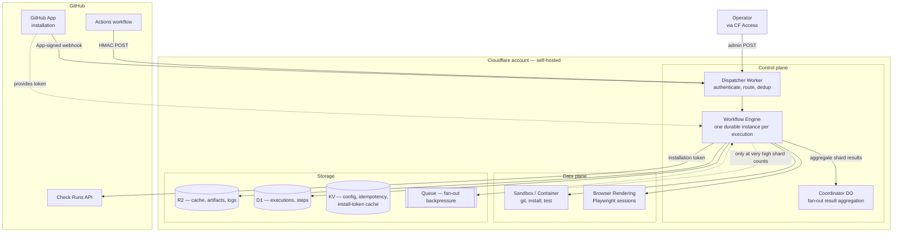
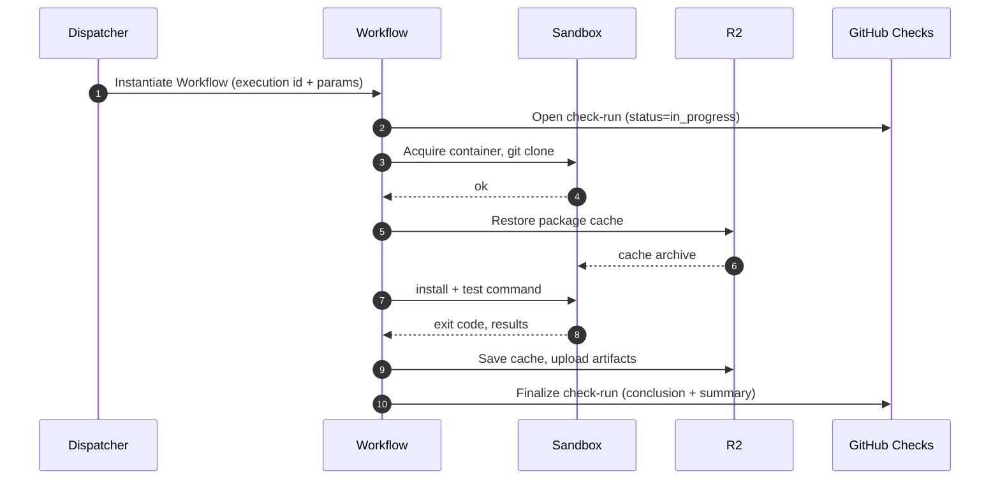
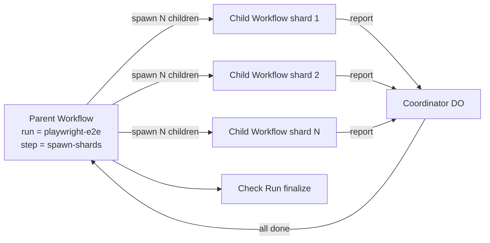

# 01 — Architecture

FlareDispatch deploys as a **single Worker** — the Dispatcher — into the user's own Cloudflare account. Around it sit three tiers: a *control plane* that routes triggers and orchestrates durable execution, a *data plane* where test code actually runs, and a *storage* tier for cache, artifacts, logs, and metadata.

This spec describes those pieces and the design model that ties them together — components, responsibilities, data flow, and the platform constraints that shape the design. It stays at the conceptual level: concrete binding names, wrangler config, and the D1 DDL are deployment artifacts and live in [05-byoc](05-byoc.md); the V0 build order is in [06-v0-plan](pm/06-v0-plan.md).

## Components



## Control plane

### Dispatcher Worker

The single public entry point. Its responsibilities are deliberately narrow — **authenticate, route, deduplicate, instantiate a Workflow** — and nothing else. No business logic and no long-running calls run on this path, so each invocation stays well within the Worker CPU budget. LLM calls, Octokit fetches, and container starts all happen later, inside the Workflow.

It exposes four kinds of endpoint:

| Surface | Responsibility |
|---|---|
| **Dispatch** | Start an execution from an HMAC-signed POST (Action mode). |
| **Webhook** | Start an execution from a `FlareDispatch` GitHub App webhook (Webhook mode). |
| **Inspection** | Return execution metadata; redirect to signed artifact / log URLs. |
| **Admin** | Operator surface — execution list, force-cancel, replay, signalling a paused Workflow. Gated by Cloudflare Access. |

Trigger modes, the request/response contracts, and the literal route paths are in [04-gha-integration](04-gha-integration.md).

### Workflow Engine

Each execution is one **durable Cloudflare Workflow instance**. The Workflow body is an Effect program (see [03-dsl](03-dsl.md)) composed of `step`s; each step is a checkpoint — durable across Worker restarts and retried by the platform. An evicted Worker resumes from the last completed step rather than restarting the execution.

### Coordinator

A Durable Object used **only by fan-out runs** to aggregate child-shard results. A matrix run spawns N child Workflows; each reports its result into a Coordinator keyed by the parent execution. Single-writer semantics let shard-completion handlers race without conflict. Once every shard has reported, the Coordinator triggers check-run finalization. Spawning the children does not itself need the Coordinator — see [§ Fan-out model](#fan-out-model).

## Data plane

### Sandbox / Container

Every step that runs arbitrary code — `git clone`, `pnpm install`, `pytest`, `cargo test`, bash scripts — acquires a container from a pool. Containers come from versioned, per-language-stack images (Node, Playwright, Rust, Python); a run may override the image via its `image:` input. Base images are kept thin: run-level installs happen at runtime and are cached to R2. The concrete image registry and tags are a deployment concern — see [05-byoc](05-byoc.md).

### Browser Rendering

Browser-centric runs (`playwright-e2e`, `cdp-acceptance`) use Cloudflare Browser Rendering — a managed Chromium with no container overhead. Two access modes:

- **REST mode** — Puppeteer against the managed pool; fast for short, stateless page interactions.
- **CDP mode** — direct CDP WebSocket attach for fine-grained instrumentation (request interception, heap snapshots, network events).

A run picks whichever mode its assertions need.

## Storage

Four stores, each with a distinct role:

| Store | Holds | Notes |
|---|---|---|
| **R2** | Package cache, artifacts, per-step logs | Zero egress within Cloudflare. Cache keys are content-addressed by lockfile hash + image digest, so cross-environment poisoning is impossible. |
| **D1** | Execution and step metadata | Metadata and pointers only — logs and artifacts live in R2. |
| **KV** | Config, receiver-level idempotency keys, App install-token cache | Three namespaces, kept separate so an audit shows config never co-mingles with idempotency state. |
| **Queue** | Fan-out backpressure | Engaged only when shard creation would exceed the platform's instance-creation rate. |

### R2 layout

```
cache/<repo>/<key>          immutable; key derived from lockfile hash
artifacts/<execution-id>/   per-execution; retention via R2 lifecycle policy
logs/<execution-id>/        per-step structured logs
```

Cache entries have no TTL; an R2 lifecycle policy on the deploy controls eviction.

### Data model

D1 holds two entities:

- **Execution** — one row per run invocation: which run, the repo / ref / sha, status, start and end timestamps, the input payload, a result summary, the GitHub check-run id, and an optional parent execution (for matrix children).
- **Step** — one row per step within an execution: name, status, timing, exit code, a pointer to the step's R2 log, and an attempt counter. A Step belongs to exactly one Execution.

The literal `CREATE TABLE` schema is a deployment artifact — see [05-byoc § D1 schema](05-byoc.md#d1-schema).

## Per-execution lifecycle

Once the Dispatcher accepts a request (Action or Webhook mode — both in [04-gha-integration](04-gha-integration.md)), the Workflow runs to completion in the background:



Because every step is a checkpoint, an evicted Worker resumes mid-execution rather than restarting. The check run is the source of truth for whether the work passed — required status checks on the PR reference the check-run name, not whatever trigger fired the execution.

## Fan-out model

Matrix runs use a parent-child Workflow tree. The platform's batch-create primitive spawns up to 100 child Workflow instances in one bound call — idempotent on a user-supplied id — invoked directly from a parent step. No intermediate Queue or spawner is needed for the common case.



The parent decides shard count from inputs or by auto-detecting test files. Each shard is a fresh child Workflow with its own check-run sub-check, annotated under the parent's summary. The parent does not block on children: batch-create returns immediately with instance handles, and the parent either subscribes via the Coordinator or polls handle status in a follow-up step.

Only when shard counts exceed the platform's per-workflow instance-creation rate does the parent pace creation through the Queue instead of batching directly.

If a child shard fails:

- The shard's check-run conclusion is `failure`.
- The parent's overall conclusion becomes `failure` once any shard fails — or once all complete, depending on `failureBehavior`.
- Each shard's logs and reports are independent R2 paths, linked from the summary.

## Durability and dedup

Two design disciplines keep executions correct under retries and redeliveries:

- **Durability** — every `step` is a Workflow checkpoint. Non-determinism (time, UUIDs, env reads) flows through the `io.*` DSL primitives (see [03-dsl](03-dsl.md)) so checkpoint replay stays consistent.
- **Two-layer dedup** — a *receiver-level* idempotency key collapses redelivery storms before any Workflow is touched; a *Workflow-level* semantic instance id collapses two distinct deliveries naming the same logical work (same repo + head SHA) onto one execution. Full discipline in [04-gha-integration § Receiver dedup](04-gha-integration.md#receiver-dedup-shared-by-both-modes).

## Long-running test handling

Workflow steps have unlimited *wall-clock* duration — a step body can `await` I/O for as long as needed — but each step is bounded by Worker *CPU time* (a few minutes maximum). Container exec, where the test command actually runs, counts as I/O against the parent Worker, so a 25-minute test is fine as long as the step body is mostly awaiting the container. Runs still split work for two reasons:

1. **Chunked execution** — the run splits work into multiple steps (e.g. per test file or per Playwright project). Each step is independently checkpointed; a failure mid-suite restarts only the failed step. This is about retry granularity, not duration caps.
2. **Detached container** — for a genuinely indivisible long execution (e.g. one integration test that takes 25 minutes), the run starts a container in detached mode, returns immediately from the Worker step, and polls the container's exit status from later steps. The DSL exposes this as `sandbox.runDetached` / `sandbox.waitForExit` (see [03-dsl](03-dsl.md)).

Both patterns are checkpointed by Workflows, so the Worker process can be evicted mid-execution and resume cleanly.

## Platform limits — design constraints

The architecture is shaped by Cloudflare platform limits. The ones that matter, and how the design accommodates each:

| Limit | Documented value (Workers Paid, 2026-05) | How the design accommodates it |
|---|---|---|
| Worker CPU per request | 30 s default, configurable to 5 min | Workflow steps are I/O-bound: spawn container, await exit, store result. Heavy CPU lives in Sandbox containers. |
| Workflow step CPU time | Same as Worker CPU; wall-clock per step is unlimited | Chunked execution for retry granularity; detached containers for long indivisible executions. |
| Workflow steps per instance | 10,000 default, configurable to 25,000 | Parent workflows for >25k-shard matrices use child-of-child nesting; sleeps don't count against the quota. |
| Workflow concurrent instances | 50,000 per account; creation rate 100/s per workflow, 300/s per account | The fan-out Queue paces creation only when shard count × dispatch rate exceeds the per-workflow rate. |
| Workflow step result size | 1 MiB per non-stream step result; larger payloads stream | Logs / artifacts go to R2; steps return pointers, not blobs. |
| Browser Rendering: session duration | No fixed max while active; 60 s idle timeout (extendable) | Runs rotate sessions per test file rather than holding one open for a whole suite. |
| Browser Rendering: concurrent sessions | 120 per account (higher on request) | Shard cap derived from this number minus headroom for other runs. |
| Browser Rendering: free included | 10 browser-hours/month; 10 concurrent browsers | Runs prefer managed Browser Rendering for short tests; in-container Playwright for sessions that would blow the free tier. |
| Container concurrency per account | 1,500 vCPU, 6 TiB memory, 30 TB disk aggregate | Run metadata declares `maxConcurrency`; the Dispatcher rejects with 429 + `Retry-After` when account headroom is gone. |
| Container registries | Cloudflare's registry, Docker Hub, Amazon ECR — **GHCR is not a supported pull source** | Base images are mirrored to Cloudflare's registry at release time; see [05-byoc](05-byoc.md). |
| D1 write rate | Sequential per-database; bounded queries per Worker invocation | Hot-path writes batched per step; checkpoints write once per step transition, not per log line. |
| D1 database size | 10 GB per database; 1 TB account storage | Logs and artifacts live in R2; D1 stores only execution metadata and pointers. |
| R2 lifecycle | Per-prefix expiration rules | Cache / artifact / log retention set by lifecycle policy; see [05-byoc § Retention](05-byoc.md#retention-and-cleanup). |
| Queues | 5,000 msg/s per queue; batched sends | Fan-out shards published in batched sends when the Queue path is taken at all. |
| GitHub API rate limit | 5,000 req/h per installation token | Check-run updates throttled to ~1/sec per execution via the Coordinator. |

*Source:* [Workflows limits](https://developers.cloudflare.com/workflows/reference/limits/), [Browser Rendering limits](https://developers.cloudflare.com/browser-rendering/platform/limits/), [Containers limits](https://developers.cloudflare.com/containers/platform-details/limits/), [D1 limits](https://developers.cloudflare.com/d1/platform/limits/), [Queues limits](https://developers.cloudflare.com/queues/platform/limits/). Values current as of 2026-05.

## Observability

- **Logs** — every step writes structured NDJSON to R2, one object per step. Streamable via Logpush if the user configures it.
- **Metrics** — Workflow built-in metrics (step duration, retry count) export to Workers Analytics Engine.
- **Traces** — each step is an OpenTelemetry span; the execution is the root span. Traces export to whatever OTel collector the user configures.
- **Execution inspection** — the PR's Checks tab shows status; the check-run detail page links to logs, artifacts, and the trace.

There is intentionally no custom web UI in v0–v2 — the GitHub check-run page is the operator surface.
