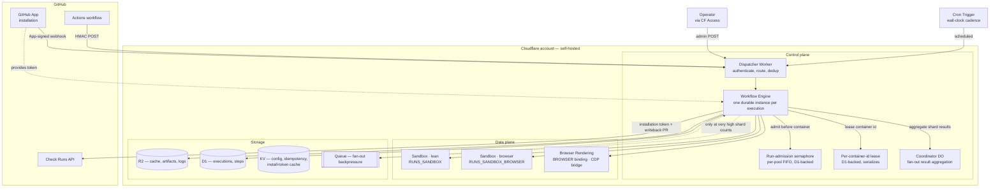
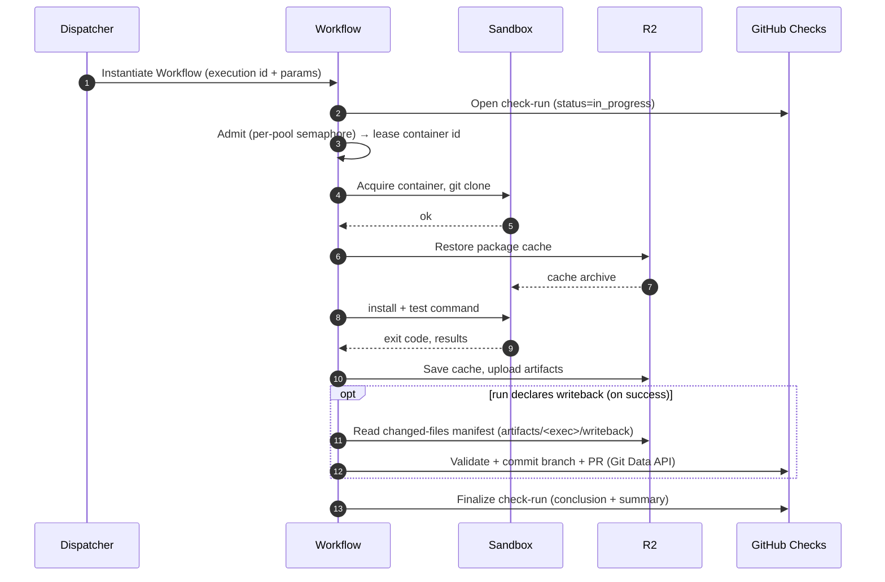
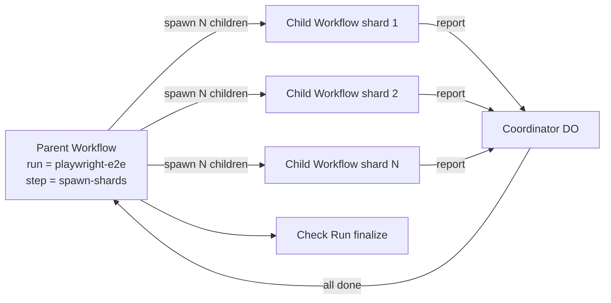
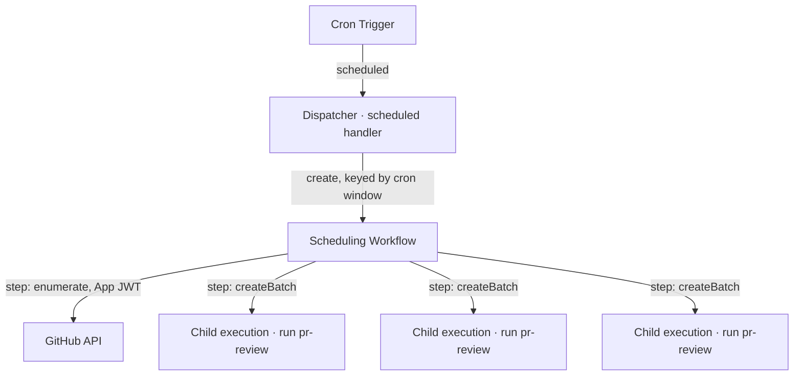

# 01 — Architecture

FlareDispatch deploys as a **single Worker** — the Dispatcher — into the user's own Cloudflare account. Around it sit three tiers: a *control plane* that routes triggers and orchestrates durable execution, a *data plane* where test code actually runs, and a *storage* tier for cache, artifacts, logs, and metadata.

This spec describes those pieces and the design model that ties them together — components, responsibilities, data flow, and the platform constraints that shape the design. It stays at the conceptual level: concrete binding names, wrangler config, and the D1 DDL are deployment artifacts and live in [05-byoc](05-byoc.md); the roadmap and V0 build order are in [pm/plan](pm/plan.md).

## Components



## Control plane

### Dispatcher Worker

The single entry point. Its responsibilities are deliberately narrow — **authenticate, route, deduplicate, instantiate a Workflow** — and nothing else. No business logic and no long-running calls run on this path, so each invocation stays well within the Worker CPU budget. LLM calls, Octokit fetches, container starts, and target enumeration all happen later, inside a Workflow.

It is invoked two ways — the Worker's `fetch()` handler serves the HTTP surfaces; its `scheduled()` handler is the Cron Trigger entry point:

| Surface | Handler | Responsibility | Status |
|---|---|---|---|
| **Dispatch** | `fetch()` | Start an execution from an HMAC-signed POST (Action mode). | Live |
| **App manifest** | `fetch()` | `/v1/github/install/new` + `/v1/github/installed` — render the App-creation form and exchange the manifest `code` for credentials (specs/05-byoc.md § GitHub App setup). | Live |
| **Artifact** | `fetch()` | `/v1/artifacts/:execution/:name` — stream the stored R2 object body (no S3 presigned-URL dependency). | Live |
| **Health** | `fetch()` | `/health` — liveness + registered-run list. | Live |
| **Webhook** | `fetch()` | Start an execution from a `FlareDispatch` GitHub App webhook (Webhook mode). | **Live** |
| **Schedule** | `scheduled()` | A Cloudflare Cron Trigger fires on a wall-clock cadence; the handler instantiates a scheduling Workflow (Schedule mode). See [§ Schedule-mode dispatch](#schedule-mode-dispatch). | Live |
| **Inspection** | `fetch()` | Return execution metadata; redirect to signed artifact / log URLs. | **Planned (V1)** — `/v1/executions/:id` for `await`-mode polling. |
| **Admin** | `fetch()` | Operator surface — signal a Workflow paused on `step.waitForEvent` via `POST /v1/admin/events/:wf_id` (`routes/admin-events.ts`, wired in `router.ts`). Gated by Cloudflare Access; opt-in bearer fallback — refuses `503` unless `ADMIN_TOKEN` is set. Execution list / force-cancel / replay remain Planned. | Live (opt-in) |
| **OIDC issuer** | `fetch()` | Public, unauthenticated `/.well-known/openid-configuration` + `/.well-known/jwks.json`. The Dispatcher self-issues OIDC tokens runs federate against AWS STS / GCP STS / Vault — see [03-dsl § `oidc`](03-dsl.md#oidc) and [05-byoc § AWS federation trust policy](05-byoc.md#aws-federation-trust-policy). Public by design: IdPs fetch the JWKS unauthenticated to verify token signatures. | **Live** |

Only the `fetch()` surfaces are publicly reachable. `scheduled()` has no HTTP route — Cloudflare invokes it internally from the Cron Trigger, which is why Schedule mode authenticates nothing inbound (see [04-gha-integration § Schedule mode](04-gha-integration.md#schedule-mode)). Trigger modes, the request/response contracts, and the literal route paths are in [04-gha-integration](04-gha-integration.md). Trust boundaries and adversaries against each surface are catalogued in [07-trust-model](07-trust-model.md).

### Workflow Engine

Each execution is one **durable Cloudflare Workflow instance**. The Workflow body is an Effect program (see [03-dsl](03-dsl.md)) composed of `step`s; each step is a checkpoint — durable across Worker restarts and retried by the platform. An evicted Worker resumes from the last completed step rather than restarting the execution.

### Coordinator

> **Status: Planned (V1)** — the Coordinator DO is not declared in `wrangler.jsonc` at HEAD and no `Coordinator` class is shipped today. It lands with `matrix-fanout` (V1).

A Durable Object used **only by fan-out runs** to aggregate child-shard results. A matrix run spawns N child Workflows; each reports its result into a Coordinator keyed by the parent execution. Single-writer semantics let shard-completion handlers race without conflict. Once every shard has reported, the Coordinator triggers check-run finalization. Spawning the children does not itself need the Coordinator — see [§ Fan-out model](#fan-out-model).

### Run-admission semaphore

> **Status: Live** — `run-admission-d1.ts` in `@flare-dispatch/runtime-cf`, wired in `apps/dispatcher/src/workflow.ts` (`makeRunAdmissionD1` / `decideAdmission`).

Before any run touches a container, the Workflow passes a **global, per-pool admission semaphore** — a FIFO queue persisted in D1 (migration `0003`). It caps in-flight runs per container pool at `ADMISSION_CAP` (a wrangler var, default 16; see [§ KV/storage](#storage) and [05-byoc](05-byoc.md)). Overflow runs enqueue and surface a "Queued — waiting for a sandbox slot behind N runs" line, then drain in FIFO order; the slot is heartbeated for the whole run and released on every exit path. A crashed holder's slot is reclaimed by a heartbeat-TTL sweep, so a dead Worker never wedges the pool. Only a pool whose slot never frees ultimately fails the run with `AdmissionTimedOut`. There is one pool per container tier (lean / browser), keyed by the same routing rule as the binding. No new operator config.

### Per-container-id lease

> **Status: Live** — `container-lease-d1.ts` in `@flare-dispatch/runtime-cf`, wired in `workflow.ts` (`makeContainerLeaseD1`).

Inside the admission slot sits a **per-container-id lease**, also D1-backed, that serializes any two runs sharing the same sandbox container id. The Workflow acquires the lease before the run touches its container, holds it (heartbeating) for the run, and releases it on every exit path via `acquireUseRelease`. A second run on the same container id waits, then fails with `ContainerBusy` after ~10 minutes rather than colliding mid-execution. Nesting order is **admission (outer, global) → lease (inner, per-container-id) → run body**.

### Post-run writeback

> **Status: Live** — `packages/core/src/writeback.ts` + the writeback stage in `workflow.ts` (`runWriteback` / `makeWritebackTokenMinter`); `refresh-fixtures` is the worked example (#112).

A post-run lifecycle stage that lets a run **propose a diff as a PR** without ever handing credentials to the container. Only on a successful run that declares a `writeback` spec: the container regenerates files into R2 (`artifacts/<exec>/writeback/…`) in a credential-free image; the **Worker** — sole holder of the App credentials — validates the changed-files manifest (path-traversal / allowlist / byte + count caps, with `.github/workflows` behind an opt-in gate) and commits a branch + PR via the Git Data API. It is best-effort: a writeback failure annotates the green check and never flips the run red. See [§ Per-execution lifecycle](#per-execution-lifecycle).

## Data plane

### Sandbox / Container

Every step that runs arbitrary code — `git clone`, `pnpm install`, `pytest`, `cargo test`, bash scripts — acquires a container from a pool. Base images are kept thin: run-level installs happen at runtime and are cached to R2. The concrete image registry and tags are a deployment concern — see [05-byoc](05-byoc.md).

There are **two container tiers**, two DO classes built from the same Dockerfile (`WITH_BROWSER` toggles the chromium layer):

- **Lean** — `RUNS_SANDBOX` (DO class `RunSandbox`), the default for every run.
- **Browser** — `RUNS_SANDBOX_BROWSER` (DO class `RunSandboxBrowser`), the chromium-baked image (chromium-headless-shell + demo-agent baked in). A run declares which it needs with `sandboxImage: "browser"` — distinct from `limits.requiresBrowser`. The Workflow routes via `selectSandboxNs`; the browser binding is optional, and a deploy that omits it degrades by falling back to the lean image (non-fatal only if the run installs its own browser — a run relying on the baked image fails on the lean tier).

### Browser Rendering

Browser-centric runs (`playwright-e2e`, `cdp-acceptance`) use Cloudflare Browser Rendering — a managed Chromium with no container overhead. Two access modes:

- **REST mode** — Puppeteer against the managed pool; fast for short, stateless page interactions.
- **CDP mode** — direct CDP WebSocket attach for fine-grained instrumentation (request interception, heap snapshots, network events).

A run picks whichever mode its assertions need. The CF Browser Rendering binding (`BROWSER`) is live: `GET /v1/browser/cdp` bridges a container's `connectOverCDP` to a Browser Rendering session (the only supported way to reach CF Browser Rendering CDP — it is not a public, token-dialable WebSocket). The route refuses `503` when the binding is absent; non-browser runs are unaffected.

## Storage

Four stores, each with a distinct role:

| Store | Holds | Notes |
|---|---|---|
| **R2** | Package cache, artifacts, per-step logs | Zero egress within Cloudflare. Cache keys are content-addressed by lockfile hash + image digest, so cross-environment poisoning is impossible. |
| **D1** | Execution and step metadata | Metadata and pointers only — logs and artifacts live in R2. |
| **KV** | Config (`CONFIG_KV` — live today, backs `loadSecrets`). Receiver-level idempotency keys (`IDEMPOTENCY_KV`) and the App install-token cache (`INSTALL_TOKEN_KV`) are wired and optional — each is a typed binding the runtime reads when present and degrades without (idempotency falls back to the platform `create({id})` no-op; tokens cache in Worker memory only). | Each namespace is separate so an audit shows config never co-mingles with idempotency state. |
| **Queue** | Fan-out backpressure | **Planned (V1)** — engaged only when shard creation would exceed the platform's instance-creation rate. |

### R2 layout

```
cache/<repo>/<key>          immutable; key derived from lockfile hash
artifacts/<execution-id>/   per-execution; retention via R2 lifecycle policy
logs/<execution-id>/        per-step structured logs
```

Cache entries have no TTL; an R2 lifecycle policy on the deploy controls eviction.

### Data model

D1 holds two entities:

- **Execution** — one row per run invocation: which run, the repo / ref / sha, status, start and end timestamps, the input payload, a result summary, the GitHub check-run id, and an optional parent execution (for matrix children).
- **Step** — one row per step within an execution: name, status, timing, exit code, a pointer to the step's R2 log, and an attempt counter. A Step belongs to exactly one Execution.

The literal `CREATE TABLE` schema is a deployment artifact — see [05-byoc § D1 schema](05-byoc.md#d1-schema).

## Per-execution lifecycle

Once the Dispatcher accepts a request (Action or Webhook mode — both in [04-gha-integration](04-gha-integration.md)), the Workflow runs to completion in the background:



Because every step is a checkpoint, an evicted Worker resumes mid-execution rather than restarting. The check run is the source of truth for whether the work passed — required status checks on the PR reference the check-run name, not whatever trigger fired the execution.

## Fan-out model

Matrix runs use a parent-child Workflow tree. The platform's batch-create primitive spawns up to 100 child Workflow instances in one bound call — idempotent on a user-supplied id — invoked directly from a parent step. No intermediate Queue or spawner is needed for the common case.



The parent decides shard count from inputs or by auto-detecting test files. Each shard is a fresh child Workflow with its own check-run sub-check, annotated under the parent's summary. The parent does not block on children: batch-create returns immediately with instance handles, and the parent either subscribes via the Coordinator or polls handle status in a follow-up step.

Only when shard counts exceed the platform's per-workflow instance-creation rate does the parent pace creation through the Queue instead of batching directly.

If a child shard fails:

- The shard's check-run conclusion is `failure`.
- The parent's overall conclusion becomes `failure` once any shard fails — or once all complete, depending on `failureBehavior`.
- Each shard's logs and reports are independent R2 paths, linked from the summary.

## Schedule-mode dispatch

The Action and Webhook modes both start with an inbound HTTP request that *names a target* — a repo, a SHA, a PR. Schedule mode starts with a [Cloudflare Cron Trigger](https://developers.cloudflare.com/workers/configuration/cron-triggers/): a wall-clock tick that names nothing. Turning a bare tick into useful work is a small orchestration of its own, and the architecture handles it the same way it handles everything else — **as a durable Workflow**.



Two design points:

- **The `scheduled()` handler stays thin.** It does no enumeration and no fan-out — it instantiates one **scheduling Workflow** and returns, exactly as `fetch()` instantiates an execution Workflow for the other modes. `scheduled()` shares the Worker CPU budget; "list every open PR across N installed repos" is a multi-call, retryable, must-survive-eviction job, so it belongs *inside* a Workflow, not on the handler path.
- **The scheduling Workflow is a parent Workflow.** Its first `step` enumerates targets (App JWT → installations → open PRs, filtered by the run's scope); subsequent steps fan out child execution Workflows with the same `createBatch` primitive matrix runs use ([§ Fan-out model](#fan-out-model)). It can use the Coordinator DO to aggregate child outcomes into a single digest, or leave each child to report its own check-run independently. A scheduled `pr-review` sweep takes the latter shape: one check-run per PR, no parent check-run.

This keeps the core invariant intact — *every unit of real work is a durable Workflow instance*, checkpointed and resumable — and adds no new component. A scheduling Workflow is an ordinary Workflow whose body happens to be "enumerate, then fan out." The recurring cadence lives in `wrangler.jsonc` (`triggers.crons`); a *one-off* deferred action lives in a run via `step.sleepUntil` ([03-dsl § Deferred scheduling](03-dsl.md#deferred-scheduling-with-stepsleepuntil)) and needs no Cron Trigger at all.

## Durability and dedup

Two design disciplines keep executions correct under retries and redeliveries:

- **Durability** — every `step` is a Workflow checkpoint. Non-determinism (time, UUIDs, env reads) flows through the `io.*` DSL primitives (see [03-dsl](03-dsl.md)) so checkpoint replay stays consistent.
- **Two-layer dedup** — a *receiver-level* idempotency key collapses redelivery storms (and duplicate cron deliveries) before any Workflow is touched; a *Workflow-level* semantic instance id collapses two distinct deliveries naming the same logical work (same repo + head SHA, or same cron window) onto one execution. Full discipline in [04-gha-integration § Receiver dedup](04-gha-integration.md#receiver-dedup-shared-by-all-modes).

## Long-running test handling

Workflow steps have unlimited *wall-clock* duration — a step body can `await` I/O for as long as needed — but each step is bounded by Worker *CPU time* (a few minutes maximum). Container exec, where the test command actually runs, counts as I/O against the parent Worker, so a 25-minute test is fine as long as the step body is mostly awaiting the container. Runs still split work for two reasons:

1. **Chunked execution** — the run splits work into multiple steps (e.g. per test file or per Playwright project). Each step is independently checkpointed; a failure mid-suite restarts only the failed step. This is about retry granularity, not duration caps.
2. **Detached container** — for a genuinely indivisible long execution (e.g. one integration test that takes 25 minutes), the run starts a container in detached mode, returns immediately from the Worker step, and polls the container's exit status from later steps. The DSL exposes this as `sandbox.runDetached` / `sandbox.waitForExit` (see [03-dsl](03-dsl.md)).

Both patterns are checkpointed by Workflows, so the Worker process can be evicted mid-execution and resume cleanly.

## Platform limits — design constraints

The architecture is shaped by Cloudflare platform limits. The ones that matter, and how the design accommodates each:

| Limit | Documented value (Workers Paid, 2026-05) | How the design accommodates it |
|---|---|---|
| Worker CPU per request | 30 s default, configurable to 5 min | Workflow steps are I/O-bound: spawn container, await exit, store result. Heavy CPU lives in Sandbox containers. |
| Workflow step CPU time | Same as Worker CPU; wall-clock per step is unlimited | Chunked execution for retry granularity; detached containers for long indivisible executions. |
| Workflow steps per instance | 10,000 default, configurable to 25,000 | Parent workflows for >25k-shard matrices use child-of-child nesting; sleeps don't count against the quota. |
| Workflow concurrent instances | 50,000 per account; creation rate 100/s per workflow, 300/s per account | The fan-out Queue paces creation only when shard count × dispatch rate exceeds the per-workflow rate. |
| Workflow step result size | 1 MiB per non-stream step result; larger payloads stream | Logs / artifacts go to R2; steps return pointers, not blobs. |
| Workflow durable sleep | `step.sleep` / `step.sleepUntil` have no upper bound and do not count toward the per-instance step quota | Deferred follow-ups and staggered fan-out hibernate the Workflow for free (see [03-dsl § Deferred scheduling](03-dsl.md#deferred-scheduling-with-stepsleepuntil)). |
| Cron Triggers | Multiple `triggers.crons` entries per Worker, minute granularity; a tick may be delivered more than once and is not guaranteed exactly-once | One deploy hosts every run's schedule; `scheduled()` routes `controller.cron` to the matching run(s). Duplicate ticks collapse via the receiver-level idempotency key and the cron-window `instanceId` (see [§ Durability and dedup](#durability-and-dedup)). |
| Browser Rendering: session duration | No fixed max while active; 60 s idle timeout (extendable) | Runs rotate sessions per test file rather than holding one open for a whole suite. |
| Browser Rendering: concurrent sessions | 120 per account (higher on request) | Shard cap derived from this number minus headroom for other runs. |
| Browser Rendering: free included | 10 browser-hours/month; 10 concurrent browsers | Runs prefer managed Browser Rendering for short tests; in-container Playwright for sessions that would blow the free tier. |
| Container concurrency per account | 1,500 vCPU, 6 TiB memory, 30 TB disk aggregate | Run metadata declares `maxConcurrency`; the Dispatcher rejects with 429 + `Retry-After` when account headroom is gone. |
| Container registries | Cloudflare's registry, Docker Hub, Amazon ECR — **GHCR is not a supported pull source** | Base images are mirrored to Cloudflare's registry at release time; see [05-byoc](05-byoc.md). |
| D1 write rate | Sequential per-database; bounded queries per Worker invocation | Hot-path writes batched per step; checkpoints write once per step transition, not per log line. |
| D1 database size | 10 GB per database; 1 TB account storage | Logs and artifacts live in R2; D1 stores only execution metadata and pointers. |
| R2 lifecycle | Per-prefix expiration rules | Cache / artifact / log retention set by lifecycle policy; see [05-byoc § Retention](05-byoc.md#retention-and-cleanup). |
| Queues | 5,000 msg/s per queue; batched sends | Fan-out shards published in batched sends when the Queue path is taken at all. |
| GitHub API rate limit | 5,000 req/h per installation token | Check-run updates throttled to ~1/sec per execution via the Coordinator. A Schedule-mode enumeration paginates `pulls` per installed repo — large-org sweeps page within the per-installation budget and back off on `403`. |

*Source:* [Workflows limits](https://developers.cloudflare.com/workflows/reference/limits/), [Cron Triggers](https://developers.cloudflare.com/workers/configuration/cron-triggers/), [Browser Rendering limits](https://developers.cloudflare.com/browser-rendering/platform/limits/), [Containers limits](https://developers.cloudflare.com/containers/platform-details/limits/), [D1 limits](https://developers.cloudflare.com/d1/platform/limits/), [Queues limits](https://developers.cloudflare.com/queues/platform/limits/). Values current as of 2026-05.

## Observability

- **Logs** — every step writes structured NDJSON to R2, one object per step. Streamable via Logpush if the user configures it.
- **Metrics** — Workflow built-in metrics (step duration, retry count) export to Workers Analytics Engine.
- **Traces** — each step is an OpenTelemetry span; the execution is the root span. Traces export to whatever OTel collector the user configures.
- **Execution inspection** — the PR's Checks tab shows status; the check-run detail page links to logs, artifacts, and the trace.

There is intentionally no custom web UI in v0–v2 — the GitHub check-run page is the operator surface.
