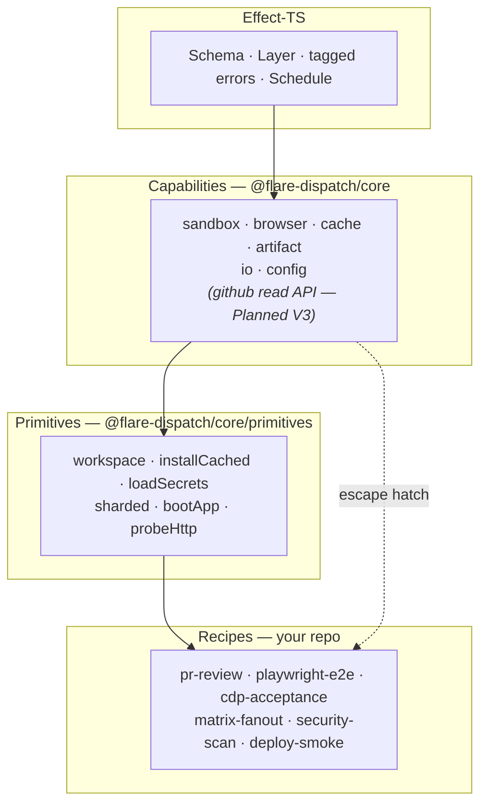

# 03 — DSL

Runs are Effect-TS programs. The DSL is a small surface — `defineRun`, `step`, and six run-author capability namespaces (`sandbox`, `browser`, `cache`, `artifact`, `io`, `config`) — wired together by Effect Layers so the same run code executes against the live CF stack, against `wrangler dev` locally, and against in-memory test fakes. A seventh — `github` (read-only GitHub API for Schedule sweeps) — is **Planned (V3)**; the dispatcher's check-run callback rides on a runtime-only `checks` service that run bodies never see directly.

## The layering: capabilities, primitives, recipes

The DSL is not one flat surface. It is three tiers, each built from the one below, and the distinction is what keeps run code small:



- **Capabilities** are the atomic, side-effectful surface — one `Context.Tag` service per namespace, each backed by a swappable Layer (real / dev / test). A capability does *one* thing: launch a container, exec a command, upload a blob. It has no opinion about how CI work is shaped.
- **Primitives** are reusable Effect-TS compositions the DSL ships *on top of* capabilities — `workspace`, `installCached`, `loadSecrets`, `sharded`, `bootApp`, `probeHttp`. Every recipe was re-deriving the same checkout → install → fan-out → upload shapes by hand; a primitive is that shape, named once, typed once, tested once. **This is the DX layer**: the DSL "creates primitives" so a recipe author rides them instead of rebuilding them. Primitives are still just Effects — composable, layer-swappable, unit-testable — see [§ Primitives](#primitives).
- **Recipes** are `defineRun` programs that ride on primitives and carry only the logic unique to *that* CI use case. A recipe drops to raw capabilities only for the part no primitive covers — the escape hatch is always open, but the common path is a primitive call.

The rest of this spec walks the tiers bottom-up: `defineRun` / `step` (the run frame), the seven capability namespaces, then the primitives built from them. The worked recipes that ride on this stack are in [recipes/](../recipes/). How each tier is shipped — `@flare-dispatch/core` as a pinned library, recipes as copy-paste — and what that split means for the supply chain is [§ Distribution and supply chain](#distribution-and-supply-chain).

> **Terminology.** "Primitive" in this spec always means a DSL primitive (this layering). The Cloudflare building blocks a run consumes — Workers, Workflows, Containers, R2, D1 — are called **platform primitives** to keep the two apart; [02-runs](02-runs.md) tags each run with the platform primitives it touches.

## Why Effect-TS and not YAML / a custom config schema

- **Typed inputs and outputs end-to-end.** `Schema` defines the contract; TypeScript checks the run body against it. Misspell a field and the build fails — not on shard 5 at 2am.
- **Tagged errors per failure mode.** `CheckoutFailed`, `InstallTimeout`, `BrowserCrashed`, `CacheMiss` are distinct types. `Effect.catchTag` recovers selectively; everything else propagates with full cause information.
- **Retry policies as data.** `Effect.retry(schedule)` with `Schedule.exponential` + `Schedule.recurs` + `Schedule.whileInput` composes retry behavior without hand-rolled loops.
- **Layers swap implementations.** The same run executes against real Sandbox in prod and against an in-process container fake in unit tests — runs become directly testable without spinning up CF.
- **No YAML escaping hell.** Multi-line scripts, JSON inputs, and template strings live in TypeScript, not stringly-typed config.

## Top-level shape

```ts
import { Effect, Schema } from "effect";
import { defineRun, step, sandbox, cache, artifact } from "@flare-dispatch/core";

export const offloadTest = defineRun({
  name: "offload-test",
  version: "1.0.0",

  inputs: Schema.Struct({
    repo: Schema.String,
    sha: Schema.String,
    command: Schema.String,
    timeoutSec: Schema.optional(Schema.Number),
  }),

  outputs: Schema.Struct({
    exitCode: Schema.Number,
    durationMs: Schema.Number,
    logUri: Schema.String,
  }),

  limits: {
    maxDurationSec: 1800,
  },

  run: (input) =>
    Effect.gen(function* () {
      const repoDir = yield* step("checkout", () =>
        sandbox.git.clone({ repo: input.repo, sha: input.sha }),
      );

      const result = yield* step("exec", () =>
        sandbox.exec({
          cwd: repoDir,
          command: input.command,
          timeoutSec: input.timeoutSec ?? 600,
        }),
      );

      const logUri = yield* step("upload-log", () =>
        artifact.upload({
          name: "step.log",
          path: result.logPath,
          signedUrlTTL: "30 days",
        }),
      );

      return {
        exitCode: result.exitCode,
        durationMs: result.durationMs,
        logUri,
      };
    }),
});
```

A run is just an object. The `run` function is an `Effect` that, when executed by the runtime, produces the typed output.

## `defineRun`

```ts
declare const defineRun: <I, O, IEnc, OEnc>(
  spec: {
    name: string;
    version: string;
    image?: string;                          // default container image
    inputs: Schema.Schema<I, IEnc>;
    outputs: Schema.Schema<O, OEnc>;
    limits: RunLimits;
    triggers?: readonly TriggerSpec<I>[];     // Webhook-mode trigger config
    schedules?: readonly ScheduleSpec<I>[];   // Schedule-mode trigger config
    run: (input: I) => Effect.Effect<O, RunError, RunContext>;
  },
) => Run<I, O>;
```

`defineRun` is a passive constructor — it validates the spec at module load and registers it for discovery. It doesn't bind to any runtime; the same `Run` value is portable.

`triggers` and `schedules` are both optional and select how the run is fired. A run with neither is dispatch-only (Action mode). A run may declare both — fire on every PR push *and* sweep nightly — and `run` is always required regardless.

### `triggers` — Webhook-mode trigger config

`triggers` is consumed only in Webhook mode: the receiver evaluates every run's `triggers` on each GitHub App webhook delivery (see [04-gha-integration § Webhook mode](04-gha-integration.md#webhook-mode)).

```ts
// A single Webhook-mode trigger binding.
type TriggerSpec<I> = {
  event: string;                             // GitHub webhook event, e.g. "pull_request"
  actions?: readonly string[];               // event-action filter, e.g. ["opened", "synchronize"]
  idempotencyKey: (ctx: { payload: WebhookPayload }) => string;  // semantic dedup key
  gate?: (ctx: { payload: WebhookPayload }) => boolean;          // receiver-side cost gate
  inputs: (ctx: { payload: WebhookPayload }) => I;               // map the payload to run inputs
};
```

### `schedules` — Schedule-mode trigger config

`schedules` is consumed only in Schedule mode: a Cloudflare Cron Trigger invokes the Dispatcher's `scheduled()` handler, which routes the firing `controller.cron` to whichever runs declared that expression (see [04-gha-integration § Schedule mode](04-gha-integration.md#schedule-mode)).

```ts
// The context a cron tick provides — no GitHub payload exists.
type ScheduleContext = {
  cron: string;                              // the expression that fired (controller.cron)
  firedAt: number;                           // controller.scheduledTime, ms epoch
};

// A single Schedule-mode trigger binding.
type ScheduleSpec<I> = {
  cron: string;                              // CF cron expression; must also be in wrangler triggers.crons
  idempotencyKey: (ctx: ScheduleContext) => string;  // collapses duplicate cron deliveries
  gate?: (ctx: ScheduleContext) => boolean;          // receiver-side skip (freeze window, holiday)
  inputs: (ctx: ScheduleContext) => I;               // coarse scope — NOT a concrete target
};
```

`ScheduleSpec` deliberately mirrors `TriggerSpec`, with one structural difference: a cron tick carries no `WebhookPayload`, so every callback receives `ScheduleContext` instead. The consequence is that `inputs` **cannot name a concrete target** — there is no repo, no SHA, no PR in a clock tick. It returns a *scope* (e.g. `{ scope: "open-prs", staleAfterHours: 24 }`); the run's first `step` performs the actual enumeration — listing installations and open PRs via the App JWT, then fanning out one child execution per target. The worked recipe is [recipes/ai-code-review § Scheduled sweep](../recipes/ai-code-review/). Threading a repo through `ScheduleSpec.inputs` fights the model — enumeration belongs in the run body, where it can do I/O and be checkpointed.

## `step`

Wraps an Effect in a Workflow checkpoint. Each `step` call becomes a `WorkflowStep.do(...)` in the underlying CF Workflow — durable, retryable, and individually logged.

```ts
declare const step: <A, E>(
  name: string,
  body: () => Effect.Effect<A, E, RunContext>,
  opts?: {
    retries?: number;                        // platform-level retry on infra failure
    timeoutSec?: number;
    metadata?: Record<string, unknown>;      // attached to the step record in D1
  },
) => Effect.Effect<A, E | StepFailed, RunContext>;
```

Steps are the only durable boundary. Inside a step, Effects compose freely without persistence — checkpoints happen at step exit, not at every `yield*`. This matches Workflow semantics: step is the atom of retry.

**Rules:**

1. A step body must be deterministic given its inputs and prior outputs. Non-determinism (random IDs, current time, env reads) goes through `io.now()` / `io.uuid()` / `io.env()` so the runtime can replay it from the checkpoint.
2. Step names must be unique within a run — they're the dedup key for checkpoint replay.
3. A step that needs to retry on a specific error catches with `Effect.catchTag` *inside* the step body and re-fails as a different tag (or recovers). Platform-level retry handles transient infra errors only.

### The `runEffect` boundary shim — Workflows vs. Effect error handling

CF Workflows is imperative: its `run(event, step)` method awaits `step.do(...)` as Promises and expects **thrown** errors to fail a step (so the platform can record the failure and retry). Effect is functional: errors live in the typed `E` channel via `Effect.fail`, and `throw` inside `Effect.gen` is an anti-pattern.

`step` reconciles these two worlds with a `runEffect` shim. **Inside a step body**, the Effect rules still apply — `yield* Effect.fail(new TaggedError({...}))`, never `throw`. **At the step boundary**, the shim executes the Effect, catches a typed failure, and rethrows it as a serializable value so Workflows can record the failure in its retry telemetry.

```ts
// packages/core/src/step.ts (sketch)
import { Effect, Cause, Exit, Option } from "effect";

export const runEffect = <A, E>(eff: Effect.Effect<A, E, RunContext>) =>
  Effect.runPromiseExit(eff).then((exit) =>
    Exit.match(exit, {
      onSuccess: (a) => a,
      onFailure: (cause) => {
        // Tagged failures bubble as throws so Workflows fails the step.
        // The Cause is preserved on the thrown error for OTel + check-run summary.
        // `Cause.failureOption` is an Option — branch it with `Option.match`,
        // never a raw `._tag` read: `Some` is a typed run failure, `None` is a
        // defect (no typed failure), rendered from the pretty Cause.
        const err = Option.match(Cause.failureOption(cause), {
          onSome: (failure) => failure,
          onNone: () => new Error(Cause.pretty(cause)),
        });
        // @ts-expect-error attach cause for downstream serialization
        err.cause = cause;
        throw err;
      },
    }),
  );
```

Run authors don't call `runEffect` directly — `step(name, body)` does it under the hood. The shim is documented because: (a) anyone writing a new platform primitive (a new `Context.Tag` service) needs to know the boundary contract; (b) the "throw at the Workflow boundary, never throw inside an Effect" rule is easy to invert if you don't see the seam. The canonical reference impl lives in `packages/core/src/step.ts`.

### Human-in-the-loop with `step.waitForEvent`

> **Status: Planned (V2/V3).** Currently stubbed in [`packages/core/src/step.ts`](../packages/core/src/step.ts) (`Effect.die("step.waitForEvent: not implemented in V0")`). Lands with the first run that needs it, alongside the Dispatcher's `/v1/admin/events/:wf_id` signalling route and the CF Access wiring.

Some runs pause for a human signal: release approval, manual gate before promoting to prod, "click here to ack the diff before applying the migration." CF Workflows supports this natively via [`step.waitForEvent`](https://developers.cloudflare.com/workflows/build/events-and-parameters/) — the Workflow **hibernates** until an external POST to `env.RUNS_WORKFLOW.get(wfId).sendEvent({ type, payload })` arrives, or until a timeout fires.

The DSL exposes this as `step.waitForEvent` directly:

```ts
declare const waitForEvent: <P>(
  name: string,
  opts: {
    type: string;                            // event discriminator
    timeout: Duration | string;              // e.g. "72 hours"
    payloadSchema: Schema.Schema<P, unknown>; // decodes the inbound payload
  },
) => Effect.Effect<P, ApprovalTimedOut | EventPayloadInvalid, RunContext>;
```

Usage:

```ts
import { Effect, Match, Schema } from "effect";
import { defineRun, step, artifact, io } from "@flare-dispatch/core";

const ApprovalPayload = Schema.Struct({
  decision: Schema.Literal("approve", "reject"),
  deciderEmail: Schema.String,
});

export const releaseNotes = defineRun({
  name: "release-notes",
  // Schedule mode: a cron tick drafts the notes every Monday 09:00 UTC; the
  // run then hibernates on step.waitForEvent until a human approves. The
  // idempotencyKey is the ISO-week window — re-firing the same week is a
  // no-op (see 04-gha-integration § Receiver dedup).
  schedules: [
    {
      cron: "0 9 * * 1",
      idempotencyKey: ({ firedAt }) => `release-notes:${isoYearWeek(firedAt)}`,
      inputs: ({ firedAt }) => ({ since: firedAt - 7 * 86_400_000 }),
    },
  ],
  // ...inputs, outputs
  run: (input) =>
    Effect.gen(function* () {
      const draft = yield* step("draft-notes", () => draftWithClaude(input));
      yield* step("create-draft-release", () => createDraftRelease(draft));
      yield* step("notify-channel", () => pingApprovalChannel(draft));

      const approval = yield* step.waitForEvent("release approval", {
        type: "release-approval",
        timeout: "72 hours",
        payloadSchema: ApprovalPayload,
      });

      // The approval decision is a literal union — match it exhaustively so a
      // new decision variant becomes a compile error, not a silent fall-through.
      return yield* Match.value(approval.decision).pipe(
        Match.when("reject", () =>
          Effect.succeed({
            published: false as const,
            reason: "rejected" as const,
            tag: draft.nextTag,
          }),
        ),
        Match.when("approve", () =>
          step("publish-release", () => publishRelease(draft)).pipe(
            Effect.as({ published: true as const, tag: draft.nextTag }),
          ),
        ),
        Match.exhaustive,
      );
    }),
});
```

The signaling endpoint is the Dispatcher's `/v1/admin/events/:wf_id`, gated by Cloudflare Access (see [01-architecture § Dispatcher Worker](01-architecture.md#control-plane)). The approver clicks a link from the notification channel; CF Access SSOs them; the Worker re-verifies the Access JWT and calls `env.RUNS_WORKFLOW.get(wfId).sendEvent({ type: "release-approval", payload: { decision, deciderEmail } })`. The matching `step.waitForEvent` resumes the Workflow with the decoded payload.

Timeout produces a tagged error so OTel records an error span rather than swallowing the case:

```ts
export class ApprovalTimedOut extends Schema.TaggedError<ApprovalTimedOut>()(
  "ApprovalTimedOut",
  { eventName: Schema.String, timeoutMs: Schema.Number },
) {}
```

Two-layer approval dedup is the receiver's job, not the run's: `/v1/admin/events/:wf_id` debounces `(wf_id, decider_email)` in `IDEMPOTENCY_KV` with a 1h window so two reviewers racing to approve produces deterministic ordering (first writer wins, second gets `409 Conflict`).

### Deferred scheduling with `step.sleepUntil`

> **Status: Planned (V3).** `step.sleep` / `step.sleepUntil` are not yet exposed on the `step` export at HEAD. The underlying CF Workflows primitive is available; the DSL wrapper lands with the first recipe that needs it (the staggered-fan-out example below is forward-looking).

A *recurring* schedule is a Cron Trigger (`schedules` above, [04-gha-integration § Schedule mode](04-gha-integration.md#schedule-mode)). A *one-off* future action — "re-check this PR in 24 hours," "poll this deployment until it settles, then report" — is not a cadence and does not belong in `wrangler.jsonc`. It is a single durable sleep *inside* a run, and CF Workflows expresses it natively: a step can [`sleep`](https://developers.cloudflare.com/workflows/build/sleeping-and-retrying/) for a relative duration or `sleepUntil` an absolute time. The Workflow **hibernates** for the interval — consuming no CPU, surviving Worker eviction — then resumes from the checkpoint.

The DSL exposes both:

```ts
declare const sleep: (name: string, duration: Duration | string) =>
  Effect.Effect<void, never, RunContext>;

declare const sleepUntil: (name: string, wakeAt: Date | number) =>
  Effect.Effect<void, never, RunContext>;
```

A scheduled sweep ([recipes/ai-code-review § Scheduled sweep](../recipes/ai-code-review/)) uses `sleepUntil` to *stagger* its fan-out — spreading 200 child reviews over an hour so the GitHub API rate limit and the model provider are never hit in a burst:

```ts
import { Effect } from "effect";
import { step } from "@flare-dispatch/core";
import { sharded } from "@flare-dispatch/core/primitives";

// Spread N child dispatches evenly across `windowMs`, each on a durable sleep.
const staggered = (targets: readonly Target[], windowMs: number) =>
  sharded({
    count: targets.length,
    concurrency: targets.length,
    body: ({ index, total }) =>
      Effect.gen(function* () {
        const offset = Math.floor((windowMs / total) * (index - 1));
        yield* step.sleepUntil(`stagger-${index}`, Date.now() + offset);
        return yield* step(`dispatch-${index}`, () =>
          spawnChildRun({ run: "pr-review", input: toInput(targets[index - 1]) }),
        );
      }),
  });
```

`sleep` / `sleepUntil` do **not** count against the Workflow step-count quota ([01-architecture § Platform limits](01-architecture.md#platform-limits--design-constraints)), so a run may sleep freely. The wakeup time itself is non-deterministic input — derive it from `io.now()`, never a bare `Date.now()` outside a step, so checkpoint replay stays consistent (see [§ `step` Rules](#step)). The example above reads `Date.now()` only inside a step body, which is the checkpointed boundary.

## Capability namespaces

All side-effectful operations live in one of these namespaces. Each is a `Context.Tag`-defined service backed by a Layer (real / dev / test).

### `sandbox`

Container execution.

```ts
namespace sandbox {
  // Acquire a container; auto-released at run end.
  declare const acquire: (opts: { image?: string; memMB?: number; vCPU?: number }) =>
    Effect.Effect<Container, ContainerLaunchFailed>;

  // Convenience: clone a repo into a fresh container, return its path.
  declare const git: {
    clone: (opts: { repo: string; sha: string; container?: Container }) =>
      Effect.Effect<string /* repoDir */, CheckoutFailed>;
  };

  // Execute a command in a container.
  declare const exec: (opts: {
    cwd?: string;
    command: string | readonly string[];
    env?: Record<string, string>;
    timeoutSec?: number;
    container?: Container;
  }) => Effect.Effect<ExecResult, ExecFailed | ExecTimeout>;

  // Detached mode for long-running processes (app boot during cdp-acceptance).
  declare const runDetached: (opts: ExecOpts) =>
    Effect.Effect<DetachedHandle, ContainerLaunchFailed>;

  declare const waitForExit: (opts: { handle: DetachedHandle; pollEvery?: Duration }) =>
    Effect.Effect<ExecResult, ExecTimeout>;

  declare const waitForPort: (opts: { handle: DetachedHandle; port: number; timeoutSec?: number }) =>
    Effect.Effect<void, PortNeverOpened>;
}
```

`ExecResult` carries `exitCode`, `durationMs`, `logPath` (R2 key for the captured stdout/stderr), and a `stdout`/`stderr` *tail* (last N KB inlined for convenience; full log streamed to R2).

A command that **runs to completion** always yields an `ExecResult`, whatever its exit code — a non-zero `exitCode` is a normal result (a failing test, a non-zero `curl`), surfaced to the run, not an Effect failure. `sandbox.exec` fails its Effect only when the command **could not run as a process**: `ExecFailed` when it could not be launched or was killed by a signal / a dying container, `ExecTimeout` when it exceeded `timeoutSec`. A run that wants a non-zero exit to abort must check `result.exitCode` itself.

### `browser`

Browser Rendering access.

```ts
namespace browser {
  // REST mode — short, stateless page interactions.
  declare const newPage: (opts?: { viewport?: { w: number; h: number } }) =>
    Effect.Effect<Page, BrowserUnavailable>;

  // CDP mode — direct WebSocket to a managed Chromium.
  declare const newCDPSession: (opts: { targetUrl: string }) =>
    Effect.Effect<CDPSession, BrowserUnavailable>;
}
```

A `Page` wraps Puppeteer's page object with Effect signatures (`page.goto`, `page.click`, `page.evaluate` all return Effects with tagged errors). A `CDPSession` exposes typed `Network.*`, `Page.*`, `Runtime.*` event streams as Effect Streams.

### `cache`

R2-backed restore/save.

```ts
namespace cache {
  declare const restoreOr: <A, E>(opts: {
    key: string;                             // content-addressed; lockfile hash
    paths: readonly string[];                // files/dirs to cache, relative to container cwd
    onMiss: () => Effect.Effect<A, E, RunContext>;
    container: Container;
  }) => Effect.Effect<A, E | CacheError, RunContext>;

  declare const save: (opts: {
    key: string;
    paths: readonly string[];
    container: Container;
  }) => Effect.Effect<void, CacheError, RunContext>;
}
```

`restoreOr` is the canonical pattern: try to restore; if missing, execute the `onMiss` effect (which presumably populates the paths) then save. Idempotent across re-executions.

### `artifact`

R2-backed artifact upload with signed URLs.

```ts
namespace artifact {
  declare const upload: (opts: {
    name: string;
    path: string;                            // file or directory (dir tars to .tar.zst)
    contentType?: string;
    signedUrlTTL?: Duration | string;
    container?: Container;
  }) => Effect.Effect<string /* signed URL */, ArtifactUploadFailed, RunContext>;

  declare const list: (opts: { executionId: string }) =>
    Effect.Effect<readonly ArtifactInfo[], never, RunContext>;
}
```

### `io`

Effect-friendly access to non-deterministic primitives. Must be used instead of `Date.now()` / `crypto.randomUUID()` / `process.env` so step replay is deterministic.

```ts
type PriorExecution<O> = {
  executionId: string;                       // ULID of the prior execution
  sha: string;                               // its head SHA
  output: O;                                 // its recorded, schema-decoded output
  finishedAt: number;                        // epoch ms
};

namespace io {
  declare const now: Effect.Effect<number, never, RunContext>;
  declare const uuid: Effect.Effect<string, never, RunContext>;
  declare const env: (key: string) => Effect.Effect<string | undefined, never, RunContext>;
  declare const sleep: (d: Duration) => Effect.Effect<void, never, RunContext>;
  declare const log: (level: "debug" | "info" | "warn" | "error", msg: string, attrs?: Record<string, unknown>) =>
    Effect.Effect<void, never, RunContext>;

  // The most recent terminal execution in this run's semantic family — the
  // instanceId prefix shared across re-runs of the same PR / branch. Powers
  // re-reviews and incremental runs: read what last time concluded before
  // deciding again. Option.none() on the first execution of a family.
  declare const priorExecution: <O>(opts: {
    family: string;                          // instanceId prefix, e.g. "pr-review:owner/name:42"
    outputSchema: Schema.Schema<O, unknown>;
  }) => Effect.Effect<Option.Option<PriorExecution<O>>, never, RunContext>;
}
```

`io.priorExecution` reads D1 execution metadata for the most recent **terminal** execution whose Workflow `instanceId` starts with `family:` — excluding the current one. The `family` is the semantic dedup key (see [04-gha-integration § Receiver dedup](04-gha-integration.md#receiver-dedup-shared-by-all-modes)) minus its head-SHA component: `pr-review:{repo}:{pr}` rather than `pr-review:{repo}:{pr}:{head_sha}`. A run uses it to make its current decision relative to its last one — incremental review, "did this regress since the previous push," resolving stale findings. The prior `output` is decoded against `outputSchema`; a decode mismatch (the prior execution ran an older run version with a different output shape) yields `Option.none()` rather than failing.

> **Status: Planned.** Stubbed in [`packages/runtime-cf/src/io-live.ts`](../packages/runtime-cf/src/io-live.ts) — the live implementation returns `Option.none()` unconditionally. Lands with the first recipe whose body branches on prior outcome (`pr-review` incremental mode is the canonical caller).

### `config`

Read-only access to dynamic configuration — model routing, provider enable/disable switches, feature flags — held in a `CONFIG_KV` namespace binding. Edits to that KV propagate to **subsequent executions within seconds, with no `wrangler deploy`**: the control plane is data, not code.

```ts
namespace config {
  // Raw string value; undefined if the key is unset.
  declare const get: (key: string) =>
    Effect.Effect<string | undefined, never, RunContext>;

  // Schema-decoded JSON value. A miss or a malformed value yields
  // Option.none() (the decode failure is logged) — config is best-effort
  // tuning, never a hard run failure.
  declare const getJSON: <A>(key: string, schema: Schema.Schema<A, unknown>) =>
    Effect.Effect<Option.Option<A>, never, RunContext>;
}
```

`config` is read-only from a run — runs never write it; operators edit `CONFIG_KV` directly (or through a small admin surface). Because every failure mode degrades gracefully — an unset key is `undefined`, a malformed JSON value is `Option.none()` — a run that reads `config` **must always carry a sensible default**. Config *tunes* behavior; it does not *gate* it. This is the seam for the kind of live model-routing / circuit-breaker control plane a multi-agent run wants (see [recipes/ai-code-review](../recipes/ai-code-review/)) without coupling routing decisions to a redeploy.

### `github`

> **Status: Planned (V3).** Not exported from `@flare-dispatch/core` at HEAD — the read-side capability lands with the Schedule-mode sweep recipes that enumerate repos/PRs (the App-JWT plumbing for the install-token cache lands in V1 alongside the Webhook receiver). The Dispatcher's check-run write callback is a runtime-only `checks` service ([`packages/runtime-cf/src/checks-github.ts`](../packages/runtime-cf/src/checks-github.ts)) that run bodies never call directly.

Read-only access to the GitHub API, scoped to the installations of the `FlareDispatch` App. The Dispatcher already holds the App private key for the check-run *write* callback ([04-gha-integration § Check-runs callback](04-gha-integration.md#check-runs-callback-shared-by-all-modes)); `github` is the symmetric *read* surface, backed by the same short-lived installation tokens. A run never sees a token — the capability Layer mints, caches, and scopes them.

```ts
type RepoRef = {
  repo: string;                              // "owner/name"
  defaultBranch: string;
  installationId: number;
  archived: boolean;
  pushedAt: number;                          // epoch ms — last push to any branch
};

type PullRequestRef = {
  repo: string;                              // "owner/name"
  number: number;
  headSha: string;
  baseSha: string;
  title: string;
  draft: boolean;
  labels: readonly string[];
  author: string;
  installationId: number;
  updatedAt: number;                         // epoch ms
};

namespace github {
  // Every repo the App is installed on. The enumeration surface for
  // Schedule-mode runs whose unit of work is a repo, not a PR — a nightly
  // dependency audit, a scheduled full-suite run.
  declare const repositories: (opts?: {
    includeArchived?: boolean;               // default false
    pushedWithinDays?: number;               // skip repos idle longer than this
  }) => Effect.Effect<readonly RepoRef[], GitHubApiError, RunContext>;

  // Open PRs across every repo the App is installed on. Paginates internally;
  // backs off on secondary rate limits. The primary surface Schedule-mode
  // sweeps enumerate against — a cron tick names no target, so the run must
  // discover them (see 04-gha-integration § Schedule mode).
  declare const openPullRequests: (opts?: {
    updatedWithinHours?: number;             // skip PRs idle longer than this
    includeDrafts?: boolean;                 // default false
    repos?: readonly string[];               // default: all installed repos
  }) => Effect.Effect<readonly PullRequestRef[], GitHubApiError, RunContext>;
}
```

`github` is deliberately **read-only and narrow**. Writing to GitHub is the Dispatcher's job and stays there — a run produces `findings` and an output, and the Dispatcher renders the check-run. The capability exists so a run can *discover what to act on*, not so it can act on GitHub directly. `GitHubApiError` ([§ Errors](#errors)) is a transient-friendly tagged error: a `403` secondary-rate-limit is retryable on a `Schedule`, a `401` (revoked installation) is not.

## Primitives

Capabilities are atomic. Recipes are not — every recipe needs to *check out a repo*, most need to *fan out across shards*, several need to *boot the app under test* or *install dependencies with a cache*. Left to raw capabilities, every recipe re-derives the same five-line `acquire → clone → install` dance, the same `Effect.forEach(Array.from({ length: n }, …), …, { concurrency })` fan-out, the same curl-and-classify probe loop.

**Primitives** are those recurring shapes, lifted out of the recipes and shipped by the DSL. A primitive is a plain Effect-TS function: it composes capabilities (and other primitives), threads the same `RunContext`, fails with the same tagged errors, and swaps Layers for tests exactly like a capability call. It adds no new runtime — only a smaller, higher-level surface to write recipes against.

Primitives live in `@flare-dispatch/core/primitives` — their source is [`packages/core/src/primitives/`](../packages/core/src/primitives/), the `./primitives` sub-path of the core package ([`packages/core/`](../packages/core/)). A recipe imports the frame and capabilities from `@flare-dispatch/core` and the compositions from `@flare-dispatch/core/primitives` — the two import paths make the layer boundary visible at the top of every recipe file.

```ts
import { defineRun, step, sandbox, artifact } from "@flare-dispatch/core";
import { workspace, sharded } from "@flare-dispatch/core/primitives";
```

### `workspace`

Acquire a container and clone a repo into it — the opening move of nearly every recipe — optionally followed by a cached dependency install. Returns the container handle and the checkout directory together so the rest of the run threads one value, not two.

```ts
type Workspace = { container: Container; dir: string };

declare const workspace: (opts: {
  repo: string;
  sha: string;
  image?: string;                            // container image override
  install?: boolean;                         // run installCached after clone
}) => Effect.Effect<
  Workspace,
  ContainerLaunchFailed | CheckoutFailed | CacheError | ExecFailed,
  RunContext
>;
```

```ts
// packages/core/src/primitives/workspace.ts (sketch)
export const workspace = (opts) =>
  Effect.gen(function* () {
    const container = yield* sandbox.acquire({ image: opts.image });
    const dir = yield* sandbox.git.clone({
      repo: opts.repo, sha: opts.sha, container,
    });
    if (opts.install) yield* installCached({ container, dir });
    return { container, dir };
  });
```

### `installCached`

The `cache-pnpm` / `npm` / `cargo` / `uv` building block from [02-runs](02-runs.md#primitive-cache-pnpm--npm--cargo--uv): detect the lockfile, derive a content-addressed cache key, restore the dependency tree from R2 or run the install on a miss, then save. Idempotent across step replay. `workspace({ install: true })` is the common caller; a recipe that needs to install at a non-standard point calls it directly.

```ts
declare const installCached: (opts: {
  container: Container;
  dir: string;
  tool?: "pnpm" | "npm" | "cargo" | "uv";    // default: auto-detect from lockfile
}) => Effect.Effect<void, CacheError | ExecFailed, RunContext>;
```

### `loadSecrets`

Pull named secrets from `config` (KV) into a `Record<string, string>` ready to hand `sandbox.exec({ env })` or `bootApp`. The "inject credentials into the container" preamble of any run whose command needs a Clerk key, a Cloudflare API token, an LLM provider key, and so on — rather than threading secrets through GHA repo secrets and the dispatch body, the operator stores them once in the FlareDispatch config store (KV) and the run names the keys it needs.

```ts
declare const loadSecrets: (
  keys: readonly string[],
  opts?: {
    prefix?: string;                         // default: ""; e.g. "secret/" to namespace
    required?: boolean;                      // default: false; true fails with SecretsMissing
  },
) => Effect.Effect<Record<string, string>, SecretsMissing, RunContext>;
```

By default a missing key (unset, empty, or an errored config read) is omitted from the result and logged at `warn` — graceful degradation suited to optional values. Credentials are usually not optional: `required: true` fails with a `SecretsMissing` tagged error listing the absent keys, so a misconfigured deploy fails fast and legibly instead of booting a container that breaks mid-run.

**Important:** call `loadSecrets` *inline* in the run body, not wrapped in `step(...)`. CF Workflows persist every step's return value to durable storage for replay; a checkpointed `Record<string,string>` of plaintext credentials would sit in Workflow state at rest. The `config` read is cheap and idempotent on replay, so the inline call recomputes deterministically without leaving credentials in checkpointed state. The `cdp-acceptance` run ([02-runs § cdp-acceptance](02-runs.md#4-cdp-acceptance)) is the canonical caller.

### `sharded`

The fan-out shape: run `count` parallel copies of a body, each handed its `{ index, total }` (1-based), bounded by `concurrency`. Collapses the hand-rolled `Effect.forEach(Array.from({ length: n }, (_, i) => i + 1), …, { concurrency })` that every matrix-style recipe otherwise repeats, and gives the index plumbing one canonical shape.

```ts
declare const sharded: <A, E>(opts: {
  count: number;
  concurrency?: number;                      // default: count
  body: (shard: { index: number; total: number }) =>
    Effect.Effect<A, E, RunContext>;
}) => Effect.Effect<readonly A[], E, RunContext>;
```

Fan-out across a *list* of heterogeneous items (scanners, review agents) stays plain `Effect.forEach` — `sharded` is specifically the count-and-index case. The DSL does not wrap what Effect already expresses cleanly.

### `bootApp`

Start a long-running process in a detached container and block until it is accepting connections — `sandbox.runDetached` followed by `sandbox.waitForPort`. The "boot the app under test" preamble of every acceptance-style recipe, as one call.

```ts
declare const bootApp: (opts: {
  container: Container;
  dir: string;
  command: string | readonly string[];
  port: number;
  timeoutSec?: number;                       // wait-for-port ceiling, default 120
}) => Effect.Effect<DetachedHandle, ContainerLaunchFailed | PortNeverOpened, RunContext>;
```

### `probeHttp`

Hit a set of paths under a base URL and classify each as healthy or not — a non-2xx/3xx status or a request that never completed counts as failed. Codifies the curl-and-classify loop a smoke test would otherwise spell out, including the `-f`-vs-no-`-f` curl exit-code subtlety (see [§ sandbox](#sandbox)).

```ts
type ProbeResult = { path: string; status: number; ok: boolean };

declare const probeHttp: (opts: {
  baseURL: string;
  paths: readonly string[];
  container?: Container;
  okStatus?: (code: number) => boolean;      // default: 200 ≤ code < 400
}) => Effect.Effect<
  { checked: number; failed: number; results: readonly ProbeResult[] },
  ExecFailed,
  RunContext
>;
```

### Adding a primitive

A new primitive earns its place when a shape recurs across **two or more** recipes and is awkward enough that copy-paste drifts. It must: compose only capabilities and existing primitives (no new Layer, no new `Context.Tag`); fail with existing tagged errors from [§ Errors](#errors); and stay a pure Effect so it inherits Layer-swapping and the unit-test story unchanged. A one-off shape used by a single recipe stays inline in that recipe — premature primitives are just indirection.

## Distribution and supply chain

The three tiers ship two different ways, and the split is deliberate.

**`@flare-dispatch/core` is a library — pinned, not copied.** Capabilities, `defineRun`, `step`, the `runEffect` shim, the Layer wiring, and the [primitives](#primitives) are one npm package. It is framework code with a real runtime: a bug in `step`'s checkpoint logic or in `installCached`'s cache key is a correctness *and* a security failure, and you want it fixed in one `pnpm update`, not forked across a hundred repos. You trust `@flare-dispatch/core` the way you trust `effect` or `wrangler` — it is the irreducible trusted base.

**Recipes are copy-paste — owned, not depended on.** A recipe is your CI *policy*: which risk tier runs which agents, which scanners fire, where an approval gate sits. Divergence between repos is the point. The [recipes/](../recipes/) directory is a starter library you copy in, edit, and review in your own PRs; recipes are never an npm dependency.

### Why primitives stay in the library

Primitives are the one layer where shipping a library versus letting each project generate its own — the [shadcn](https://ui.shadcn.com/) model — is a real question. For FlareDispatch the answer is the library, for three reasons.

**A primitive is a sub-path of a package you already fully trust.** `@flare-dispatch/core/primitives` is `packages/core/src/primitives/`, not a separate package. No recipe can be written without `@flare-dispatch/core` — `defineRun` and `step` live there, and `step` runs in the high-privilege Workflow alongside the D1 / R2 / KV bindings. Whether `workspace` ships *inside* that package or is copied into your repo, the trusted set is identical. Copying primitives out removes nothing from the attack surface — it only makes `workspace` un-patchable while `step`, which is strictly more dangerous, stays live.

**Pinning already delivers what copy-paste promises.** The control that matters is depending on an *exact* version of `@flare-dispatch/core` (no caret range), committing the lockfile, and installing with `--frozen-lockfile`. A pinned `@flare-dispatch/core@1.4.2` freezes `workspace` exactly as hard as a file checked into your repo would — and freezes `step` too, which copy-paste cannot. Copy-paste primitives is a weaker form of that control applied to a smaller slice of the code.

**A primitive has a *correct* implementation, not a *preferred* one.** The shadcn model suits code where divergence is taste — a `<Button>` should look the way you want. A primitive is logic with one right answer: `installCached`'s content-addressed cache key is a *security property*, and fifty hand-tweaked copies are fifty subtly-broken cache-integrity guarantees. The DSL ships one tested implementation on purpose.

The library path has one genuine cost: an upgrade lands as a `1.4.2 → 1.4.3` lockfile diff, not as reviewable source — where copy-paste would surface the change as a code diff in your PR. If your threat model requires reviewing the source of every dependency change, read the release diff when you bump (the primitives are a handful of small files — [`packages/core/src/primitives/`](../packages/core/src/primitives/)), or eject.

### Ejecting

A high-assurance deployment that must own the primitive source outright can **eject**: the V4 `init` CLI ([pm/plan](pm/plan.md)) exposes an `eject primitives` command that copies the primitive sources into the repo and rewrites recipe imports from `@flare-dispatch/core/primitives` to the local path. Ejecting is opt-in and one-way — it trades patchability for an in-repo audit trail. It is deliberately not the default: a default of ejected would make the primitives un-patchable for every deployment in order to serve the few that need it.

### The surface that actually matters

None of the hardening below is the library-versus-copy-paste question, and all of it outranks it.

- **Provenance.** `@flare-dispatch/core` is published with [npm provenance attestations](https://docs.npmjs.com/generating-provenance-statements) from CI, so a consumer can verify the package was built from the tagged source. Consumers pin exact versions and install `--frozen-lockfile`.
- **Transitive dependencies.** A recipe author audits five small primitives in minutes; nobody audits four hundred transitive packages. `@flare-dispatch/core`'s own dependency tree is the real surface — keep it minimal, and treat each new transitive dependency as a reviewable change.
- **Cache poisoning — the FlareDispatch-specific vector.** `installCached` writes a dependency tree to R2 that is restored into *every subsequent container* for that repo. Content-addressed keys (lockfile hash + image digest) make cross-environment poisoning impossible only if writes to the cache prefix are themselves trusted: treat a restored tree as verified by its *content*, not by its key path — record the archive's own digest at save and check it on restore. See [01-architecture § R2 layout](01-architecture.md#r2-layout).
- **The Dispatcher holds the crown jewels.** The GitHub App private key and the HMAC secret are Worker Secrets on the Dispatcher; a compromise there reaches every repository the App is installed on. Its dependency hygiene and secret handling outrank every concern above. See [05-byoc](05-byoc.md).

## Errors

All run errors are `Schema.TaggedError`s, defined in `@flare-dispatch/core/errors`:

```ts
export class CheckoutFailed extends Schema.TaggedError<CheckoutFailed>()(
  "CheckoutFailed",
  { repo: Schema.String, sha: Schema.String, cause: Schema.Unknown },
) {}

export class ExecFailed extends Schema.TaggedError<ExecFailed>()(
  "ExecFailed",
  { exitCode: Schema.Number, stderrTail: Schema.String },
) {}

export class ExecTimeout extends Schema.TaggedError<ExecTimeout>()(
  "ExecTimeout",
  { timeoutSec: Schema.Number, command: Schema.String },
) {}

export class ContainerLaunchFailed extends Schema.TaggedError<ContainerLaunchFailed>()(
  "ContainerLaunchFailed",
  { image: Schema.String, cause: Schema.Unknown },
) {}

export class PortNeverOpened extends Schema.TaggedError<PortNeverOpened>()(
  "PortNeverOpened",
  { port: Schema.Number, timeoutSec: Schema.Number },
) {}

export class BrowserUnavailable extends Schema.TaggedError<BrowserUnavailable>()(
  "BrowserUnavailable",
  { reason: Schema.Literal("quota", "transient", "session-cap"), retryAfterMs: Schema.optional(Schema.Number) },
) {}

export class CacheError extends Schema.TaggedError<CacheError>()(
  "CacheError",
  { phase: Schema.Literal("restore", "save"), key: Schema.String, cause: Schema.Unknown },
) {}

export class ArtifactUploadFailed extends Schema.TaggedError<ArtifactUploadFailed>()(
  "ArtifactUploadFailed",
  { name: Schema.String, cause: Schema.Unknown },
) {}

export class StepFailed extends Schema.TaggedError<StepFailed>()(
  "StepFailed",
  { step: Schema.String, cause: Schema.Unknown },
) {}

export class SecretsMissing extends Schema.TaggedError<SecretsMissing>()(
  "SecretsMissing",
  { keys: Schema.Array(Schema.String), prefix: Schema.String },
) {}

export class ApprovalTimedOut extends Schema.TaggedError<ApprovalTimedOut>()(
  "ApprovalTimedOut",
  { eventName: Schema.String, timeoutMs: Schema.Number },
) {}

export class EventPayloadInvalid extends Schema.TaggedError<EventPayloadInvalid>()(
  "EventPayloadInvalid",
  { eventName: Schema.String, reason: Schema.String },
) {}

export class GitHubApiError extends Schema.TaggedError<GitHubApiError>()(
  "GitHubApiError",
  {
    status: Schema.Number,                   // HTTP status from the GitHub API
    reason: Schema.Literal("rate-limited", "unauthorized", "transient", "other"),
    retryAfterMs: Schema.optional(Schema.Number),
  },
) {}

export type RunError =
  | CheckoutFailed | ExecFailed | ExecTimeout
  | ContainerLaunchFailed | PortNeverOpened | BrowserUnavailable
  | CacheError | ArtifactUploadFailed | StepFailed | SecretsMissing
  | ApprovalTimedOut | EventPayloadInvalid | GitHubApiError;
```

Runs recover with `Effect.catchTag` / `Effect.catchTags`. Anything not caught fails the execution with the full Cause attached to the check-run summary.

## Retry patterns

Transient infra errors (`BrowserUnavailable` with `reason: "transient"`, `ExecFailed` from a container that died mid-command, launch flakes) should retry. Deterministic outcomes should not: a non-zero `ExecResult.exitCode` is the user's command result (a failing test — surfaced to the check-run, never retried), and a `ContainerLaunchFailed` from a bad image is a config error.

```ts
import { Effect, Schedule } from "effect";

const launchPlaywright = browser.newCDPSession({ targetUrl }).pipe(
  Effect.retry(
    Schedule.exponential("500 millis").pipe(
      Schedule.intersect(Schedule.recurs(4)),
      Schedule.whileInput((e: BrowserUnavailable) => e.reason === "transient"),
    ),
  ),
);
```

`Schedule.whileInput` accesses `_tag` indirectly through the predicate — this is the documented Schedule API, not a branching escape hatch.

## Pattern matching

Run authors converting tagged outcomes to summaries use `Match.tag` + `Match.exhaustive`:

```ts
import { Match } from "effect";

const summarize = (e: RunError): string =>
  Match.value(e).pipe(
    Match.tag("CheckoutFailed", ({ repo, sha }) => `Could not check out ${repo}@${sha}`),
    Match.tag("ExecFailed", ({ exitCode, stderrTail }) => `Command exited ${exitCode}\n${stderrTail}`),
    Match.tag("ExecTimeout", ({ timeoutSec, command }) => `Timed out after ${timeoutSec}s: ${command}`),
    Match.tag("ContainerLaunchFailed", ({ image }) => `Could not launch container ${image}`),
    Match.tag("BrowserUnavailable", ({ reason }) => `Browser unavailable (${reason})`),
    Match.tag("CacheError", ({ phase, key }) => `Cache ${phase} failed for key ${key}`),
    Match.tag("ArtifactUploadFailed", ({ name }) => `Artifact upload failed: ${name}`),
    Match.tag("StepFailed", ({ step }) => `Step "${step}" failed`),
    Match.tag("SecretsMissing", ({ keys, prefix }) => `Missing secret keys (${prefix}${keys.join(", ")})`),
    Match.tag("ApprovalTimedOut", ({ eventName }) => `Approval "${eventName}" timed out`),
    Match.tag("GitHubApiError", ({ status, reason }) => `GitHub API ${status} (${reason})`),
    Match.tag("EventPayloadInvalid", ({ eventName, reason }) => `Event "${eventName}" payload invalid: ${reason}`),
    Match.exhaustive,
  );
```

`Match.exhaustive` ensures adding a new `RunError` variant is a compile error until every summary path handles it.

## Layers — how the run binds to runtimes

```ts
// Production: wires sandbox → Cloudflare Containers, browser → Browser Rendering, etc.
export const CFRuntimeLive = Layer.mergeAll(
  SandboxCloudflareLive,
  BrowserRenderingLive,
  R2CacheLive,
  R2ArtifactLive,
  D1IOLive,
);

// Local dev: wires sandbox → local Docker via wrangler dev miniflare, browser → local Chromium.
export const CFRuntimeDev = Layer.mergeAll(
  SandboxLocalDockerLive,
  BrowserPuppeteerLocalLive,
  R2LocalLive,
  R2ArtifactLocalLive,
  D1LocalLive,
);

// Test: in-memory fakes.
export const CFRuntimeTest = Layer.mergeAll(
  SandboxFake,
  BrowserFake,
  CacheFake,
  ArtifactFake,
  IOFake,
);
```

The same run executes against any of these:

```ts
import { Effect } from "effect";
import { CFRuntimeLive } from "@flare-dispatch/runtime-cf";
import { offloadTest } from "./runs/offload-test";

const program = offloadTest.run({
  repo: "owner/name",
  sha: "abc123",
  command: "pnpm test",
});

Effect.runPromise(program.pipe(Effect.provide(CFRuntimeLive)));
```

## Unit-testing runs

```ts
import { it, expect, vi } from "@effect/vitest";
import { Effect, Layer } from "effect";
import { offloadTest } from "./offload-test";
import { CFRuntimeTest, sandboxFakeProgram } from "@flare-dispatch/runtime-test";

it.effect("offload-test reports exit code from sandbox exec", () =>
  Effect.gen(function* () {
    const fakeSandbox = sandboxFakeProgram({
      "git clone": { exitCode: 0 },
      "pnpm test": { exitCode: 1, stderrTail: "1 failing" },
    });

    const result = yield* offloadTest.run({
      repo: "owner/name",
      sha: "abc",
      command: "pnpm test",
    });

    expect(result.exitCode).toBe(1);
  }).pipe(Effect.provide(Layer.merge(CFRuntimeTest, fakeSandbox))),
);
```

Run tests execute in `vitest` without touching CF, Docker, or the network. Catches the bulk of run bugs before any container ever boots.

## Worked example — `playwright-e2e` (abbreviated)

```ts
export const playwrightE2E = defineRun({
  name: "playwright-e2e",
  version: "1.0.0",
  inputs: PlaywrightInput,
  outputs: PlaywrightOutput,
  limits: { maxDurationSec: 2400, maxConcurrency: 8, requiresBrowser: true },

  run: (input) =>
    Effect.gen(function* () {
      const shardPlan = yield* step("plan", () =>
        Effect.succeed(
          Array.from({ length: input.shards }, (_, i) => ({ index: i + 1, total: input.shards })),
        ),
      );

      const shardResults = yield* step("fanout", () =>
        Effect.forEach(
          shardPlan,
          (shard) =>
            spawnChildRun({
              run: "playwright-e2e-shard",
              input: { ...input, shard },
            }),
          { concurrency: input.shards },
        ),
      );

      const reportUri = yield* step("merge-reports", () =>
        mergeAndUploadReports(shardResults),
      );

      return summarizeShards(shardResults, reportUri);
    }).pipe(
      Effect.catchTag("BrowserUnavailable", (e) =>
        // Match on the failure reason: a hard quota wall becomes its own tagged
        // error; transient / session-cap failures propagate unchanged for the
        // retry Schedule to handle.
        Match.value(e.reason).pipe(
          Match.when("quota", () =>
            Effect.fail(new BrowserQuotaExhausted({ retryAfterMs: e.retryAfterMs ?? 60_000 })),
          ),
          Match.orElse(() => Effect.fail(e)),
        ),
      ),
    ),
});
```

The shard child is a separate run (`playwright-e2e-shard`), kept thin: clone, install (cached), `playwright test --shard i/N`, upload partial report.
