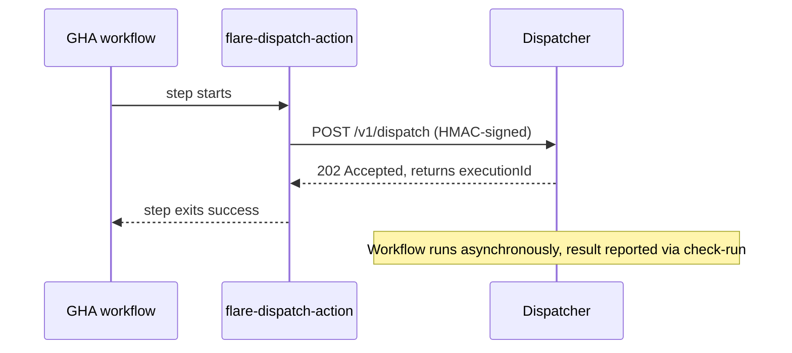
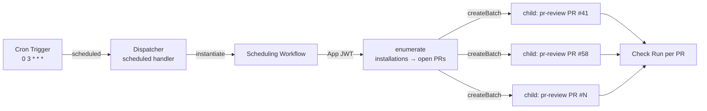
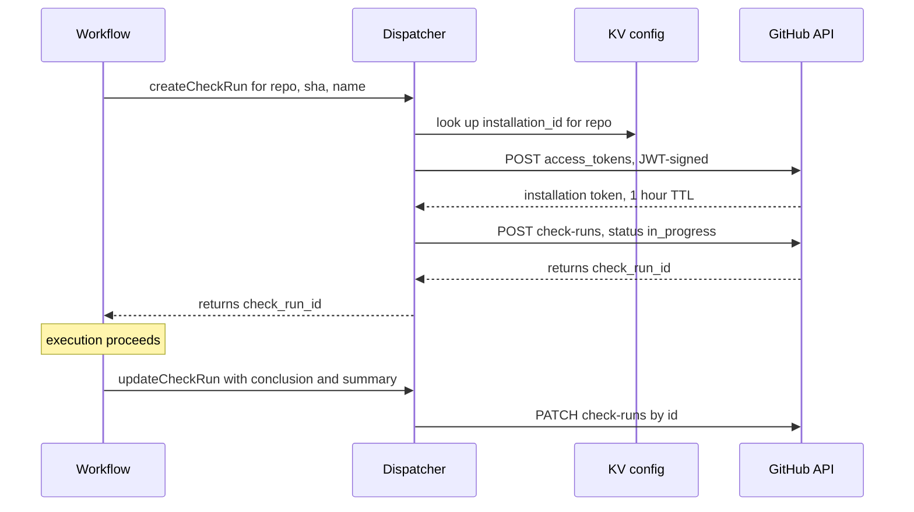

# 04 — GitHub Integration

GitHub talks to FlareDispatch through **three trigger modes**. Pick whichever fits — most teams end up running more than one, side by side, against the same Dispatcher.

| Mode | How a run is triggered | GHA workflow file? | GHA minutes per execution | Shared secret to rotate? | Status |
|---|---|---|---|---|---|
| **Action mode** | A GHA workflow calls `openhackersclub/flare-dispatch-action`; or any external caller HMAC-signs and POSTs the dispatch endpoint | yes (or none, for direct POST) | ~10 s per dispatch | yes — `FLAREDISPATCH_HMAC` | Live |
| **Webhook mode** | The `FlareDispatch` GitHub App webhook fires the Dispatcher directly | no | 0 | no — only the App's own webhook secret | **Live** — opt-in (needs `GITHUB_WEBHOOK_SECRET`; off → route `503`s) |
| **Schedule mode** | A Cloudflare [Cron Trigger](https://developers.cloudflare.com/workers/configuration/cron-triggers/) fires the Dispatcher's `scheduled()` handler on a wall-clock cadence; the handler instantiates a durable scheduling Workflow | no | 0 | no — no GitHub-facing secret at all | Live |

All three modes hit the same Dispatcher, share the same dedup discipline, and report results through the same check-run callback. The rest of this doc is **one section per mode**, then the parts they share (check-runs callback, dedup, secrets, failure handling). Trust boundaries and threats per mode are catalogued in [07-trust-model](07-trust-model.md).

## Pieces

| Piece | Role | Used by |
|---|---|---|
| **Dispatcher Worker** | Single receiver for all three modes — `fetch()` for Action / Webhook, `scheduled()` for Schedule. See [01-architecture § Dispatcher Worker](01-architecture.md#control-plane). | all |
| **`FlareDispatch` GitHub App** | Owns the check-runs API token (writes results back). In Webhook mode, also the trigger source. In Schedule mode, the JWT that enumerates targets. | all for callback; Webhook mode for trigger; Schedule mode for enumeration |
| **`openhackersclub/flare-dispatch-action`** | Composite Action — HMAC-signs the body, POSTs the dispatch, then exits or polls. | Action mode only |
| **Cron Trigger** | A `triggers.crons` entry in `wrangler.jsonc` — Cloudflare's wall-clock heartbeat into the Worker's `scheduled()` handler. | Schedule mode only |

Installing only the GHA Action still requires the App (for check-run writes). Webhook mode and Schedule mode do not require the Action. Schedule mode requires the App for both the check-run callback **and** target enumeration, but no webhook delivery — so it needs neither `HMAC_SECRET` nor `GITHUB_WEBHOOK_SECRET`.

---

## Action mode

A GHA workflow — or any HMAC-signing HTTP caller — POSTs `/v1/dispatch/:run` to start an execution.

### When to use

- The run needs to interleave with other GHA jobs (lint → run → deploy).
- You want GHA's native trigger filters (`paths:`, `branches:`, `workflow_dispatch`).
- The caller lives outside GitHub entirely — a cron service, another CI system, a local debugging script. Same HMAC, same body shape; no GHA wrapper required.

### Workflow snippet

```yaml
# .github/workflows/ci.yml
- uses: openhackersclub/flare-dispatch-action@v1
  with:
    run: playwright-e2e
    endpoint: ${{ vars.FLAREDISPATCH_ENDPOINT }}
    hmac-secret: ${{ secrets.FLAREDISPATCH_HMAC }}
    inputs: |
      { "baseURL": "https://staging.example.com", "shards": 4 }
    mode: fire-and-forget    # default; "await" also supported
```

### Inputs

| Input | Required | Default | Notes |
|---|---|---|---|
| `run` | yes | — | Run slug. Must exist on the target deploy. |
| `endpoint` | yes | — | `https://runs.<your-domain>` |
| `hmac-secret` | yes | — | Shared HMAC secret. Same value as the Worker's `HMAC_SECRET`. |
| `inputs` | no | `{}` | JSON or YAML mapping. Validated against the run's Schema on the Worker side. |
| `mode` | no | `fire-and-forget` | `fire-and-forget` returns 202 immediately; `await` polls until terminal. |
| `timeout` | no | `30m` | Await sub-mode poll ceiling. |
| `check-name` | no | `flare-dispatch/<run>` | Overrides the check-run name. |

### Outputs

| Output | Notes |
|---|---|
| `execution-id` | ULID of the execution on CF. Always set — the Dispatcher returns it in the 202. |
| `check-run-id` | GitHub check-run id. **Await sub-mode only** — the check-run is opened by the Workflow *after* dispatch, so it is not known at 202 time; the polling action reads it once the Workflow has created it. |
| `conclusion` | Await sub-mode only: `success` / `failure` / `neutral` / `timed_out` / `cancelled`. |
| `summary-url` | Link to the check-run page on github.com. |

### Dispatch body

```json
{
  "run": "playwright-e2e",
  "github": {
    "repo": "owner/name",
    "ref": "refs/pull/42/head",
    "sha": "abc123...",
    "pr_number": 42,
    "actor": "octocat",
    "installation_id": 12345
  },
  "inputs": { "baseURL": "...", "shards": 4 },
  "trigger": { "workflow_run_id": 678901, "job_id": 234567 },
  "notify": { "emails": ["reviewer@example.com"] }
}
```

`notify.emails` is optional — see [§ Notifications](#notifications). Omit it (or pass an empty list) and no email is sent.

HMAC-SHA256 signed; the signature goes in `X-FlareDispatch-Signature: sha256=<hex>`, verified with a constant-time comparison. Direct (non-GHA) callers must also supply an `Idempotency-Key` header so receiver-level dedup applies; the GHA Action generates one per dispatch.

### Fire-and-forget sub-mode (default)



The GHA step succeeds the moment dispatch is accepted — it has done its job. The **check run** is the actual PR signal. In branch protection, require the check-run name (e.g. `flare-dispatch/playwright-e2e`), not the GHA job. Zero GHA minutes are spent for the execution duration. This is the recommended sub-mode.

### Await sub-mode

> **Status: partially live.** The `GET /v1/executions/:id` inspection endpoint **is live at HEAD** (capability-token gated; the token rides in the `logsUrl` the dispatch 202 returns). The `await`-*mode Action wiring* — the JS Action that polls it — is still **Planned (V1)**: the Action today rejects any `mode` other than `fire-and-forget` before touching the network (`packages/cli/src/dispatch.ts`).

```yaml
- uses: openhackersclub/flare-dispatch-action@v1
  with:
    run: cdp-acceptance
    mode: await
    timeout: 20m
```

When the Action wiring lands, it will poll `GET /v1/executions/:id` every 10 s — passing the capability token from the 202's `logsUrl` (the endpoint is token-gated, not unauthenticated) — until the execution reaches a terminal state, then mirror the conclusion as its own GHA step status.

Use **only** when a follow-up GHA step needs the result inline — e.g. a deploy gate that consumes the acceptance execution's exact output. Avoid for runs longer than ~5 minutes: polling burns GHA minutes that fire-and-forget would not.

---

## Webhook mode

> **Status: Live — opt-in, off by default.** The receiver — `X-Hub-Signature-256` verify, `triggers` evaluation, `actions[]` filtering, `gate()`, optional `IDEMPOTENCY_KV` receiver-dedup, and (via the generic event match) `check_run.rerequested` re-runs — is wired at `apps/dispatcher/src/routes/webhook.ts`. The `FlareDispatch` GitHub App manifest declares `/v1/webhooks/github` as its `hook_attributes.url` (`infra/github-app-manifest.json`, mirrored in `apps/dispatcher/src/routes/github.ts`). **The mode is opt-in:** a deploy without `GITHUB_WEBHOOK_SECRET` returns `503` on this route (`webhook.ts` refuses rather than accept unsigned bodies) — it does not fire on every push until you provision that secret.

The `FlareDispatch` GitHub App webhook fires the Dispatcher's `/v1/webhooks/github` directly. No GHA workflow file is involved.

### When to use

- The run should execute on **every** push without burning GHA minutes (PR review, smoke).
- The trigger is a GitHub *event* that isn't a code push — `deployment_status.success` for E2E gating, `check_run.rerequested` for re-runs.
- You want one less shared secret to rotate.
- Users shouldn't have to touch `.github/workflows/` to onboard the run.

For runs whose trigger is a **wall-clock cadence** rather than a GitHub event — nightly dependency scans, weekly release notes, a scheduled sweep of open PRs — use **Schedule mode** below, not Webhook mode. A cron tick carries no webhook payload, so it cannot drive a `triggers` entry.

### Trigger config lives in the run

The receiver-side gates that GHA `on:` filters would normally provide instead live in the run's `triggers`:

```ts
// runs/pr-review.ts
export const prReview = defineRun({
  name: "pr-review",
  triggers: [
    {
      event: "pull_request",
      actions: ["opened", "synchronize", "ready_for_review"],
      // Matches Action mode's semantic instanceId (`{run}:{repo_}:{sha12}`) so
      // webhook- and Action-mode dispatches of the same logical work collapse
      // to one execution at the `create({id})` layer.
      idempotencyKey: ({ payload }) =>
        `pr-review:${payload.repository.full_name.replace(/\//g, "_")}:${payload.pull_request.head.sha.slice(0, 12)}`,
      gate: ({ payload }) =>
        // skip drafts unless explicitly labelled, skip dependabot
        (!payload.pull_request.draft || hasLabel(payload, "request-ai-review"))
        && !hasLabel(payload, "skip-ai-review")
        && payload.pull_request.user.login !== "dependabot[bot]",
      inputs: ({ payload }) => ({
        repo: payload.repository.full_name,
        pr: payload.pull_request.number,
        headSha: payload.pull_request.head.sha,
        installationId: payload.installation.id,
      }),
    },
  ],
  // ...inputs, outputs, run as usual
});
```

On each delivery the receiver verifies the App webhook signature (`X-Hub-Signature-256`), evaluates every matching `triggers` entry across all registered runs, dedupes (see § Receiver dedup), and fires whichever runs' gates pass. Multiple runs may subscribe to the same event. The Dispatcher meets GitHub's 10-second webhook ack window with margin — all LLM calls, Octokit fetches, and container starts happen inside the Workflow, never on the receiver path.

The agentic reviewer `pr-review` is the headline Webhook-mode consumer: it subscribes to `pull_request` (its `triggers` block in [`runs/pr-review.ts`](../runs/pr-review.ts)) and runs its model calls in-Worker through the `modelGateway` capability (backend selectable from `CONFIG_KV` without redeploy — Workers AI, Anthropic-via-AI-Gateway, reasonix/DeepSeek, Bedrock-via-AI-Gateway). The same run is also dispatchable per-call in **Action mode** (`workflow_dispatch`), where a single dispatch can override the model/backend/region/role and the single-vs-multi agent mode — the model-bake-off path. Either way the LLM work stays inside the Workflow, so the receiver still acks within the 10-second window.

---

## Schedule mode

Some runs aren't triggered by anything GitHub does — they're triggered by **the clock**: review every open PR each night, scan dependencies every morning, draft release notes every Monday. Neither Action mode (a GHA workflow ran) nor Webhook mode (a GitHub event arrived) fits, because there is no run, no push, no payload. Schedule mode is the third trigger: a wall-clock cadence.

### When to use

- The trigger is a **recurring time**, not a GitHub event — nightly, hourly, weekly.
- The run has **no single target** at trigger time. It must *discover* its targets — every open PR, every installed repo, every dependency manifest — rather than receive one in a payload.
- You want autonomous, zero-GHA-minute runs with **no GitHub-facing secret at all**: Schedule mode needs neither `HMAC_SECRET` (no inbound POST) nor `GITHUB_WEBHOOK_SECRET` (no inbound webhook). The only credential it touches is the App private key it already needs for the check-run callback.

### Cron Trigger as the heartbeat, Workflow as the durable dispatch

Schedule mode deliberately splits the *timer* from the *work*:

- **The timer is a Cloudflare Cron Trigger.** A `triggers.crons` entry in `wrangler.jsonc` invokes the Dispatcher Worker's `scheduled(controller, env, ctx)` handler at each cadence. Cron Triggers are Cloudflare's purpose-built scheduling primitive — the cadence is deploy-time config, visible in the dashboard, with no step-budget to manage.
- **The work is a durable Workflow.** The `scheduled()` handler does *no* enumeration and *no* fan-out inline — it instantiates a **scheduling Workflow** and returns, exactly as `fetch()` does for the other two modes. The handler shares the Worker CPU budget, and "list every open PR across N installed repos, then spawn a child execution for each" is precisely the multi-step, retryable, must-survive-eviction orchestration Workflows exist for. This keeps the architecture invariant intact: *every unit of real work is a durable Workflow instance* (see [01-architecture § Schedule-mode dispatch](01-architecture.md#schedule-mode-dispatch)).

> **Why not a long-lived `sleepUntil` loop instead of a Cron Trigger?** A Workflow *can* schedule itself — `step.sleepUntil(next)` then loop. We don't, for recurring schedules: a Workflow instance has a step-count ceiling (10k default, 25k max — [01-architecture § Platform limits](01-architecture.md#platform-limits--design-constraints)), so an hourly loop would need `continueAsNew` plumbing to outlive ~1–3 years, and the cadence would be buried in run code instead of declared in `wrangler.jsonc`. The Cron Trigger is the right primitive for the *heartbeat*. `step.sleepUntil` is still the right primitive for a *one-off deferred* execution — see [§ Deferred follow-ups](#deferred-follow-ups).

### Schedule config lives in the run

Where Webhook mode runs declare `triggers`, Schedule mode runs declare `schedules`. A schedule entry binds a cron expression to the run and supplies the *coarse* input — the run body does the actual target discovery (full type in [03-dsl § `ScheduleSpec`](03-dsl.md#schedules--schedule-mode-trigger-config)):

```ts
// runs/pr-review-sweep.ts
export const prReviewSweep = defineRun({
  name: "pr-review-sweep",
  schedules: [
    {
      cron: "0 3 * * *",                       // 03:00 UTC daily — must also appear in wrangler triggers.crons
      idempotencyKey: ({ firedAt }) =>
        `pr-review-sweep:${new Date(firedAt).toISOString().slice(0, 10)}`,
      gate: ({ firedAt }) => !isHoliday(firedAt),   // optional: skip a freeze window
      inputs: ({ firedAt }) => ({
        scope: "open-prs" as const,
        staleAfterHours: 24,
        firedAt,
      }),
    },
  ],
  // ...inputs, outputs, run as usual
});
```

A cron tick carries no repo, no SHA, no PR number — only the expression that fired and `firedAt` (the scheduled time). So `inputs` cannot name a target; it produces a *scope*. **Enumeration is the run's first step**: the run uses the App JWT to list installations, lists the repos and open PRs each cadence cares about, and fans out one child execution per target with the platform's `createBatch` primitive — the same fan-out matrix runs use ([01-architecture § Fan-out model](01-architecture.md#fan-out-model)).

### Flow



The cron expression in the run's `schedules` and the one in `wrangler.jsonc`'s `triggers.crons` must match — `wrangler.jsonc` is what Cloudflare actually subscribes to; the run's `schedules` is how the `scheduled()` handler routes `controller.cron` to the right run(s). The `init` CLI ([pm/plan](pm/plan.md)) reconciles the two; until then it is a deploy-time check. Multiple runs may share one cron expression, exactly as multiple runs may subscribe to one webhook event.

### Free dedup against the other modes

A scheduled sweep does not waste compute re-doing work the other modes already did. The child executions it spawns keep their **semantic** `instanceId` — `pr-review:{repo_}:{sha12}` — and CF Workflows treats a duplicate `create({ id })` as a no-op (see [§ Receiver dedup](#receiver-dedup-shared-by-all-modes)). So a PR already reviewed at its current head SHA by Webhook mode is silently skipped by the nightly sweep; the sweep only spends tokens on PRs that changed since their last review, or that Webhook mode never saw. Schedule mode is a *backstop*, not a duplicate channel.

### Deferred follow-ups

Schedule mode's heartbeat is recurring, but a run sometimes needs a **one-off** future execution: "re-check this PR in 24 hours if it's still open," "poll this deployment until it settles." That does not need a Cron Trigger — it is a single durable sleep inside a Workflow, expressed with `step.sleepUntil` ([03-dsl § Deferred scheduling](03-dsl.md#deferred-scheduling-with-stepsleepuntil)). The Workflow hibernates (consuming no CPU, surviving eviction) until the wakeup time, then resumes. Use the Cron Trigger for *every night*; use `step.sleepUntil` for *once, later*.

---

## Signal ingress

> **Status: Live.** Receiver — source-label sanitize, static-bearer auth, CONFIG_KV dot-path mapping, `signals/v1` validation, and shared `RunWorkflow` instantiation — is wired at `apps/dispatcher/src/routes/signals-webhook.ts`, routed in `apps/dispatcher/src/router.ts`.

The *push* counterpart to the [`signals/v1`](02-runs.md) pull contract. Where the pull path has a consumer collect signals on its own schedule and POST them through Action mode, signal ingress lets **any observability vendor that can POST a JSON alert webhook** (Datadog, SigNoz, Grafana, PagerDuty, …) trigger an immediate [`ci-triage-pr`](#) dispatch the moment an alert fires — carrying that one alert as a single `signals/v1` signal.

The dispatcher stays **vendor-blind**: the payload → signal mapping is *configuration* (CONFIG_KV), never vendor-specific code. No new code ships to onboard a new vendor — only a CONFIG_KV mapping entry and a webhook URL pasted into the vendor's UI.

### When to use

- A vendor emits an alert webhook and you want the day's CI-triage PR to **also** reflect that runtime alert, the moment it fires — not at the next scheduled sweep.
- The vendor's webhook UI can set a **custom header** but cannot produce FlareDispatch's HMAC scheme (the Action-mode `X-FlareDispatch-Signature`). Alert webhooks are the only cross-vendor quasi-standard; ingress meets them there.
- You want a single, low-ceremony URL per vendor rather than a GHA workflow or a bespoke collector.

For a consumer that owns its own scheduling and can sign an HMAC, prefer **Action mode** (`POST /v1/dispatch/ci-triage-pr` with `inputs.signals[]`) — it carries the full capped `signals[]` array, not one alert at a time.

### Route

```
POST /v1/webhooks/signals/:source
```

`:source` is an **operator-chosen label** (e.g. `datadog`, `vendor-a`) — it names the mapping to apply and becomes the signal's `source` field (`webhook:<source>`). It is sanitized to `^[a-z0-9-]{1,32}$`; anything else is a `404`.

### Auth — static bearer token

A vendor's generic webhook UI can't compute our HMAC over the raw body, so ingress authenticates with a **static bearer token** the operator configures and pastes into the vendor's webhook **custom-header** field:

```
Authorization: Bearer <signals.webhook.token>
```

The presented token is compared against the configured one in **constant time** (`constantTimeEqual` in `apps/dispatcher/src/hmac.ts` — HMACs both sides under a per-call random key and compares the fixed-width MACs via `crypto.subtle.verify`, since Workers has no `timingSafeEqual`).

- **Missing / empty `signals.webhook.token`** (or no `CONFIG_KV` bound) → `503 ingress_not_configured`. Ingress is **off by default** and **fails closed** — it never accepts unauthenticated alerts.
- **Token absent or mismatched** → `401`.

One shared token covers all sources. Rotate it by overwriting the CONFIG_KV key and updating each vendor's custom-header config.

### CONFIG_KV keys

| Key | Holds |
|-----|-------|
| `signals.webhook.token` | The shared static bearer token. **Required** — absent → `503`. |
| `signals.map.<source>` | Per-source JSON mapping template (below). Optional — absent → the default mapping. |

### Mapping template semantics

`signals.map.<source>` is a JSON **object** whose values map onto the four `signals/v1` body fields — `title`, `detail`, `url`, `count` (`source` is always set to `webhook:<source>`; any other key is ignored):

```json
{ "title": "$.alert_title", "detail": "$.body.message", "url": "$.link", "count": "$.occurrences" }
```

- A **`"$."`-prefixed** string is a **dot-path** into the webhook payload. Array indices are integer segments: `$.items.0.name`. A path that resolves to an object/array is JSON-stringified (so a template can lift a sub-tree into `detail`). A **missing** path → the field is omitted.
- Any **other** string is a **literal** (e.g. `"title": "Production alert"`).
- After mapping, every field is **clamped** to the `signals/v1` caps (truncate, never reject) and the signal is validated against the same core `Signal` Schema the dispatch gate uses.
- A payload that yields **no title and no derivable detail** → `422 unmappable_payload`. (A single-field template still validates — the missing required field is derived from the present one.)

**Default mapping** (no `signals.map.<source>` configured) is best-effort across common alert-webhook field names — `title|alert|message|summary|name` → `title`; `body|description|text|detail` → `detail`; `url|link|alert_url|permalink` → `url` — and falls back to a JSON excerpt of the payload for `detail` so an unrecognized shape still produces a triageable signal.

### Idempotency

The Workflow instance id is `signals:<source>:<delivery>`, where `<delivery>` is a common vendor **delivery header** (`X-Delivery-Id` / `X-Request-Id` / `X-Message-Id`) when present, else the **SHA-256 of the raw body**. So a vendor **retry** of the same alert dedupes onto one execution, while **distinct** alerts stay distinct. Dedup uses the same `IDEMPOTENCY_KV` + platform `create({id})` no-op path as every other mode ([§ Receiver dedup](#receiver-dedup-shared-by-all-modes)).

### Response

| Status | Meaning |
|--------|---------|
| `202`  | accepted — `{ "executionId": "signals:<source>:<delivery>" }` (+ `detailsUrl` when `CLOUDFLARE_ACCOUNT_ID` is set) |
| `400`  | request body is not valid JSON |
| `401`  | bearer token missing / invalid |
| `404`  | `:source` is not `^[a-z0-9-]{1,32}$` |
| `422`  | payload yields neither a title nor a derivable detail |
| `503`  | ingress not configured (no `CONFIG_KV` / `signals.webhook.token`) |

### Per-day interaction with `ci-triage-pr`

An alert webhook has no schedule tick, so the dispatch carries `firedAt: Date.now()` (the ingest time). `ci-triage-pr` keys its draft PR by date (`flare-dispatch/ci-triage-<date>`), so **the first alert of the day opens that day's triage draft PR, and every later alert UPDATES the same PR** — folding the new signal into the same write-up rather than opening a new PR per alert. A signal counts as a failure for the green-day check, so a day with no Actions/deploy failures but a real runtime alert still produces a PR.

### Examples

**`vendor-a`** — a vendor whose alert payload nests its fields:

```sh
# CONFIG_KV
signals.webhook.token            =  <shared-bearer-token>
signals.map.vendor-a             =  {"title":"$.alert.name","detail":"$.alert.body","url":"$.alert.url","count":"$.alert.event_count"}
```

```sh
curl -X POST https://runs.example.com/v1/webhooks/signals/vendor-a \
  -H "Authorization: Bearer <shared-bearer-token>" \
  -H "Content-Type: application/json" \
  -d '{"alert":{"name":"5xx rate high","body":"api 5xx > 2% for 5m","url":"https://vendor-a.example/a/1","event_count":312}}'
# → 202 {"executionId":"signals:vendor-a:<sha256-or-delivery-id>"}
```

**`vendor-b`** — a vendor with flat, conventionally-named fields, so **no mapping entry** is needed (the default mapping handles it):

```sh
# CONFIG_KV
signals.webhook.token            =  <shared-bearer-token>
# (no signals.map.vendor-b)
```

```sh
curl -X POST https://runs.example.com/v1/webhooks/signals/vendor-b \
  -H "Authorization: Bearer <shared-bearer-token>" \
  -H "Content-Type: application/json" \
  -d '{"title":"Disk almost full","description":"node-7 at 95%","link":"https://vendor-b.example/i/9"}'
# → 202, default mapping lifts title/description/link
```

---

## Check-runs callback (shared by all modes)

Whatever triggered the execution, the Dispatcher reports the result through the `FlareDispatch` App's check-runs API. App credentials are exchanged for short-lived installation tokens (1-hour TTL). The token is cached in **Worker memory only** (`packages/github-app/src/installation-token.ts`); the KV-backed `INSTALL_TOKEN_KV` cache that survives Worker recycles is **Planned (V1)** — `INSTALL_TOKEN_KV` is declared (commented-out, optional) in `wrangler.jsonc`, and on a recycle the next check-run write simply does a fresh JWT exchange (one extra round-trip, never a failure).



A token is per-installation, not per-repo; one installation covers every repo the App is installed on for that org.

### Summary content

A successful execution renders as:

```
✓ playwright-e2e — 24 passed, 0 failed, 1 flaky (3m 42s)

| Shard | Passed | Failed | Duration |
|-------|--------|--------|----------|
| 1/4   | 6      | 0      | 51s      |
| 2/4   | 6      | 0      | 49s      |
| 3/4   | 6      | 0      | 53s      |
| 4/4   | 6      | 0      | 48s      |

📂 [Full report](https://runs.example.com/v1/artifacts/01J.../playwright-report)
📜 [Logs](https://runs.example.com/v1/artifacts/01J.../exec.ndjson)
```

The check-run summary carries two log links: the Cloudflare Workflows instance page (step timeline) and a **"view full logs"** link to the self-hosted viewer `/logs/:execution` (capability-token gated). The promoted-artifact link still points at `/v1/artifacts/:execution/:name` (`apps/dispatcher/src/routes/artifacts.ts`); the dedicated aggregator `GET /v1/executions/:id/logs` (a streaming plain-text roll-up of every exec's NDJSON) **is now live** alongside the per-file `GET /v1/executions/:id/logs/:file` (`?format=ndjson|text`).

For a failure, the summary inlines the first N failing test names with stack traces and direct links to per-shard reports. The summary is markdown; GitHub renders it in the check-run detail page.

### Inline findings — annotations

The summary is one markdown blob on the check-run detail page. For findings that belong to a **specific line of a specific file** — a security issue on `auth.ts:42`, the source location of a failed assertion, an AI reviewer's comment — the Dispatcher additionally posts GitHub **check-run annotations**.

A run surfaces these by returning a `findings` array in its output:

```ts
const Finding = Schema.Struct({
  path: Schema.String,                       // repo-relative path
  startLine: Schema.Number,
  endLine: Schema.Number,
  level: Schema.Literal("notice", "warning", "failure"),
  title: Schema.String,
  message: Schema.String,
});
```

The Dispatcher maps each `Finding` onto a check-run annotation (`annotation_level` ← `level`) and attaches them when it `PATCH`es the check-run. GitHub's API caps `output.annotations` at **50 per request**, so the Dispatcher batches: the first 50 land on the closing `updateCheckRun`, the remainder in follow-up `PATCH`es of the same `check_run_id`. Annotations render inline on the PR's **Files changed** tab, anchored to the exact lines — the GitHub-native equivalent of a per-line review comment, with no separate PR review thread to manage and nothing to clean up on the next push: a new execution opens a new check-run, so its annotations replace the prior set wholesale.

This keeps the single-surface model intact — the check-run is still the only thing FlareDispatch writes to the PR. Annotations are part of the check-run, not a second channel. A run that produces no line-anchored findings simply omits `findings`; the summary stands alone, exactly as before.

### Re-running

> **Status: Live** (opt-in, like all of Webhook mode — needs `GITHUB_WEBHOOK_SECRET`). The receiver is event-generic (`triggersByEvent`, `apps/dispatcher/src/routes/webhook.ts`), so re-run handling is a run-config matter, not a bespoke handler: a run declares a `check_run` trigger with `actions: ["rerequested"]` (or `["created"]`) and the existing fan-out path dispatches it.

Clicking "Re-run failed checks" on a PR fires `check_run.rerequested` to `POST /v1/webhooks/github`. The receiver matches it against any run subscribing to the `check_run` event, filters on `payload.action`, and routes to a new Workflow execution with the same inputs. The run re-executes in place — no GHA workflow re-runs, regardless of which mode originally triggered it.

---

## Notifications

The check-run is the PR signal, but stakeholders who don't watch the PR (designers reviewing a demo, an operator on a scheduled sweep) often want the result pushed to them. The dispatch body's optional `notify.emails` list does this: when present, `RunWorkflow` emails each address the run's verdict + output at the finalize boundary, right after completing the check-run.

The email renders the run's **output object** — wherever a run returns shareable URLs (`playwright-demo` → `videoUri`/`logUri`, `deploy-smoke` → a target URL), those become clickable links (artifact / demo / log), so the recipient clicks straight through. On a failed run the email links the Cloudflare step logs instead.

### How to pass recipients

- **Action mode** — the `notify-emails` input (comma/whitespace separated, or a JSON array): `notify-emails: "alice@x.com, bob@y.com"`.
- **Direct dispatch** — `notify.emails: ["…"]` in the POST body.

Recipients are validated for shape (single `@`, a dot in the domain) at the dispatch gate; a malformed address is a `400`.

### Backend — Cloudflare Email Routing

Delivery uses Cloudflare Email Routing's `send_email` binding (`SEND_EMAIL`), with `EMAIL_FROM` as the verified sender. **Cloudflare only delivers to addresses verified as Email Routing destination addresses on the deploy's zone** — this is Cloudflare's anti-abuse posture, not a FlareDispatch choice. For a fixed reviewer/stakeholder list (verify each once in the dashboard) this is exactly right; for arbitrary external recipients, swap the `Email` capability's Layer for a transactional provider (Resend / MailChannels / SES) — the capability interface is provider-agnostic so no run changes.

Notification is **reporting, never a gate**: an unconfigured backend (no binding / no `EMAIL_FROM`), an unverified recipient, or a provider outage is logged and the run's verdict is unaffected — exactly like a missing check-run. The optional `EMAIL_ALLOWED_RECIPIENTS` var pins an allowlist on top of Cloudflare's verified-destination check.

Setup: see [`specs/05-byoc.md` § Secrets](./05-byoc.md) and the commented `send_email` block + `EMAIL_FROM` var in `wrangler.jsonc`.

---

## Receiver dedup (shared by all modes)

All three modes share the same two-layer dedup discipline so a redelivery storm, a double-click on "Re-run failed checks," a GHA retry, or a duplicate cron delivery doesn't produce parallel work or duplicate check-runs.

1. **Receiver-level** — `IDEMPOTENCY_KV.put(deliveryId, "1", { expirationTtl: 86_400 })` with a get-set guard. The key is `X-GitHub-Delivery` for App webhooks, the caller-supplied `Idempotency-Key` for direct dispatch, or the `schedules[].idempotencyKey` value for a cron tick (Cloudflare may deliver a Cron Trigger more than once). A repeat returns `202` immediately — Workflows is never touched. `apps/dispatcher/src/routes/webhook.ts` does this today, guarded on the **optional** `IDEMPOTENCY_KV` binding: it is declared (commented-out) in `wrangler.jsonc`, so this layer is on once you bind the namespace. Absent the binding, receiver dedup falls back to the Workflow-level key below (Schedule mode passes its `idempotencyKey(ctx)` as the Workflow `instanceId`, so duplicate cron deliveries already collapse at layer 2 regardless).
2. **Workflow-level** — the Workflow `instanceId` is the **semantic** key: `playwright-e2e:{repo}:{sha}`, `pr-review:{repo_}:{sha12}`, `release-notes:{repo}:{iso_year}-W{iso_week_2digit}`, and for a scheduling Workflow the cron-window key `pr-review-sweep:{iso_date}`. CF Workflows treats a duplicate `env.RUNS_WORKFLOW.create({ id })` as a no-op, so two distinct deliveries naming the same logical work collapse onto one execution. A scheduling Workflow's fan-out children are themselves keyed semantically, so a sweep is idempotent against both itself and the other modes.

### Run cooldown (rate cap on top of dedup)

Dedup collapses dispatches naming the **same** logical work (same sha); it does nothing against a rapid push sequence, where every push is new work. A run may additionally declare a **cooldown** — `cooldown: { seconds, scope }` on `defineRun` — capping dispatches to one per window per `{run}:{repo}:{scope}` bucket. `pr-review` ships `{ seconds: 1800, scope: pr-<number> }`: at most one review per PR per 30 minutes, across BOTH Action and Webhook mode (Schedule mode is exempt — crons self-pace).

Enforcement lives in `apps/dispatcher/src/cooldown.ts`, rides the same optional `IDEMPOTENCY_KV` binding (no binding → no cap, best-effort like layer 1), and **never errors**: a dispatch landing inside the window is answered `202` with the *prior* execution's id plus `skipped: "cooldown"` and `retryAfterSec`, so a fire-and-forget CI step stays green and its `execution-id` output still points at a real execution. The webhook receiver reports the same outcome in a `skipped[]` array alongside `dispatched[]`.

---

## Secrets the user needs to configure

| Secret | Where | Action mode | Webhook mode | Schedule mode |
|---|---|---|---|---|
| `FLAREDISPATCH_ENDPOINT` (a URL, not a secret) | Repo/org variable | required | required | not used |
| `FLAREDISPATCH_HMAC` | Repo/org secret + Worker secret `HMAC_SECRET` | required | not used | not used |
| GitHub App ID + private key | Worker secrets (`GITHUB_APP_ID`, `GITHUB_APP_PRIVATE_KEY`) | required (for the check-run callback) | required | required (callback **and** target enumeration) |
| App webhook secret | Worker secret (`GITHUB_WEBHOOK_SECRET`) | not used | required | not used |

Users running **only** Webhook mode never provision or rotate `FLAREDISPATCH_HMAC` — one less long-lived shared secret. Users running both rotate it on the cadence in [05-byoc § Security posture](05-byoc.md#security-posture); the App webhook secret rotates independently from the App settings page. Schedule mode is the leanest of the three on secrets: the cron tick is internal to Cloudflare, so the only credential in play is the App private key — there is no inbound request to authenticate, hence no `HMAC_SECRET` and no `GITHUB_WEBHOOK_SECRET`.

---

## What the Action does not do

- It does not execute any run logic. The Action is a thin composite wrapper around a ~30-line bash script — sign request, POST, optionally poll.
- It does not require the user to manage a GitHub PAT for check-runs. The App handles it.
- It does not require `runs-on: self-hosted`. It's a normal hosted-runner step that finishes in seconds.

## Failure handling

| Failure | Behavior |
|---|---|
| Dispatcher unreachable | Action retries 3× with exponential backoff; then fails the GHA step with a clear message. |
| HMAC rejected | Dispatcher returns 401; Action fails the step (config bug — no retry). |
| Webhook signature rejected | Dispatcher returns 401; GitHub retries per its standard delivery policy, then marks the delivery failed. |
| Run input doesn't match Schema | Dispatcher returns 400 with the Schema parse error; Action fails the step with the error inlined. |
| Run not found on the deploy | Dispatcher returns 404; Action fails the step. |
| Worker quota exhausted | Dispatcher returns 429 + `Retry-After`; Action waits and retries up to 3×. |
| Run fails mid-execution (await sub-mode) | Action mirrors the conclusion; GHA step fails. |
| Run times out (await sub-mode) | Action sets conclusion `timed_out`; GHA step fails. The Workflow itself continues on CF; the check-run updates independently when it finishes. |
