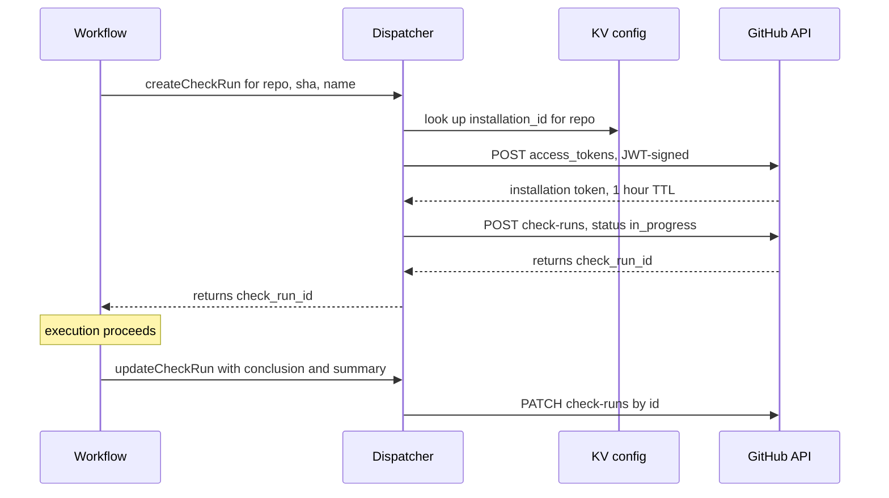

# 04 — GitHub Integration

GitHub talks to FlareDispatch through **two trigger modes**. Pick whichever fits — most teams end up running both, side by side, against the same Dispatcher.

| Mode | How a run is triggered | GHA workflow file? | GHA minutes per execution | Shared secret to rotate? |
|---|---|---|---|---|
| **Action mode** | A GHA workflow calls `openhackersclub/flaredispatch-action`; or any external caller HMAC-signs and POSTs the dispatch endpoint | yes (or none, for direct POST) | ~10 s per dispatch | yes — `FLAREDISPATCH_HMAC` |
| **Webhook mode** | The `FlareDispatch` GitHub App webhook fires the Dispatcher directly | no | 0 | no — only the App's own webhook secret |

Both modes hit the same Dispatcher, share the same dedup discipline, and report results through the same check-run callback. The rest of this doc is **one section per mode**, then the parts they share (check-runs callback, dedup, secrets, failure handling).

## Pieces

| Piece | Role | Used by |
|---|---|---|
| **Dispatcher Worker** | Single receiver for both modes. See [01-architecture § Dispatcher Worker](01-architecture.md#control-plane). | both |
| **`FlareDispatch` GitHub App** | Owns the check-runs API token (writes results back). In Webhook mode, also the trigger source. | both for callback; Webhook mode for trigger |
| **`openhackersclub/flaredispatch-action`** | Composite Action — HMAC-signs the body, POSTs the dispatch, then exits or polls. | Action mode only |

Installing only the GHA Action still requires the App (for check-run writes). Running only Webhook mode does not require the Action.

---

## Action mode

A GHA workflow — or any HMAC-signing HTTP caller — POSTs `/v1/dispatch/:run` to start an execution.

### When to use

- The run needs to interleave with other GHA jobs (lint → run → deploy).
- You want GHA's native trigger filters (`paths:`, `branches:`, `workflow_dispatch`).
- The caller lives outside GitHub entirely — a cron service, another CI system, a local debugging script. Same HMAC, same body shape; no GHA wrapper required.

### Workflow snippet

```yaml
# .github/workflows/ci.yml
- uses: openhackersclub/flaredispatch-action@v1
  with:
    run: playwright-e2e
    endpoint: ${{ vars.FLAREDISPATCH_ENDPOINT }}
    hmac-secret: ${{ secrets.FLAREDISPATCH_HMAC }}
    inputs: |
      { "baseURL": "https://staging.example.com", "shards": 4 }
    mode: fire-and-forget    # default; "await" also supported
```

### Inputs

| Input | Required | Default | Notes |
|---|---|---|---|
| `run` | yes | — | Run slug. Must exist on the target deploy. |
| `endpoint` | yes | — | `https://runs.<your-domain>` |
| `hmac-secret` | yes | — | Shared HMAC secret. Same value as the Worker's `HMAC_SECRET`. |
| `inputs` | no | `{}` | JSON or YAML mapping. Validated against the run's Schema on the Worker side. |
| `mode` | no | `fire-and-forget` | `fire-and-forget` returns 202 immediately; `await` polls until terminal. |
| `timeout` | no | `30m` | Await sub-mode poll ceiling. |
| `check-name` | no | `flaredispatch/<run>` | Overrides the check-run name. |

### Outputs

| Output | Notes |
|---|---|
| `execution-id` | ULID of the execution on CF. Always set — the Dispatcher returns it in the 202. |
| `check-run-id` | GitHub check-run id. **Await sub-mode only** — the check-run is opened by the Workflow *after* dispatch, so it is not known at 202 time; the polling action reads it once the Workflow has created it. |
| `conclusion` | Await sub-mode only: `success` / `failure` / `neutral` / `timed_out` / `cancelled`. |
| `summary-url` | Link to the check-run page on github.com. |

### Dispatch body

```json
{
  "run": "playwright-e2e",
  "github": {
    "repo": "owner/name",
    "ref": "refs/pull/42/head",
    "sha": "abc123...",
    "pr_number": 42,
    "actor": "octocat",
    "installation_id": 12345
  },
  "inputs": { "baseURL": "...", "shards": 4 },
  "trigger": { "workflow_run_id": 678901, "job_id": 234567 }
}
```

HMAC-SHA256 signed; the signature goes in `X-FlareDispatch-Signature: sha256=<hex>`, verified with a constant-time comparison. Direct (non-GHA) callers must also supply an `Idempotency-Key` header so receiver-level dedup applies; the GHA Action generates one per dispatch.

### Fire-and-forget sub-mode (default)


The GHA step succeeds the moment dispatch is accepted — it has done its job. The **check run** is the actual PR signal. In branch protection, require the check-run name (e.g. `flaredispatch/playwright-e2e`), not the GHA job. Zero GHA minutes are spent for the execution duration. This is the recommended sub-mode.

### Await sub-mode

```yaml
- uses: openhackersclub/flaredispatch-action@v1
  with:
    run: cdp-acceptance
    mode: await
    timeout: 20m
```

The Action polls `GET /v1/executions/:id` every 10 s until the execution reaches a terminal state, then mirrors the conclusion as its own GHA step status.

Use **only** when a follow-up GHA step needs the result inline — e.g. a deploy gate that consumes the acceptance execution's exact output. Avoid for runs longer than ~5 minutes: polling burns GHA minutes that fire-and-forget would not.

---

## Webhook mode

The `FlareDispatch` GitHub App webhook fires the Dispatcher's `/v1/webhooks/github` directly. No GHA workflow file is involved.

### When to use

- The run should execute on **every** push without burning GHA minutes (PR review, smoke).
- The trigger isn't a code push — `deployment_status.success` for E2E gating, `check_run.rerequested` for re-runs, Cron Triggers for scheduled runs (release notes, dependency scans).
- You want one less shared secret to rotate.
- Users shouldn't have to touch `.github/workflows/` to onboard the run.

### Trigger config lives in the run

The receiver-side gates that GHA `on:` filters would normally provide instead live in the run's `triggers`:

```ts
// runs/pr-review.ts
export const prReview = defineRun({
  name: "pr-review",
  triggers: [
    {
      event: "pull_request",
      actions: ["opened", "synchronize", "ready_for_review"],
      idempotencyKey: ({ payload }) =>
        `pr-review:${payload.repository.full_name}:${payload.pull_request.number}:${payload.pull_request.head.sha}`,
      gate: ({ payload }) =>
        // skip drafts unless explicitly labelled, skip dependabot
        (!payload.pull_request.draft || hasLabel(payload, "request-ai-review"))
        && !hasLabel(payload, "skip-ai-review")
        && payload.pull_request.user.login !== "dependabot[bot]",
      inputs: ({ payload }) => ({
        repo: payload.repository.full_name,
        pr: payload.pull_request.number,
        headSha: payload.pull_request.head.sha,
        installationId: payload.installation.id,
      }),
    },
  ],
  // ...inputs, outputs, run as usual
});
```

On each delivery the receiver verifies the App webhook signature (`X-Hub-Signature-256`), evaluates every matching `triggers` entry across all registered runs, dedupes (see § Receiver dedup), and fires whichever runs' gates pass. Multiple runs may subscribe to the same event. The Dispatcher meets GitHub's 10-second webhook ack window with margin — all LLM calls, Octokit fetches, and container starts happen inside the Workflow, never on the receiver path.

---

## Check-runs callback (shared by both modes)

Whatever triggered the execution, the Dispatcher reports the result through the `FlareDispatch` App's check-runs API. App credentials are exchanged for short-lived installation tokens (1-hour TTL), cached in `INSTALL_TOKEN_KV` with a 55-minute TTL so the token survives Worker recycles mid-execution.



A token is per-installation, not per-repo; one installation covers every repo the App is installed on for that org.

### Summary content

A successful execution renders as:

```
✓ playwright-e2e — 24 passed, 0 failed, 1 flaky (3m 42s)

| Shard | Passed | Failed | Duration |
|-------|--------|--------|----------|
| 1/4   | 6      | 0      | 51s      |
| 2/4   | 6      | 0      | 49s      |
| 3/4   | 6      | 0      | 53s      |
| 4/4   | 6      | 0      | 48s      |

📂 [Full report](https://runs.example.com/v1/artifacts/01J.../playwright-report)
📜 [Logs](https://runs.example.com/v1/executions/01J.../logs)
```

For a failure, the summary inlines the first N failing test names with stack traces and direct links to per-shard reports. The summary is markdown; GitHub renders it in the check-run detail page.

### Re-running

The App listens for `check_run.rerequested` and `check_run.created`. Clicking "Re-run failed checks" on a PR fires `POST /v1/webhooks/github`, which the Dispatcher routes to a new Workflow execution with the same inputs. The run re-executes in place — no GHA workflow re-runs, regardless of which mode originally triggered it.

---

## Receiver dedup (shared by both modes)

Both modes share the same two-layer dedup discipline so a redelivery storm, a double-click on "Re-run failed checks," or a GHA retry doesn't produce parallel work or duplicate check-runs.

1. **Receiver-level** — `IDEMPOTENCY_KV.put(deliveryId, "1", { expirationTtl: 86_400 })` with a get-set guard. The key is `X-GitHub-Delivery` for App webhooks, or the caller-supplied `Idempotency-Key` for direct dispatch. A repeat returns `202` immediately — Workflows is never touched.
2. **Workflow-level** — the Workflow `instanceId` is the **semantic** key: `playwright-e2e:{repo}:{sha}`, `pr-review:{repo}:{pr}:{head_sha}`, `release-notes:{repo}:{iso_year}-W{iso_week_2digit}`. CF Workflows treats a duplicate `env.RUNS_WORKFLOW.create({ id })` as a no-op, so two distinct deliveries naming the same head SHA collapse onto one execution.

---

## Secrets the user needs to configure

| Secret | Where | Action mode | Webhook mode |
|---|---|---|---|
| `FLAREDISPATCH_ENDPOINT` (a URL, not a secret) | Repo/org variable | required | required |
| `FLAREDISPATCH_HMAC` | Repo/org secret + Worker secret `HMAC_SECRET` | required | not used |
| GitHub App ID + private key | Worker secrets (`GITHUB_APP_ID`, `GITHUB_APP_PRIVATE_KEY`) | required (for the check-run callback) | required |
| App webhook secret | Worker secret (`GITHUB_WEBHOOK_SECRET`) | not used | required |

Users running **only** Webhook mode never provision or rotate `FLAREDISPATCH_HMAC` — one less long-lived shared secret. Users running both rotate it on the cadence in [05-byoc § Security posture](05-byoc.md#security-posture); the App webhook secret rotates independently from the App settings page.

---

## What the Action does not do

- It does not execute any run logic. The Action is a thin composite wrapper around a ~30-line bash script — sign request, POST, optionally poll.
- It does not require the user to manage a GitHub PAT for check-runs. The App handles it.
- It does not require `runs-on: self-hosted`. It's a normal hosted-runner step that finishes in seconds.

## Failure handling

| Failure | Behavior |
|---|---|
| Dispatcher unreachable | Action retries 3× with exponential backoff; then fails the GHA step with a clear message. |
| HMAC rejected | Dispatcher returns 401; Action fails the step (config bug — no retry). |
| Webhook signature rejected | Dispatcher returns 401; GitHub retries per its standard delivery policy, then marks the delivery failed. |
| Run input doesn't match Schema | Dispatcher returns 400 with the Schema parse error; Action fails the step with the error inlined. |
| Run not found on the deploy | Dispatcher returns 404; Action fails the step. |
| Worker quota exhausted | Dispatcher returns 429 + `Retry-After`; Action waits and retries up to 3×. |
| Run fails mid-execution (await sub-mode) | Action mirrors the conclusion; GHA step fails. |
| Run times out (await sub-mode) | Action sets conclusion `timed_out`; GHA step fails. The Workflow itself continues on CF; the check-run updates independently when it finishes. |
