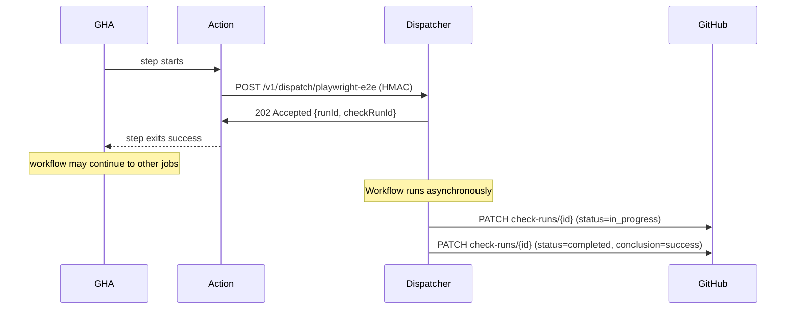
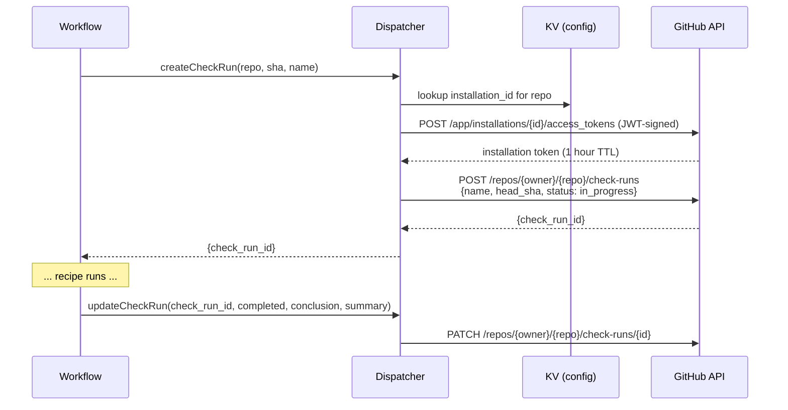

# 04 — GitHub Actions Integration

GHA is the trigger and the user-facing surface. Recipes integrate as a custom Action plus a GitHub App that handles check-run callbacks.

## Two pieces

| Piece | Lives in | What it does |
|---|---|---|
| **`openhackersclub/cf-recipes-action`** | GitHub Marketplace | A composite Action invoked from a user's workflow. POSTs an HMAC-signed dispatch to the user's Dispatcher Worker, then either exits (fire-and-forget) or polls (await mode). |
| **`CF Recipes` GitHub App** | The user installs it on their org/repo | Owns the check-runs API token. The Dispatcher Worker exchanges App credentials for short-lived installation tokens to create/update check-runs on the user's repos. |

The Action and the App are independent: the Action sends work to CF; the App is how CF talks back to GitHub. A user installs both during onboarding.

## Action contract

```yaml
# .github/workflows/ci.yml
- uses: openhackersclub/cf-recipes-action@v1
  with:
    recipe: playwright-e2e
    endpoint: ${{ secrets.CF_RECIPES_ENDPOINT }}
    hmac-secret: ${{ secrets.CF_RECIPES_HMAC }}
    inputs: |
      {
        "baseURL": "https://staging.example.com",
        "shards": 4,
        "project": "chromium"
      }
    mode: fire-and-forget    # or "await"
    timeout: 30m             # only used in await mode
```

### Inputs

| Input | Required | Default | Notes |
|---|---|---|---|
| `recipe` | yes | — | Recipe slug. Must exist on the target deploy. |
| `endpoint` | yes | — | `https://recipes.<your-domain>` |
| `hmac-secret` | yes | — | Shared HMAC secret. Same value set as Worker Secret. |
| `inputs` | no | `{}` | JSON or YAML mapping. Validated against the recipe's Schema on the Worker side. |
| `mode` | no | `fire-and-forget` | `fire-and-forget` returns 202 immediately; `await` polls until terminal. |
| `timeout` | no | `30m` | Await-mode poll ceiling. |
| `check-name` | no | `cf-recipes/<recipe>` | Overrides the check-run name. |
| `wait-for` | no | — | Await-mode only: comma-separated list of recipes to await. Useful when one Action dispatches several. |

### Outputs

| Output | Notes |
|---|---|
| `run-id` | ULID of the run on CF. |
| `check-run-id` | GitHub check-run id. |
| `conclusion` | Set in await mode only: `success` / `failure` / `neutral` / `timed_out` / `cancelled`. |
| `summary-url` | Link to the check-run page on github.com. |

### Dispatch request body

```json
{
  "recipe": "playwright-e2e",
  "github": {
    "repo": "owner/name",
    "ref": "refs/pull/42/head",
    "sha": "abc123...",
    "pr_number": 42,
    "actor": "octocat",
    "installation_id": 12345
  },
  "inputs": { "baseURL": "...", "shards": 4, "project": "chromium" },
  "trigger": { "workflow_run_id": 678901, "job_id": 234567 }
}
```

The body is HMAC-SHA256 signed; the signature goes in `X-CF-Recipes-Signature: sha256=<hex>`. The Dispatcher rejects any request that doesn't verify, with a constant-time comparison.

## Fire-and-forget mode (default)



The GHA step "succeeds" once dispatch is accepted — it has done its job. The recipe's outcome is reported as a **check run**, which becomes the actual PR signal.

**Required-checks configuration:** in branch protection, require the check-run name (e.g. `cf-recipes/playwright-e2e`), not the GHA job. PRs cannot merge until the check completes.

This is the recommended mode. It uses zero GHA minutes for the recipe duration.

## Await mode

```yaml
- uses: openhackersclub/cf-recipes-action@v1
  with:
    recipe: cdp-acceptance
    mode: await
    timeout: 20m
```

The Action polls `GET /v1/runs/:id` every 10s (configurable) until the run reaches a terminal state, then sets its own GHA step status to mirror the conclusion.

When to use:
- Subsequent GHA steps depend on the recipe's output (e.g. deploy gate that needs the acceptance run's exact result).
- Recipe output is consumed by a follow-up Action that doesn't read check-runs.
- Recipe wall-time is short and you want simpler debugging in the GHA logs view.

When not to use:
- Long recipes (>5 minutes) — wastes GHA minutes.
- Standard PR gate flows where check-runs are sufficient.

## Check-runs flow

The Dispatcher Worker uses GitHub App authentication (installation tokens) to write check-runs:



The installation token cache lives in the Dispatcher (Worker memory + KV fallback), refreshed before expiry. A token is per-installation, not per-repo; one installation covers all repos the App is installed on for that org.

### Check-run summary content

For a successful run:

```
✓ playwright-e2e — 24 passed, 0 failed, 1 flaky (3m 42s)

| Shard | Passed | Failed | Duration |
|-------|--------|--------|----------|
| 1/4   | 6      | 0      | 51s      |
| 2/4   | 6      | 0      | 49s      |
| 3/4   | 6      | 0      | 53s      |
| 4/4   | 6      | 0      | 48s      |

📂 [Full report](https://recipes.example.com/v1/artifacts/01J.../playwright-report)
📜 [Logs](https://recipes.example.com/v1/runs/01J.../logs)
```

For a failure, the summary includes the first N failing test names with stack traces and direct links to per-shard reports.

The summary is markdown; GitHub renders it in the check-run detail page.

### Re-running from the UI

The GitHub App listens for `check_run.rerequested` and `check_run.created` events. When a user clicks "Re-run failed checks" on the PR, the App fires `POST /v1/github/webhook`, which the Dispatcher routes to a new Workflow run with the same inputs. No GHA workflow re-runs — the recipe re-runs in place.

## Triggering recipes — three patterns

### 1. From a workflow trigger

Standard. A `pull_request` event in GHA fires a workflow that calls the Action.

```yaml
on:
  pull_request:
    paths: ["apps/**", "packages/**"]

jobs:
  e2e:
    runs-on: ubuntu-latest
    steps:
      - uses: openhackersclub/cf-recipes-action@v1
        with: { recipe: playwright-e2e, ... }
```

### 2. Reusable workflow with multiple recipes

```yaml
# .github/workflows/cf-recipes.yml
on:
  workflow_call:
    inputs:
      recipes:
        type: string                         # comma-separated
        required: true

jobs:
  dispatch:
    runs-on: ubuntu-latest
    strategy:
      matrix:
        recipe: ${{ fromJson(format('[{0}]', inputs.recipes)) }}
    steps:
      - uses: openhackersclub/cf-recipes-action@v1
        with:
          recipe: ${{ matrix.recipe }}
          endpoint: ${{ secrets.CF_RECIPES_ENDPOINT }}
          hmac-secret: ${{ secrets.CF_RECIPES_HMAC }}
```

Callers do:

```yaml
jobs:
  cf:
    uses: ./.github/workflows/cf-recipes.yml
    with:
      recipes: '"playwright-e2e","cdp-acceptance","security-scan"'
    secrets: inherit
```

### 3. Direct webhook (no GHA)

For users who want to skip GHA entirely on heavy jobs, the Dispatcher accepts authenticated webhooks from anywhere (a cron service, a different CI, a local script). The HMAC and the dispatch body shape are identical; only the GHA-specific `trigger` fields are optional.

## Secrets the user needs to configure

In their repo or org settings:

| Secret | Where | Value |
|---|---|---|
| `CF_RECIPES_ENDPOINT` | Repo/org variable (not secret — it's a URL) | `https://recipes.your-domain.com` |
| `CF_RECIPES_HMAC` | Repo/org secret | 32-byte random base64; same value goes into the Worker as a secret |

That's it. The GitHub App handles authentication for the callback path; users don't manage tokens.

## What the Action does not do

- It does not run any of the recipe logic. The Action is ~50 lines of JS — sign request, POST, optionally poll.
- It does not require the user to manage a GitHub PAT for check-runs. The App handles it.
- It does not require `runs-on: self-hosted`. It's a normal hosted-runner step, finishes in seconds.

## Failure handling

| Failure | Behavior |
|---|---|
| Dispatcher unreachable | Action retries 3× with exponential backoff. If all fail, GHA step fails with a clear message. |
| HMAC rejected | Dispatcher returns 401; Action fails the step (no retry — this is a config bug, not a transient failure). |
| Recipe input doesn't match Schema | Dispatcher returns 400 with the Schema parse error; Action fails the step with the error inlined. |
| Recipe not found on the deploy | Dispatcher returns 404; Action fails the step. |
| Worker quota exhausted | Dispatcher returns 429 with `Retry-After`; Action waits and retries up to 3×. |
| Recipe fails mid-run (await mode) | Action mirrors the conclusion; GHA step fails. |
| Recipe times out (await mode) | Action sets conclusion `timed_out`; GHA step fails. The Workflow itself continues running on CF; the check-run will update independently when it eventually finishes. |
