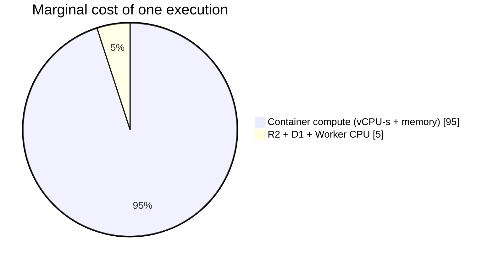
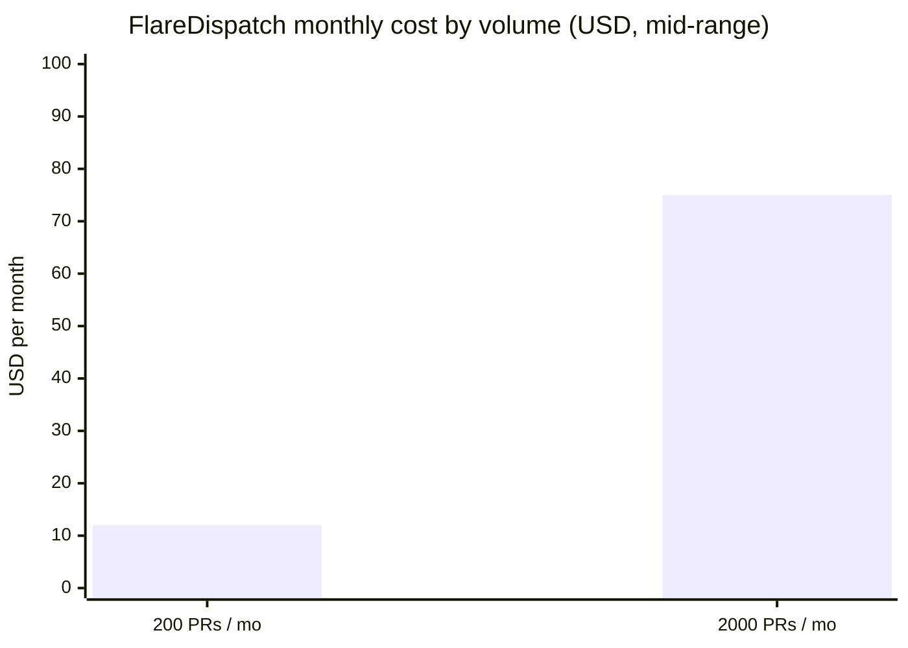
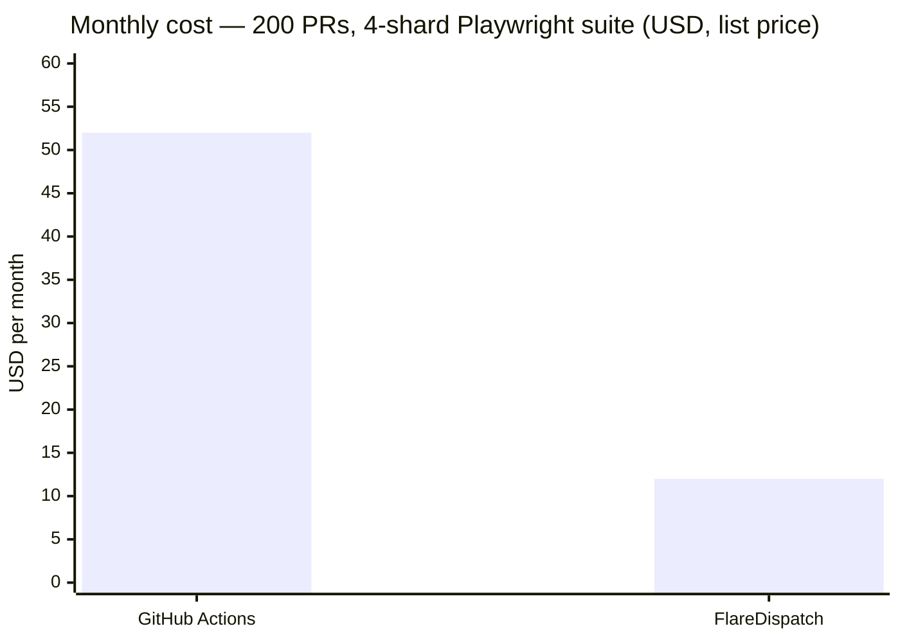

# 06 — Cost Estimation

The economic case for FlareDispatch: heavy CI compute billed at Cloudflare serverless rates (per vCPU-second, scale-to-zero) instead of GitHub Actions per-minute rates. This spec lays out the pricing model, worked estimates at two volumes, and a head-to-head with GHA list pricing.

All figures are Workers Paid, current as of 2026-05. Cloudflare pricing changes — treat these as planning estimates, re-check the linked sources before committing a budget.

## Pricing model — what you pay for

A FlareDispatch deploy is a single Worker plus its bindings. The cost components:

| Component | Included on the $5 Workers Paid plan | Overage rate |
|---|---|---|
| **Workers base** | 10M requests + 30M CPU-ms / month | $0.30 per 1M requests; $0.02 per 1M CPU-ms |
| **Containers** (Sandbox) | 375 vCPU-min + 25 GiB-h memory + 200 GB-h disk / month | $0.000020/vCPU-s; $0.0000025/GiB-s; $0.00000007/GB-s |
| **Browser Rendering** | 10 browser-hours/month; 10 concurrent browsers (monthly average) | $0.09 per browser-hour; $2.00 per extra concurrent browser |
| **R2** | 10 GB storage; Class A/B ops free tier; **zero egress** | $0.015 per GB-month beyond 10 GB |
| **D1** | 5 GB storage free tier; generous read/write free tier | within free tier for execution metadata |
| **Queues** | 1M operations/month | within free tier for fan-out backpressure |
| **Workflows** | billed as the underlying Worker requests + CPU-ms | — (no separate Workflows line item) |

The dominant variable cost is **Containers** — that's where test commands actually execute. Everything else tends to stay within the included quotas for small-to-medium volume.

*Source:* [Workers pricing](https://developers.cloudflare.com/workers/platform/pricing/), [Containers pricing](https://developers.cloudflare.com/containers/pricing/), [Browser Rendering pricing](https://developers.cloudflare.com/browser-rendering/platform/pricing/), [R2 pricing](https://developers.cloudflare.com/r2/pricing/), [D1 pricing](https://developers.cloudflare.com/d1/platform/pricing/).

## Per-execution cost anatomy

A single `offload-test`-shaped execution (clone → install → test → upload log):

- **Worker / Workflow CPU** — the step bodies are I/O-bound (spawn container, await exit, write D1). A few hundred CPU-ms per execution. Negligible against the 30M CPU-ms monthly quota.
- **Container vCPU-seconds** — the real cost. A `standard-2` instance (1 vCPU, 6 GiB) running an 8-minute test = ~480 vCPU-s ≈ **$0.0096** in vCPU, plus ~$0.0072 GiB-s memory ≈ **~$0.017 per execution** before the included quota.
- **R2** — log NDJSON is kilobytes; a Playwright report archive is single-digit MB. Storage cost rounds to zero; egress is free.
- **D1** — two row writes per step. Free tier.

Rule of thumb: **container compute ≈ (vCPU-s + GiB-s) × wall-time**, and that's ~95% of the marginal cost of a run. Browser-heavy runs (`playwright-e2e`, `cdp-acceptance`) add Browser Rendering hours on top — see the trade-off table in [02-runs § playwright-e2e](02-runs.md#3-playwright-e2e).

## Worked estimate — small team

Assumptions: 200 PRs/month, ~8 min average run wall time, 4-shard matrices, `standard-2` containers.

| Line item | Estimate |
|---|---|
| Workers Paid base | $5 (includes 10M requests + 30M CPU-ms) |
| Workers requests + CPU-ms | within included quota |
| Containers (vCPU-s + memory + disk) | $3–8 above the included 375 vCPU-min + 25 GiB-h + 200 GB-h |
| Browser Rendering | within included 10 browser-hr/month + 10 concurrent browsers |
| R2 storage (~5 GB cache + artifacts) | ~$0.08 |
| R2 ops + lifecycle expirations | within free tier |
| D1 | within free tier |
| Queues | within free tier |
| **Total** | **~$8–15 / month** |

## Worked estimate — 10× volume

Same shape, 2,000 PRs/month. Container compute scales roughly linearly; Browser Rendering starts to exceed the included 10 browser-hours; R2 storage grows but stays cheap.

| Line item | Estimate |
|---|---|
| Workers Paid base + overage | $5 + modest request/CPU overage |
| Containers | $35–70 |
| Browser Rendering | $5–15 (overage beyond 10 browser-hr) |
| R2 storage + ops | ~$1–2 |
| D1 / Queues | within free tier |
| **Total** | **~$50–100 / month** |

Cost scales sub-linearly with volume — the $5 base and the included quotas are fixed, so only the variable components grow:

## Head-to-head with GitHub Actions

GHA bills standard Linux runners at **$0.008/minute** beyond the plan's included minutes; larger runners (4–64 vCPU) cost 2–16× that. The jobs FlareDispatch targets — Playwright e2e, acceptance suites, big matrices — are precisely the long, wide ones.

Illustrative: a 4-shard Playwright suite, ~8 min wall time per shard, 200 PRs/month.

| | GitHub Actions | FlareDispatch |
|---|---|---|
| Billable unit | wall-clock minutes per shard, summed | container vCPU-seconds, scale-to-zero |
| Compute for one PR (4 shards × 8 min) | 32 runner-minutes ≈ $0.26 (standard runner) | ~4 × $0.017 ≈ $0.07 in container compute |
| 200 PRs/month | ~$52 in runner minutes | folds into the ~$8–15 total above |
| Idle cost between runs | none, but no scale-to-zero benefit either | none — scale-to-zero |
| Larger-runner premium | 2–16× for 4–64 vCPU runners | pay only for the vCPU-seconds actually used |

The gap widens as suites get longer and wider, because GHA bills wall-clock-minutes-per-shard while CF bills vCPU-seconds with scale-to-zero. For cheap fast jobs (lint, unit) the comparison inverts — GHA's included minutes make them effectively free — which is exactly why those jobs stay on GHA (see [PRD § Non-goals](PRD.md#non-goals)).

This is a list-price comparison, not a benchmark. Actual savings depend on suite shape, runner size, and how much of the GHA included-minutes allowance a team already consumes.

## Cost levers

Ways a run author or operator reduces the bill:

- **Right-size the container.** `standard-2` is the default; a lint-only run can drop to `basic` (1/4 vCPU, 1 GiB). Instance types are listed in [05-byoc § Wrangler config](05-byoc.md#wrangler-config).
- **Cache aggressively.** The `installCached` primitive ([02-runs § cache](02-runs.md#primitive-cache-pnpm--npm--cargo--uv), [03-dsl § installCached](03-dsl.md#installcached)) skips re-install on R2 cache hits — install time is often a third of a run's wall time.
- **Prefer `cf-browser-rendering` for short browser tests.** It uses the included browser-hours; `in-container` Playwright trades that for container vCPU-seconds. See [02-runs § playwright-e2e](02-runs.md#3-playwright-e2e).
- **Set R2 lifecycle retention.** Logs at 14 days, artifacts at 90, cache at 30 keeps R2 storage flat. Policy in [05-byoc § Retention and cleanup](05-byoc.md#retention-and-cleanup).
- **Gate Webhook-mode runs.** A run's `gate` ([04-gha-integration § Webhook mode](04-gha-integration.md#webhook-mode)) skips drafts, bots, and `skip-*`-labelled PRs so expensive runs don't fire on every push.
- **Declare `maxConcurrency`.** Caps simultaneous shards so a large matrix can't spike Container vCPU usage past the account aggregate (1,500 vCPU); see [01-architecture § Platform limits](01-architecture.md#platform-limits--design-constraints).

## What to watch

Cost-relevant signals from [05-byoc § What to monitor](05-byoc.md#what-to-monitor):

- Container vCPU-minutes trending toward / past the included 375/month — the first overage line to appear.
- Browser Rendering quota past 80% of the included 10 browser-hr — switch short tests away from `in-container` mode, or accept the $0.09/hr overage.
- R2 storage growth past ~50 GB — revisit lifecycle retention.
