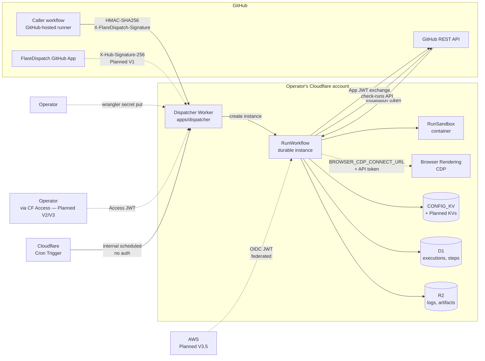
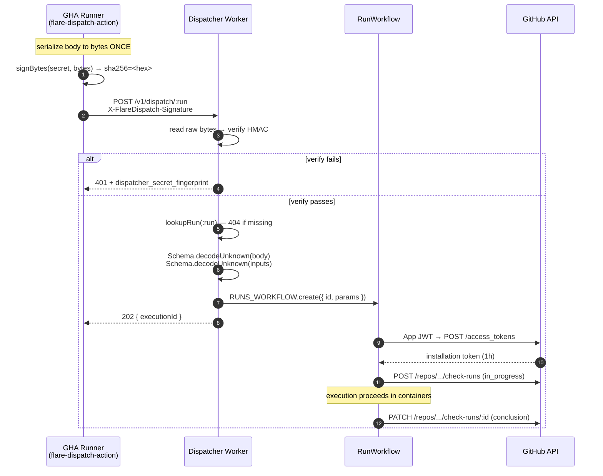

# 07 — Trust & Threat Model

The dedicated trust spec for FlareDispatch. Where [05-byoc § Security posture](05-byoc.md#security-posture) is the operator-facing summary, this doc is the **adversary-first** view: who can attack the system, what they can attempt, what stops them today, and what is currently un-defended.

The lead conclusion: the Dispatcher Worker holds the GitHub App private key and the HMAC secret, and a compromise of those two values reaches every repository the App is installed on. Almost every control below exists to keep one of those two values out of an attacker's hands, or to limit the blast radius when they leak.

## Scope and non-goals

**In scope.** Threats that can be deflected, mitigated, or detected by code shipped in this repository — the Dispatcher Worker, the GHA Action, the Effect-TS DSL, and the operator's `wrangler.jsonc` config.

**Out of scope (trust assumptions).** Each item below is a thing FlareDispatch *trusts to be sound*; if it isn't, the whole model fails.

| Trusted | What we assume | Why we don't defend against it |
|---|---|---|
| **Cloudflare's platform** | Workers, Workflows, Containers, R2, D1, KV, Browser Rendering execute as documented; container escape is Cloudflare's problem; Workers Secrets are not extractable by a Worker request handler | FlareDispatch is a CF-native BYOC product. If Cloudflare is compromised, every BYOC consumer is compromised. |
| **The operator's Cloudflare account** | The operator's CF API token, dashboard 2FA, and Workers Secrets are not leaked; the operator hasn't published their secret on a gist | A hostile or careless operator running their own fork can do anything FlareDispatch can do — this model can't help. |
| **The GitHub App's PKCS#8 private key** | The PEM piped to `wrangler secret put GITHUB_APP_PRIVATE_KEY` is held only in Workers Secrets storage and not in the operator's shell history, a `.env` file, or a CI cache | A leaked private key is a recovery scenario ([§ Compromised GitHub App installation](#compromised-github-app-installation)), not a defended-against attack. |
| **GitHub** | The GitHub API serves valid responses; webhook deliveries from `api.github.com` are not forged at the TLS layer; the App-manifest `/app-manifests/<code>/conversions` exchange is one-shot and authentic | If GitHub is compromised, all GitHub-integrated CI is compromised. |
| **The DSL author** | The `@flare-dispatch/core` package the operator pinned was published with provenance and built from the tagged source ([03-dsl § Provenance](03-dsl.md#the-surface-that-actually-matters)) | A poisoned core package can do anything the Dispatcher can do — supply-chain controls move out of scope of this doc. |

**Explicitly out of scope.** "Defense against a malicious Cloudflare operator," "defense against a malicious FlareDispatch operator," "covert channels between concurrent Workflows," and "side-channel attacks against the container runtime" are all outside the model. So is "GHA runner image is itself compromised" — that's a GitHub problem.

## System boundaries

Every arrow that crosses a tenancy boundary carries an authentication mechanism. The map below names each one explicitly; everything that follows references this picture.

Dashed arrows are **Planned**, not implemented at HEAD. Solid arrows are live.

| Arrow | Authentication | Live? |
|---|---|---|
| Caller workflow → Dispatcher | HMAC-SHA256 over raw request bytes, `X-FlareDispatch-Signature: sha256=<hex>` | Yes |
| GitHub App webhook → Dispatcher | `X-Hub-Signature-256` over raw body, verified against `GITHUB_WEBHOOK_SECRET` | Planned (V1) |
| Cron Trigger → Dispatcher `scheduled()` | None — internal-to-Cloudflare; the runtime delivers `controller.cron` + `controller.scheduledTime` | Yes |
| Operator → Dispatcher (admin) | Cloudflare Access JWT, re-verified Worker-side | Planned (V2/V3) |
| Operator → Dispatcher (secrets) | `wrangler` CLI authenticated against the operator's CF account | Yes |
| Dispatcher → GitHub API | App JWT (RS256, ≤10 min) exchanged for installation token (1h TTL) | Yes |
| Container → Browser Rendering CDP | API token query parameter on the `wss://` `/connect` endpoint (`BROWSER_CDP_*` Worker secrets) | Yes (V2 PR9) |
| Workflow → AWS | OIDC JWT federation (no static AWS keys) | Planned (V3.5) |

The dispatch request lifecycle in detail:

The 401 branch is the dominant failure mode the dispatch contract is shaped around — see [§ Compromised Action runner](#compromised-action-runner) for what an attacker who knows the HMAC secret can do, and [§ Controls in place](#controls-in-place) for the raw-bytes canonicalization that makes the contract verifiable.

## Adversary catalog

Adversaries are concrete actors, not abstract STRIDE categories. Each entry names what the adversary *has*, what they can *attempt*, and what the system does about it today.

### External unauthenticated attacker

**Has.** A public IP and the Dispatcher's URL.

**Can attempt.**

- POST `/v1/dispatch/:run` with an absent or guessed signature → expects to trigger an execution.
- GET `/v1/github/install/new` → the install-form page is publicly reachable (it has to be — operators visit it from a browser before any secret exists).
- GET `/v1/github/installed?code=<guess>` → expects to convert a stolen manifest code into App credentials.
- GET `/health` → expects to enumerate registered runs.
- GET `/v1/artifacts/:execution/:name` → expects to fetch another deploy's artifact.

**Defended by.**

- HMAC verify on `/v1/dispatch/:run` (`apps/dispatcher/src/hmac.ts`). An unsigned or wrong-signed request gets 401; the 401 body includes the dispatcher's secret fingerprint (8 hex chars of `sha256(secret)`) which is non-secret by construction — short of the full key, useless as a credential.
- The install form is the *only* unauthenticated POST surface to GitHub, and it doesn't trust user input — the manifest is constructed server-side from `MANIFEST_TEMPLATE` (`apps/dispatcher/src/routes/github.ts`), not from the request body.
- `/v1/github/installed` only accepts a `code` query param. The code is one-shot, valid for one minute, and the API call to convert it is made by the Dispatcher (no auth header — the code IS the credential). An attacker who guesses a valid `code` does see the App credentials in the success page; this is a **gap** ([§ Known gaps](#known-gaps): state-token CSRF).
- `/v1/artifacts/:execution/:name` streams the R2 object body directly. The execution id is a ULID (122 bits of entropy); guessing is not a useful attack. Multi-tenancy across deploys is not a thing — one operator, one R2 bucket. Artifact URLs are stable and immutable — cache headers are set accordingly.
- `/health` lists run names. This is intentional — the run list is not secret.

**Residual risk.** Without CSRF binding on the manifest install flow, an attacker who can lure an operator-with-an-active-GitHub-session to a controlled URL can race the install. See [§ Known gaps](#known-gaps).

### Malicious workflow author in a repo where the App is installed

**Has.** Push access to a repo whose `.github/workflows/*.yml` invokes `openhackersclub/flare-dispatch-action`. By extension: control over `INPUT_*` values passed to the Action and over the repo contents that `sandbox.git.clone` checks out.

**Can attempt.**

- Pass a hostile `INPUT_INPUTS` JSON to coerce the Dispatcher into running a run with attacker-chosen parameters.
- Set `INPUT_ENDPOINT` to a malicious URL (a controlled host, `file://`, `data:`, cloud metadata) so the runner POSTs the signed body somewhere else.
- Set `INPUT_RUN` to a path-traversal value like `../admin/cancel`.
- Push a repo whose `pnpm test` (or whatever command `offload-test` runs) executes arbitrary code in the container — exfiltrate any env vars the container has, scan the container network for the metadata service, etc.
- Pass a hostile dispatcher response that injects a second `::error::` workflow command into the runner log.

**Defended by.**

- The Action's scheme allowlist (`packages/cli/src/dispatch.ts`) rejects anything but `http:` / `https:`. `file://`, `data:`, `ftp://`, and metadata-only schemes never reach `fetch`. (Security review M1.)
- The Action `encodeURIComponent(run)`s the run-name path segment so a `../` cannot rewrite the URL. (Security review M4.)
- The Dispatcher Schema-validates `inputs` against the *named run's* `inputs` Schema (`apps/dispatcher/src/routes/dispatch.ts`); a hostile JSON shape gets 400 with the parse error inlined.
- `safeForCmd` (`escapeCmd` ∘ `truncateForLog`) percent-encodes `%`/`\r`/`\n` and caps any user-controlled string at 500 chars before it lands in an `::error::` annotation. (Security review H2/L1/L2.)
- The container itself runs *whatever the run author put in their repo*. This is the same trust model GHA has: code on `HEAD` runs on a pushable branch. The container is short-lived and isolated, and **carries no FlareDispatch secrets** by default — `HMAC_SECRET`, `GITHUB_APP_PRIVATE_KEY`, `BROWSER_CDP_API_TOKEN`, `GITHUB_WEBHOOK_SECRET` are Worker Secrets bound to the Dispatcher, not to `RUNS_SANDBOX`.

**Residual risk.** A run that explicitly uses `loadSecrets` to inject `CONFIG_KV` values into a container command is, by design, giving the container those secrets. That is the operator's decision; the seam exists so secrets move out of GHA repo secrets into the Dispatcher-controlled `CONFIG_KV`. A malicious workflow author cannot pull anything out of `CONFIG_KV` they aren't already authorized for, but a run author who indiscriminately loads every secret into every run is creating exposure.

### Compromised Action runner (leaked HMAC secret)

**Has.** A copy of `HMAC_SECRET` — extracted from a leaked CI log, a phished operator, a compromised GHA runner image, a publicly-pushed `.env`.

**Can attempt.** Forge `/v1/dispatch/:run` calls indefinitely. Every signed request the Dispatcher receives is, by HMAC contract, authentic from a holder of the secret.

**Blast radius.**

- Trigger any registered run against any repo, with any inputs that pass that run's Schema.
- Burn the operator's CF Container vCPU-minutes quota.
- Cause check-runs to be posted on commits in any repo the App is installed on (the run carries `github.repo` + `github.sha`; the Dispatcher trusts the signed body).
- *Cannot* read existing artifacts (artifact URLs are signed-and-short-lived; the execution-id is a ULID an attacker doesn't know).
- *Cannot* read the App private key, the `CONFIG_KV` secret store, or any other Worker Secret.
- *Cannot* alter the deployed code — that takes a CF API token, not the HMAC secret.

**Recovery.** Rotate via `wrangler secret put HMAC_SECRET` (operator). The 401 fingerprint in `packages/cli/src/dispatch.ts` reports `localFingerprint` vs `dispatcherFingerprint` precisely so an operator post-rotation can confirm the GHA side is also updated.

**Defended by.** The fact that the secret only authenticates the *dispatch* surface — not any read surface, not any admin surface. The blast radius is "burn the operator's bill and spam check-runs"; it is not "read the operator's private repos."

### Hostile webhook source (forged GitHub webhook)

**Has.** The Dispatcher's URL and the knowledge that `/v1/webhooks/github` will exist.

**Can attempt.** POST a crafted webhook payload to `/v1/webhooks/github` claiming a `pull_request.opened` event, hoping the Dispatcher fires a run with attacker-chosen `payload` values.

**Defended by.**

- The receiver is live at `apps/dispatcher/src/routes/webhook.ts`. `X-Hub-Signature-256` HMAC over `GITHUB_WEBHOOK_SECRET` is the gate, verified with the same `crypto.subtle.verify` primitive as the dispatch HMAC; no shared secret with `HMAC_SECRET`. A deploy without `GITHUB_WEBHOOK_SECRET` returns 503 on the route rather than silently accepting unsigned deliveries.

**Residual risk.** A leaked webhook secret lets an attacker fire Webhook-mode runs at will but does not let them read repos. Same comments as [§ Compromised Action runner](#compromised-action-runner) with `GITHUB_WEBHOOK_SECRET` substituted for `HMAC_SECRET`.

### Compromised GitHub App installation (leaked App private key)

**Has.** The PKCS#8 PEM the operator piped to `wrangler secret put GITHUB_APP_PRIVATE_KEY`.

**Can attempt.** Sign App JWTs and exchange them for installation tokens, scoped to whatever permissions the App was installed with. Per `infra/github-app-manifest.json`:

- `checks: write` — post check-runs on any commit, on any repo where the App is installed.
- `contents: read` — read repo contents on any installed repo.
- `deployments: read` — read deployment statuses.
- `metadata: read` — read repo metadata (visibility, default branch).
- `pull_requests: read` — read PR titles, bodies, reviewers.

That is *every repository the App is installed on*. This is the worst-case compromise in the model.

**Blast radius.** Read access to the contents and PRs of every repo where the operator installed the App. Write access to check-runs, which permits posting forged "this commit failed verification" or "this PR is approved by [look-alike App]" indicators.

**Recovery.**

1. Operator goes to `https://github.com/settings/apps/<slug>` and regenerates the private key. Old key is invalidated server-side.
2. Operator runs `wrangler secret put GITHUB_APP_PRIVATE_KEY < new-key.pem`.
3. In-flight executions whose Worker memory still holds the old installation token will fail their next check-run write; new executions mint fresh tokens against the new key. No code change required.

**Defended by.**

- Installation tokens are short-lived (1h TTL; refresh on demand). A leaked installation token expires; only the private key persists.
- The App is installed with a minimal-by-design permission set; `default_permissions` in the manifest is *read* for everything except `checks: write`. The App **cannot push code**, **cannot modify PRs**, and **cannot touch issues**.
- Worker Secrets are not extractable by a Worker request handler.

**Residual risk.** A leaked private key remains valid until the operator notices and regenerates. There is no automated leak detector today — operators should treat `GITHUB_APP_PRIVATE_KEY` with the same care as a Cloudflare API token.

### Container escape

**Has.** Code execution inside a `RunSandbox` container.

**Can attempt.** Escape to the host, read other containers' filesystems, exfiltrate Worker Secrets through the host kernel.

**Defended by.** Cloudflare's container runtime. This is a [§ trust assumption](#scope-and-non-goals): if Cloudflare's container isolation fails, every BYOC consumer is compromised, and there is nothing FlareDispatch-specific the operator can do.

**Residual risk.** `RUNS_SANDBOX` containers do not have Worker Secrets in their env by default — only what `loadSecrets` explicitly injects (`CONFIG_KV` values, not raw `HMAC_SECRET` / `GITHUB_APP_PRIVATE_KEY`). So even a hypothetical container escape would not directly yield the Dispatcher's crown jewels; the secrets live in the Worker's Workers-Secrets binding, not on the container host.

### Network attacker (MITM)

**Has.** Position on the path between a runner and the Dispatcher.

**Can attempt.** Read or rewrite signed dispatch requests.

**Defended by.**

- TLS on `*.workers.dev` (automatic) and any custom domain (operator-configured).
- The HMAC contract is over the **request body** only — not the URL or headers. A MITM rewriting the URL to point at a different Dispatcher would also need to re-MAC the body with that other Dispatcher's `HMAC_SECRET`, which they don't have.
- The Action's `endpoint` input accepts both `http:` and `https:` (`packages/cli/src/dispatch.ts`) — `http:` is permitted for `wrangler dev` smokes. A production deploy using an `http://` endpoint is sending the HMAC secret through nothing protecting it from observation; this is an operator-hygiene matter rather than an enforced policy.

**Residual risk.** An `http://` endpoint in a CI workflow file is an operator misconfiguration that the Action does not refuse. A configuration linter / `init` CLI (Planned, V4) is the planned spot to warn here.

## Controls in place

Each control below is implemented at HEAD and pointed at the file that does the work.

### HMAC verification — raw bytes, constant time

**File.** `apps/dispatcher/src/hmac.ts`.

**Contract.** The signature is computed over the **raw request body bytes exactly as received** — no JSON parse/re-serialize, no key reordering, no whitespace normalization. The dispatch route reads the body once via `request.arrayBuffer()`, verifies, and only then parses (`apps/dispatcher/src/routes/dispatch.ts`). The caller (`packages/cli/src/dispatch.ts`) signs the same bytes it POSTs. The signer-and-verifier-on-the-same-octets contract means no canonicalization scheme is required.

**Primitive.** `crypto.subtle.verify("HMAC", key, sig, data)` — constant-time, the only supported primitive on Workers (Node's `crypto.timingSafeEqual` is not available in the Workers runtime).

**Failure surface.** A malformed `X-FlareDispatch-Signature` header (missing prefix, wrong length, non-hex) fails verify without reaching the constant-time path. A 401 carries `dispatcher_secret_fingerprint = sha256(HMAC_SECRET)[:8]` so an operator can match it against the caller-side `localFingerprint` printed by the Action (issue #24, PR #26).

**Spec.** [04-gha-integration § Dispatch body](04-gha-integration.md#dispatch-body), [05-byoc § Security posture](05-byoc.md#security-posture), [pm/plan § PR5 HMAC verification](pm/plan.md#6-risks--open-questions).

### HTTP scheme allowlist on the dispatch caller

**File.** `packages/cli/src/dispatch.ts` (the `endpoint` validation block).

**Contract.** Before any network call, the Action parses the `endpoint` input with `new URL(...)` and rejects anything whose protocol is not `http:` or `https:`. This blocks `file://`, `data:`, `ftp://`, and cloud-metadata-only schemes from pivoting a signed request to a non-HTTP target.

**Spec.** Security review M1 (PR #27 follow-up).

### `::error::` workflow-command escape

**File.** `packages/cli/src/dispatch.ts` — `escapeCmd`, `truncateForLog`, `safeForCmd`.

**Contract.** Every user/dispatcher-controlled string the Action inlines into a workflow-command line is percent-encoded for `%`, `\r`, `\n` and truncated to 500 chars. Without `safeForCmd`, a Dispatcher response body containing `\n::set-output ...` would inject a second workflow command into the runner.

**Spec.** Security review H2/L1/L2.

### Install-flow HTML escaping

**File.** `apps/dispatcher/src/routes/github.ts` — `htmlEscape`.

**Contract.** Every interpolated string in the manifest-form page and the credentials-shown-once success page goes through `htmlEscape` — text-node escaping for `<>`, attribute-boundary escaping for `"`/`'`. Even values FlareDispatch itself controls (the App id) are escaped, on the rule "escape all substitutions, no exceptions." This holds even when GitHub returns a hostile/buggy response payload.

**Spec.** `apps/dispatcher/src/routes/github.ts` § "XSS posture".

### Path-segment encoding on the dispatch URL

**File.** `packages/cli/src/dispatch.ts`.

**Contract.** The run-name segment is `encodeURIComponent(run)`'d before insertion into the dispatch URL. Because the HMAC is over the body and not the URL, an attacker who could rewrite the URL path could otherwise pivot a signed request to a different endpoint. (Security review M4.)

### GitHub App JWT + installation token

**Files.** `packages/github-app/src/jwt.ts`, `packages/github-app/src/installation-token.ts`, `packages/github-app/src/check-runs.ts`.

**Contract.** App JWTs are RS256-signed with the PKCS#8 PEM from `GITHUB_APP_PRIVATE_KEY`, lifetime ≤10 min (the App-side maximum). The JWT is exchanged for an installation token (1h TTL) scoped to one installation. At V0 the token is cached in **Worker memory only**; KV-backed `INSTALL_TOKEN_KV` (55min TTL across Worker recycles) is Planned (V1). No long-lived PATs anywhere.

**Spec.** [04-gha-integration § Check-runs callback](04-gha-integration.md#check-runs-callback-shared-by-all-modes).

### Dispatch body Schema validation

**File.** `apps/dispatcher/src/routes/dispatch.ts` — `DispatchBody` + `Schema.decodeUnknownEither`.

**Contract.** The dispatch envelope is Schema-decoded; then `inputs` is decoded against the *named run's* `inputs` Schema. A shape mismatch returns 400 with the parse error inlined. There is no `Schema.Unknown` path that reaches the Workflow — the run sees only typed input.

### Worker Secrets posture

**Where.** Worker Secrets via `wrangler secret put`. Never committed, never in `wrangler.jsonc`, never echoed back by the App-install success page (the success page only displays the credentials *GitHub* just returned — those have to be stored by the operator manually).

**Audit hook.** A non-secret 8-hex-char fingerprint of `HMAC_SECRET` is surfaced in 401 responses; the same fingerprint is computed by the Action and printed on permanent-failure. The two sides can be diffed without revealing the secret (issue #24).

## Known gaps

These are explicitly **un-defended today**. Each has a severity, a description, and a tracking pointer.

### CSRF state-token unbound on the manifest install flow — high

**Description.** `apps/dispatcher/src/routes/github.ts` generates a `state` token at `/v1/github/install/new` (a `crypto.randomUUID()`) and includes it in the form POST to `https://github.com/settings/apps/new?state=<csrf>`. GitHub echoes that state back to `/v1/github/installed?code=<code>&state=<state>`. The Dispatcher reads `state` from the query but **does not validate it** — the variable is destructured and dropped (`const _state = url.searchParams.get("state")`).

**Consequence.** An attacker who can lure an operator-with-an-active-GitHub-session to a controlled URL can race the App-install flow. The current install handler renders the App credentials in a one-shot success page to whoever holds a valid `code` — so an attacker who completes the install on the operator's behalf does see the App credentials in the rendered HTML.

**Tracking.** Acknowledged inline in `apps/dispatcher/src/routes/github.ts` (file header, "CSRF state-token *binding*"). The follow-up PR will bind state to `IDEMPOTENCY_KV` and reject callbacks whose state we never minted.

**Workaround until fixed.** Operators should not click links to `/v1/github/installed?code=...` they did not initiate themselves; the install flow should be completed in one continuous browser session from `install/new`.

### Webhook receiver — live ✅

**Status.** The receiver is implemented at `apps/dispatcher/src/routes/webhook.ts`. `POST /v1/webhooks/github` verifies `X-Hub-Signature-256` against `GITHUB_WEBHOOK_SECRET`, evaluates every registered run's `triggers[]` against the inbound event, filters by `actions[]` and `gate()`, dedups via `IDEMPOTENCY_KV`, and fans out Workflow instances. The `check_run.rerequested` re-run path is wired through the same route.

**Residual.** The installation-id map auto-populated from webhook deliveries (`installation.id` on every payload) replaces the manual `installation-id` Action input. Operators no longer need to pass `installation-id` explicitly for Webhook-mode runs.

### Installation-ID map not populated — medium

**Description.** Spec language in [05-byoc § GitHub App setup](05-byoc.md#github-app-setup) says "each installation's `installation_id` is auto-discovered from webhooks; you don't have to record it manually." That auto-discovery rides on the [§ Webhook receiver](#webhook-receiver-not-implemented---high-deferred) above and so doesn't exist yet. Today the GHA Action accepts an explicit `installation-id` input (defaults to `0`); a run dispatched with `installation_id: 0` has no way to mint an installation token and the check-run callback fails silently (logged at `info`).

**Consequence.** Operators must pass `installation-id` explicitly through the GHA Action `with:` block until V1.

**Tracking.** Planned (V1), tied to the webhook receiver.

### Per-installation tenancy isolation — medium

**Description.** One Dispatcher deploy can host many installations of the same App. Today there is no enforcement that an Action-mode dispatch claiming `github.repo: "alice/repo"` and `installation_id: 12345` actually corresponds to a real install of the App on `alice/repo`. The HMAC contract authenticates the **caller** (someone who knows `HMAC_SECRET`); it does not bind a caller to a repo.

**Consequence.** A holder of `HMAC_SECRET` can dispatch runs *against any repo on which the App is installed*, even if that holder normally only owns a different repo. The shared HMAC secret is intentionally a coarse credential.

**Defended by, partially.** The App installation permission scope itself — runs can only check-out repos visible to the installation. A repo the App isn't installed on returns "not found" at `sandbox.git.clone` time.

**Tracking.** Multi-tenant scoping is a Planned (V3) concern; until then the trust boundary is "anyone with the HMAC secret can dispatch on behalf of any installation that secret is paired with."

### Idempotency-key replay attack surface — low

**Description.** The Dispatch body's `Idempotency-Key` (or, for App webhooks once V1 lands, `X-GitHub-Delivery`) is used for two-layer dedup. A replay attacker who captures a signed dispatch body can re-POST it; the **receiver-level** dedup (Planned V1) would absorb the replay, but the **Workflow-level** dedup (the semantic `instanceId`, live today) already collapses two identical dispatches onto one execution — so a replay is a no-op against the *intended* logical work.

**Consequence.** A replay attacker can confirm that a dispatch happened (by getting `202` back) but cannot cause double-execution of the intended work. They can, however, dispatch *new* `github.sha` values inside the same secret-and-installation if they can mutate the body and re-sign it — but they need the HMAC secret to re-sign, which makes this equivalent to the [§ Compromised Action runner](#compromised-action-runner) scenario.

**Tracking.** Acceptable as designed. Receiver-level KV dedup (V1) closes the residual "spam the Dispatcher with replays" denial-of-service vector.

### Rate limiting / DoS posture — medium

**Description.** The Dispatcher Worker has no rate-limiting middleware. An attacker with a valid `HMAC_SECRET` can dispatch as fast as Workers will accept requests; an attacker without it can spam unsigned requests and burn 401-handling CPU.

**Consequence.** Burn CF Workers request quota and (with the secret) Container vCPU-minutes. Does not exfiltrate data.

**Defended by, partially.** Workers' platform-level abuse handling and the operator's per-account quotas. Cloudflare's default protections do most of the heavy lifting here.

**Tracking.** Planned, no firm version — likely V4 alongside the OTel + Logpush observability work, when the per-installation request counters needed for sane rate-limit thresholds become available.

### Secret rotation playbook not documented — low

**Description.** [05-byoc § Security posture](05-byoc.md#security-posture) lists the secrets but does not yet have a step-by-step "you suspect a leak — do this" playbook. Today the procedure is "regenerate from the App page, `wrangler secret put` the new value, in-flight executions either complete on the old in-memory token or fail their check-run write and the run output is still recorded in D1."

**Tracking.** Planned, V4 polish. Once the V4 `flare-dispatch` CLI lands an `init` subcommand, a `rotate` subcommand is a natural pairing.

### `BROWSER_CDP_API_TOKEN` is a long-lived static credential — medium

**Description.** The `cdp-acceptance` run (V2 PR9) authenticates to Browser Rendering's `/connect` WebSocket endpoint with a Cloudflare API token carried as a query parameter (`BROWSER_CDP_API_TOKEN`). API tokens have no built-in TTL — they're static until the operator revokes them. The container, not the Worker, opens the WebSocket, so this token is exposed to the container process.

**Consequence.** A leaked `BROWSER_CDP_API_TOKEN` lets the leaker open Browser Rendering sessions against the operator's account until rotation.

**Defended by.** API tokens are scope-limited (the operator should provision a Browser-Rendering-only token, not an account-wide token). Token rotation is `wrangler secret put`.

**Tracking.** Acknowledged in `apps/dispatcher/src/env.ts` (the `BROWSER_CDP_API_TOKEN` field docstring). A future Browser Rendering binding (Planned, V2 — `RUNS_BROWSER`) would eliminate the static token in favor of a binding-mediated session, see [05-byoc § Wrangler config — Planned wrangler entries](05-byoc.md#planned-wrangler-entries-v1).

## Operator responsibilities

Out-of-band trust assumptions that operators carry — failing any of these breaks the model.

### Protect the Cloudflare API token

The operator's Cloudflare API token (used by `wrangler`) is more powerful than any FlareDispatch secret. With it, an attacker can redeploy the Worker, read every Workers Secret, drop the R2 bucket, and exfiltrate `CONFIG_KV` contents. Treat it as the root credential.

### Rotate the HMAC secret on suspected leak

`HMAC_SECRET` rotation is `wrangler secret put HMAC_SECRET` (Worker side) and updating the GHA repo/org secret (caller side). The 401 fingerprint in `packages/cli/src/dispatch.ts` is the diagnostic — `localFingerprint` and `dispatcherFingerprint` should match after rotation. Don't reuse the old value.

### Restrict who can invoke `flare-dispatch-action`

A repository where the App is installed and `flare-dispatch-action` is in any workflow file effectively grants "dispatch a FlareDispatch run" to anyone who can push to that branch (because they can edit `.github/workflows/*.yml`). To enforce who can trigger:

- Add `CODEOWNERS` rules for `.github/workflows/` so workflow edits require review.
- Use branch protection — required reviews + status checks — on the branch where the workflows live.
- Or pin the Action invocation under a `workflow_dispatch` trigger so only repo-write-permission accounts can fire it, not every PR author.

### Pin `@flare-dispatch/core` exactly

`@flare-dispatch/core` is the trusted base. Pin an exact version (no caret), commit the lockfile, install with `--frozen-lockfile`. A poisoned core update can do anything the Dispatcher can do (see [03-dsl § The surface that actually matters](03-dsl.md#the-surface-that-actually-matters)).

### Audit `CONFIG_KV` writers

`CONFIG_KV` is the secret store the `loadSecrets` primitive resolves. Only the operator's CF API-token-holder can write to it (`wrangler kv key put CONFIG_KV ...`); a compromised CF account is required to poison it. But: if a run author calls `loadSecrets` with a broad key list, the corresponding env vars land in any container that calls `sandbox.exec`. Treat the choice of which secrets to inject into which run as part of the threat model.

## Cross-references

- [04-gha-integration § Dispatch body](04-gha-integration.md#dispatch-body) — the HMAC body contract.
- [04-gha-integration § Receiver dedup](04-gha-integration.md#receiver-dedup-shared-by-all-modes) — two-layer idempotency.
- [05-byoc § Secrets](05-byoc.md#secrets) — operator secret table.
- [05-byoc § Security posture](05-byoc.md#security-posture) — the operator-facing summary this doc expands.
- `apps/dispatcher/src/hmac.ts` — the raw-bytes HMAC verifier.
- `apps/dispatcher/src/routes/github.ts` — install-flow XSS/CSRF posture (the file header is the canonical reference for the CSRF gap above).
- `packages/cli/src/dispatch.ts` — `safeForCmd`, scheme allowlist, 401 fingerprint diagnostic.
- `packages/github-app/` — App JWT signing, install-token cache.
- PR #26 — the 401 secret-fingerprint diagnostic.
- PR #27 — Action HMAC parity + scheme allowlist + `safeForCmd`.
- PR #28 — GitHub App manifest-creation flow (the routes that hold the still-open CSRF gap).
