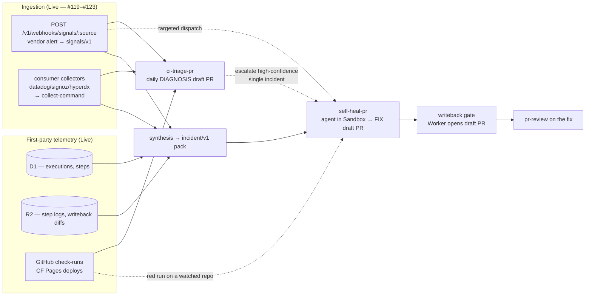
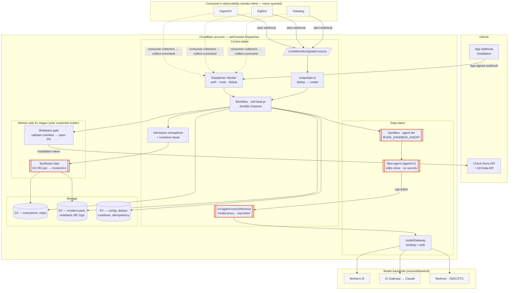
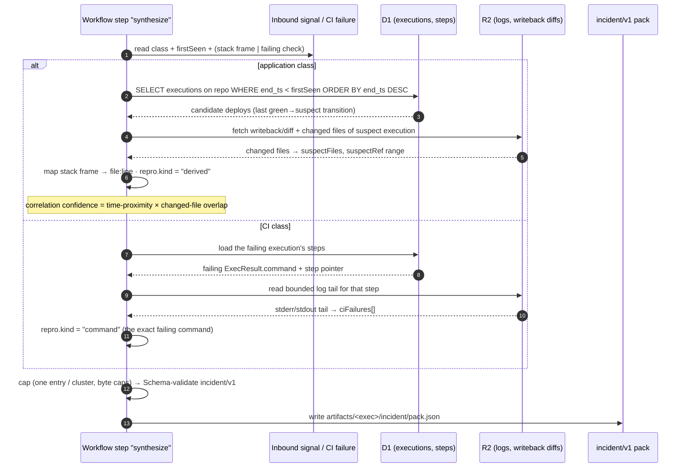
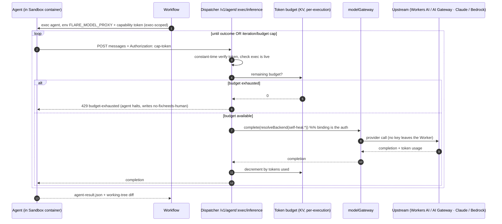
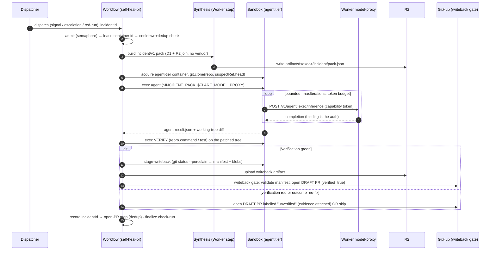
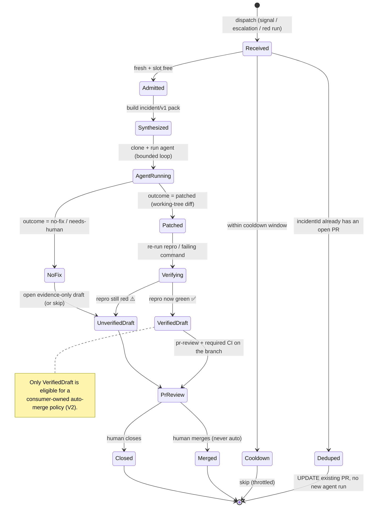
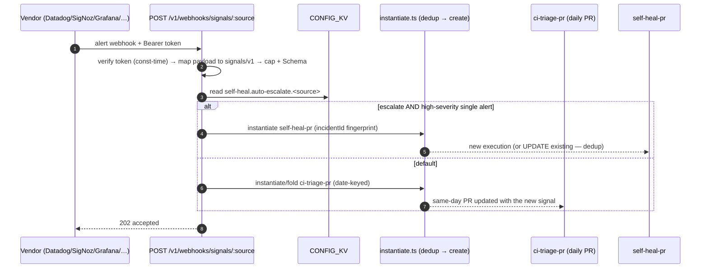

# 08 — Self-Healing PRs

> **Status: Design (V0 not built).** This spec defines the design. It composes
> mechanisms that are already Live — `signals/v1` ([02-runs § Signals](02-runs.md#signals)),
> post-run writeback ([01-architecture § Post-run writeback](01-architecture.md#post-run-writeback)),
> the Sandbox ([01-architecture § Sandbox / Container](01-architecture.md#sandbox--container)),
> and the `modelGateway` engine ([the review-agent `completeStructured` engine](02-runs.md)).
> The open PR stack #119 / #121 / #122 / #123 lands the ingestion half; this
> spec is the *fix* half. Nothing here requires a new vendor integration.

A **self-healing PR** is a draft pull request that proposes an actual fix for a
failure — opened automatically, by a coding agent that ran in a Sandbox
container, gated on the failure becoming green again. It is the next stage after
[`ci-triage-pr`](02-runs.md#signals), which diagnoses but deliberately
[*does not fix*](../runs/ci-triage-pr.ts). Where triage produces a daily
human-read write-up, self-heal produces a reviewable diff for one incident.

It covers **two error classes** through one pipeline:

- **CI errors** — a flare-dispatch run (or the consumer's own GitHub Actions /
  Cloudflare Pages build) went red. flare-dispatch already *sees* these: it **is**
  the CI. The failing command, the stderr tail, the diff under test, and the
  step span are first-party data already in D1 + R2.
- **Application / runtime errors** — an exception, a firing alert, a failed health
  probe in the *running product*. flare-dispatch does **not** see these; they
  arrive as caller-collected `signals/v1` (push webhook or pull collectors from
  Datadog / SigNoz / HyperDX), exactly the contract #119–#123 establish.

---

## 1. Principles & non-goals

These are load-bearing. The design is mostly a consequence of them.

1. **Don't *duplicate* the observability stack — but do own your own outcomes.**
   flare-dispatch never becomes a second copy of the running product's raw
   telemetry (errors/traces/logs): that copy is stale the moment it's written,
   drifts from the vendor that *is* the source of truth, and saddles a stateless
   router with the consumer's production PII + retention liability. The cost of a
   telemetry store was never the bytes — it is data gravity, drift, and staleness
   ([§ 3.1](#31-why-not-just-store-everything)). So: full context reaches the agent
   by a *fresh on-demand pull from the vendor* ([§ 6.4](#64-on-demand-context-pull--full-context-without-a-store)),
   not from a local copy; a *thin ephemeral per-incident cache* holds the assembled
   pack for the run's lifetime; and the **one** durable store flare-dispatch keeps
   is its **own** incident→fix→outcome history ([§ 9.1](#91-incident-memory--the-one-store-worth-keeping)) —
   low-liability operational data, the same class as the executions table, and the
   substrate for learning across incidents. It still *emits* its own OTel
   ([01-architecture § Observability](01-architecture.md#observability)).
2. **Vendor-blind *dispatcher* — vendor-aware at the edge.** The Dispatcher never
   queries a vendor and holds none of their credentials (same posture as
   #121/#123); this keeps its secret set tiny and its surface auditable. But
   vendor-blindness is a property of the *dispatcher*, not the *system*: the
   credentialed, vendor-aware work lives at the edge — consumer-side collectors,
   the in-sandbox context-pull adapter, and an opaque vendor-native `dedupKey`
   passed *through* the waist so the dispatcher dedups on the vendor's own grouping
   without understanding it ([§ 9.2](#92-incident-fingerprint--vendor-native-dedup)).
   Accepted cost: onboarding a vendor is consumer work, and loop-closing writeback
   *to* the vendor (ack/resolve/link) is a consumer-side adapter, out of dispatcher
   scope ([§ 12](#12-relationship-to-the-open-pr-stack)).
3. **Credential-free agent.** The coding agent is untrusted code, like any run.
   It never holds the GitHub App key, the HMAC secret, or a long-lived model key
   ([07-trust-model § container escape](07-trust-model.md)). It receives a context
   pack (data, not secrets), edits a clone, and emits a diff. The **Worker** —
   sole credential holder — opens the PR via the existing writeback gate.
4. **Never auto-merge. Draft only.** A self-heal PR is opened as a draft, gated on
   the same check-runs as any human PR, and is itself eligible for `pr-review`.
   The loop never merges; a human (or an explicit, separately-gated auto-merge
   policy the consumer owns) does.
5. **A fix is only credible if it makes the red green.** The agent's diff is
   *verified in the sandbox* — re-run the failing CI command, or the repro derived
   from the signal — before the PR is opened. Verification outcome travels with the
   PR as evidence. An unverifiable fix is still openable, but labelled and never
   auto-mergeable. This is the adversarial-verify discipline applied to fixes.
6. **Bounded cost.** Agent loops cost tokens and wall-clock and can spin. Every
   self-heal is admission-gated, iteration-capped, token-budgeted, fingerprint-
   deduped, and cooldown-throttled. See [§ 9](#9-cost--safety-governance).

**Non-goals (V0–V2):** continuous auto-merge; flare-dispatch as a durable store of
the *product's* raw telemetry (a shadow Sentry/Datadog); querying vendor APIs from
the **Dispatcher** (the agent pulling vendor data at the edge with the consumer's
own credentials is in scope — [§ 6.4](#64-on-demand-context-pull--full-context-without-a-store));
fixing across repos in one PR; fixing infra/IaC outside the repo; "agent has
production access."

---

## 2. Where it sits: triage → heal



`ci-triage-pr` stays the cheap daily digest. `self-heal-pr` is the targeted,
gated, expensive escalation for **one** incident. They share the `signals/v1`
input and the `completeStructured` engine; they differ in output (write-up vs.
diff) and cost profile. Triage may *escalate* a high-confidence, single-cluster
incident into a self-heal dispatch (opt-in, [§ 11](#11-the-self-heal-pr-run)).

### Component placement

The same tier map as [01-architecture § Components](01-architecture.md#components).
Self-heal adds **four** components (bold-bordered below); everything else is Live
and reused unchanged.



**Reading the credential boundary:** the agent (`AG`) holds no secrets — it
reaches a model only through `MPROXY` with an execution-scoped token, and its diff
becomes a PR only through `WBG`, which alone holds the GitHub App credential.
Nothing crosses from the data plane to GitHub directly.

---

## 3. Three-layer telemetry model

The whole "don't replace your stack" promise is this separation. flare-dispatch
touches telemetry in exactly three bounded ways:

| Layer | Direction | What | Mechanism | Stores? |
|---|---|---|---|---|
| **Emit** | out | flare-dispatch's own execution: each step is an OTel span, the execution is the root span | Logpush / Workers Analytics Engine / user's OTel collector | No — exported to the user's collector |
| **Ingest** | in | bounded *findings* the consumer collected from their stack | `signals/v1` push webhook + pull collectors (#121/#122/#123) | Transiently, in the dispatch body (50 × ~2 KB cap) |
| **Synthesize** | internal | join ingested findings with first-party CI history at fix time | [§ 5](#5-synthesis-the-incidentv1-context-pack), produces a capped `incident/v1` pack | No — the pack is per-execution, ephemeral in R2 |

There is no fourth layer. flare-dispatch never polls Datadog, never holds a
SigNoz API key, never ingests a raw trace stream. The synthesis step reads the
consumer's *already-narrowed* signals and flare-dispatch's *own* D1/R2 — both
already in hand — and never reaches back into the vendor.

### 3.1 Why not just store everything?

The obvious objection: *a coding agent fixes better with full context — so add a
cheap context store and give it everything.* The answer is to separate two stores
that "context store" conflates, because storage bytes were never the cost:

| | Store the **product's raw telemetry** (errors/traces/logs) | Store flare-dispatch's **own incident→fix→outcome** |
|---|---|---|
| Whose data | the consumer's production / users — **PII** | flare-dispatch's operational record |
| Real cost | data gravity, retention/residency liability, a breach target holding production data | low — same class as the executions table |
| Freshness | **stale at ingest**; the agent wants *current* state, so you'd re-poll the vendor → violates [principle 2](#1-principles--non-goals) | n/a — it's historical by nature |
| Vs. the vendor | a worse, drifting **second source of truth** | the vendor never had it |
| Verdict | **don't** — [§ 6.4](#64-on-demand-context-pull--full-context-without-a-store) pulls it fresh instead | **do** — [§ 9.1](#91-incident-memory--the-one-store-worth-keeping) |

So the real choice is not *snapshot vs. full context* — it is *where full context
lives and who fetches it fresh*. Full context read **fresh from the vendor on
demand** dominates a **stale local copy** on every axis but offline availability,
without the liability. The only durable telemetry flare-dispatch keeps is its own
outcomes. (One honest exception: a consumer running **no APM** has no vendor to
pull from — for them, opt-in retention of ingested `signals/v1` as their error
history is offered, with retention controls; off by default.)

---

## 4. The two error classes, sourced

| | **CI error** | **Application / runtime error** |
|---|---|---|
| Example | `pnpm test` red; CF Pages deploy failed; a flare-dispatch run step exited non-zero | `TypeError` in a Workers fetch handler ×12/24h; a firing Datadog monitor; a failed `/health` probe |
| Visible to flare-dispatch? | **Yes — first-party.** check-run, step `ExecResult.exitCode`, R2 step log, the diff under test | **No.** Only via `signals/v1` |
| Source | D1 executions + R2 step logs + `github.actionRuns` / `cloudflare.deployments` read capabilities | `signals/v1`: `POST /v1/webhooks/signals/:source` (push) or `collect-command` (pull) |
| Repro available? | **Strong** — re-run the exact failing command in the sandbox | **Weak** — derive from stack frame → `file:line`; may need a written repro test |
| Suspect locus | the SHA range under test; the changed files | the deploy that introduced it (correlate signal time → executions), the stack frame's file |

The two converge at the **synthesis** step into one `incident/v1` pack, so the
agent loop downstream is identical. The difference is entirely in *where the
context comes from* and *how strong the repro is* — both recorded in the pack so
the agent and the confidence gate can reason about them.

---

## 5. Synthesis: the `incident/v1` context pack

`signals/v1` is the narrow waist for **ingestion**. The pack is the narrow waist
for the **fix** — the single, capped, model-ready bundle the agent receives. It
is the synthesis output and the audited boundary: the agent sees exactly this and
nothing else.

```jsonc
// incident/v1 — the bounded context an agent receives. New contract package:
// @flare-dispatch/core/incident (sibling of signals.ts), JSON Schema mirrored
// like schemas/signals.v1.schema.json. Caps bound it well under the Workflow
// param/step-result ceilings (1 MiB).
{
  "contractVersion": "v1",
  "incidentId": "sha256(fingerprint)",   // dedup key — see § 9
  "class": "ci" | "application",
  "repo": "owner/name",
  "suspectRef": { "base": "<sha>", "head": "<sha>" },  // range to inspect
  "diagnosis": {                          // reuse ci-triage's TriageReport item shape
    "title": "…", "area": "…", "diagnosis": "…", "suggestedFix": "…"
  },
  "signals": [ /* signals/v1 — the external findings, verbatim, capped */ ],
  "ciFailures": [                         // first-party — capped
    { "kind": "actions"|"pages"|"run-step",
      "name": "…", "conclusion": "failure",
      "command": "pnpm test",            // the exact failing command (CI class)
      "logTail": "…",                    // bounded stderr/stdout tail from R2
      "url": "…" }
  ],
  "suspectFiles": [ "src/handler.ts" ],   // from changed-files (CI) or stack frame (app)
  "repro": {                              // how the agent/verifier reproduces it
    "kind": "command" | "derived" | "none",
    "command": "pnpm test -- handler.test.ts",  // when kind=command
    "note": "stack frame src/handler.ts:42; write a failing test first"  // when derived
  }
}
```

### How synthesis builds it — no new vendor read

1. **First-party correlation (the new, non-obvious value).** Given a signal with
   a timestamp, join it against D1 **executions** to find the deploy/run that most
   plausibly introduced it (the last green→suspect transition before the signal's
   first occurrence), and pull that execution's **writeback/diff** and changed
   files from R2. A bare "TypeError ×12" becomes "TypeError ×12, first seen 20 min
   after execution `X` shipped a change to `src/handler.ts`." This correlation uses
   data flare-dispatch **already owns** — it adds no vendor capability and no new
   secret.
2. **Repro derivation.** CI class → the failing `ExecResult.command` *is* the
   repro. Application class → map the stack frame to `file:line` and mark
   `repro.kind = "derived"` so the agent knows to write a failing test first.
3. **Capping.** Same discipline as `signals/v1`: one entry per cluster, bounded
   tails, hard item/byte caps, validated by Schema at the boundary. The pack is
   written to `artifacts/<exec>/incident/pack.json` (R2), the same place writeback
   reads from.

Synthesis is a pure-ish Worker/Workflow step (D1 + R2 reads, no model, no
container) so it is cheap, deterministic, and testable.

### Synthesis sequence — the first-party correlation join



The join in step 2 is the whole point: it reaches only into flare-dispatch's
**own** D1/R2, never back into the vendor. Low correlation confidence marks
`suspectRef` advisory so the agent doesn't over-trust a wrong SHA
([§ 13 open question 3](#13-phased-rollout)).

---

## 6. The coding agent

### 6.1 Agent-adapter contract (`agent/v1`) — swappable, like collectors

The same taste as `signals/v1` collectors: the agent is an **adapter behind a
narrow contract**, baked into a container image, so the runtime is swappable
(opencode, Claude Code, a custom Effect CLI à la [`demo-agent`](../packages/demo-agent/)).
The agent binary:

1. reads the pack from `$INCIDENT_PACK` (a file path; **data, not secrets**),
2. reaches a model **only** through `$FLARE_MODEL_PROXY` (see [§ 6.3](#63-model-access-the-key-decision)) — it is given no model API key,
3. edits the working tree of the clone in place,
4. on exit writes `agent-result.json`:

```jsonc
// agent/v1 result — what the adapter MUST emit. Mirrors the producer contract:
// stdout/stderr are diagnostics; this file is the structured handoff.
{
  "contractVersion": "v1",
  "outcome": "patched" | "no-fix" | "needs-human",
  "summary": "one-paragraph what-and-why for the PR body",
  "changedFiles": [ "src/handler.ts" ],   // advisory; the diff is source of truth
  "confidence": 0.0,                       // self-assessed 0–1
  "addedTests": [ "src/handler.test.ts" ], // the repro/regression test it wrote
  "iterations": 3,
  "tokensUsed": 41200
}
```

The diff itself is captured by the existing `git status --porcelain` →
`stage-writeback` script ([`refresh-fixtures` precedent](../runs/refresh-fixtures.ts)),
**not** trusted from the agent's self-report. `agent-result.json` is metadata for
the PR body and the confidence gate.

### 6.2 Sandbox tier

A new **agent tier** image: a third Dockerfile target alongside lean/browser
([01-architecture § Sandbox / Container](01-architecture.md#sandbox--container)),
baking the coding-agent CLI + a node/git toolchain — same "one Dockerfile, build
flag" pattern as `WITH_BROWSER`. Declared on the run as `sandboxImage: "agent"`.
Instance type bumped (`standard-3`/`standard-4`) since an agent loop is CPU- and
memory-heavier than a test run. Concurrency stays admission-capped.

### 6.3 Model access — the key decision

The in-container agent **cannot** use the Worker-side `modelGateway` Effect
capability. Three ways to give it a model; the spec **recommends (A)** and keeps
(C) as the federated fallback:

| | Mechanism | Credential posture | Verdict |
|---|---|---|---|
| **(A) Worker model-proxy** ✅ | New dispatcher route `POST /v1/agent/:execution/inference`, called by the container with a **per-execution capability token** (same pattern as the [log-viewer capability token](01-architecture.md#components) and the [`/v1/browser/cdp` CDP bridge](01-architecture.md#browser-rendering)). The Worker proxies to `modelGateway`. | **No model key in the container.** Binding stays the auth. Token is execution-scoped, expires with the run, rate-limited per execution. | **Recommended.** Exact precedent: the CDP bridge already brokers container→managed-resource through the Worker. |
| (B) Injected key | Operator puts a model key in CONFIG_KV; run `loadSecrets`-injects it into the container env. | A long-lived key sits in the container env for the run. Violates principle 3. | MVP-only escape hatch; discourage. |
| (C) OIDC → Bedrock | Container federates via the [self-issued OIDC](01-architecture.md#components) to AWS STS → Bedrock, exactly like the [`bedrock` backend](02-runs.md). | Short-lived STS creds, no long-lived key. | Good fallback when the consumer is already on Bedrock/BYOC. |

(A) makes the agent's model spend observable (it flows through the Worker, so it
lands in flare-dispatch's own OTel + the per-execution token's rate limit) and
keeps the credential-free invariant whole. The proxy reuses the existing backend
resolution (`resolveBackend`, the `self-heal.*` CONFIG_KV namespace) so Claude via
AI Gateway, a Workers AI model, or Bedrock are all selectable without touching the
agent.

### Model-proxy sequence — credential-free in-container inference



The token never leaves the execution's lifetime, the model key never leaves the
Worker, and every call lands in flare-dispatch's own OTel — so agent spend is
observable and hard-capped. This mirrors the [`/v1/browser/cdp` bridge](01-architecture.md#browser-rendering)
brokering container→Browser Rendering.

### 6.4 On-demand context pull — full context without a store

The `incident/v1` pack is a bounded *trigger* snapshot (50 × ~2 KB), sized for
"name the failure," not "hold an entire stack trace + the surrounding events." A
good fix often needs more, and *current* state: "is this error still firing?",
"the 3 spans around it", "what else shipped in that deploy?". flare-dispatch
answers this **without storing telemetry and without the Dispatcher querying a
vendor** — by letting the **agent** pull, on demand, from the consumer's stack:

- The consumer supplies a **read-only context-pull adapter** (a CLI/MCP tool baked
  into the agent image, or shipped with the run) — the same "consumer-side adapter,
  dispatcher stays blind" shape as the #121 collectors, but *pull-during-fix*
  instead of *pull-at-dispatch*.
- It runs **in the sandbox**, authenticated with the **consumer's own** vendor
  credentials, injected via `loadSecrets` ([07-trust-model § secret injection](07-trust-model.md)).
  The agent is already untrusted code holding a clone; a read-only vendor token it
  was *given* changes nothing about the dispatcher's posture.
- The agent calls it like any tool: `context-pull traces --error <id> --window 1h`.
  Output folds into the agent's working context, capped like everything else.

This keeps **both** principles whole — the Dispatcher stores nothing and queries
no vendor — while removing the context-starvation that produces plausible-but-wrong
fixes. The vendor stays the store; it is simply read *fresh*, at the edge, by the
party that already holds the credentials.

> **Security note (see [§ 10](#10-trust-model-delta)).** On-demand pull *amplifies*
> the prompt-injection surface — more attacker-influenced telemetry enters the
> agent. Mitigations: the adapter is **read-only** (no vendor mutation), pulled
> context is treated as untrusted like the rest of the pack, and the agent's output
> is still gated by sandbox-verify + the writeback allowlist. Code never ships on
> the strength of context alone. Egress for the pull is to the vendor endpoint the
> consumer configured — lock down with Zero Trust egress rules if the threat model
> needs it.

---

## 7. The heal loop



Every box is an existing primitive except synthesis (a new Worker step), the
model-proxy (one new route), the agent-tier image (one Dockerfile target), and
the verify step (a plain `sandbox.exec` of the repro command). The writeback half
is **unchanged** — the agent's diff flows through the same validated gate
`refresh-fixtures` uses: path-traversal/allowlist/byte/count caps, `.github/workflows`
behind the opt-in, draft PR, best-effort (a writeback failure annotates, never
flips the run red).

---

## 8. Confidence gate & human-in-the-loop

- **Draft, always.** Writeback opens drafts; self-heal never overrides that.
- **Verified vs. unverified.** Verification (re-run the repro/CI on the patched
  tree) is the gate. `verified=true` → the PR body leads with "✅ reproduced the
  failure, applied a fix, the repro is now green." `verified=false` → labelled
  `self-heal:unverified`, evidence attached, explicitly "needs a human."
- **The fix re-enters CI.** Because the PR is an ordinary branch, the consumer's
  required check-runs (flare-dispatch itself, or their GHA) run against it. The
  loop's claim — "this makes the red green" — is checkable by the same CI that
  found the failure. This is the strongest possible verification and it is free.
- **`pr-review` on the fix.** A self-heal PR is a PR; the existing `pr-review`
  run reviews it like any other, giving an independent model a refute-pass over
  the agent's change before a human looks.
- **Escalation, not silent action.** When triage escalates an incident, it does
  so as a labelled draft PR a human can close — never a merge.

### Incident lifecycle



The `Deduped` / `Cooldown` edges are the alert-storm dampers — repeated alerts
for one root cause fold into the single open PR rather than spawning runs.

---

## 9. Cost & safety governance

| Control | Mechanism | Reuses |
|---|---|---|
| Concurrency | per-pool admission semaphore (agent tier is its own pool) | [run-admission semaphore](01-architecture.md#run-admission-semaphore) (Live) |
| No collision | per-container-id lease | [per-container-id lease](01-architecture.md#per-container-id-lease) (Live) |
| Loop bound | `self-heal.max-iterations` (default 4) + `self-heal.token-budget` (hard cap; agent killed when reached) | model-proxy enforces per-execution |
| Dedup | `incidentId = sha256(fingerprint)`; one open self-heal PR per incident — repeat alerts UPDATE it | mirrors [date-keyed ci-triage PR](../runs/ci-triage-pr.ts) + [webhook idempotency](04-gha-integration.md) |
| Cooldown | `self-heal` capped at 1 dispatch per incidentId per window (default 6 h) | mirrors the [pr-review run cooldown](https://github.com/OpenHackersClub/flare-dispatch/commit/cfa55b1) (1/PR/30 min) |
| Spend visibility | model spend flows through the Worker proxy → flare-dispatch OTel + [06-cost](06-cost.md) accounting | [§ 6.3](#63-model-access-the-key-decision) |

### 9.1 Incident-memory — the one store worth keeping

The single durable store self-heal adds is its **own** outcome history (D1, the
same class as the [executions table](01-architecture.md#data-model) — *not* the
product's telemetry, see [§ 3.1](#31-why-not-just-store-everything)): one row per
incident — `incidentId`, fingerprint, class, the agent's diff summary, the
verification result, the PR number, and **what happened to it** (merged / closed /
reverted). Low-liability, cheap, and it earns its keep three ways:

1. **Priors for the fix.** On a recurring `incidentId`, the pack carries "you fixed
   this class before; that PR {merged & held | was reverted}" — the agent starts
   from the last known-good (or known-bad) attempt instead of cold. This is the
   step past one-shot autofix.
2. **Dedup against *resolved* history**, not just open PRs — a fixed-then-recurring
   incident is flagged as a regression, not a fresh bug.
3. **Cost/quality telemetry** — verified-rate, merge-rate, revert-rate per
   fingerprint feed [06-cost](06-cost.md) and tell the operator where self-heal is
   actually earning its spend vs. generating noise.

### 9.2 Incident fingerprint & vendor-native dedup

**Fingerprint** = stable identity of *the failure*, not the alert delivery: for CI,
`(repo, failing-check-name, normalized-error-signature)`; for application,
`(source, signal.title-normalized, suspect-file)`. Repeated alerts for the same
root cause collapse onto one PR; distinct failures get distinct PRs.

The generic fingerprint is *weaker* than the grouping a vendor already computed
(Sentry issue id, Datadog aggregation key). So `signals/v1` carries an **optional
opaque `dedupKey`** the consumer's adapter fills with the vendor's native group id.
When present it *is* the fingerprint — the Dispatcher dedups on the vendor's own
grouping **without understanding it** (vendor-aware at the edge, blind at the
core, [principle 2](#1-principles--non-goals)); when absent, the generic
fingerprint is the fallback. This is the dedup spine that stops an alert storm
becoming a PR storm, at the vendor's own grouping quality.

---

## 10. Trust-model delta

Everything in [07-trust-model](07-trust-model.md) holds; the agent is untrusted
code like any run. Two additions:

- **The model-proxy is a new authenticated egress.** `POST /v1/agent/:execution/inference`
  is reachable only with a per-execution capability token (minted by the Workflow,
  scoped to that execution, expiring with it, rate-limited). It brokers
  container→model exactly as `/v1/browser/cdp` brokers container→Browser Rendering —
  a container never gets a raw model credential, only a token that the Worker
  trades for a binding-authenticated call. A leaked token buys, at most, that one
  execution's remaining token budget.
- **No new secret reaches the container.** The pack is data. The proxy token is
  not a model key. The agent's only outbound credential is execution-scoped. The
  GitHub App key remains Worker-only — the agent's diff becomes a PR exclusively
  through the writeback gate, never by the container pushing. A container escape
  yields no more than [07-trust-model § container escape](07-trust-model.md)
  already bounds.

Residual risk worth stating: the agent writes code that lands in a draft PR. The
mitigations are (a) draft-only + required CI + `pr-review` before any merge, (b)
the writeback allowlist/caps and the `.github/workflows` opt-in gate, (c) the
fix is verified against the repro before the verified label is granted. The agent
cannot merge, cannot touch workflows without the gate, and cannot exceed the
writeback caps.

---

## 11. The `self-heal-pr` run

A new run, sibling to `ci-triage-pr`, namespaced `self-heal.*` in CONFIG_KV and
reusing `resolveBackend`. Declares `sandboxImage: "agent"` and a `writeback`
spec. Sketch (full shape follows the [`refresh-fixtures` writeback run](../runs/refresh-fixtures.ts)):

```ts
export const selfHealPr = defineRun({
  name: "self-heal-pr",
  version: "1.0.0",
  sandboxImage: "agent",
  inputs: Schema.Struct({
    incident: Incident,          // incident/v1 — OR enough to synthesize one
    signals: Schema.optionalWith(SignalArray, { default: () => [] }),
  }),
  writeback: {
    branch: { prefix: "flare-dispatch/self-heal" },   // per-incident branch
    pr: { title: "fix: …", body: "…", draft: true },
    pathAllowlist: [/* operator-scoped; src/** etc. */],
    // allowWorkflows: false  — workflows stay gated
  },
  run: (input) => Effect.gen(function* () {
    const pack = yield* step("synthesize", () => buildIncidentPack(input));
    if (pack === undefined) return /* dedup/cooldown skip */;
    const { container, dir } = yield* step("checkout", () =>
      sandbox.git.clone({ repo: pack.repo, sha: pack.suspectRef.head }));
    yield* step("agent", () => sandbox.exec({
      container, cwd: dir,
      command: ["flare-agent", "heal", "--pack", PACK_PATH],
      env: { INCIDENT_PACK: PACK_PATH, FLARE_MODEL_PROXY: proxyUrl },
      timeoutSec: 1200,
    }));
    const verify = yield* step("verify", () => sandbox.exec({
      container, cwd: dir, command: pack.repro.command, timeoutSec: 600 }));
    yield* step("stage-writeback", () => sandbox.exec({ /* porcelain → manifest */ }));
    // writeback gate (Worker) opens the draft PR with verified = verify.exitCode === 0
  }),
});
```

### Dispatch modes

- **Webhook escalation** — `POST /v1/webhooks/signals/:source` already exists
  (#122). A CONFIG_KV flag `self-heal.auto-escalate` (per source, default off)
  routes a high-severity single alert straight to a self-heal dispatch instead of
  (or in addition to) folding into the daily triage PR.
- **Triage escalation** — `ci-triage-pr` may, for a high-confidence single-cluster
  item, emit a self-heal dispatch (opt-in `ci-triage.escalate-self-heal`).
- **Action mode** — a consumer dispatches `POST /v1/dispatch/self-heal-pr` from
  their own CI when a build goes red, carrying the failing context as signals +
  the repo/sha. The CI class with the strongest repro.
- **Schedule mode** — a daily sweep that self-heals the single worst incident
  (cost-bounded: one per tick).

The webhook path is the most automatic; here is its decision exactly — it reuses
the #122 ingress and the extracted `instantiate.ts`, branching only on the
`auto-escalate` flag:



Onboarding a vendor stays zero-code: a CONFIG_KV mapping + the `auto-escalate`
flag + a webhook URL. The dispatcher never learns the vendor's API.

### CONFIG_KV keys (operator sets out of band)

```
self-heal.repos              repos eligible for self-heal (allowlist; required)
self-heal.backend            opencode | reasonix | anthropic | bedrock
self-heal.<backend>.model    model id (+ .mode)               (resolveBackend)
self-heal.max-iterations     agent loop cap                   (default 4)
self-heal.token-budget       hard token cap per heal          (default 200k)
self-heal.cooldown-hours     per-incident dispatch cooldown   (default 6)
self-heal.path-allowlist     writeback path scope             (default src/**)
self-heal.auto-escalate.<source>   webhook → self-heal       (default off)
self-heal.prompt             agent system-prompt override     (optional)
```

---

## 12. Relationship to the open PR stack

This spec **builds on** #119/#121/#122/#123 — do not duplicate them:

- **#123** (`signals/v1` canonical contract + JSON Schema) — the ingestion waist.
  `incident/v1` is its sibling: a second contract package in `@flare-dispatch/core`,
  same hand-mirrored-JSON-Schema + cap-parity-test discipline.
- **#119** (`ci-triage-pr` accepts signals) — the diagnosis stage self-heal
  escalates *from*. Reuse its `TriageReport` item shape inside the pack's `diagnosis`.
- **#121** (collectors) — unchanged; they feed both triage and self-heal.
- **#122** (webhook ingress + `instantiate.ts`) — reuse the extracted
  `instantiate.ts` dedup→create helper for the self-heal dispatch; add the
  `auto-escalate` branch in the webhook handler.

Land the ingestion stack first. Self-heal has no value until signals flow.

---

## 13. Phased rollout

| Phase | Scope | New surface |
|---|---|---|
| **V0 — CI-class, verified, action-mode** | Self-heal only the strong-repro CI class. Synthesis = first-party only (no signal correlation). Agent tier image. Model via proxy (A). Verify = re-run failing command. Draft PR, verified-only. | `incident/v1` contract; agent-tier Dockerfile target; `flare-agent` adapter; `/v1/agent/:exec/inference` proxy; `self-heal-pr` run + writeback. |
| **V1 — application-class + correlation + edge pull** | Add signal→execution time correlation, stack-frame→file mapping, derived-repro (agent writes a failing test first). On-demand context-pull adapter ([§ 6.4](#64-on-demand-context-pull--full-context-without-a-store)). Vendor-native `dedupKey` passthrough ([§ 9.2](#92-incident-fingerprint--vendor-native-dedup)). Webhook auto-escalation. Triage escalation. | Synthesis correlation; context-pull adapter contract; `dedupKey` (additive `signals/v1`); `auto-escalate` branch; unverified-label path. |
| **V2 — memory, governance & breadth** | Incident-memory store + fix priors ([§ 9.1](#91-incident-memory--the-one-store-worth-keeping)). Token-budget accounting into [06-cost](06-cost.md); multi-candidate (N agents, pick the one whose fix verifies — the judge-panel pattern); cooldown/fingerprint tuning; optional consumer-owned auto-merge policy gate; opt-in signal retention for APM-less consumers. | incident-memory D1 table; cost accounting; candidate fan-out via [fan-out model](01-architecture.md#fan-out-model). |

### Open questions

1. **Agent runtime default.** opencode (already a backend name), Claude Code, or a
   bespoke Effect CLI like `demo-agent`? The `agent/v1` contract makes it
   swappable, but V0 needs one default. *Recommendation: a thin Effect CLI driving
   the model-proxy, so the loop/iteration/budget controls live in our code, not the
   agent's.*
2. **Repro strength for application errors.** When `repro.kind = "derived"`, how
   hard do we push the agent to write a failing test before fixing? A fix with no
   regression test is weaker. *Recommendation: require an added test for the
   `verified` label in the application class.*
3. **Correlation confidence.** The signal→execution join is heuristic (time
   proximity + changed-file overlap). How is low-confidence correlation surfaced to
   the agent so it doesn't over-trust a wrong suspect SHA? *Carry a correlation
   confidence in the pack; below a threshold, mark suspectRef advisory.*
4. **Model-proxy vs. Bedrock default.** Is (A) the universal default, or do
   BYOC/Bedrock consumers prefer (C) end-to-end? *Recommendation: (A) default,
   (C) auto-selected when `self-heal.backend = bedrock`.*
```
