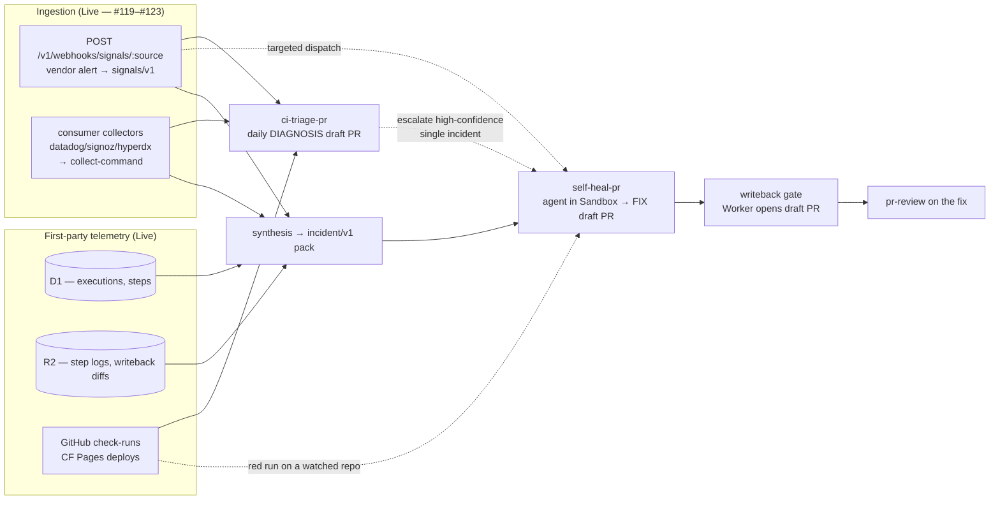
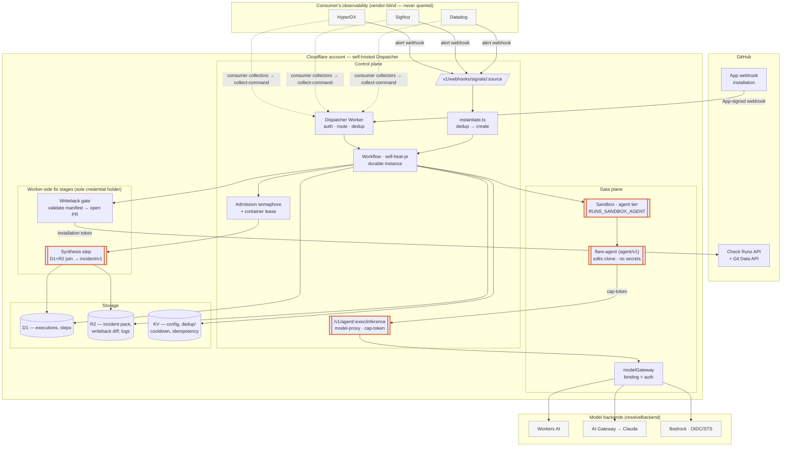
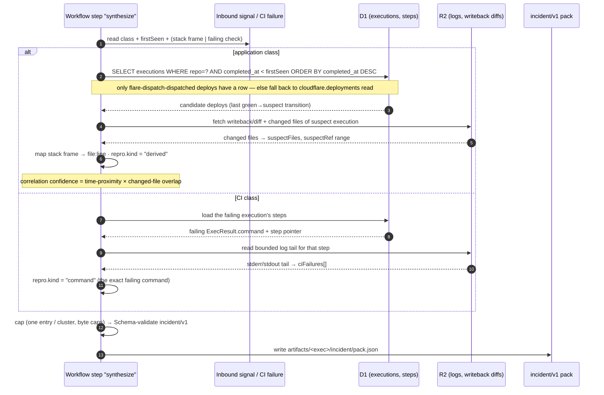
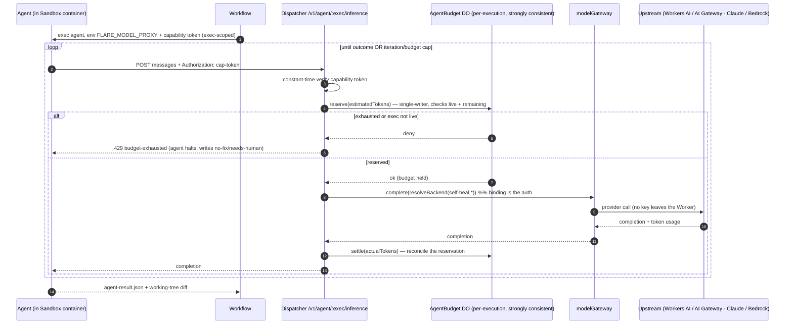
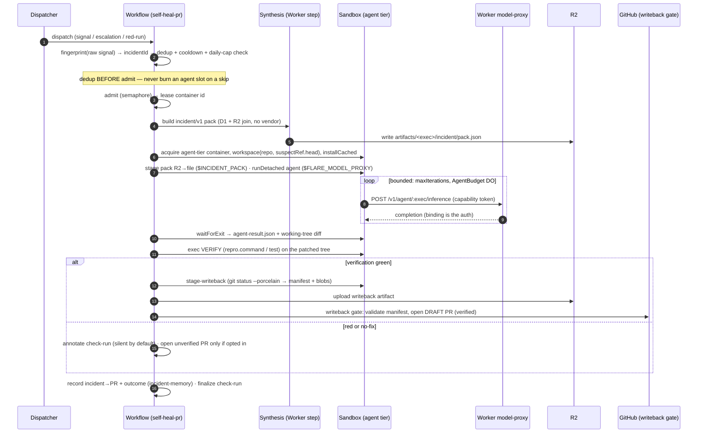
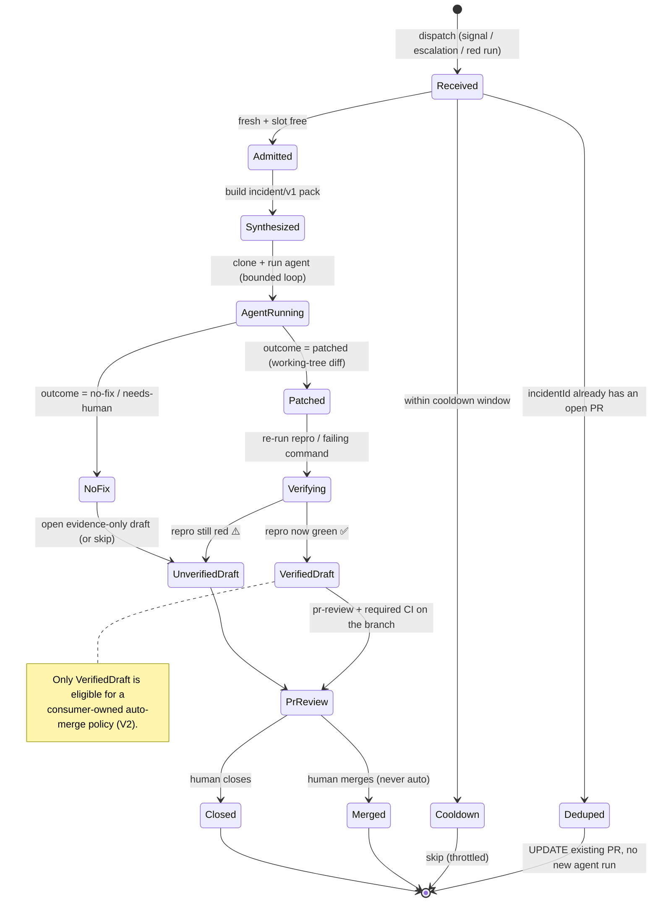
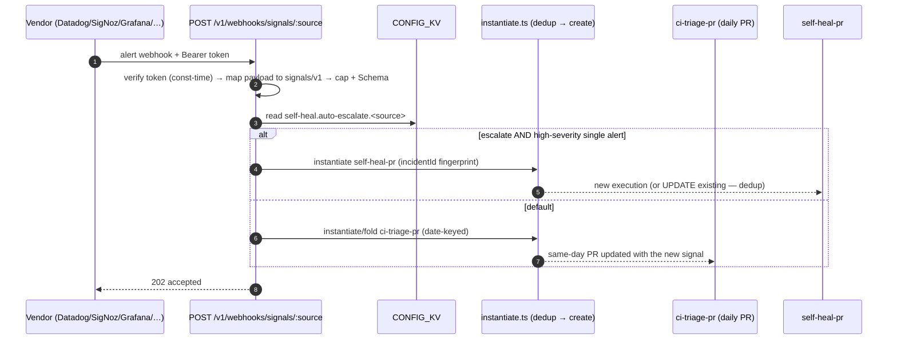

# 08 — Self-Healing PRs

> **Status: Design (V0 not built).** This spec defines the design. It composes
> mechanisms that are already Live — `signals/v1` ([02-runs § Signals](02-runs.md#signals)),
> post-run writeback ([01-architecture § Post-run writeback](01-architecture.md#post-run-writeback)),
> the Sandbox ([01-architecture § Sandbox / Container](01-architecture.md#sandbox--container)),
> and the `modelGateway` engine ([the review-agent `completeStructured` engine](02-runs.md)).
> The open PR stack #119 / #121 / #122 / #123 lands the ingestion half; this
> spec is the *fix* half. Nothing here requires a new vendor integration.

A **self-healing PR** is a draft pull request that proposes an actual fix for a
failure — opened automatically, by a coding agent that ran in a Sandbox
container, gated on the failure becoming green again. It is the next stage after
[`ci-triage-pr`](02-runs.md#signals), which diagnoses but deliberately
[*does not fix*](../runs/ci-triage-pr.ts). Where triage produces a daily
human-read write-up, self-heal produces a reviewable diff for one incident.

It covers **two error classes** through one pipeline:

- **CI errors** — a flare-dispatch run (or the consumer's own GitHub Actions /
  Cloudflare Pages build) went red. flare-dispatch already *sees* these: it **is**
  the CI. The failing command, the stderr tail, the diff under test, and the
  step span are first-party data already in D1 + R2.
- **Application / runtime errors** — an exception, a firing alert, a failed health
  probe in the *running product*. flare-dispatch does **not** see these; they
  arrive as caller-collected `signals/v1` (push webhook or pull collectors from
  Datadog / SigNoz / HyperDX), exactly the contract #119–#123 establish.

---

## 1. Principles & non-goals

These are load-bearing. The design is mostly a consequence of them.

1. **Don't *duplicate* the observability stack — but do own your own outcomes.**
   flare-dispatch never becomes a second copy of the running product's raw
   telemetry (errors/traces/logs): that copy is stale the moment it's written,
   drifts from the vendor that *is* the source of truth, and saddles a stateless
   router with the consumer's production PII + retention liability. The cost of a
   telemetry store was never the bytes — it is data gravity, drift, and staleness
   ([§ 3.1](#31-why-not-just-store-everything)). So: full context reaches the agent
   by a *fresh on-demand pull from the vendor* ([§ 6.4](#64-on-demand-context-pull--full-context-without-a-store)),
   not from a local copy; a *thin ephemeral per-incident cache* holds the assembled
   pack for the run's lifetime; and the **one** durable store flare-dispatch keeps
   is its **own** incident→fix→outcome history ([§ 9.1](#91-incident-memory--the-one-store-worth-keeping)) —
   low-liability operational data, the same class as the executions table, and the
   substrate for learning across incidents. It still *emits* its own OTel
   ([01-architecture § Observability](01-architecture.md#observability)).
2. **Vendor-blind *dispatcher* — vendor-aware at the edge.** The Dispatcher never
   queries a vendor and holds none of their credentials (same posture as
   #121/#123); this keeps its secret set tiny and its surface auditable. But
   vendor-blindness is a property of the *dispatcher*, not the *system*: the
   credentialed, vendor-aware work lives at the edge — consumer-side collectors,
   the in-sandbox context-pull adapter, and an opaque vendor-native `dedupKey`
   passed *through* the waist so the dispatcher dedups on the vendor's own grouping
   without understanding it ([§ 9.2](#92-incident-fingerprint--vendor-native-dedup)).
   Accepted cost: onboarding a vendor is consumer work, and loop-closing writeback
   *to* the vendor (ack/resolve/link) is a consumer-side adapter, out of dispatcher
   scope ([§ 12](#12-relationship-to-the-open-pr-stack)).
3. **Credential-free agent — and telemetry is an injection vector.** The coding
   agent is untrusted code, like any run: it never holds the GitHub App key, the HMAC
   secret, or a long-lived model key ([07-trust-model § container escape](07-trust-model.md)),
   reaches the network only through a mandatory egress allowlist (model-proxy + git
   remote), receives a context pack (data, not secrets), and emits a diff the
   **Worker** alone turns into a PR. Critically, the *telemetry itself is
   attacker-controlled* — signals and logs flow into code generation — so the pack
   separates data from instruction and the design assumes the agent may be
   injection-steered ([§ 10.1](#101-adversarial-telemetry-is-an-injection-vector-the-gap)).
4. **Never auto-merge. Draft only.** A self-heal PR is opened as a draft, gated on
   the same check-runs as any human PR, and is itself eligible for `pr-review`.
   The loop never merges; a human (or an explicit, separately-gated auto-merge
   policy the consumer owns) does.
5. **A fix is only credible if it makes the red green — verified in the sandbox,
   not in secret-bearing CI.** The agent's diff is verified by re-running the repro in
   the credential-free, egress-restricted sandbox before any PR. A *verified* fix opens
   a draft PR; an unverified one is silent by default. The consumer's `pull_request`
   CI is **not** the verification gate — on a same-repo self-heal branch it runs with
   secrets on possibly-injected code before review, so it must be gated
   ([§ 10.1](#101-adversarial-telemetry-is-an-injection-vector-the-gap)).
6. **Bounded cost.** Agent loops cost tokens and wall-clock and can spin. Every
   self-heal is admission-gated, iteration-capped, token-budgeted, fingerprint-
   deduped, and cooldown-throttled. See [§ 9](#9-cost--safety-governance).

**Non-goals (V0–V2):** continuous auto-merge; flare-dispatch as a durable store of
the *product's* raw telemetry (a shadow Sentry/Datadog); querying vendor APIs from
the **Dispatcher** (the agent pulling vendor data at the edge with the consumer's
own credentials is in scope — [§ 6.4](#64-on-demand-context-pull--full-context-without-a-store));
fixing across repos in one PR; fixing infra/IaC outside the repo; "agent has
production access."

---

## 2. Where it sits: triage → heal



`ci-triage-pr` stays the cheap daily digest. `self-heal-pr` is the targeted,
gated, expensive escalation for **one** incident. They share the `signals/v1`
input and the `completeStructured` engine; they differ in output (write-up vs.
diff) and cost profile. Triage may *escalate* a high-confidence, single-cluster
incident into a self-heal dispatch (opt-in, [§ 11](#11-the-self-heal-pr-run)).

### Component placement

The same tier map as [01-architecture § Components](01-architecture.md#components).
Self-heal adds **four** components (bold-bordered below); everything else is Live
and reused unchanged.



**Reading the credential boundary:** the agent (`AG`) holds no secrets — it
reaches a model only through `MPROXY` with an execution-scoped token, and its diff
becomes a PR only through `WBG`, which alone holds the GitHub App credential.
Nothing crosses from the data plane to GitHub directly.

---

## 3. Three-layer telemetry model

The whole "don't replace your stack" promise is this separation. flare-dispatch
touches telemetry in exactly three bounded ways:

| Layer | Direction | What | Mechanism | Stores? |
|---|---|---|---|---|
| **Emit** | out | flare-dispatch's own execution: each step is an OTel span, the execution is the root span | Logpush / Workers Analytics Engine / user's OTel collector | No — exported to the user's collector |
| **Ingest** | in | bounded *findings* the consumer collected from their stack | `signals/v1` push webhook + pull collectors (#121/#122/#123) | Transiently, in the dispatch body (50 × ~2 KB cap) |
| **Synthesize** | internal | join ingested findings with first-party CI history at fix time | [§ 5](#5-synthesis-the-incidentv1-context-pack), produces a capped `incident/v1` pack | No — the pack is per-execution, ephemeral in R2 |

There is no fourth layer. flare-dispatch never polls Datadog, never holds a
SigNoz API key, never ingests a raw trace stream. The synthesis step reads the
consumer's *already-narrowed* signals and flare-dispatch's *own* D1/R2 — both
already in hand — and never reaches back into the vendor.

### 3.1 Why not just store everything?

The obvious objection: *a coding agent fixes better with full context — so add a
cheap context store and give it everything.* The answer is to separate two stores
that "context store" conflates, because storage bytes were never the cost:

| | Store the **product's raw telemetry** (errors/traces/logs) | Store flare-dispatch's **own incident→fix→outcome** |
|---|---|---|
| Whose data | the consumer's production / users — **PII** | flare-dispatch's operational record |
| Real cost | data gravity, retention/residency liability, a breach target holding production data | low — same class as the executions table |
| Freshness | **stale at ingest**; the agent wants *current* state, so you'd re-poll the vendor → violates [principle 2](#1-principles--non-goals) | n/a — it's historical by nature |
| Vs. the vendor | a worse, drifting **second source of truth** | the vendor never had it |
| Verdict | **don't** — [§ 6.4](#64-on-demand-context-pull--full-context-without-a-store) pulls it fresh instead | **do** — [§ 9.1](#91-incident-memory--the-one-store-worth-keeping) |

So the real choice is not *snapshot vs. full context* — it is *where full context
lives and who fetches it fresh*. Full context read **fresh from the vendor on
demand** dominates a **stale local copy** on every axis but offline availability,
without the liability. The only durable telemetry flare-dispatch keeps is its own
outcomes. (One honest exception: a consumer running **no APM** has no vendor to
pull from — for them, opt-in retention of ingested `signals/v1` as their error
history is offered, with retention controls; off by default.)

---

## 4. The error classes, sourced

| | **CI error** | **Application / runtime error** |
|---|---|---|
| Example | `pnpm test` red; CF Pages deploy failed; a flare-dispatch run step exited non-zero | `TypeError` in a Workers fetch handler ×12/24h; a firing Datadog monitor; a failed `/health` probe |
| Visible to flare-dispatch? | **Yes — first-party.** check-run, step `ExecResult.exitCode`, R2 step log, the diff under test | **No.** Only via `signals/v1` |
| Source | D1 executions + R2 step logs + `github.actionRuns` / `cloudflare.deployments` read capabilities | `signals/v1`: `POST /v1/webhooks/signals/:source` (push) or `collect-command` (pull) |
| Repro available? | **Strong** — re-run the exact failing command in the sandbox | **Weak** — derive from stack frame → `file:line`; may need a written repro test |
| Suspect locus | the SHA range under test; the changed files | the deploy that introduced it (correlate signal time → executions), the stack frame's file |

The two converge at the **synthesis** step into one `incident/v1` pack, so the
agent loop downstream is identical. The difference is entirely in *where the
context comes from* and *how strong the repro is* — both recorded in the pack so
the agent and the confidence gate can reason about them.

### 4.1 The `demo` class — product-demo journey failures

A failed [`product-demo`](../recipes/product-demo/) chapter is a **third class**
(`class: "demo"`) — first-party like CI, but it drives a *deployed URL, not the
repo*, and its verdict is a *non-deterministic LLM `done` call*. That combination
breaks the CI-class verify (you can't re-run the browser demo in the
credential-free agent sandbox — no Browser Run — and the fix lands in the repo,
not the live deploy; an LLM re-judging an LLM is circular). So the demo class
**does not verify by re-running the demo.** Instead:

- **Only assertion failures escalate.** `product-demo` tags each failed chapter
  `failureKind ∈ {assertion, timeout, infra, unparseable}`; only `assertion`
  (the journey ran and the app misbehaved) becomes a signal/incident. The rest
  are flake/environment ([`packages/core/src/demo-signals.ts`](../packages/core/src/demo-signals.ts)).
- **Repro = a regression test, run as a command.** The agent writes a
  deterministic test reproducing the journey failure (guided by the chapter
  `narrative` + replay), and verify runs the configured test **command** — so a
  demo incident carries `repro.kind: "command"` and flows through the *same*
  verify→writeback gate as CI. No Browser Run, no circular oracle.
- **`narrative` is UNTRUSTED** (an LLM summary of a possibly attacker-influenced
  page) — fenced in `demoChapters[].narrative` + `signals[].detail`, never in the
  trusted `diagnosis`. The fingerprint keys off the operator-authored chapter
  **name**, so a reworded flake can't defeat dedup ([§ 9.2](#92-incident-fingerprint--vendor-native-dedup)).
- **`suspectRef` is advisory.** The demo proves the deployed app is broken, not
  which commit broke it; the synthesized `suspectRef` is low-confidence/advisory.

`storyResultsToIncident` builds the `demo`-class pack; `self-heal-pr` accepts it
exactly when it carries a command (test) repro — otherwise it is left to triage,
like the experimental application class.

### 4.2 The `ci` class — first-party `offload-test` failures (V0 auto-trigger)

The simplest, strongest trigger is the run that *executes* the suite. When
[`offload-test`](../runs/offload-test.ts) runs a repo's command and it exits
non-zero, that **is** a deterministic CI failure — the command is the
ground-truth oracle, so (unlike the LLM demo verdict) it needs **no k-of-n
confirmation**. The run escalates directly:

- **Gated + off by default.** Only when `self-heal.ci.enabled=true` does a
  non-zero exit dispatch a child `self-heal-pr`; otherwise `offload-test` is
  unchanged (just reports the red check).
- **Repro = the exact failing command.** `commandFailureToIncident`
  ([`packages/core/src/ci-incident.ts`](../packages/core/src/ci-incident.ts))
  builds a `ci`-class pack carrying `repro.kind: "command"` with the command the
  run just executed — the verify step re-runs it in the credential-free sandbox.
- **`suspectRef` is high-confidence, not advisory** (contrast the demo class):
  CI failed on *this* commit, so `head = sha`, `confidence: 1`.
- **`logTail` is UNTRUSTED** (a test name / stack frame / console line is
  attacker-influenceable) — fenced in `ciFailures[].logTail`, never the trusted
  `diagnosis`. The fingerprint keys off `(repo, sha)` so a reworded log can't
  mint a fresh identity; same `(repo, sha)` re-runs collapse to one heal
  ([§ 9.2](#92-incident-fingerprint--vendor-native-dedup)), a new push re-heals.
- **Bounded + best-effort.** One failed command → one child heal, capped by the
  `AgentBudget` DO; a dispatch fault never changes the run's own check outcome.

This is the dogfood path that produces self-heal PRs for flare-dispatch's own
red test runs. The richer `ci-triage-pr`/webhook escalations
([§ 11](#11-future-work)) remain the multi-repo, signal-driven future.

---

## 5. Synthesis: the `incident/v1` context pack

`signals/v1` is the narrow waist for **ingestion**. The pack is the narrow waist
for the **fix** — the single, capped, model-ready bundle the agent receives. It
is the synthesis output and the audited boundary: the agent sees exactly this and
nothing else.

```jsonc
// incident/v1 — the bounded context an agent receives. New contract package:
// @flare-dispatch/core/incident (sibling of signals.ts), JSON Schema mirrored
// like schemas/signals.v1.schema.json. Caps bound it well under the Workflow
// param/step-result ceilings (1 MiB).
{
  "contractVersion": "v1",
  "incidentId": "sha256(fingerprint)",   // dedup key — see § 9
  "class": "ci" | "application",
  "repo": "owner/name",
  "suspectRef": { "base": "<sha>", "head": "<sha>" },  // range to inspect
  "diagnosis": {                          // reuse ci-triage's TriageReport item shape
    "title": "…", "area": "…", "diagnosis": "…", "suggestedFix": "…"
  },
  "signals": [ /* signals/v1 — the external findings, verbatim, capped */ ],
  "ciFailures": [                         // first-party — capped
    { "kind": "actions"|"pages"|"run-step",
      "name": "…", "conclusion": "failure",
      "command": "pnpm test",            // the exact failing command (CI class)
      "logTail": "…",                    // bounded stderr/stdout tail from R2
      "url": "…" }
  ],
  "suspectFiles": [ "src/handler.ts" ],   // from changed-files (CI) or stack frame (app)
  "repro": {                              // how the agent/verifier reproduces it
    "kind": "command" | "derived" | "none",
    "command": "pnpm test -- handler.test.ts",  // when kind=command
    "note": "stack frame src/handler.ts:42; write a failing test first"  // when derived
  }
}
```

### How synthesis builds it — no new vendor read

1. **First-party correlation (the new, non-obvious value).** Given a signal with
   a timestamp, join it against D1 **executions** (`… WHERE repo = ? AND completed_at
   < firstSeen ORDER BY completed_at DESC`) to find the deploy/run that most plausibly
   introduced it (the last green→suspect transition before the signal's first
   occurrence), and pull that execution's **writeback/diff** and changed files from
   R2. A bare "TypeError ×12" becomes "TypeError ×12, first seen 20 min after
   execution `X` shipped a change to `src/handler.ts`." This uses data flare-dispatch
   **already owns** — no vendor capability, no new secret.

   > **Scope (V1 honesty).** D1 holds only flare-dispatch's *own* execution rows
   > ([05-byoc § D1 schema](05-byoc.md#d1-schema), columns `started_at`/`completed_at`).
   > The correlation therefore only fires when **flare-dispatch dispatched the deploy**.
   > A consumer who ships via their own GitHub Actions / Pages has *no* execution row
   > to join — for them this step degrades to a `cloudflare.deployments` read-capability
   > query (recent deploys), not the rich diff join, and `suspectRef` stays advisory.
   > The query also needs a `(repo, completed_at)` index — the only existing index is
   > `(repo, sha)`, so an unindexed `ORDER BY completed_at` is a scan. Add the index
   > (migration) before claiming the join is cheap.
2. **Repro derivation.** CI class → the failing `ExecResult.command` *is* the
   repro. Application class → map the stack frame to `file:line` and mark
   `repro.kind = "derived"` so the agent knows to write a failing test first.
3. **Capping.** Same discipline as `signals/v1`: one entry per cluster, bounded
   tails, hard item/byte caps, validated by Schema at the boundary. The pack is
   written to `artifacts/<exec>/incident/pack.json` (R2), the same place writeback
   reads from.

Synthesis is a pure-ish Worker/Workflow step (D1 + R2 reads, no model, no
container) so it is cheap, deterministic, and testable.

### Synthesis sequence — the first-party correlation join



The join in step 2 is the whole point: it reaches only into flare-dispatch's
**own** D1/R2, never back into the vendor. Low correlation confidence marks
`suspectRef` advisory so the agent doesn't over-trust a wrong SHA
([§ 13 open question 3](#13-phased-rollout)).

---

## 6. The coding agent

### 6.1 Agent-adapter contract (`agent/v1`) — swappable, like collectors

The same taste as `signals/v1` collectors: the agent is an **adapter behind a
narrow contract**, baked into a container image, so the runtime is swappable
(opencode, Claude Code, a custom Effect CLI à la [`demo-agent`](../packages/demo-agent/)).
The agent binary:

1. reads the pack from `$INCIDENT_PACK` (a file path; **data, not secrets**),
2. reaches a model **only** through `$FLARE_MODEL_PROXY` (see [§ 6.3](#63-model-access-the-key-decision)) — it is given no model API key,
3. edits the working tree of the clone in place,
4. on exit writes `agent-result.json`:

```jsonc
// agent/v1 result — what the adapter MUST emit. Mirrors the producer contract:
// stdout/stderr are diagnostics; this file is the structured handoff.
{
  "contractVersion": "v1",
  "outcome": "patched" | "no-fix" | "needs-human",
  "summary": "one-paragraph what-and-why for the PR body",
  "changedFiles": [ "src/handler.ts" ],   // advisory; the diff is source of truth
  "confidence": 0.0,                       // self-assessed 0–1
  "addedTests": [ "src/handler.test.ts" ], // the repro/regression test it wrote
  "iterations": 3,
  "tokensUsed": 41200
}
```

The diff itself is captured by the existing `git status --porcelain` →
`stage-writeback` script ([`refresh-fixtures` precedent](../runs/refresh-fixtures.ts)),
**not** trusted from the agent's self-report. `agent-result.json` is metadata for
the PR body and the confidence gate.

### 6.2 Sandbox tier

A new **agent tier** image: a third Dockerfile target alongside lean/browser
([01-architecture § Sandbox / Container](01-architecture.md#sandbox--container)),
baking the coding-agent CLI + a node/git toolchain — same "one Dockerfile, build
flag" pattern as `WITH_BROWSER`. Declared on the run as `sandboxImage: "agent"`.
Instance type bumped (`standard-3`/`standard-4`) since an agent loop is CPU- and
memory-heavier than a test run. Concurrency stays admission-capped.

**Mandatory egress allowlist.** Unlike the base posture ([05-byoc § Security posture](05-byoc.md#security-posture),
egress open by default), the agent tier ships with egress **restricted to the
model-proxy + the git remote**. The container holds the cloned (possibly private)
repo and the pack; an injection-steered agent must not be able to `curl` them to an
attacker ([§ 10.1](#101-adversarial-telemetry-is-an-injection-vector-the-gap)). This
is not optional configuration — it is part of the tier definition.

### 6.3 Model access — the key decision

The in-container agent **cannot** use the Worker-side `modelGateway` Effect
capability. Three ways to give it a model; the spec **recommends (A)** and keeps
(C) as the federated fallback:

| | Mechanism | Credential posture | Verdict |
|---|---|---|---|
| **(A) Worker model-proxy** ✅ | New dispatcher route `POST /v1/agent/:execution/inference`, called by the container with a **per-execution capability token** (the [log-viewer capability-token precedent](01-architecture.md#components) — a request/response gate, *not* the CDP bridge, which uses a static `BROWSER_CDP_API_TOKEN` over a persistent WebSocket). The Worker proxies to `modelGateway`. | **No model key in the container.** Binding stays the auth. Token is execution-scoped, expires with the run, rate-limited per execution. | **Recommended.** |
| (B) Injected key | Operator puts a model key in CONFIG_KV; run `loadSecrets`-injects it into the container env. | A long-lived key sits in the container env for the run. Violates principle 3. | MVP-only escape hatch; discourage. |
| (C) OIDC → Bedrock | Container federates via the [self-issued OIDC](01-architecture.md#components) to AWS STS → Bedrock, exactly like the [`bedrock` backend](02-runs.md). | Short-lived STS creds, no long-lived key. | Good fallback when the consumer is already on Bedrock/BYOC. |

(A) makes the agent's model spend observable (it flows through the Worker, so it
lands in flare-dispatch's own OTel + the per-execution budget) and keeps the
credential-free invariant whole. The proxy reuses the existing backend resolution
(`resolveBackend`, the `self-heal.*` CONFIG_KV namespace) so Claude via AI Gateway,
a Workers AI model, or Bedrock are all selectable without touching the agent.

**The budget + liveness must be a Durable Object, not KV.** The proxy decrements a
running token budget and checks the execution is still live on *every* call. KV is
eventually consistent (read-after-write is not guaranteed; [01-architecture § Storage](01-architecture.md#storage)
scopes KV to config/idempotency/token-cache, never an atomic counter), so a
`read → call → decrement` loop racing across isolates/colos under-counts and blows
the hard cap. A per-execution **`AgentBudget` Durable Object** (single-writer,
strongly consistent) holds the remaining budget, the liveness flag, and a simple
rate limiter — the same role the admission/lease D1 state plays for containers. The
capability token authenticates; the DO holds the state the stateless token can't.

### Model-proxy sequence — credential-free in-container inference



The token never leaves the execution's lifetime, the model key never leaves the
Worker, and every call lands in flare-dispatch's own OTel — so agent spend is
observable and hard-capped. The reserve-then-settle on the strongly-consistent
`AgentBudget` DO is what makes the cap *hard* (a naive KV decrement would race).
The capability-token gate mirrors the [log-viewer token](01-architecture.md#components),
not the static-token CDP bridge.

### 6.4 On-demand context pull — full context without a store

The `incident/v1` pack is a bounded *trigger* snapshot (50 × ~2 KB), sized for
"name the failure," not "hold an entire stack trace + the surrounding events." A
good fix often needs more, and *current* state: "is this error still firing?",
"the 3 spans around it", "what else shipped in that deploy?". flare-dispatch
answers this **without storing telemetry and without the Dispatcher querying a
vendor** — by letting the **agent** pull, on demand, from the consumer's stack:

- The consumer supplies a **read-only context-pull adapter** (a CLI/MCP tool baked
  into the agent image, or shipped with the run) — the same "consumer-side adapter,
  dispatcher stays blind" shape as the #121 collectors, but *pull-during-fix*
  instead of *pull-at-dispatch*.
- It runs **in the sandbox**, authenticated with the **consumer's own** vendor
  credentials, injected via `loadSecrets` ([07-trust-model § secret injection](07-trust-model.md)).
- The agent calls it like any tool: `context-pull traces --error <id> --window 1h`.
  Output folds into the agent's working context, capped like everything else.

This keeps **both** principles whole — the Dispatcher stores nothing and queries
no vendor — while removing the context-starvation that produces plausible-but-wrong
fixes. The vendor stays the store; it is simply read *fresh*, at the edge, by the
party that already holds the credentials.

> **Security note — this is V1-gated and NOT posture-neutral (see [§ 10.1](#101-adversarial-telemetry-is-an-injection-vector-the-gap)).**
> Edge-pull injects the **consumer's vendor read-token into an injection-steered
> container** — and most "read-only" vendor keys read the *whole* observability
> account, so an escape/leak exposes far more than this incident. It also creates a
> **second-order injection loop**: injected text can tell the agent to `context-pull`
> *more* attacker-influenced telemetry, deepening the injection each hop. So the
> controls are **mandatory**, not "if the threat model needs it": the token uses the
> **narrowest** vendor read role; egress is **pinned to the one configured vendor
> endpoint**; pull **count and volume are capped**; the adapter is read-only; pulled
> output is untrusted like the rest of the pack; and output still ships only through
> sandbox-verify + the writeback gate. Stays **out of V0**.

---

## 7. The heal loop



Most boxes are existing primitives, but **two reuse claims need qualifying**:

- **The verify→writeback path is *not* unchanged.** Today writeback fires only on
  a *successful* run (`workflow.ts:775`, `status === "success"`), and `WritebackSpec`
  fixes the PR `title`/`body`/`draft` at `defineRun` time with **no label/dynamic-body
  field**. Self-heal needs writeback to (a) run on a *verified-but-the-run-concluded-how?*
  basis and (b) carry the verify outcome into the PR body/label. So the gate must be
  **extended**: decouple writeback from run conclusion (or always conclude `success`
  and carry verified-ness in the writeback inputs), and add an optional dynamic
  `body`/`labels` channel the run supplies post-verify. The *validation* half
  (path/allowlist/byte/count caps, `.github/workflows` opt-in) is reused unchanged.
- **The agent loop must use `runDetached` + `waitForExit`**, not a plain
  `sandbox.exec`. A 10–20-min indivisible agent run that replays from scratch on
  Worker eviction would re-spawn the agent and double-spend the budget
  ([01-architecture § Long-running test handling](01-architecture.md#long-running-test-handling)).
  Wall-clock itself is fine (the step is I/O-bound awaiting the container).

---

## 8. Confidence gate & human-in-the-loop

- **Draft, always.** Writeback opens drafts; self-heal never overrides that.
- **A verified fix opens a PR; an unverified one is silent by default.**
  Verification (re-run the repro/CI on the patched tree) is the gate. `verified=true`
  → open the draft PR, body leading with "✅ reproduced the failure, applied a fix,
  the repro is now green." `verified=false` / `no-fix` → **annotate the run and stop;
  open no PR** unless the operator opts in (`self-heal.open-unverified`, default off).
  Rationale: an evidence-only PR for a fix the agent *couldn't* verify is triage
  burden, not signal — auto-opened review PRs already tend to see low engagement.
  Sentry Seer and Copilot Autofix both refuse to
  surface unverified fixes; this matches them by default and diverges only on
  explicit opt-in.
- **Verification is the sandbox run — NOT the consumer's secret-bearing CI.** The
  trusted "this makes the red green" check is the credential-free, egress-restricted
  `verify` step in the sandbox. The consumer's `pull_request` CI on the self-heal
  branch runs with **full repo secrets on possibly-injected code before review** — it
  is an exfil surface, not a verification gate ([§ 10.1](#101-adversarial-telemetry-is-an-injection-vector-the-gap)).
  Enabling self-heal on a repo with CI secrets *requires* gating that CI (fork PR /
  environment protection / label-gated workflows) so it does not run before a human
  reviews the diff.
- **`pr-review` on the fix.** A self-heal PR is a PR; the existing `pr-review`
  run reviews it like any other, giving an independent model a refute-pass over
  the agent's change before a human looks.
- **Escalation, not silent action.** When triage escalates an incident, it does
  so as a labelled draft PR a human can close — never a merge.

### Incident lifecycle



The `Deduped` / `Cooldown` edges are the alert-storm dampers — repeated alerts
for one root cause fold into the single open PR rather than spawning runs.

---

## 9. Cost & safety governance

| Control | Mechanism | Reuses |
|---|---|---|
| Concurrency | per-pool admission semaphore (agent tier is its own pool) | [run-admission semaphore](01-architecture.md#run-admission-semaphore) (Live) |
| No collision | per-container-id lease | [per-container-id lease](01-architecture.md#per-container-id-lease) (Live) |
| Loop bound | `self-heal.max-iterations` (default 4) + `self-heal.token-budget` per heal (hard cap, [`AgentBudget` DO](#63-model-access-the-key-decision)) | model-proxy enforces per-execution |
| Dedup | `incidentId = sha256(fingerprint)`; one open self-heal PR per incident — repeat alerts UPDATE it. Checked **before admission** ([§ 7](#7-the-heal-loop)) so a skip never burns an agent slot | mirrors [date-keyed ci-triage PR](../runs/ci-triage-pr.ts) + [webhook idempotency](04-gha-integration.md) |
| Cooldown | `self-heal` capped at 1 dispatch per incidentId per window (default 6 h) | mirrors the [pr-review run cooldown](https://github.com/OpenHackersClub/flare-dispatch/commit/cfa55b1) (1/PR/30 min) |
| **Global ceiling** | `self-heal.max-heals-per-day` (per repo + account) **and** a rolling token/$ budget kill-switch (an account-level `AgentBudget` DO) — fail-closed when exceeded | new — the per-incident throttles above do **not** bound a multi-fingerprint storm |
| Spend visibility | model spend flows through the Worker proxy → flare-dispatch OTel + [06-cost](06-cost.md) accounting | [§ 6.3](#63-model-access-the-key-decision) |

**Why the per-incident throttles are not enough.** Dedup and cooldown are both keyed
to a single `incidentId`. A bad deploy emitting *N distinct* error signatures →
*N fingerprints* → *N heals*, each spending a token budget plus a downstream
`pr-review` fan-out. The semaphore *serializes* them but they all eventually run.
A rough storm: ~20 distinct fingerprints → ~20 heals + ~20 pr-reviews ≈ **$40–300**
in one window before anything per-incident fires. The **global ceiling** row is what
actually closes that path — a hard daily heal cap and a rolling spend kill-switch
that throttles *across* incidents. It is not optional.

### 9.1 Incident-memory — the one store worth keeping

The single durable store self-heal adds is its **own** outcome history (D1, the
same class as the [executions table](01-architecture.md#data-model) — *not* the
product's telemetry, see [§ 3.1](#31-why-not-just-store-everything)): one row per
incident — `incidentId`, fingerprint, class, the agent's diff summary, the
verification result, the PR number, and **what happened to it** (merged / closed /
reverted). Low-liability, cheap, and it earns its keep three ways:

1. **Priors for the fix.** On a recurring `incidentId`, the pack carries "you fixed
   this class before; that PR {merged & held | was reverted}" — the agent starts
   from the last known-good (or known-bad) attempt instead of cold. This is the
   step past one-shot autofix.
2. **Dedup against *resolved* history**, not just open PRs — a fixed-then-recurring
   incident is flagged as a regression, not a fresh bug.
3. **Cost/quality telemetry** — verified-rate, merge-rate, revert-rate per
   fingerprint feed [06-cost](06-cost.md) and tell the operator where self-heal is
   actually earning its spend vs. generating noise.

### 9.2 Incident fingerprint & vendor-native dedup

**Fingerprint** = stable identity of *the failure*, not the alert delivery: for CI,
`(repo, failing-check-name, normalized-error-signature)`; for application,
`(source, signal.title-normalized, suspect-file)`. Repeated alerts for the same
root cause collapse onto one PR; distinct failures get distinct PRs.

The generic fingerprint is *weaker* than the grouping a vendor already computed
(Sentry issue id, Datadog aggregation key). So `signals/v1` carries an **optional
opaque `dedupKey`** the consumer's adapter fills with the vendor's native group id.
When present it *is* the fingerprint — the Dispatcher dedups on the vendor's own
grouping **without understanding it** (vendor-aware at the edge, blind at the
core, [principle 2](#1-principles--non-goals)); when absent, the generic
fingerprint is the fallback.

> **`dedupKey` is attacker-controlled — treat it as untrusted.** The alert emitter
> controls signal contents, hence the key. Two abuses: a *unique* key per alert makes
> every alert a distinct incident → bypasses cooldown/dedup → PR/cost storm; a key
> *colliding* with an unrelated open self-heal PR rides the `Deduped → UPDATE existing
> PR` edge ([§ 8](#8-confidence-gate--human-in-the-loop)) to graft an injected incident
> onto someone else's PR, or to *suppress* a legitimate fix (the real incident never
> opens its own PR). Mitigations, all required: **namespace** the key by `source`,
> **validate + length-cap** it, **never let a `dedupKey` collision alone trigger UPDATE
> across differing provenance**, and put a **global distinct-key rate cap** behind it.
> The cost storm this enables is bounded only by the global *spend* ceiling
> ([§ 9](#9-cost--safety-governance)), not by count throttles — fingerprint evasion
> defeats anything keyed to a single incident.

The *application-class* fallback fingerprint is the weakest link, two ways at once:
`title-normalized` collapses distinct bugs that share a generic message ("TypeError")
into one PR, while a `suspect-file` from the heuristic stack-frame map (low
correlation confidence, [§ 5](#5-synthesis-the-incidentv1-context-pack)) can split
one root cause across files into many PRs. So **fold the correlation confidence into
the key** and **gate auto-escalation on confidence ≥ threshold** — below it, an
application alert folds into the daily triage PR rather than spinning a heal. The CI
fingerprint `(repo, check, error-signature)` has no such problem and needs no gate.

---

## 10. Threat model & trust delta

Everything in [07-trust-model](07-trust-model.md) holds; the agent is untrusted
code like any run. A security review (verdict: *rethink*) found the earlier draft
defended the credential boundary but missed two chains — telemetry as an injection
vector, and injection-shaped code reaching secret-bearing CI. § 10.1 adds that threat
model; § 10.2 restates the credential-boundary delta.

- **The model-proxy is a new authenticated egress.** `POST /v1/agent/:execution/inference`
  is reachable only with a per-execution capability token (minted by the Workflow,
  scoped to that execution, expiring with it). Liveness + rate limit + the hard
  token budget live in the strongly-consistent [`AgentBudget` DO](#63-model-access-the-key-decision),
  not in the stateless token. It brokers container→model the way the
  [log-viewer token](01-architecture.md#components) gates container→Worker — a
  container never gets a raw model credential, only a token the Worker trades for a
  binding-authenticated call. A leaked token buys, at most, that one execution's
  remaining token budget.
- **No new secret reaches the container.** The pack is data. The proxy token is
  not a model key. The agent's only outbound credential is execution-scoped. The
  GitHub App key remains Worker-only — the agent's diff becomes a PR exclusively
  through the writeback gate, never by the container pushing. A container escape
  yields no more than [07-trust-model § container escape](07-trust-model.md)
  already bounds.

### 10.1 Adversarial telemetry is an injection vector (the gap)

The sections above defend the *credential boundary* well — but a security review
surfaced that the earlier draft never treated **attacker-controlled telemetry as a
prompt-injection vector**, and let **injection-shaped code reach secret-bearing CI
before a human looks**. Both are now first-class. The new threat model:

**Untrusted input → code.** `signals/v1` `title`/`detail` and the R2 `logTail` are
*attacker-influenced* — anyone who can emit a log line or fire an alert controls
them. They flow verbatim into the `incident/v1` pack ([§ 5](#5-synthesis-the-incidentv1-context-pack))
and into the agent's context, which then *writes code*. The pack caps **bytes**, not
**trust**. So:

- The pack **separates data from instruction**: every caller/log-derived string is
  carried in clearly-fenced, explicitly-untrusted fields the agent's system prompt
  is told never to follow as instructions. (Necessary, not sufficient — never rely
  on the model declining; the load-bearing walls are the two below.)

**The verification paradox — secret-bearing CI is the exfil vector, not the proof.**
The earlier §8 sold "the fix re-enters the consumer's CI as the strongest
verification." That is **wrong and dangerous**: writeback pushes a branch to the
**same repo** (`writeback-r2.ts` — not a fork), so opening the PR fires the
consumer's `pull_request` workflows **with full repo secrets**, on possibly-injected
code, **before any human review**. The CI you were treating as the proof is itself an
RCE/secret-exfil surface. Resolution:

- **Verification happens only in the credential-free, egress-restricted sandbox**
  (the `verify` step re-runs the repro). That run holds no secrets and cannot reach
  the network beyond the allowlist below. The consumer's secret-bearing CI is **not**
  a trusted verification gate for self-heal branches.
- **Operator prerequisite (hard):** self-heal branches must not run secret-bearing
  workflows before human review — via fork-based PRs, GitHub environment
  protection/required-reviewer rules on `pull_request`, or label-gated workflows.
  The spec must state this as a precondition for enabling self-heal on a repo with
  CI secrets; it is not optional.

**Mandatory egress allowlist on the agent tier.** [05-byoc § Security posture](05-byoc.md#security-posture)
leaves container egress *open by default*. For the agent tier that is unacceptable —
the container holds the cloned (possibly private) repo + the pack, and an agent (or
injected instruction) can `curl` it out. So the agent tier ships with a **mandatory**
egress allowlist (model-proxy + the git remote only), not the optional "lock down if
needed" of the base posture.

**Manifest/build-file gating, not just workflows.** `validateManifest` special-cases
only `.github/workflows/**` (`allowWorkflows`). The default `src/**` allowlist
*incidentally* blocks `package.json`/lockfiles/`Dockerfile`/`.npmrc`/`wrangler.toml`
— but the moment an operator widens the allowlist (e.g. to fix a build), a
`postinstall` RCE opens silently. The opt-in gate must be **extended** to package
manifests, lockfiles, Dockerfiles, `.npmrc`, and CI config regardless of allowlist.

### 10.2 Trust-model delta (credential boundary)

Everything in [07-trust-model](07-trust-model.md) holds; the agent is untrusted code
like any run. Additions:

- **The model-proxy is a new authenticated egress.** `POST /v1/agent/:execution/inference`
  is reachable only with a per-execution capability token. Liveness + rate limit + the
  hard token budget live in the strongly-consistent [`AgentBudget` DO](#63-model-access-the-key-decision),
  not the stateless token. It brokers container→model the way the
  [log-viewer token](01-architecture.md#components) gates container→Worker. **But** the
  run author's code shares the container and sees `FLARE_MODEL_PROXY` + the token for
  the whole run — so the token is **scoped to the agent step's lifetime** with a low
  request count and a low default budget, or it becomes a free general-purpose LLM
  gateway for a malicious author. A leaked token buys, at most, that step's remaining
  budget.
- **No new *flare-dispatch* secret reaches the container.** The pack is data; the
  proxy token is not a model key; the GitHub App key stays Worker-only — the diff
  becomes a PR only through the writeback gate, never by the container pushing.
- **Edge-pull (§ 6.4) is the exception and is V1-gated.** It deliberately injects the
  *consumer's* vendor read-token into an injection-steered container. Because most
  "read-only" vendor keys read the *whole* observability account, this is a real new
  secret in the blast radius — so §6.4's egress lock-down is **mandatory** (narrowest
  vendor read role, egress pinned to the one configured endpoint, capped pull
  count/volume), and §6.4 stays out of V0.

Residual risk: the agent writes code that lands in a draft PR. The walls are
(a) draft-only + `pr-review` + **human review before secret-bearing CI**, (b) the
extended writeback allowlist/manifest gate, (c) verification in the credential-free
sandbox only, (d) the mandatory agent-tier egress allowlist. The agent cannot merge,
cannot exfiltrate past the allowlist, cannot touch manifests/workflows without the
gate, and cannot exceed the writeback caps.

---

## 11. The `self-heal-pr` run

A new run, sibling to `ci-triage-pr`, namespaced `self-heal.*` in CONFIG_KV and
reusing `resolveBackend`. Declares `sandboxImage: "agent"` and a `writeback`
spec. Sketch (full shape follows the [`refresh-fixtures` writeback run](../runs/refresh-fixtures.ts)):

```ts
export const selfHealPr = defineRun({
  name: "self-heal-pr",
  version: "1.0.0",
  sandboxImage: "agent",
  inputs: Schema.Struct({
    incident: Incident,          // incident/v1 — OR enough to synthesize one
    signals: Schema.optionalWith(SignalArray, { default: () => [] }),
  }),
  writeback: {
    branch: { prefix: "flare-dispatch/self-heal" },   // per-incident branch
    commitMessage: "fix: self-heal …",                // required by WritebackSpec
    pr: { title: "fix: …", body: "…", draft: true },
    pathAllowlist: [/* operator-scoped; src/** etc. */],
    // allowWorkflows: false — workflows stay gated. NOTE: the gate must ALSO cover
    // package.json / lockfiles / Dockerfile / .npmrc / CI config (postinstall RCE) —
    // src/** blocks them today only incidentally (§ 10.1). Widening the allowlist
    // without extending the gate opens that door.
  },
  run: (input) => Effect.gen(function* () {
    // Fingerprint + dedup/cooldown/daily-cap BEFORE admit (don't burn a slot on a
    // skip). The Workflow's admission/lease wrap the body as for any run.
    const pack = yield* step("synthesize", () => buildIncidentPack(input));
    if (pack === undefined) return /* deduped / throttled — no agent run */;
    // workspace() returns { container, dir } and runs installCached (sandbox.git.clone
    // alone returns just dir) — same primitive refresh-fixtures uses. install: true
    // avoids a cold `pnpm install` on the ephemeral FS each heal.
    const { container, dir } = yield* step("checkout", () =>
      workspace({ repo: pack.repo, sha: pack.suspectRef.head, install: true }));
    // Stage the pack (a value the synthesis step holds) into a file the agent reads
    // — data, never a secret. (Pick the concrete R2→container restore mechanism;
    // the pack is ≤ the signals cap so an exec-write or artifact-restore both work.)
    yield* step("stage-pack", () => stagePack({ container, path: PACK_PATH, pack }));
    // runDetached + waitForExit: a 10–20-min agent loop must be eviction-safe, or a
    // Worker eviction replays the step, re-spawns the agent, and double-spends budget.
    const handle = yield* step("agent-start", () => sandbox.runDetached({
      container, cwd: dir,
      command: ["flare-agent", "heal", "--pack", PACK_PATH],
      env: { INCIDENT_PACK: PACK_PATH, FLARE_MODEL_PROXY: proxyUrl /* + cap token */ },
    }));
    yield* step("agent-wait", () => sandbox.waitForExit({ handle }));
    const verify = yield* step("verify", () => sandbox.exec({
      container, cwd: dir, command: pack.repro.command, timeoutSec: 600 }));
    if (verify.exitCode !== 0 && !openUnverified) return /* annotate run, no PR */;
    yield* step("stage-writeback", () => sandbox.exec({ /* porcelain → manifest */ }));
    // writeback gate (Worker) opens the draft PR with verified = verify.exitCode === 0
  }),
});
```

### Dispatch modes

- **Webhook escalation** — `POST /v1/webhooks/signals/:source` already exists
  (#122). A CONFIG_KV flag `self-heal.auto-escalate` (per source, default off)
  routes a high-severity single alert straight to a self-heal dispatch instead of
  (or in addition to) folding into the daily triage PR.
- **Triage escalation** — `ci-triage-pr` may, for a high-confidence single-cluster
  item, emit a self-heal dispatch (opt-in `ci-triage.escalate-self-heal`).
- **Action mode** — a consumer dispatches `POST /v1/dispatch/self-heal-pr` from
  their own CI when a build goes red, carrying the failing context as signals +
  the repo/sha. The CI class with the strongest repro.
- **Schedule mode** — a daily sweep that self-heals the single worst incident
  (cost-bounded: one per tick).

The webhook path is the most automatic; here is its decision exactly — it reuses
the #122 ingress and the extracted `instantiate.ts`, branching only on the
`auto-escalate` flag:



Onboarding a vendor stays zero-code: a CONFIG_KV mapping + the `auto-escalate`
flag + a webhook URL. The dispatcher never learns the vendor's API.

### CONFIG_KV keys (operator sets out of band)

```
self-heal.repos              repos eligible for self-heal (allowlist; required)
self-heal.backend            workers-ai | anthropic | bedrock
self-heal.<backend>.model    model id (+ .mode)               (resolveBackend)
self-heal.max-iterations     agent loop cap                   (default 4)
self-heal.token-budget       hard token cap per heal          (default 200k; see note)
self-heal.cooldown-hours     per-incident dispatch cooldown   (default 6)
self-heal.max-heals-per-day  GLOBAL daily heal cap (repo+acct)(default 10)   ← storm guard
self-heal.spend-ceiling      rolling token/$ kill-switch      (account-level; fail-closed)
self-heal.open-unverified    open a PR when verify fails      (default off — silent)
self-heal.escalate-min-confidence  app-class correlation gate (default 0.6)
self-heal.path-allowlist     writeback path scope             (default src/**)
self-heal.auto-escalate.<source>   webhook → self-heal       (default off)
self-heal.prompt             agent system-prompt override     (optional)
```

> **Token-budget note.** 200k is a *tension point*, not a safe default: real agentic
> coding loops on a multi-file fix routinely exceed it (→ premature `no-fix`), yet
> 200k is also the **dominant per-heal cost**. Tune it against the chosen backend
> (cheaper on Workers AI/Sonnet, far costlier on Opus) and track the no-fix rate per
> [§ 9.1](#91-incident-memory--the-one-store-worth-keeping) — it is the main quality⇄cost dial.

---

## 12. Relationship to the open PR stack

This spec **builds on** #119/#121/#122/#123 — do not duplicate them:

- **#123** (`signals/v1` canonical contract + JSON Schema) — the ingestion waist.
  `incident/v1` is its sibling: a second contract package in `@flare-dispatch/core`,
  same hand-mirrored-JSON-Schema + cap-parity-test discipline.
- **#119** (`ci-triage-pr` accepts signals) — the diagnosis stage self-heal
  escalates *from*. Reuse its `TriageReport` item shape inside the pack's `diagnosis`.
- **#121** (collectors) — unchanged; they feed both triage and self-heal.
- **#122** (webhook ingress + `instantiate.ts`) — reuse the extracted
  `instantiate.ts` dedup→create helper for the self-heal dispatch; add the
  `auto-escalate` branch in the webhook handler.

Land the ingestion stack first. Self-heal has no value until signals flow.

---

## 13. Phased rollout

**Security gates (from review — non-negotiable per phase).** V0 does not ship
without: data/instruction separation in the pack + untrusted-string marking (#1);
the **mandatory agent-tier egress allowlist** (#3); the **manifest/lockfile/Dockerfile
gate** extension (#8); the **operator prerequisite** that self-heal branches don't run
secret-bearing CI before human review (#2); and the agent-step-scoped proxy token +
global **spend** ceiling (#6/#7). V1 (edge-pull §6.4 + `dedupKey` §9.2) does not ship
without the mandatory vendor-token egress lock-down (#4) and the `dedupKey`
untrusted-input hardening (#5). Numbers reference [§ 10.1](#101-adversarial-telemetry-is-an-injection-vector-the-gap)
/ [§ 9.2](#92-incident-fingerprint--vendor-native-dedup).

| Phase | Scope | New surface |
|---|---|---|
| **V0 — CI-class, verified, action-mode** | Self-heal only the strong-repro CI class. Synthesis = first-party only (no signal correlation). Agent tier image (egress-allowlisted). Model via proxy (A), step-scoped token. Verify = re-run failing command in the sandbox. Draft PR, verified-only, silent on no-fix. | `incident/v1` contract; agent-tier Dockerfile + egress allowlist; manifest-gate extension; `flare-agent` adapter; `/v1/agent/:exec/inference` proxy + `AgentBudget` DO; `self-heal-pr` run + extended writeback. |
| **V1 — application-class (experimental) + correlation + edge pull** | Behind an experimental flag. Add signal→execution time correlation, stack-frame→file mapping, derived-repro (agent writes a failing test first). On-demand context-pull adapter ([§ 6.4](#64-on-demand-context-pull--full-context-without-a-store)). Vendor-native `dedupKey` passthrough ([§ 9.2](#92-incident-fingerprint--vendor-native-dedup)). Webhook auto-escalation. Triage escalation. | Synthesis correlation; context-pull adapter contract; `dedupKey` (additive `signals/v1`); `auto-escalate` branch; unverified-label path. |
| **V2 — memory, governance & breadth** | Incident-memory store + fix priors ([§ 9.1](#91-incident-memory--the-one-store-worth-keeping)). Token-budget accounting into [06-cost](06-cost.md); multi-candidate (N agents, pick the one whose fix verifies — the judge-panel pattern); cooldown/fingerprint tuning; optional consumer-owned auto-merge policy gate; opt-in signal retention for APM-less consumers. | incident-memory D1 table; cost accounting; candidate fan-out via [fan-out model](01-architecture.md#fan-out-model). |

### Open questions

1. **Agent runtime default.** opencode, Claude Code, or a
   bespoke Effect CLI like `demo-agent`? (`opencode`/`reasonix` are no longer
   model-route backend names — those collapsed to `workers-ai` — so the name is
   free to mean the actual coding-agent CLI here.) The `agent/v1` contract makes it
   swappable, but V0 needs one default. *Recommendation: a thin Effect CLI driving
   the model-proxy, so the loop/iteration/budget controls live in our code, not the
   agent's.*
2. **Repro strength for application errors — V1 is experimental, label it so.**
   When `repro.kind = "derived"` the agent writes a failing test, then fixes — and
   autonomous agents frequently produce plausible-but-wrong diffs or **vacuously-
   passing tests**, so "require an added test for the `verified` label" does *not*
   by itself stop a tautological test that asserts nothing. V0's CI class (a real,
   pre-existing failing command) is the only *credible* auto path; **V1 application-
   class ships behind an explicit experimental flag**, and even then leans on
   draft-only + `pr-review` + human merge. Don't oversell derived-repro healing.
3. **Correlation confidence.** The signal→execution join is heuristic (time
   proximity + changed-file overlap) and only exists for flare-dispatch-dispatched
   deploys ([§ 5](#5-synthesis-the-incidentv1-context-pack)). Low confidence must
   both mark `suspectRef` advisory *and* gate auto-escalation
   (`self-heal.escalate-min-confidence`) so a weak guess folds into triage, not a heal.
4. **Model-proxy vs. Bedrock default.** Is (A) the universal default, or do
   BYOC/Bedrock consumers prefer (C) end-to-end? *Recommendation: (A) default,
   (C) auto-selected when `self-heal.backend = bedrock`.*
