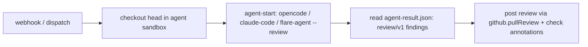

# 09. `agentic-review` — a coding agent reviews in a sandbox (proposed)

> **Status: Proposed (design).** No run is registered yet. This spec sketches a
> heavier sibling to [`pr-review`](02-runs.md#12-pr-review) that runs a real
> coding-agent CLI (opencode, Claude Code, or a bespoke Effect CLI) against a
> **checked-out working tree** in the agent-tier sandbox — reusing the
> [self-healing](08-self-healing.md) image, model-proxy, and egress model
> wholesale. It also records *why* `pr-review` is deliberately NOT this.

## 1. The two review tiers

`pr-review` and this proposal sit at opposite ends of one axis: **does the
reviewer execute code?**

- **`pr-review` (live)** runs **in the Worker**. The body resolves a model-route
  backend (`workers-ai` | `anthropic` | `bedrock`) and makes one structured
  model call per domain through the `modelGateway` capability; the **diff travels
  in the prompt** ([`runs/pr-review.ts`](../runs/pr-review.ts),
  [`packages/review-agent`](../packages/review-agent/)). The one container image
  is used only for `git` (checkout + `base...head` diff). The reviewer never
  reads a file outside the diff and never runs a command.

- **`agentic-review` (proposed)** runs a **coding agent in the agent-tier
  sandbox**. The agent gets a real working tree, reads any file it wants,
  optionally runs read-only tooling (typecheck, tests, `grep`), and iterates —
  the same shape as [`self-heal-pr`](../runs/self-heal-pr.ts)'s `flare-agent`
  loop, but the output is **review findings, not a patch**.

> NAMING. `opencode` / `reasonix` are NOT model-route backends — that was a
> misnomer, now collapsed to `workers-ai` (see [`backend.ts`](../packages/review-agent/src/backend.ts)).
> The names are reserved for **exactly this tier**: an actual coding-agent CLI
> spawned in a sandbox. `opencode` here means the OSS tool, run via the
> [`agent/v1`](08-self-healing.md#61-agent-adapter-contract-agentv1--swappable-like-collectors)
> adapter (`@opencode-ai/sdk` is already a workspace dependency).

## 2. Worker-based vs. agentic-container-based review — the recommendation

| Dimension | Worker model-call review (`pr-review`) | Agentic sandbox review (`agentic-review`) |
|---|---|---|
| Where it runs | V8 isolate (Worker) | Linux container (agent tier) |
| Context the reviewer sees | the **diff** only (prompt-embedded) | the **whole working tree**, read on demand |
| Can run build / tests / lint / grep | ❌ no subprocess in an isolate | ✅ native (the value of the tier) |
| Cross-file / architectural reasoning | weak — only changed hunks | strong — can follow callers, read configs |
| Cost per review | one model call per domain (cheap) | long agentic loop + checkout + tool runs (≫) |
| Latency | seconds | minutes (container boot + agent loop) |
| Ack within webhook's 10 s window | ✅ trivially (work stays in the Workflow) | ✅ via async dispatch (run is durable) |
| Untrusted model-authored actions | n/a — it only emits text | runs in the **credential-free, egress-allowlisted** sandbox (specs/08 §6.1/§10.1) |
| Determinism / reproducibility | high (single structured call) | lower (agent trajectory varies) |

**Recommendation: keep `pr-review` (Worker) as the default; add `agentic-review`
(container) as an opt-in escalation, not a replacement.** The diff-fed Worker
path is the right default — cheap, fast, deterministic, and good enough for the
"did this change introduce a bug?" question, which is local to the diff. Reach
for the agentic tier only when a review genuinely needs what the diff can't give:
whole-repo context, "does this break callers I can't see in the hunk?", or
running the test/typecheck to ground a claim. Spending minutes of container
compute + an agent loop on every PR to answer questions the diff already answers
is the wrong default. Gate it behind a label (e.g. `deep-review`) or a per-repo
config, the same way `pr-review` already gates on draft/skip labels.

The boundary is the exec question: the moment a review must **run code** to be
correct, it belongs in the container; until then, the Worker is strictly better.

## 3. The `agentic-review` run — sketch

Reuse, don't rebuild. The agent tier already exists for self-heal; this run is a
thin new body over the same primitives.

- **Image / tier.** `sandboxImage: "agent"` — the `WITH_AGENT` variant of
  [`infra/Dockerfile.sandbox`](../infra/Dockerfile.sandbox) that already bakes
  the agent CLIs onto `PATH`. No new image.
- **Checkout.** `workspace({ repo, sha, install })` exactly like `self-heal-pr`
  — a real working tree. `install` only if the chosen agent runs tooling.
- **Model access — credential-free.** The agent reaches the model **only**
  through the Worker model-proxy with a per-execution capability token the Worker
  injects (`FLARE_MODEL_PROXY` / `FLARE_AGENT_TOKEN`); it holds no model key and
  no GitHub App key. Identical to self-heal §6.3.
- **Egress.** The mandatory agent-tier allowlist (model-proxy + git remote only)
  applies unchanged — untrusted agent code cannot exfiltrate.
- **Agent invocation.** `sandbox.runDetached` + `waitForExit` (a 10–20-min
  indivisible loop must not replay on Worker eviction — self-heal §11). Command
  is the `agent/v1` adapter in **review mode**, e.g.
  `opencode review --base <sha> --out review-result.json` (the adapter
  normalizes opencode / Claude Code / `flare-agent` behind one contract).
- **Output — `review/v1`.** The agent writes findings (file, line, severity,
  rationale) the run decodes with the **existing
  [`ReviewOutputSchema`](../packages/review-agent/src/schemas.ts)** and posts via
  the same `github.pullReview` + check-run annotation path `pr-review` uses. The
  surface stays identical; only the *producer* moved from a Worker model call to
  a sandboxed agent.
- **Backend reuse.** The model the agent talks to is still resolved by
  `resolveBackend` under an `agentic-review.*` namespace — same `workers-ai` |
  `anthropic` | `bedrock` routes. The *agent runtime* (which CLI) is a separate
  axis, selected by `agentic-review.agent` → `opencode` | `claude-code` |
  `flare-agent`.

## 4. Open questions

1. **Verification scope.** Should the agent be allowed to *run tests* during
   review, or read-only (no execution) for V0? Running tests grounds findings but
   costs minutes and needs `install`. *Lean: read-only V0, tests behind a flag.*
2. **Trajectory determinism.** An agent's findings vary run-to-run more than a
   single structured call. Do we pin temperature/seed, or accept variance as the
   cost of depth?
3. **Agent runtime default.** Same open question as self-heal §13 — `opencode`
   vs `claude-code` vs a thin Effect CLI. The `agent/v1` (here, `review/v1`)
   contract keeps it swappable; V0 needs one default.
4. **Cost guardrail.** A per-review token + wall-clock budget (self-heal already
   has `token-budget` / `max-iterations`); reviews should inherit the same caps.

## 5. Relationship to existing specs

- Builds directly on [08-self-healing](08-self-healing.md) — same tier, image,
  proxy, egress, and `agent/v1` adapter taste.
- Complements [02-runs §12 `pr-review`](02-runs.md#12-pr-review) — does not
  replace it. `pr-review` stays the default; this is the escalation path.
- Inherits the [07-trust-model](07-trust-model.md) boundary: untrusted
  agent-authored actions run only in the credential-free sandbox.
