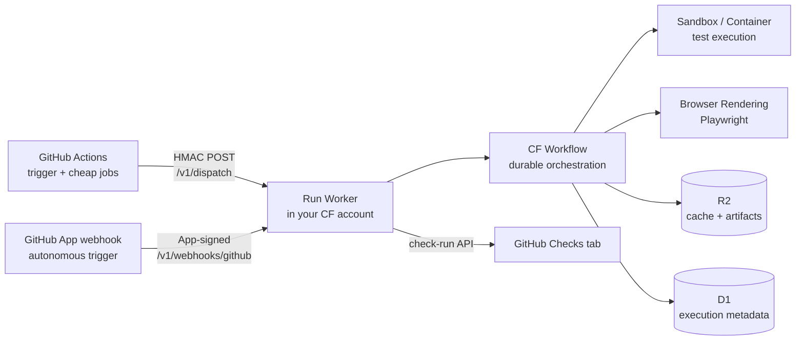

# PRD — FlareDispatch

**BYOC (Cloudflare)** CI/CD that offloads the expensive half of CI from GitHub Actions onto a Cloudflare stack — bring your own Cloudflare account, `wrangler deploy` the reusable typed **runs** into it, done in under an hour.

## Problem

GitHub Actions is excellent as a trigger and a PR gate, and fine for cheap jobs (lint, type-check, unit). It is a poor fit for the *heavy* half of CI:

- **Per-minute billing on slow work.** Playwright e2e suites, acceptance tests against a running app, large sharded matrices, and long security scans are exactly the jobs that consume the most GHA minutes — and GHA minutes are expensive relative to raw serverless compute.
- **Hard ceilings.** A 6-hour job limit, `actions/cache` at a 10 GB cap with eviction, `actions/upload-artifact` with a fixed 90-day retention.
- **Fan-out is awkward.** Matrix builds are capped and coarse; there is no scale-to-zero between runs.

Teams work around this with self-hosted runners (which they must operate and secure) or by simply eating the bill. Neither is good.

## Who needs this

| Persona | Pain today | What FlareDispatch gives them |
|---|---|---|
| **Small / mid eng team with a heavy test suite** | A Playwright or integration suite that dominates their GHA bill and wall-clock time | Heavy compute moves to CF Containers + Workflows fan-out; GHA keeps the trigger and the cheap jobs. See [06-cost](06-cost.md). |
| **Team already on Cloudflare (Workers Paid)** | Wants to consolidate infra; doesn't want a second vendor or a runner fleet to operate | One `wrangler deploy` into the account they already pay for. See [05-byoc](05-byoc.md). |
| **Platform / DevEx engineer** | Owns CI tooling for an org; needs something auditable, typed, and forkable — not opaque YAML | Runs are typed Effect-TS programs the team owns and vendor-edits. See [03-dsl](03-dsl.md). |
| **OSS maintainer / autonomous-CI user** | Wants PR review, smoke, or scheduled jobs on *every* push without burning GHA minutes or adding workflow files | Webhook mode: the GitHub App fires runs directly, zero GHA minutes, no `.github/workflows/` edits. See [04-gha-integration § Webhook mode](04-gha-integration.md#webhook-mode). |

Not for: teams whose CI is already cheap and fast (lint + unit only) — there is nothing to offload.

## Value proposition

1. **Lower cost on heavy CI.** Per-execution compute is billed at CF Container rates (per vCPU-second, scale-to-zero) instead of GHA per-minute. Worked estimates and the head-to-head with GHA list pricing are in [06-cost](06-cost.md).
2. **No platform ceilings.** Multi-step Workflows have no 6-hour limit; R2 cache and artifacts have no 10 GB cap and user-controlled retention. See [01-architecture § Platform limits](01-architecture.md#platform-limits--design-constraints).
3. **Cheap, wide fan-out.** Workflows `createBatch` spawns up to 100 children per call, 50,000 concurrent instances per account, scale-to-zero between runs. See [01-architecture § Fan-out model](01-architecture.md#fan-out-model).
4. **You own the runs.** Runs are typed Effect programs — composable steps, tagged errors, exhaustive matching, retry/Schedule combinators — not stringly-typed YAML. Fork them, vendor-edit them, unit-test them without booting a container. See [02-runs](02-runs.md) and [03-dsl](03-dsl.md).
5. **BYOC, no new dashboard.** Every code path assumes "deployed into the user's own Cloudflare account" — bring-your-own-Cloud, no operator runs it for you. Status reports back as a GitHub Check Run — the existing PR UI is the UI. See [04-gha-integration § Check-runs callback](04-gha-integration.md#check-runs-callback-shared-by-both-modes).
6. **Two trigger modes, one Dispatcher.** Action mode interleaves with existing GHA jobs; Webhook mode runs autonomously with zero GHA minutes. See [04-gha-integration](04-gha-integration.md).

## What a run is

A **run** is a typed, named Effect-TS program with:

- A `Schema`-defined input contract (what the caller sends).
- A `Schema`-defined output contract (what gets posted back).
- A sequence of `step`s, each mapped to a CF Workflow step, composed via `Effect.gen`.
- Access to a fixed set of platform primitives: `sandbox`, `browser`, `cache`, `artifact`, `io`.

Runs are not opaque — they are TypeScript files in the user's repo. The shipped runs are the starter library; the DSL is the contract. Full catalog in [02-runs](02-runs.md); DSL surface in [03-dsl](03-dsl.md).

## Operating model — BYOC (Cloudflare)

A team installs runs by:

1. Forking or cloning a template repo.
2. Setting Workers Secrets (GitHub App key, HMAC secret).
3. `wrangler deploy`.
4. Installing the companion GitHub App on their org/repos.
5. Adding `uses: openhackersclub/flaredispatch-action@v1` to their workflow (Action mode), or just letting the App webhook fire runs (Webhook mode).

After that, each PR fires runs against the team's own Cloudflare bill. The project supplies the runs, the GHA Action, and the Effect-TS DSL packages. The team supplies the account. Full deploy guide in [05-byoc](05-byoc.md).

## Non-goals

- **Replacing GitHub Actions.** GHA remains the trigger, PR gate, and home for fast jobs. Runs are an offload target, not a control plane.
- **Hosted SaaS in v1.** Every code path assumes "deployed into the user's Cloudflare account." A SaaS edition is possible later; it is not a v1 constraint we design around.
- **A new dashboard / UI.** GitHub Check Runs are the UI. Logs and artifacts are served via R2 signed URLs linked from the check summary.
- **Secrets management product.** Workers Secrets is sufficient; runs don't reinvent it.
- **Generalized workflow engine.** Runs are for CI-shaped work. For durable business workflows, use Trigger.dev or Temporal.

## Success criteria

V0 is the slice that proves the model — a `pnpm test` executing in CF Sandbox reports green/red to a PR check. Everything after is incremental and independently shippable: V1 adds fan-out + cache + artifacts, V2 browser e2e + acceptance, V3 long-running + security scans, V4 polish (OpenTelemetry, retention, an `init` CLI).

Project-management detail lives under [`pm/`](pm/): the phased roadmap — scope, runs shipped, and the exit criterion that closes each phase — and the 7-PR V0 build sequence are both in [pm/plan.md](pm/plan.md).

## Relationship to Cloudflare Workers CI/CD

Cloudflare ships its own CI/CD — [Workers Builds](https://developers.cloudflare.com/workers/ci-cd/) — but it solves a **different problem at a different layer**. Workers Builds (and the GitHub Actions integration the same docs describe) automates *building and deploying Worker code* on a git push: it pushes your Worker to production, manages deploy credentials, and keeps deployments consistent across a team. It does **not** run your repository's test suites — there is no integrated test runner and no arbitrary-suite execution.

FlareDispatch is not a deploy pipeline. It is a **test-compute offload**: it executes Playwright e2e, acceptance suites, sharded matrices, and security scans inside CF Containers / Browser Rendering / Workflows and reports the outcome as a GitHub Check Run. The two are complementary, not competing:

- **Workers Builds deploys FlareDispatch.** The FlareDispatch Dispatcher is itself a Worker, so Workers Builds is a perfectly good way to deploy and keep it updated — see [05-byoc](05-byoc.md).
- **FlareDispatch runs the tests Workers Builds doesn't.** Workers Builds has no opinion about your repo's heavy test suite; FlareDispatch is exactly that opinion.
- **Same platform, different layer.** FlareDispatch is built *on* the same Cloudflare primitives Workers Builds deploys to — Workers, Workflows, Containers, Browser Rendering, R2, D1 — but it is an orchestration plane for CI work, not a code-deployment pipeline.

## Comparison with adjacent options

| | Role |
|---|---|
| **Cloudflare Workers CI/CD** ([Workers Builds](https://developers.cloudflare.com/workers/ci-cd/)) | Cloudflare's own CI/CD — builds and *deploys Worker code* on git push. Different layer entirely (see above): it ships Workers, it doesn't run test suites. Complementary — Workers Builds can deploy the FlareDispatch Dispatcher itself. |
| **Depot** | GHA runner accelerator. Complementary — keep using it for fast jobs that stay on GHA. Not a backend for these runs; reselling its runners has no margin. |
| **Trigger.dev** | Durable workflow platform. Could be the backend for a non-Cloudflare BYOC edition later. Out of scope for v1 — adds Postgres + Redis ops that conflict with the easy-BYOC goal. |
| **Buildkite Agent** | Hybrid CI: their orchestrator, your compute. Same shape as this project, but you operate VMs. Runs replace the "your compute" half with serverless CF. |
| **Earthly / Dagger** | Local-and-CI build engines. Could be invoked *inside* a run step; not a substitute for the orchestration plane. |

## Spec index

| Spec | Covers |
|---|---|
| [01-architecture](01-architecture.md) | Components, per-execution lifecycle, storage, fan-out, platform limits |
| [02-runs](02-runs.md) | Run catalog with inputs/outputs/primitives |
| [03-dsl](03-dsl.md) | Effect-TS DSL surface — `defineRun`, `step`, `sandbox`, `browser`, `cache`, `artifact` |
| [04-gha-integration](04-gha-integration.md) | Two trigger modes (Action / Webhook), HMAC auth, check-runs callback |
| [05-byoc](05-byoc.md) | Bindings, secrets, wrangler config, GitHub App, local dev |
| [06-cost](06-cost.md) | Cost model, worked estimates, head-to-head with GHA pricing |
| [pm/plan](pm/plan.md) | Delivery roadmap (V0–V4) and the 7-PR V0 build plan |
