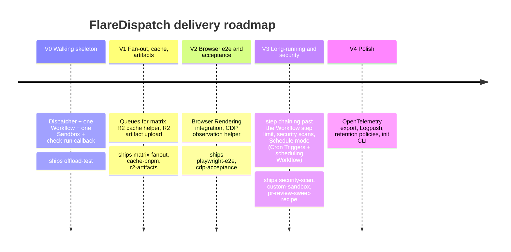

# FlareDispatch — Roadmap & V0 Plan

Project-management reference for FlareDispatch: the phased delivery roadmap, then the detailed V0 walking-skeleton build plan. The run catalog is in [02-runs](../02-runs.md); the product framing is in [PRD](../PRD.md).

## Roadmap

Delivery phasing — what ships in each version and the exit criterion that closes it. **V0 is the slice that proves the model**; V1–V4 are incremental and independently shippable.



### Phases

| Phase | Scope | Runs shipped | Exit criterion |
|---|---|---|---|
| **V0 — Walking skeleton** | Dispatcher Worker + one Workflow + one Sandbox + check-run callback | `offload-test` | A `pnpm test` executing in CF Sandbox reports green/red to a PR check |
| **V1 — Fan-out + cache + artifacts** | Queues for matrix; R2 cache helper; R2 artifact upload with signed URLs | `+ matrix-fanout`, `+ cache-pnpm`, `+ r2-artifacts` (primitives) | 8-shard test matrix on CF beats GHA wall time on a real repo |
| **V2 — Browser e2e + acceptance** | Browser Rendering integration; CDP observation helper | `+ playwright-e2e`, `+ cdp-acceptance` | Sharded Playwright suite reports per-shard status; gctrl-board acceptance suite executes |
| **V3 — Long-running + security** | Step chaining for suites past the Workflow step limit; security scan runs; **Schedule mode** — `scheduled()` handler, `triggers.crons`, scheduling Workflow (enumerate + fan-out), `schedules` on `defineRun`, `step.sleepUntil` | `+ security-scan`, `+ custom-sandbox`; `pr-review-sweep` recipe | 30-min suite completes; npm audit / cargo audit / trivy run in Sandbox; a cron tick fans out a `pr-review` per open PR |
| **V4 — Polish** | OpenTelemetry export, Logpush integration, retention policies, `flare-dispatch init` CLI | — | Time-to-first-green-check < 30 min on a fresh CF account |

## V0 walking-skeleton plan

The smallest end-to-end slice that proves the model from the [roadmap](#roadmap) above:

> **V0 acceptance:** a `pnpm test` executing in CF Sandbox reports green/red to a PR check.

Everything else from V1–V4 is deferred. This plan covers what we build, in what order, and how we know it works.

### 1. Scope

- **Dispatcher Worker** — HMAC verify on `POST /v1/dispatch/offload-test`, instantiate the Workflow, return `202 {executionId}`. Plus `GET /health` and a single artifact endpoint `GET /v1/artifacts/:execution/:name` that 302-redirects to a short-lived R2 signed URL.
- **One Workflow class** — `RunWorkflow extends WorkflowEntrypoint`, dispatches to `offload-test.run` under an Effect runtime.
- **One run** — `offload-test` (clone → exec → upload log → finalize). Inputs/outputs per [02-runs § 1](../02-runs.md#1-offload-test).
- **Sandbox / Container binding** — single container per execution, default Node image.
- **R2 bucket** — `logs/<execution-id>/<step>.ndjson` only (no `cache/`, no `artifacts/` directory tar pipeline).
- **D1** — `executions` + `steps` tables per [05-byoc § D1 schema](../05-byoc.md#d1-schema).
- **GitHub App** — JWT → installation token → `POST /repos/.../check-runs` (in_progress) and `PATCH .../check-runs/{id}` (completed).
- **Effect-TS DSL surface** — `defineRun`, `step`, `sandbox.git.clone`, `sandbox.exec`, `artifact.upload` (logs only), `io.now`, `io.uuid`, `io.log`. Tagged errors from [03-dsl § Errors](../03-dsl.md#errors). All other DSL surface stubbed to `Effect.die("not implemented in V0")`.
- **GHA composite Action** — `action.yml` + a ~30 LOC bash entry (`dispatch.sh`) that HMAC-signs the body and POSTs. Fire-and-forget only.

### 2. Out of scope (deferred to V1+)

| Deferred | Why |
|---|---|
| Matrix fan-out (Queues + Coordinator DO + child Workflows) | Adds three components (Queue, DO, spawner) and the per-shard check-run aggregation. None of it is needed to prove a single container reports green/red. → V1. |
| Browser Rendering binding, `playwright-e2e`, `cdp-acceptance` | Requires browser pool + CDP plumbing + report merging. Orthogonal to "Sandbox → check-run." → V2. |
| Cache restore/save (`cache.restoreOr`, `cache.save`) | Optimization, not a correctness primitive. V0 re-executes `pnpm install` every execution; that's fine for a smoke. → V1. |
| Other runs (`matrix-fanout`, `security-scan`, `custom-sandbox`) | One run is enough to prove the contract; the others are variations on the same DSL. → V1/V3. |
| CLI (`flare-dispatch init`, `flare-dispatch dispatch`, etc.) | A `curl` script and `wrangler deploy` cover V0 onboarding. → V4. |
| OpenTelemetry export | Workflows' built-in metrics + R2 NDJSON logs are enough to debug V0. → V4. |
| Multi-environment (`env.staging` / `env.prod`) | Single deploy on `*.workers.dev`. Splitting environments is mechanical once V0 works. → V4. |
| Retention crons (R2 lifecycle, D1 prune) | At V0 volumes, retention is "delete the bucket if you want a reset." → V4. |
| Custom domain | `https://flare-dispatch-v0.<account>.workers.dev` is the public endpoint. Custom domain is DNS, not code. → V4. |
| `await` mode in the GHA Action | Fire-and-forget covers the acceptance criterion. Await mode adds polling + GHA timeout logic. → V1. |
| **App-webhook trigger surface** (`POST /v1/webhooks/github`) | V0 proves the HMAC-POST dispatch path end-to-end. The autonomous App-webhook trigger ([04-gha-integration § Webhook mode](../04-gha-integration.md#webhook-mode)) adds receiver-side gate logic, run-level trigger config, and `check_run.rerequested` re-run handling — orthogonal to "Sandbox → check-run." → V1. |
| **Schedule-mode trigger surface** (`scheduled()` handler + `triggers.crons`) | V0 has no time-triggered runs. Schedule mode ([04-gha-integration § Schedule mode](../04-gha-integration.md#schedule-mode)) adds the `scheduled()` handler, the scheduling Workflow (enumerate targets → fan out), and `schedules` on `defineRun`. It builds on the V1 App-JWT enumeration + dedup KVs and the V1 `createBatch` fan-out — nothing to prove until those exist. → V3. |
| **`step.waitForEvent` + `/v1/admin/events/:wf_id`** | Human-in-loop runs (release approval, manual gates) aren't part of the V0 acceptance criterion. The DSL primitive is documented in [03-dsl § Human-in-the-loop](../03-dsl.md#human-in-the-loop-with-stepwaitforevent) but the Dispatcher route + CF Access wiring lands with the first run that needs it. → V2/V3. |
| **`IDEMPOTENCY_KV` / `INSTALL_TOKEN_KV` KV namespaces** | V0 dispatches are caller-driven (one POST per CI run, no redelivery storm to absorb), and a single Worker process can keep the install token in memory. The dedicated KVs land with the App-webhook trigger in V1, where receiver-level dedup on `X-GitHub-Delivery` is load-bearing. → V1. |
| Container image build & publish to GHCR | V0 references `node:lts-slim` or a hand-built local image; the OHC base images are a separate stream. → V1. |

### 3. Repository layout for V0

```
flare-dispatch/
├── wrangler.jsonc                              # bindings: Workflow, Container, R2, D1; no DO/Queue/Browser in V0
├── package.json                                # pnpm workspace root
├── pnpm-workspace.yaml                         # packages/* + apps/dispatcher
├── tsconfig.base.json                          # strict TS + Effect-friendly settings
├── .github/
│   └── workflows/
│       └── ci.yml                              # typecheck + vitest on every PR
├── apps/
│   └── dispatcher/
│       ├── package.json                        # depends on @flare-dispatch/core + @flare-dispatch/runtime-cf
│       ├── src/
│       │   ├── index.ts                        # Worker entry: fetch handler dispatching to routes
│       │   ├── routes/
│       │   │   ├── dispatch.ts                 # POST /v1/dispatch/:run — HMAC verify + instantiate Workflow
│       │   │   ├── artifacts.ts                # GET /v1/artifacts/:execution/:name — sign + 302 redirect to R2
│       │   │   └── health.ts                   # GET /health — returns {status, runs}
│       │   ├── hmac.ts                         # constant-time HMAC-SHA256 verify
│       │   ├── workflow.ts                     # RunWorkflow class extending WorkflowEntrypoint
│       │   └── env.ts                          # typed Env interface for bindings
│       └── tsconfig.json
├── packages/
│   ├── core/                                   # @flare-dispatch/core — DSL primitives
│   │   ├── package.json
│   │   ├── src/
│   │   │   ├── index.ts                        # public exports
│   │   │   ├── define-run.ts                   # defineRun constructor + Run<I,O> type
│   │   │   ├── step.ts                         # step() — wraps an Effect in a Workflow checkpoint
│   │   │   ├── errors.ts                       # Schema.TaggedError classes from 03-dsl § Errors
│   │   │   ├── context.ts                      # RunContext = Context.Tag union of services
│   │   │   ├── services/                       # capabilities — one Context.Tag per namespace
│   │   │   │   ├── sandbox.ts                  # Context.Tag for SandboxService + interface
│   │   │   │   ├── artifact.ts                 # Context.Tag for ArtifactService + interface
│   │   │   │   ├── io.ts                       # Context.Tag for IOService + interface
│   │   │   │   ├── checks.ts                   # Context.Tag for ChecksService (GitHub check-runs)
│   │   │   │   └── executions.ts               # Context.Tag for ExecutionsService (D1 metadata writes)
│   │   │   ├── primitives/                      # reusable compositions — 03-dsl § Primitives
│   │   │   │   ├── index.ts                    # @flare-dispatch/core/primitives public exports
│   │   │   │   ├── workspace.ts                # acquire + clone (+ optional cached install)
│   │   │   │   ├── install-cached.ts           # cache.restoreOr keyed on lockfile hash
│   │   │   │   ├── sharded.ts                  # count-and-index parallel fan-out
│   │   │   │   ├── boot-app.ts                 # runDetached + waitForPort
│   │   │   │   └── probe-http.ts               # curl-and-classify endpoint probe
│   │   │   └── fakes/                          # in-memory Layers for unit tests
│   │   │       ├── sandbox-fake.ts             # records exec calls; returns canned ExecResult
│   │   │       ├── artifact-fake.ts            # in-memory map of name → fake signed URL
│   │   │       ├── io-fake.ts                  # deterministic now/uuid for tests
│   │   │       ├── checks-fake.ts              # records check-run create/update calls
│   │   │       └── executions-fake.ts          # in-memory executions + steps tables
│   │   └── tsconfig.json
│   ├── runtime-cf/                             # @flare-dispatch/runtime-cf — live CF bindings
│   │   ├── package.json
│   │   ├── src/
│   │   │   ├── index.ts                        # exports CFRuntimeLive Layer
│   │   │   ├── sandbox-cf.ts                   # SandboxService via Containers binding
│   │   │   ├── artifact-r2.ts                  # ArtifactService backed by R2 bucket
│   │   │   ├── io-live.ts                      # IOService using globalThis.crypto + Date
│   │   │   ├── executions-d1.ts                # ExecutionsService via D1 binding (INSERT executions/steps)
│   │   │   └── checks-github.ts                # ChecksService via GitHub App installation token
│   │   └── tsconfig.json
│   └── github-app/                             # @flare-dispatch/github-app — App auth helpers
│       ├── package.json
│       ├── src/
│       │   ├── index.ts
│       │   ├── jwt.ts                          # sign App JWT with RS256 from PEM secret
│       │   ├── installation-token.ts           # exchange JWT for installation token; cache in-memory
│       │   └── check-runs.ts                   # POST/PATCH /repos/{owner}/{repo}/check-runs
│       └── tsconfig.json
├── runs/
│   └── offload-test.ts                         # the V0 run (see 03-dsl § Top-level shape)
├── infra/
│   ├── d1-schema.sql                           # executions + steps tables verbatim from 05-byoc § D1 schema
│   └── github-app-manifest.json                # GitHub App manifest (see 05-byoc § GitHub App setup)
├── actions/
│   └── flare-dispatch-action/
│       ├── action.yml                          # composite Action: 'using: composite', steps run dispatch.sh
│       ├── dispatch.sh                         # ~30 LOC: compute HMAC, curl POST, exit 0
│       └── README.md                           # usage snippet
├── README.md                                   # quickstart: wrangler deploy + Action snippet
└── specs/                                      # this directory (unchanged in V0)
```

### 4. PR sequence

Each PR targets `main`, is independently mergeable, and ships a single concern. The order makes downstream PRs reviewable in isolation (the prior PR's surface is already merged).

#### PR 1 — Repo scaffold + wrangler config

- **What:** pnpm workspace, `tsconfig.base.json`, `wrangler.jsonc` declaring V0 bindings only (Workflow, Container, R2, D1 — no Queue/DO/Browser), `infra/d1-schema.sql`, empty `apps/dispatcher/src/index.ts` returning `{status: "ok"}` on `/health`, CI workflow executing `pnpm typecheck` + `pnpm test`.
- **Verifiable acceptance:** `pnpm install && pnpm typecheck && wrangler deploy --dry-run` exits 0; `wrangler d1 execute flare-dispatch-v0 --file infra/d1-schema.sql --local` creates both tables.

#### PR 2 — `@flare-dispatch/core` DSL + tagged errors + fakes

- **What:** `defineRun`, `step`, all `Schema.TaggedError` classes from [03-dsl § Errors](../03-dsl.md#errors), `Context.Tag`s for `SandboxService`/`ArtifactService`/`IOService`/`ChecksService`/`ExecutionsService`, and the in-memory fake Layer for each. No live implementations.
- **Verifiable acceptance:** `pnpm --filter @flare-dispatch/core test` passes. A unit test composes `step("a", () => Effect.succeed(1))` and asserts the run runtime invokes the fake `ExecutionsService` once per step. `Match.exhaustive` on every tagged error compiles.

#### PR 3 — `offload-test` run + run-level unit tests

- **What:** `runs/offload-test.ts` exactly as sketched in [03-dsl § Top-level shape](../03-dsl.md#top-level-shape). Uses only `sandbox.git.clone`, `sandbox.exec`, `artifact.upload`, `io.now`. Unit tests under `runs/offload-test.test.ts` using `CFRuntimeTest` + a `sandboxFakeProgram` matching the [03-dsl § Unit-testing runs](../03-dsl.md#unit-testing-runs) pattern.
- **Verifiable acceptance:** `pnpm test` passes for: (a) green path — fake `pnpm test` exits 0, output `.exitCode === 0`; (b) red path — fake exits 1, output `.exitCode === 1`, no thrown error; (c) timeout — fake raises `ExecTimeout`, run re-fails with the same tag.

#### PR 4 — Live runtime Layers (`@flare-dispatch/runtime-cf`) + `RunWorkflow` class

- **What:** `SandboxCloudflareLive` calling the Containers binding, `R2ArtifactLive` writing log NDJSON, `D1ExecutionsLive` writing `executions`/`steps` rows, `IOLive` using platform `crypto.randomUUID()`/`Date.now()`. `apps/dispatcher/src/workflow.ts` exports `RunWorkflow extends WorkflowEntrypoint`, whose `run(event, step)` maps each `step.do(name, ...)` call to a run `step(name, ...)` boundary. `wrangler.jsonc` workflows binding added.
- **Verifiable acceptance:** `pnpm dev` (wrangler dev) + `curl -X POST http://localhost:8787/v1/dispatch/offload-test -H 'X-FlareDispatch-Signature: sha256=<hmac>' -d @fixtures/dispatch.json` returns `202 {executionId}`, and `wrangler d1 execute --local` shows one row in `executions` and N rows in `steps`. R2 `logs/<executionId>/exec.ndjson` exists in local Miniflare R2.

#### PR 5 — Dispatcher routes + HMAC verify + artifact signed-URL endpoint

- **What:** `apps/dispatcher/src/routes/dispatch.ts` does Schema-validate the body against `offload-test.inputs`, HMAC-verify with constant-time compare against `env.HMAC_SECRET`, then call `env.RUNS_WORKFLOW.create({...})`. Add `GET /v1/artifacts/:execution/:name` that signs an R2 URL and 302-redirects. `GET /health` lists registered runs.
- **Verifiable acceptance:** `vitest run apps/dispatcher` covers: invalid HMAC → 401; valid HMAC + invalid body → 400 with Schema error inlined; valid HMAC + valid body → 202 + `{executionId}`. A separate test fetches `/v1/artifacts/<executionId>/exec.ndjson` after a fake execution and asserts 302 with a signed URL pointing at R2.

#### PR 6 — GitHub App auth (`@flare-dispatch/github-app`) + ChecksService live binding

- **What:** RS256 JWT signer using the PEM secret, installation-token exchange + cache (Worker memory only in V0 — the `INSTALL_TOKEN_KV` fallback is deferred to V1 per § 2; see [04-gha-integration § Check-runs callback](../04-gha-integration.md#check-runs-callback-shared-by-all-modes)), `POST` / `PATCH` to `/repos/{owner}/{repo}/check-runs`. Wire `ChecksGithubLive` into the runtime Layer so `offload-test` posts `in_progress` on start and `completed` with conclusion at end.
- **Verifiable acceptance:** Integration test against an MSW-mocked `api.github.com` asserts: (a) one POST to `/repos/.../check-runs` with `status: in_progress`; (b) one PATCH with `status: completed` and `conclusion: success` for green, `failure` for red. End-to-end manual: dispatch against a real test repo, observe check-run appears on the commit's Checks tab.

#### PR 7 — GHA composite Action + acceptance smoke

- **What:** `actions/flare-dispatch-action/action.yml` (composite, `using: composite`) calling `dispatch.sh`. `dispatch.sh` is ~30 LOC: compute `HMAC = openssl dgst -sha256 -hmac "$INPUT_HMAC_SECRET"`, curl POST, exit 0 on 202, fail on anything else. Plus a `.github/workflows/acceptance.yml` in this repo that uses the local action against the live deploy. Quickstart `README.md` with copy-paste deploy steps.
- **Verifiable acceptance:** A PR against this repo triggers `.github/workflows/acceptance.yml`, which calls the Action, which dispatches `offload-test` with `command: "pnpm test"` against this repo's own SHA. The check-run posted by the Worker turns green and appears as a required-status candidate on the PR. End-to-end timing recorded in PR comment.

### 5. Acceptance test

The full V0 walking skeleton works iff this sequence executes green from a fresh clone.

```sh
# 0. Prereqs — Cloudflare Workers Paid, gh CLI authed, wrangler ≥ 4
git clone https://github.com/openhackersclub/flare-dispatch && cd flare-dispatch
pnpm install
pnpm typecheck                       # PR1 + PR2 + PR3 + PR4 invariants
pnpm test                            # all unit tests across packages
```

```sh
# 1. Provision CF resources
wrangler r2 bucket create flare-dispatch-v0
wrangler d1 create flare-dispatch-v0
wrangler d1 execute flare-dispatch-v0 --remote --file infra/d1-schema.sql
# wrangler writes IDs back into wrangler.jsonc

# 2. Set secrets
wrangler secret put HMAC_SECRET                          # 32-byte base64
wrangler secret put GITHUB_APP_ID                        # numeric
wrangler secret put GITHUB_APP_PRIVATE_KEY < ./app.pem   # piped from PEM
wrangler secret put GITHUB_WEBHOOK_SECRET                # not used in V0 but present

# 3. Deploy
wrangler deploy
# Note the deployed URL, e.g. https://flare-dispatch-v0.<account>.workers.dev

# 4. Health check
curl -fsS https://flare-dispatch-v0.<account>.workers.dev/health
# Expected: {"status":"ok","runs":["offload-test"]}
```

```sh
# 5. Install the GitHub App on a test repo
# (manual: visit the app install URL from infra/github-app-manifest.json setup)

# 6. Direct dispatch — simulates what the GHA Action does
BODY='{"run":"offload-test","github":{"repo":"owner/test-repo","ref":"refs/heads/main","sha":"<sha>","installation_id":<id>},"inputs":{"repo":"owner/test-repo","sha":"<sha>","command":"pnpm test"},"trigger":{}}'
SIG=$(printf '%s' "$BODY" | openssl dgst -sha256 -hmac "$HMAC_SECRET" -binary | xxd -p -c 256)
curl -fsS -X POST https://flare-dispatch-v0.<account>.workers.dev/v1/dispatch/offload-test \
  -H "Content-Type: application/json" \
  -H "X-FlareDispatch-Signature: sha256=$SIG" \
  -d "$BODY"
# Expected: 202 {"executionId":"01J..."}
```

```sh
# 7. Observe — within the run's wall-time ceiling
gh pr checks <pr-number-of-test-commit>
# Expected: flare-dispatch/offload-test  PASS (or FAIL with the test command's exit)

# 8. Inspect via D1
wrangler d1 execute flare-dispatch-v0 --remote --command "SELECT id, status, completed_at FROM executions WHERE id = '01J...'"
# Expected: status = success | failure, completed_at populated

# 9. Inspect log
wrangler d1 execute flare-dispatch-v0 --remote --command "SELECT log_uri FROM steps WHERE execution_id = '01J...' AND name = 'exec'"
# Open the returned log_uri (signed via /v1/artifacts/...); see NDJSON of exec output
```

```sh
# 10. PR-driven smoke (the real acceptance bar)
# In a downstream repo:
#   .github/workflows/ci.yml:
#     - uses: openhackersclub/flare-dispatch-action@v0
#       with:
#         run: offload-test
#         endpoint: ${{ vars.FLAREDISPATCH_ENDPOINT }}
#         hmac-secret: ${{ secrets.FLAREDISPATCH_HMAC }}
#         inputs: '{"repo":"${{ github.repository }}","sha":"${{ github.sha }}","command":"pnpm test"}'
gh pr create --title "smoke: flare-dispatch v0" --body "Tests the V0 walking skeleton"
gh pr checks <pr>
# Expected: flare-dispatch/offload-test reports green when `pnpm test` passes, red when it fails.
```

If steps 4, 6, 7, and 10 all pass, V0 is complete and the [roadmap](#roadmap) V0 exit criterion is met.

### 6. Risks + open questions

- **Container image is upstream of V0.** The run assumes a working Node container image. The OHC base images (`flare-dispatch-node:latest`) are a separate workstream; for V0 we either (a) hand-build a local image and reference it by digest, or (b) use `node:lts-slim` directly. PR1 should resolve which. *Risk:* slow first deploy if image isn't cached on CF's edge.
- **Sandbox / Containers binding API.** The spec assumes a `RUNS_SANDBOX` binding with a `fetch`-like exec surface. The current Cloudflare Containers API has been evolving; PR4's `SandboxCloudflareLive` is the most likely spot to discover a mismatch between [01-architecture § Sandbox](../01-architecture.md#data-plane) and reality. *Mitigation:* keep the `SandboxService` Tag interface narrow (`clone`, `exec`) so the live binding is a small surface to revise.
- **D1 write rate under load.** V0 writes one row per step transition (start + end). With only `offload-test` (4 steps), this is well within budget — but [01-architecture § Platform limits](../01-architecture.md#platform-limits--design-constraints) flags D1 hot-path writes as a concern at V1+ matrix scale. Worth a row-count assertion in PR4's test.
- **Coordinator DO + Queue declared but unused.** [05-byoc § Wrangler config](../05-byoc.md#wrangler-config) shows the Coordinator DO and `flare-dispatch-fanout` Queue in `wrangler.jsonc`. For V0 we omit both — they're unused and a DO migration is irreversible. *Open question:* do we ship a stub `Coordinator` class in V0 to make the V1 migration a no-op, or land it cleanly in V1? Plan currently chooses the latter.
- **Artifact endpoint scope ambiguity.** [03-dsl § artifact](../03-dsl.md#artifact) describes `artifact.upload` as a building block that returns a signed URL embedded in the check-run summary. For V0 we use it for logs only — but the dispatcher endpoint `GET /v1/artifacts/:execution/:name` still needs to exist so the check-run summary's "view logs" link works. PR5 covers this; just noting the scope creep risk.
- **GitHub App per-installation token cache eviction.** [04-gha-integration § Check-runs callback](../04-gha-integration.md#check-runs-callback-shared-by-all-modes) caches installation tokens in Worker memory with KV fallback. V0's PR6 ships memory-only — if the Worker is recycled mid-execution, the next check-run write does a fresh JWT exchange. Acceptable for V0 throughput; flag for V1.
- **Run replay determinism.** [03-dsl § step Rules](../03-dsl.md#step) requires non-determinism to flow through `io.now` / `io.uuid` so Workflow checkpoint replay is consistent. The `offload-test` run is simple enough that this is easy to enforce; PR3's unit test should explicitly assert no direct `Date.now()` / `crypto.randomUUID()` calls in the run body (lint or grep guard).
- **HMAC verification surface.** [04-gha-integration § Dispatch body](../04-gha-integration.md#dispatch-body) and [05-byoc § Secrets](../05-byoc.md#secrets) both reference `HMAC_SECRET`, but neither pins the canonicalization of the signed body (raw bytes vs. JSON-normalized). PR5 must lock this down — recommend signing **raw request bytes** as received, no normalization — and document in `apps/dispatcher/src/hmac.ts`.
- **Workflow step duration vs. run wall-time.** `offload-test` declares `maxDurationSec` at the run level (per [02-runs § 1](../02-runs.md#1-offload-test)), but a single `sandbox.exec` step is also bounded by the Workflow step duration ceiling. For V0 the run wall-time is shorter than the step ceiling so this is moot, but [01-architecture § Long-running test handling](../01-architecture.md#long-running-test-handling) introduces chunked/detached execution that V0 explicitly does **not** implement. *Open question:* should the run error tag for "command exceeded the Workflow step ceiling" be a distinct `StepDurationExceeded` or fold into `ExecTimeout`? Plan currently folds — flag for V1 revisit.

## V1 / V2 plan — toward `cdp-acceptance`

V0 ships `offload-test`. The next target is `cdp-acceptance` — the Playwright/CDP acceptance run [recipes/cdp-acceptance](../../recipes/cdp-acceptance/) sketches. It needs three capabilities V0 stubbed: a `config` store (for injected secrets), a `cache` (for `workspace({ install: true })`), detached container execution (`bootApp`), and Browser Rendering. That work is split across two PRs so each is independently reviewable; the run itself lands in PR9.

### PR 8 — `config` + `cache` live Layers + `loadSecrets` primitive

- **What:** `makeConfigKvLive` — the KV-backed `ConfigService` (`config.get` / `config.getJSON`), wired into `makeCFRuntimeLive` when the `CONFIG_KV` namespace binding is present (absent → the dying `ConfigDeferred` stub, so a config-reading run fails loudly). `makeCacheR2Live` — the R2 + Containers-backed `CacheService` (`restoreOr` / `save`), always wired, replacing V0's dying `CacheDeferred`; a cache entry is a gzipped tar at `cache/<key>.tar.gz`. `loadSecrets` (`@flare-dispatch/core/primitives`) — resolves a named set of config keys into the `Record<string,string>` env a run hands to `sandbox.exec` / `bootApp`, the path that moves credentials out of GHA repo secrets into the FlareDispatch config store. `CacheService.restoreOr`/`save` gain an optional `dir` (the directory `paths` are relative to). `wrangler.jsonc` adds the `kv_namespaces` `CONFIG_KV` binding.
- **Verifiable acceptance:** `pnpm typecheck` + `wrangler deploy --dry-run` exit 0 (the `CONFIG_KV` binding resolves). `vitest run` covers `makeConfigKvLive` against a Miniflare KV (`get` reads stored values / degrades unset keys to `undefined`; `getJSON` decodes against a Schema and collapses malformed-JSON / Schema-mismatch / unset to `Option.none()`), and `loadSecrets` against fakes (present keys land in the env record, unset keys are omitted + logged at `warn`, the optional prefix namespaces the lookup). `makeCacheR2Live`'s container-side `tar` I/O is typecheck-only — Miniflare has no container runtime, the same constraint `sandbox-cf.ts` documents.

### PR 9 — Sandbox detached execution + Browser CDP + `cdp-acceptance` run

- **What:** `SandboxCloudflareLive.runDetached` / `waitForExit` / `waitForPort` — the V0 `Effect.die` stubs replaced with the `@cloudflare/sandbox` `startProcess` / `Process.waitForExit` / `Process.waitForPort` surface, so the `bootApp` primitive works. `makeBrowserRenderingLive` — the live `BrowserService`; `newCDPSession` composes the Browser Rendering `/connect` `wss://` endpoint the container's Playwright process dials directly, authenticated with a Cloudflare API token carried as a query parameter. The connect URL + token are operator-pinned `BROWSER_CDP_*` Worker secrets (no Workers `browser` binding — the container, not the Worker, opens the WS); absent, the runtime keeps the dying `Browser` stub. `runs/cdp-acceptance.ts` is the real run — modeled on `recipes/cdp-acceptance` and extended with `loadSecrets`-based credential injection into both the app boot and the test command — registered in the Dispatcher registry and `RunWorkflow`.
- **Verifiable acceptance:** `cdp-acceptance` unit-tested against `CFRuntimeTest` + a `sandboxFakeProgram` + the Browser fake — green / red / test-command-timeout / secret-injection paths, the same pattern as `runs/offload-test.test.ts`. Live detached + Browser Rendering Layers are typecheck + `wrangler deploy --dry-run` verified; the end-to-end acceptance suite is a `wrangler dev` smoke. This closes the [roadmap](#roadmap) V2 exit criterion.
