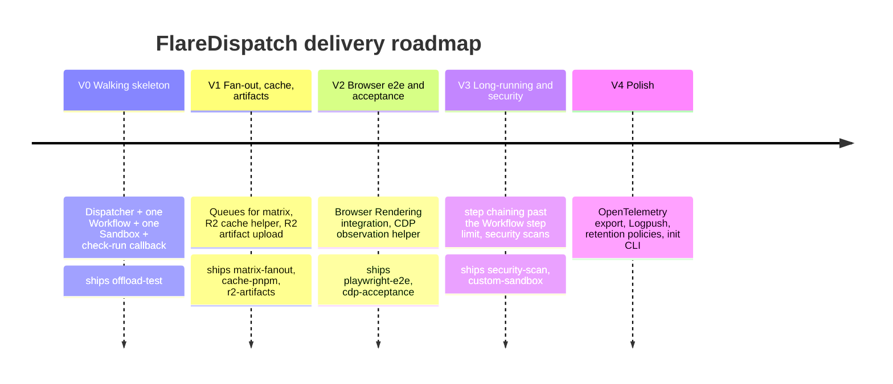

# Timeline & Roadmap

Delivery phasing for FlareDispatch — what ships in each version and the exit criterion that closes it. **V0 is the slice that proves the model**; V1–V4 are incremental and independently shippable.

## Phases

| Phase | Scope | Runs shipped | Exit criterion |
|---|---|---|---|
| **V0 — Walking skeleton** | Dispatcher Worker + one Workflow + one Sandbox + check-run callback | `offload-test` | A `pnpm test` executing in CF Sandbox reports green/red to a PR check |
| **V1 — Fan-out + cache + artifacts** | Queues for matrix; R2 cache helper; R2 artifact upload with signed URLs | `+ matrix-fanout`, `+ cache-pnpm`, `+ r2-artifacts` (building blocks) | 8-shard test matrix on CF beats GHA wall time on a real repo |
| **V2 — Browser e2e + acceptance** | Browser Rendering integration; CDP observation helper | `+ playwright-e2e`, `+ cdp-acceptance` | Sharded Playwright suite reports per-shard status; gctrl-board acceptance suite executes |
| **V3 — Long-running + security** | Step chaining for suites past the Workflow step limit; security scan runs | `+ security-scan`, `+ custom-sandbox` | 30-min suite completes; npm audit / cargo audit / trivy run in Sandbox |
| **V4 — Polish** | OpenTelemetry export, Logpush integration, retention policies, `flaredispatch init` CLI | — | Time-to-first-green-check < 30 min on a fresh CF account |

## What's next

- **V0 build sequence** — the 7-PR walking-skeleton plan, with per-PR scope and verifiable acceptance, is in [06-v0-plan](06-v0-plan.md).
- **Run catalog** — each phase's "runs shipped" is detailed in [02-runs](../02-runs.md).
- **Product framing** — the problem, personas, and value proposition are in [PRD](../PRD.md).
